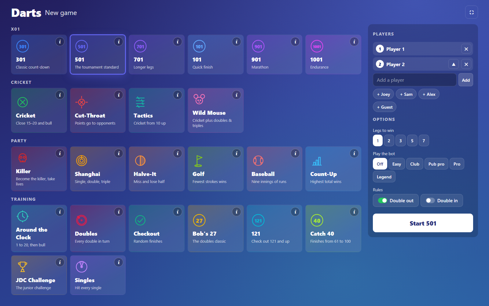
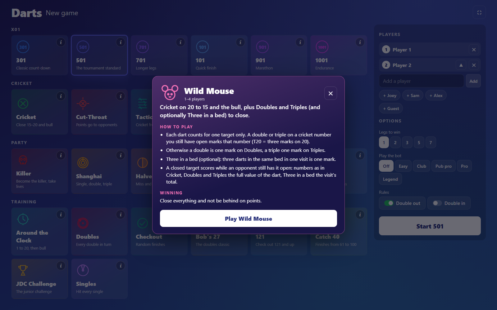
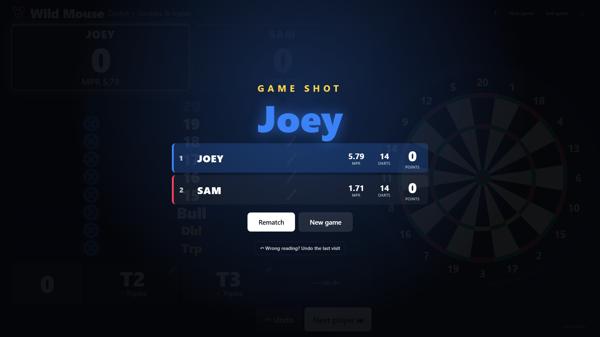
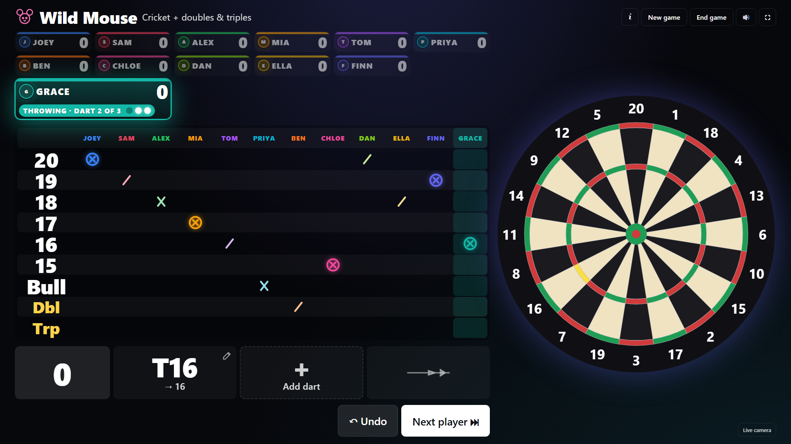
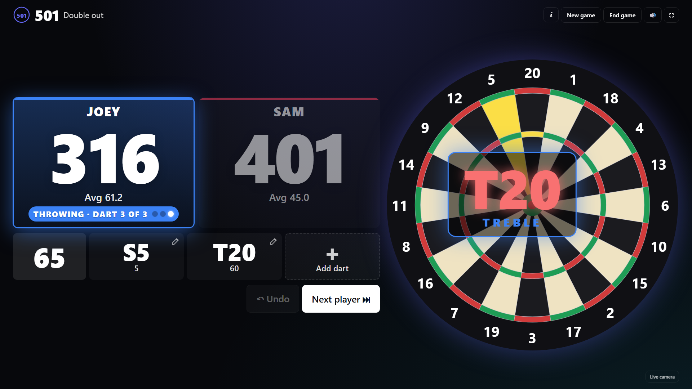
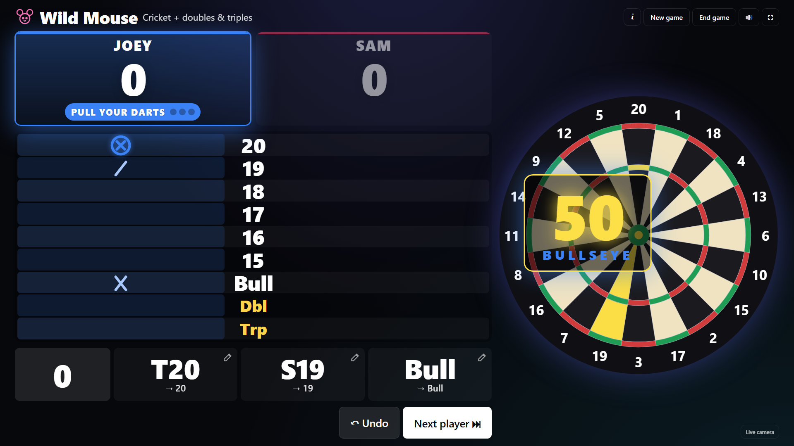
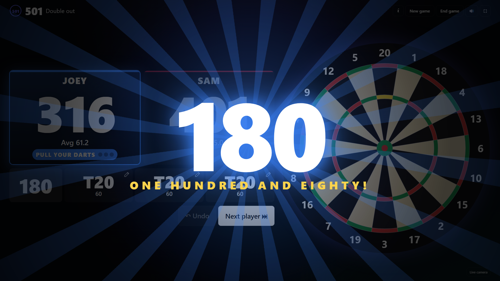
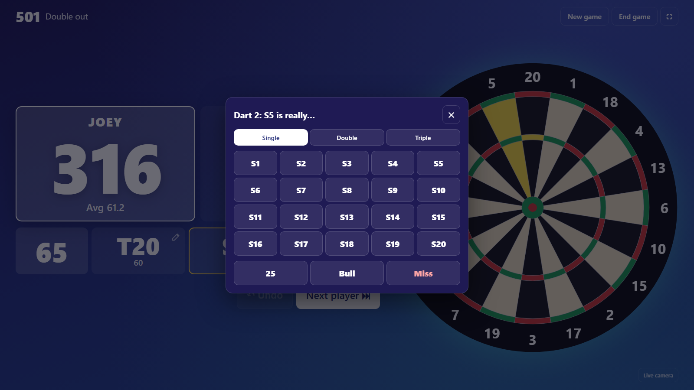
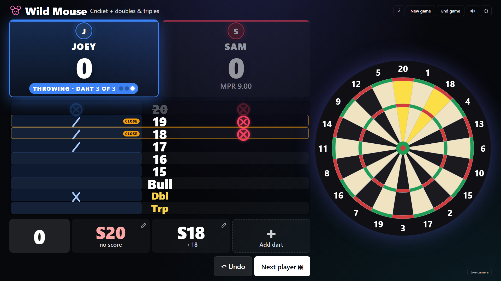

# Classic game screen

A full-screen game screen for a TV or monitor at the board, in the style of play.autodarts.io. It is a single Lovelace card that sits on top of this integration: it reads the integration's entities, calls its services and talks to the board's local API for dart positions. Nothing in the integration changes.

| New game | X01 | Wild Mouse |
| --- | --- | --- |
|  |  |  |

## What it does

- Covers Home Assistant's header and sidebar, so players only see the game.
- **New game** screen with every game as a tile with its own icon and colour (X01, Cricket, party and training games), recent players as one-tap chips, bot levels, legs, double in/out and Golf holes.
- **How to play**: an **(i)** on every game tile, and next to the game name while playing, opens that game's rules: who can play, the goal, how it scores and how it is won.

  
- **Dart-machine look**: a dark theme made for a TV at the board (or classic blue, pub green, neon, high contrast). Every player keeps a colour on their card, chalkboard column and dart markers; the newest dart is white.
- **Game screen**: big scores readable from several metres, whose turn it is with the darts left (●●○), the three darts of the visit, checkout suggestion, bust, Undo and Next player. Cricket games use a chalkboard with marks in the players' colours. Training games show the next target and progress.
- **Result screen**: the winner, then every player ranked with legs, average or marks per round and their score, with Rematch and New game.

  
- **Correct a dart** the board read wrong: tap it (every dart has a ✎) and pick the right bed. See [Correcting darts](#correcting-darts).
- **Drawn dartboard** with a marker where each dart landed (from the board's `/api/events` coordinates). The camera picture is one tap away (warped straight-on with the calibration homography from `/api/system`).
- **Made for the oche, 2 m away**: games with a board of their own (Ladder Rush, target strips, derby lanes, towers) give it the whole left side of a wide screen under slim player cards; the dartboard, the darts of the visit and Undo / Next share a column on the right.
- **The night**: tonight's Top List (3, 2 and 1 points a game), an attract screen between games, teams, throw lines and handicaps, sudden death for a dead heat, and the trophies at the end. See *The night at the board*.
- **Statistics**: the thrower's earlier darts glow on the drawn board, each player's darts and grouping on the game shot screen, the X01 score chart, and a gallery of 180s, big checkouts and game shots.
- **Your voice**: record the caller and the sound effects on the screen, or cut one long take into files. See *Feedback, sound and the caller*.
- **Wild Mouse (Minnesota) Cricket.** Where the integration plays Wild Mouse itself (the releases after 1.9.2), the card hands it every game of up to four players without teams, with the bot, legs, three in a bed and the integration's statistics. A bigger party, teams, or an older integration are scored by the card from the board's darts. See [Wild Mouse rules](#wild-mouse-rules).
- Resets the board when it hangs in "Takeout in progress" with no darts on it (seen with Autodarts 2.0.2), and wakes it from standby. With several screens on one board, keep the reset on one of them and set `stuck_takeout_reset: 0` on the others.

## Install

1. Copy `autodarts-classic-card.js` to `config/www/` of Home Assistant.
2. Settings → Dashboards → ⋮ → Resources → Add: `/local/autodarts-classic-card.js?v=1`, type *JavaScript module*. Raise `v` after every change so browsers reload it.
3. Add a dashboard with one view in **panel** mode and this card:

```yaml
type: custom:autodarts-classic-card
# all optional:
prefix: autodarts_board        # entity id prefix of the board
board_url: http://192.168.1.50:3180   # otherwise read from the integration's device
view: virtual                  # virtual (drawn board) or live (camera)
camera: 0                      # first camera for the live view
brand: Darts                   # name on the screens
photo: /local/my-photo.jpg     # optional picture on the New game and Game shot screens
overlay: true                  # cover Home Assistant's header and sidebar
stuck_takeout_reset: 5         # seconds before a stuck takeout is reset; 0 turns it off
theme: machine                 # machine (dark, default), red, classic (blue), pub, neon or contrast; also on the New game screen
player_colors: ["#3b82f6", "#f43f5e", "#22c55e", "#f59e0b"]   # one colour per player, in throwing order
sound: true                    # sound effects (also on the New game screen and the sound button)
caller: true                   # the caller: scores, "You require", "Game shot"
voice_path: /local/darts/voice/   # optional: your own recordings (.mp3 or .wav), see Feedback, sound and the caller
caller_voice: Daniel           # optional: part of the name of a browser voice to use
camera_window: false           # optional: small live board camera on the game screen
replay_on: ["180", "game_shot"]   # optional: moments that get a thrower replay (180, game_shot, bull, t20, ton)
auto_next: 0                   # optional: Wild Mouse moves on this many seconds after the third dart (0: when darts are pulled)
ha_sync: false                 # optional: write the game to Home Assistant helpers and take controls from them
avatars:                       # optional: pictures by player name, shared by every screen
  Joey: /local/darts/joey.png
keys: true                     # keyboard, presenter and TV remote keys (see At the board)
intro: true                    # the match intro with photos and head to head
up_next: true                  # the Up next splash when the turn passes
coach: true                    # "if S20: ..." after the checkout route
banter: true                   # banter bubbles after a visit; "always" for every visit, false off
idle: 180                      # seconds before the attract screen between games; 0 off
session_gap_h: 6               # hours without a game before tonight's Top List starts again
heat: true                     # the thrower's earlier darts on the drawn board
highlight_photo: true          # the blueprint's highlight photo on the game shot screen
notify: notify.mobile_app_joey # optional: where Send the highlights sends the night
buttons:                       # optional: smart-home buttons in the bar, lit while on
  - light.board
  - entity: scene.darts_party
    name: Party
```

The board's local API must be reachable from the browser (it answers CORS with `*`). If Home Assistant is served over HTTPS, the browser blocks the plain-HTTP board and the card falls back to what the entities carry.

## Players and photos

Add as many players as there are: Wild Mouse takes up to 24 (the card scores it itself from five players on), and with five or more the thrower's card is shown big and everybody else small. The integration's own games (X01, Cricket, party and training games) play up to four; with more in the list they start with the first four, and the New game screen says so. *Shuffle order* mixes up who throws first.



Every player has a picture on their score card, in the player list and on the result screen, in their colour:

1. **A photo taken at the screen**: 📷 next to a name opens the photo booth. It uses the webcam of the screen's PC, counts down and takes a square photo; *Choose a picture* takes one from a file instead. Photos are kept in that screen's browser.
2. **The `avatars` option**, for pictures every screen shares: `avatars: {Joey: /local/darts/joey.png}`.
3. **The picture of a Home Assistant person** with the same name, automatically.
4. Otherwise the player's initials.

**Webcam**: any USB webcam works (1080p with autofocus is plenty). Plug it into the PC that shows the screen, on a different USB controller from the Autodarts cameras so it cannot take their bandwidth; the booth only turns it on while it is open. Browsers give pages the webcam only over https or on localhost, so open Home Assistant as `http://localhost:8123` on the screen's PC: the launcher in `extras/` does this, and allows the webcam without a prompt.

## Home Assistant in control

The integration's own games already have their entities. With `ha_sync: true` and the helpers of [`extras/darts-screen-package.yaml`](extras/darts-screen-package.yaml) (a Home Assistant package), every game the screen plays, Wild Mouse included, is also written to Home Assistant, and Home Assistant can run the screen:

| Helper | |
| --- | --- |
| `input_text.darts_screen_status` | `idle`, `lobby`, `playing` or `finished` |
| `input_text.darts_screen_game`, `_player`, `_scores`, `_last_dart`, `_winner` | the game, who is throwing, "Joey 60 · Sam 20", the last dart (T20, BULL …), the winner |
| `input_text.darts_screen_players` | set it to "Joey, Sam, Alex" to fill the player list |
| `input_select.darts_screen_game` | picking a game starts it with those players |
| `input_button.darts_screen_new_game`, `_rematch`, `_next_player`, `_undo`, `_end_game` | the screen's buttons |

So an automation can flash the lights for the winner, a voice assistant can say who is throwing, and a phone dashboard can start the next game. Turn `ha_sync` on for one screen. The status pill also warns when one of the board's cameras reports a problem (the integration's camera problem sensors).

## Cameras and replays

Up to two webcams on the screen's PC, next to the Autodarts cameras (which stay untouched: the card only reads their picture):

- **Photo webcam**, on the monitor: player photos (see *Players and photos*).
- **Thrower webcam**, in front of the oche facing the player: **instant replay**. While a game is on the screen the card keeps the last seconds of this webcam in memory; after a 180 or a game shot (choose which moments: 180, game shot, bullseye, T20, ton plus) it shows **"Let's see that again"**: the last five seconds, then the last two and a half in **slow motion**. *Again* and *Slow motion* replay it, and the video button in the game bar replays the last throw at any time. Nothing is saved or sent anywhere.
- **Board camera window**: a small live picture from an Autodarts camera in a corner of the board area; tap it for all board cameras big, and tap one to show it in the window. It only streams while it is on the screen.

Set them up on the New game screen under *Screen → Cameras*: which webcam takes photos, which records the thrower (or off), which moments get a replay, and the board camera window. `camera_window: true` and `replay_on: ["180", "game_shot"]` set the defaults in the card options.

What it takes: two USB webcams (a 1080p webcam at 30 fps is plenty; 60 fps ones make smoother slow motion). The replay is recorded by the browser's own video encoder, a few megabits a second, and only while a game is on. Plug the webcams into a different USB controller from the Autodarts cameras, so the board keeps all its bandwidth; if the board PC is short on USB or CPU, the screen can run on a second PC or mini PC with the webcams, pointing at the same Home Assistant and board. Browsers only allow webcams on https or localhost.

## Your brand and moment pictures

Make the screen yours with your own artwork, kept in `config/www/darts/` (not in this repository):

```yaml
brand: Darts
logo: /local/darts/logo.png          # lobby title and a corner of the board
hero: /local/darts/hero.jpg          # a wide banner over the games in the lobby
hero_position: center 30%            # which part of the banner picture to show
theme: red                           # a black and red look to go with it
moments:                             # a picture slammed in over the screen when it happens
  "180": /local/darts/180.jpg
  bull: /local/darts/bullseye.jpg
  t20: /local/darts/triple20.jpg     # t1 … t20 for one treble, treble for any
  bounce_out: /local/darts/bounce-out.jpg
  miss: /local/darts/out-of-board.jpg
  game_shot: /local/darts/game-shot.jpg
```

Every moment is optional; without a picture the built-in effect plays. The keys: `180`, `ton` (100+), `ton40` (140+), `bull`, `outer`, `double`, `treble`, `t1` … `t20`, `miss`, `bounce_out` (a dart the board flagged as a bouncer), `bust`, `three_in_a_bed`, `game_shot`, the moments of the card's games (`ladder`, `snake`, `goal`, `killer`, `shanghai`, `black`, `tower_down`, `bullseye`), and a win picture per game, `<game>_win` (for example `derby_win`), shown instead of `game_shot`. Square pictures work best for moments; web-optimised JPEGs of about 1024 px keep them quick on a TV. Pictures must be site paths (`/local/…`) or web addresses.

## Feedback, sound and the caller

Every dart flashes big over the board for a moment, styled by what it hit (single, double, treble, bull, miss), with its own sound. A 180 and a ton plus get a full-screen celebration, and so do three in a bed and a bust; a won game gets confetti and a fanfare. Scores run down to their new value instead of jumping.

| Treble | Bullseye | 180 |
| --- | --- | --- |
|  |  |  |

The **caller** calls every X01 visit ("One hundred and forty"), tells the next thrower what they require when they are on a finish, calls "Checkout" after a finish of 100 or more, "Up next" and the name in the other games, and the moments of the card's games ("Up the ladder!", "Goal!", "Shanghai!"). It uses the browser's voice, or your own recordings, in this order:

1. **Recorded on the screen**: *Screen → Your voice* on the New game screen lists every call, the scores 0 to 180, the players' names and the sound effects. ● counts down, you speak into the webcam's microphone, the silence is cut off both ends; hear it, keep it or record it again, and *Use default* goes back. *Record the numbers one by one* walks through 0 to 180. Recordings are kept in that screen's browser; *Export* makes a zip of WAV files to import on another screen, or to unzip into `config/www/darts/voice/`. Browsers allow the microphone only on https or on localhost, like the webcam.
2. **Files in `voice_path`**: `<line>.mp3` or `<line>.wav` in `config/www/darts/voice/` with `voice_path: /local/darts/voice/`.
3. **The browser's voice** for any line without a recording, so recordings can be added a few at a time.

[CALLER-LINES.md](CALLER-LINES.md) is the checklist of every line. To record many lines in one take, read them with a pause in between and cut the take into files with `tools/split-caller.mjs` (needs ffmpeg):

```bash
node contrib/classic-game-screen/tools/split-caller.mjs numbers.wav voice              # score_0 ... score_180
node contrib/classic-game-screen/tools/split-caller.mjs calls.wav voice --lines calls   # every call, in the checklist's order
```

Recorded sound effects (`single`, `double`, `triple`, `outer`, `bull`, `miss`, `bust`, `closed`, `ton`, `180`, `win`) play instead of the drawn ones.

Most browsers play sound only after a first tap on the screen; the launcher in `extras/` starts Chrome with autoplay allowed, so it works at once. The sound button in the game bar mutes effects and caller together.

## Correcting darts

When the calibration is off or a dart sits on a wire, the board can read a dart wrong. Tap the dart in the visit and a pad opens: choose Single, Double or Triple, then the number, or 25, Bull or Miss. The dart is corrected through the integration's `autodarts.correct_dart`, and the score, bust, checkout and cricket marks follow at once.



- **A dart the board missed:** with the integration's *Practice manual entry* switch on, the next empty slot shows **+ Add dart**, which enters it with `autodarts.throw_dart`.
- **After the takeout:** Undo reopens the last visit, then its darts can be corrected; Next player ends it again.
- **The card's own games** (Wild Mouse with five or more players, in teams or on an older integration, and every game of its own) are scored by the card, so the card corrects them itself: the visit is replayed with the right bed, and marks, points and a won leg follow. **+ Add dart** always works there while the leg is open.

## Cricket boards

The chalkboard of every cricket game (Cricket, Cut-Throat, Tactics, Wild Mouse) helps the thrower like a dart machine does:

- **Score** in green next to the thrower's marks where they have closed a target and somebody is still open, and **Close** in amber where somebody else has closed it and could score on them.
- A **shield** on a row when a dart hits a target that everybody has closed, so it scored nothing.
- The points a dart scored float up from the player's card (**+20**).
- Wild Mouse can move to the next player by itself 3, 5 or 10 seconds after the third dart (*Next player after three darts* on the New game screen, or `auto_next: 5`), for boards whose takeout is not seen reliably. The thrower's tag counts down. In the integration's Wild Mouse the card presses *Next player* (`autodarts.next_player`) for you.



## The card's own games

Besides the integration's games, the screen plays 31 games of its own, for up to 24 players, scored from the board's darts (positions included) with the same undo, dart correction, auto next player, rules sheet and result screen as Wild Mouse:

| | |
| --- | --- |
| **Cricket family** | Wild Mouse, Mickey Mouse (20–12, doubles, trebles, beds, bull), Quick Cricket (four random numbers), Party Cricket and Party Cut-Throat for 5–24 |
| **Countdowns and races** | Party X01 (5–24 players, legs, double in/out), Tower Takedown, Touchdown 200, Gotcha, Pour the Pint |
| **Two-player** | Scram |
| **Party** | Party Shanghai (1–7 or 1–20, a Lite option where the neighbours count), Lives, Hi-Lo, Chase the Dragon, Bull & Goal, Snooker |
| **Arcade games** | Ladder Rush, Derby Dash, Under the Bar, Chasing Bullseye, Killer Night, Nine Lives, Board Grab, Target Blast |
| **Training** | Random Checkout, Clock Doubles, Clock Trebles, Clock Lite, Hare & Hounds, Doubles Ladder |

Games with a board of their own show it big on the left of a wide screen (Ladder Rush's 50 squares, towers, landers, glasses, derby lanes, target strips that wrap into rows); Board Grab, Killer Night, Nine Lives, Derby Dash, Target Blast and Party Shanghai also paint the drawn dartboard. The head-to-head games (Lives, Hi-Lo, Under the Bar, Nine Lives, Killer Night, Board Grab) need two players or teams, and Scram exactly two. Party games without a limit of their own can be played to a **round limit** (10, 15 or 20 rounds): the leader then wins, level leaders share it.

## Wild Mouse rules

When the integration plays the game, its rules apply: see [Wild Mouse](../../docs/games.md#wild-mouse). The chalkboard then shows the integration's targets, and every dart of the visit says what it counted for (→ 20, → Doubles, no score). The rules below are those of the card's own game, for bigger parties and teams.

Cricket on 20–15 and bull, plus **Doubles** and **Triples** to close, and optionally **Three in a bed**.

- A dart counts toward one target only. A double or triple on a cricket number you still have open marks that number (T20 = 3 marks on 20). Otherwise it is one mark on Doubles or Triples.
- A closed target scores while an opponent still has it open: numbers as in Cricket, Doubles and Triples the full value of the dart, Three in a bed the visit's total.
- Win: everything closed and not behind on points. Legs are supported.
- The visit ends when the darts are pulled (the board's throws drop to zero) or with Next player. Undo takes back the last visit. A tap on a dart corrects it.

The card's own game lives in the browser's `localStorage`, so it belongs to one screen; the integration's game is shared by every screen and card.

## The night at the board

- **Tonight's Top List**: every game of two or more players gives 3, 2 and 1 points to the first three (a shared win is 3 each). It shows in the lobby and on the attract screen; a game counts once, also after a reload, and undo on the game shot screen takes it off again. *New session* (tap twice) starts over; after `session_gap_h` quiet hours it starts over by itself.
- **Attract screen**: after `idle` quiet seconds in the lobby or on the game shot screen (never during a game) the screen shows the brand, a clock, the Top List big enough for the room, the board's records and the gallery of 180s, big checkouts and game shots. A dart, a key or a tap wakes it.
- **Teams**: *Teams* on the New game screen plays Pairs (1 and 2, 3 and 4 in the list; an odd one out joins the last pair), Two teams (the first half against the second) or Auto (pairs above six players), in every game the card scores. A team's members take turns visit by visit; the card shows who throws, and each member gets the team's points on the Top List.
- **Throw lines and handicaps**: tap a player's line in the list for Rookie, Regular or Pro; it shows on their card. With *Start bonus*, rookies and regulars start ahead where a game has a start to give (Party X01, Tower, Touchdown 200, the target strips, Ladder Rush, Derby Dash).
- **Sudden death**: a dead heat offers one dart each at the bullseye; the nearest wins (measured by the board when it knows where the dart sits), level players throw again, and the winner takes the game on the Top List.
- **Trophies**: *Trophies* over the Top List shows the champion of the night, the podium and every game's winner. With `notify:` set, *Send the highlights* sends the night to a phone.
- **Statistics**: during a game the thrower's earlier darts glow on the drawn board (`heat: false` turns it off); the game shot screen shows each player's darts on a small board with their grouping in millimetres, and X01 games a chart of the scores coming down.
- **Home on the screen**: `buttons:` puts lights, scenes, scripts and buttons in the bar; the highlight photo of the integration's blueprint shows on the game shot screen when it takes one.

## At the board: keys and remotes

A keyboard, a presenter or a TV remote runs the game (`keys: false` turns it off): N, Space, Enter or → for the next player; U, Backspace or ← to undo; 1–3 to correct a dart; R rematch; G new game; F full screen; M mute; I the rules; Esc closes what is open. The rematch order (next starts, same order, loser starts, winner stays on) is chosen on the game shot screen or in the lobby.

## Try it without a board

`demo/` starts a complete local setup in Docker: Home Assistant with this integration, a simulated Autodarts board (the one the end-to-end tests use), the game screen as a dashboard with the helpers of `ha_sync`, and a **dart simulator**, a clickable dartboard that throws darts at the simulated board, positions included, like the real one.

```bash
bash contrib/classic-game-screen/demo/demo.sh        # or .demo.ps1 in PowerShell
```

| | |
| --- | --- |
| Game screen | http://localhost:18125/darts-classic/game |
| Dart simulator | http://localhost:18126: click where the dart lands, *Pull the darts* ends the visit; quick buttons for T20, bull, off the board, a bounce out and a 180 |
| Home Assistant | http://localhost:18125 (logs in by itself; only this PC can reach it) |

The demo has no pictures of its own. To try yours, put `logo.png`, `hero.jpg`, the moment pictures and `player.jpg` (the photo of Player 1) in a folder and start it with `DARTS_ASSETS=path`. The card file is mounted from the repository: `demo.sh reload` shows a changed card without resetting anything (Home Assistant restarts, so give it a minute). `demo.sh stop` removes everything.

`tools/ui-tour.mjs` plays every game on the demo in a headless Chrome or Edge and saves screenshots of each at the sizes you ask for, with the lobby, the attract screen, the trophies, the teams, the voice page and the game shot screen of every card game:

```bash
node contrib/classic-game-screen/tools/ui-tour.mjs out 1080x860 1280x720 1920x1080 --only=snakes,derby
```

## Tests

```bash
npm ci   # once: the browser tests use happy-dom from the repository's dev dependencies
node --test "contrib/classic-game-screen/*.test.mjs"
```

`game-fuzz.test.mjs` plays every game the card scores with random players and random darts, corrections and undos, and checks the rules every game must keep; `FUZZ_RUNS=400` plays more games.

## Setting a board up from scratch

[UPGRADE-TO-V2.md](UPGRADE-TO-V2.md) walks through moving a board from Autodarts 1.x to 2.x and setting up Home Assistant, this integration, the game screen and a one-click launcher, including the problems met on the way. `extras/` has the launcher and loading screen.
