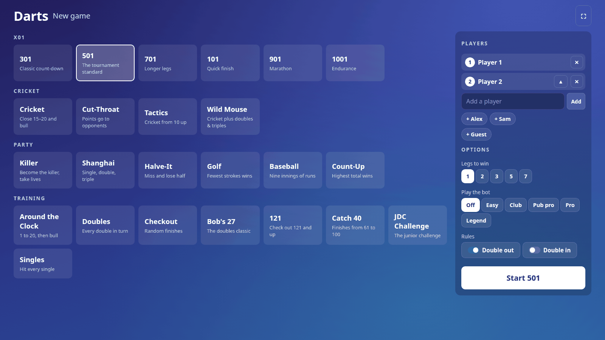
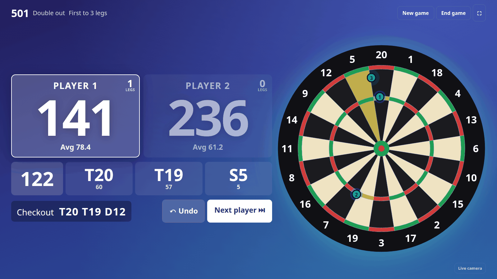
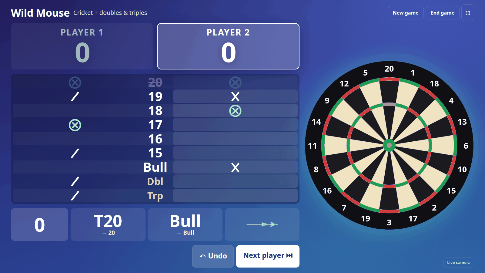

# Classic game screen

A full-screen game screen for a TV or monitor at the board, in the style of play.autodarts.io. It is a single Lovelace card that sits on top of this integration: it reads the integration's entities, calls its services and talks to the board's local API for dart positions. Nothing in the integration changes.

| New game | X01 | Wild Mouse |
| --- | --- | --- |
|  |  |  |

## What it does

- Covers Home Assistant's header and sidebar, so players only see the game.
- **New game** screen with every game as a tile (X01, Cricket, party and training games), recent players as one-tap chips, bot levels, legs, double in/out and Golf holes.
- **Game screen**: big scores readable from about 2 m, the three darts of the visit, checkout suggestion, bust, Undo and Next player. Cricket games use a pub-style chalkboard. Training games show the next target and progress. Game shot screen with Rematch.
- **Drawn dartboard** with a marker where each dart landed (from the board's `/api/events` coordinates). The camera picture is one tap away (warped straight-on with the calibration homography from `/api/system`).
- **Wild Mouse (Minnesota) Cricket**, which the integration does not have. The card scores it itself from the board's darts.
- Resets the board when it hangs in "Takeout in progress" with no darts on it (seen with Autodarts 2.0.2), and wakes it from standby.

## Install

1. Copy `autodarts-classic-card.js` to `config/www/` of Home Assistant.
2. Settings → Dashboards → ⋮ → Resources → Add: `/local/autodarts-classic-card.js?v=1`, type *JavaScript module*. Raise `v` after every change so browsers reload it.
3. Add a dashboard with one view in **panel** mode and this card:

```yaml
type: custom:autodarts-classic-card
# all optional:
prefix: autodarts_board        # entity id prefix of the board
board_url: http://192.168.1.50:3180   # otherwise read from the integration's device
view: virtual                  # virtual (drawn board) or live (camera)
camera: 0                      # first camera for the live view
brand: Darts                   # name on the screens
photo: /local/my-photo.jpg     # optional picture on the New game and Game shot screens
overlay: true                  # cover Home Assistant's header and sidebar
```

The board's local API must be reachable from the browser (it answers CORS with `*`). If Home Assistant is served over HTTPS, the browser blocks the plain-HTTP board and the card falls back to what the entities carry.

## Wild Mouse rules

Cricket on 20–15 and bull, plus **Doubles** and **Triples** to close, and optionally **Three in a bed**.

- A dart counts toward one target only. A double or triple on a cricket number you still have open marks that number (T20 = 3 marks on 20). Otherwise it is one mark on Doubles or Triples.
- A closed target scores while an opponent still has it open: numbers as in Cricket, Doubles and Triples the full value of the dart, Three in a bed the visit's total.
- Win: everything closed and not behind on points. Legs are supported.
- The visit ends when the darts are pulled (the board's throws drop to zero) or with Next player. Undo takes back the last visit.

The game state lives in the browser's `localStorage`, so it belongs to one screen.

## Tests

```bash
node --test contrib/classic-game-screen/
```

## Setting a board up from scratch

[UPGRADE-TO-V2.md](UPGRADE-TO-V2.md) walks through moving a board from Autodarts 1.x to 2.x and setting up Home Assistant, this integration, the game screen and a one-click launcher, including the problems met on the way. `extras/` has the launcher and loading screen.
