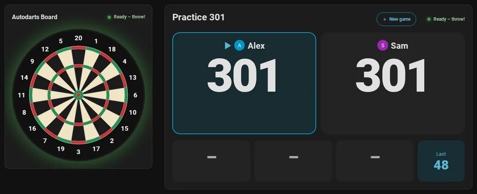
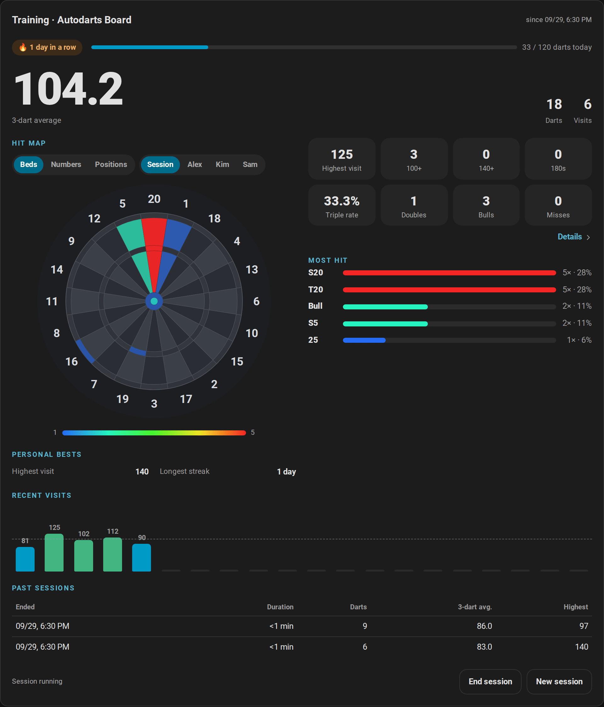
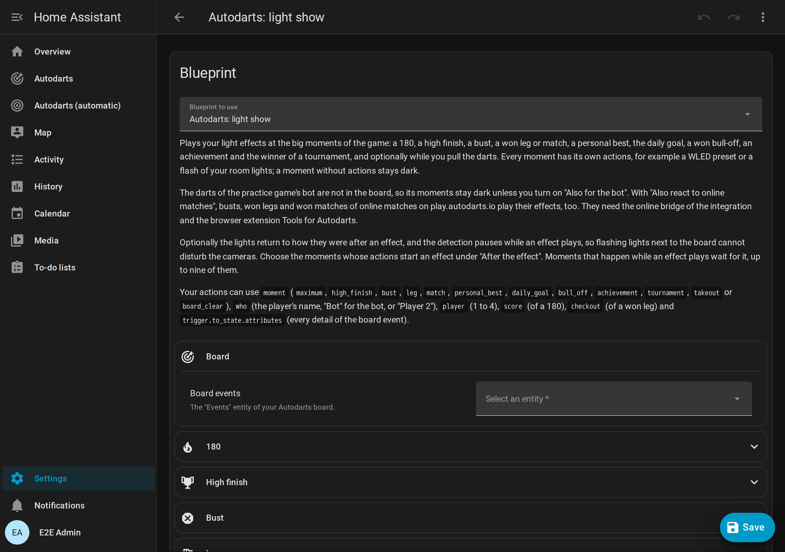
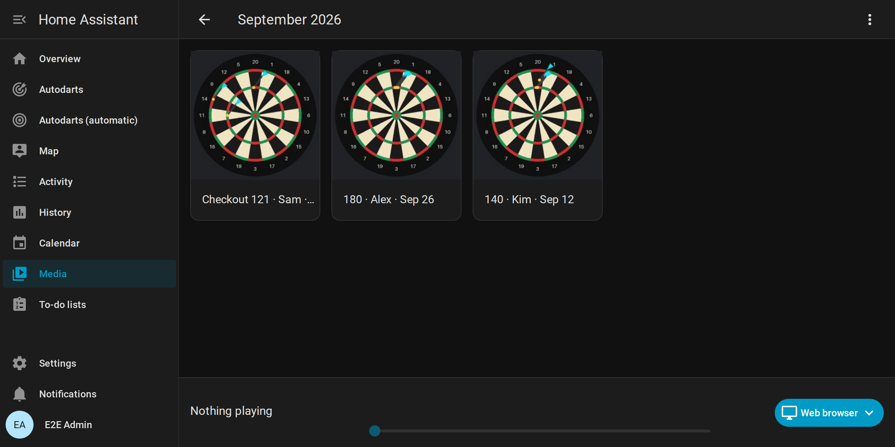
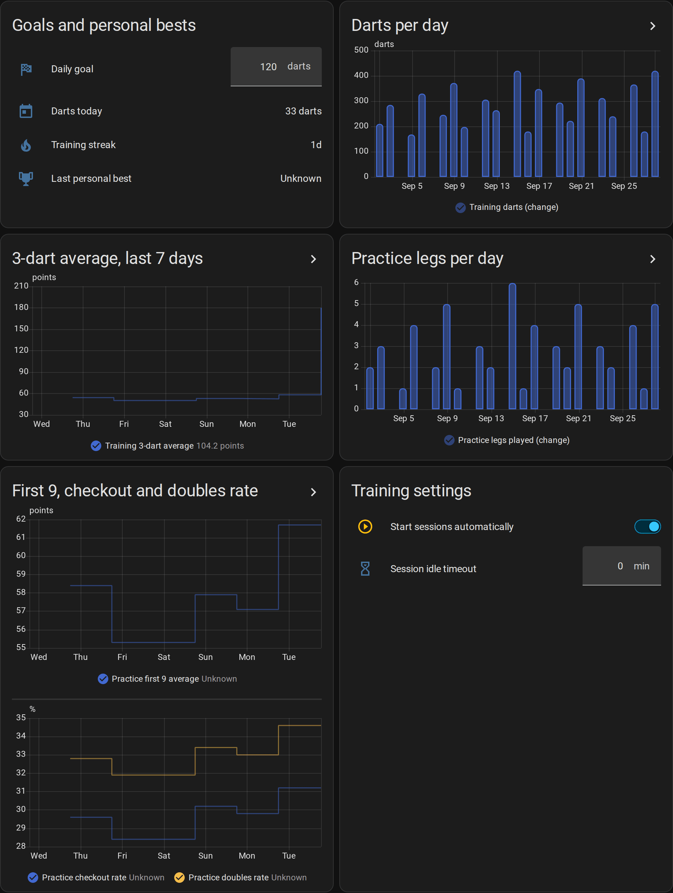
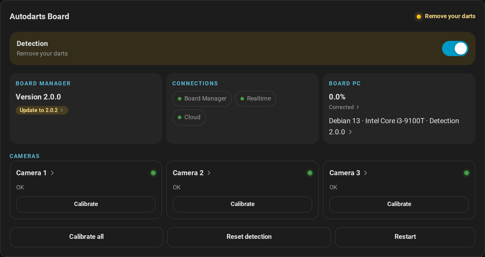

# Autodarts for Home Assistant: documentation

[← Project page](../README.md) · [Deutsche Dokumentation](de/README.md)

Everything about the Autodarts integration: how to set it up, play and train with it, put a scoreboard next to the board, follow your statistics and let your home join in.

## Get started

| Guide | What you'll find |
| --- | --- |
| [From zero to the scoreboard](getting-started.md) | For Autodarts players without Home Assistant: set up Home Assistant and HACS, install the integration, add the board and play the first game on the scoreboard |
| [Installation and setup](installation.md) | Requirements, HACS and manual installation, the three ways to add a board, the optional cloud link, reconfiguration, updating and removal |

## Guides

| Guide | What you'll find |
| --- | --- |
| [Games and rules](games.md) | Every game at a glance, four ways to start one, matches, the match summary, teams, handicaps, the bull-off, tournaments and the rules of X01, the Cricket games, the party games and the training games |
| [Scoreboard at the board](scoreboard.md) | A tablet or TV next to the board: setup, landscape and portrait, the new game screen, tournaments, the caller and idle mode |
| [Statistics and players](statistics.md) | Training sessions, personal bests, the heatmap and dart positions, progress over time, doubles, player profiles, achievements, trends and grouping, the leaderboard, the weekly report, the training calendar and exports |
| [Automations](automations.md) | Eleven blueprints, their settings, board events and ready-to-use examples |
| [Online matches](online-matches.md) | Busts, won legs and matches of online matches as board events, with the browser extension Tools for Autodarts *(experimental)* |

## Reference

| Page | What you'll find |
| --- | --- |
| [Dashboard cards](cards.md) | The live card, the training card, the board status card, the scoreboard, the doubles card, the players card, the leaderboard card and the automatic dashboard, with every option and accessibility |
| [Entities and events](entities.md) | Every entity, board event, state, attribute and action, and which Board Manager generation provides it |
| [How it works](how-it-works.md) | Architecture, update intervals, connection behavior, Board Manager generations, address changes, training and records, stored data and privacy |
| [Troubleshooting](troubleshooting.md) | Setup messages, repairs, unavailable entities, failing actions, diagnostics and logs |
| [Security design](security.md) | What is protected, trust boundaries, threats and countermeasures |
| [Glossary](glossary.md) | The words of darts and of this integration, with their German terms |

## Project

| Page | What you'll find |
| --- | --- |
| [Changelog](../CHANGELOG.md) | What every version brought |
| [Roadmap](roadmap.md) | Released versions and what comes next |
| [Development](development.md) | Tests, Docker end-to-end test, demo instance, screenshots and CI |
| [Releases](releases.md) | How versions and release notes are produced |
| [Creator kit](creator-kit.md) | Facts, descriptions, videos, animations and pictures for YouTubers, streamers and bloggers, free to use |

## Use cases

<table>
  <tr>
    <td width="50%" valign="top"> <b>Train with a purpose.</b> Follow your average, your 180s and where your darts land after every session, and let a daily goal and a training streak keep you going. <a href="statistics.md">Statistics</a></td>
    <td width="50%" valign="top"> <b>A darts night with friends.</b> Choose the game on the tablet at the board or start a tournament, let the scoreboard keep the score and call the game, and watch the table or the leaderboard between games. <a href="scoreboard.md">Scoreboard</a></td>
  </tr>
  <tr>
    <td width="50%" valign="top"> <b>Atmosphere.</b> Light shows for a 180 or a won match, a dart caller on your speakers and the board light for the takeout. <a href="automations.md">Automations</a></td>
    <td width="50%" valign="top"> <b>Keep the highlights.</b> A photo of the board after every 180 or checkout, on your phone and in a gallery by month. <a href="automations.md#highlight-gallery">Highlight gallery</a></td>
  </tr>
  <tr>
    <td width="50%" valign="top"> <b>Progress over months.</b> Long-term graphs, a weekly report on your phone and a training calendar with a year of sessions and matches. <a href="statistics.md#progress-over-time">Progress over time</a></td>
    <td width="50%" valign="top"> <b>A board that looks after itself.</b> Start the detection when you enter the darts room, stop it when you leave, and get a notification when the board goes offline or a camera fails. <a href="automations.md#blueprints">Blueprints</a></td>
  </tr>
</table>

## Supported devices

| | Supported | Tested with |
| --- | --- | --- |
| Board Manager 2: Autodarts 2 without a screen (headless) | 2.x | 2.0.0 and 2.0.2 |
| Board Manager 1 (classic app) | 1.x | 1.0.7 |
| Autodarts Desktop on Linux | Works, as reported by a player | 2.0.2 on Ubuntu 24.04 ([report](https://github.com/Dennis-Otto/ha-autodarts/issues/105)) |
| Autodarts Desktop on Windows and other systems | Not tested yet | – |
| Winmau Autodarts devices such as Autodarts X or Lens | Not tested yet | – |
| Cameras | Any number supported by the Board Manager | 3 |
| Home Assistant | 2026.8 or newer | 2026.8.0 and 2026.9.4 |

Any board hardware that runs the Autodarts Board Manager works, because the integration talks to the Board Manager, not to the cameras. Rows reported by a player were tested by a player on their own board, not by the project.

Since September 2026, the Autodarts documentation describes the Board Manager as the browser interface of Autodarts 0.x that is not supported from version 2 on. The local interface on port 3180 that the integration uses still answers on Autodarts 2.0.2. If an update changes it, the integration shows a repair notice instead of failing silently (see [troubleshooting](troubleshooting.md#repairs)). If your setup is not in the table, a [compatibility report](https://github.com/Dennis-Otto/ha-autodarts/issues/new?template=board_compatibility.yml) helps, even when everything works.

## Languages

The integration speaks English, German, Dutch, French and Spanish: setup, options, entities and their states, actions, messages and repairs, the cards with their editors and the caller of the scoreboard. It follows the language of Home Assistant; a regional variant such as `de-CH` or `es-419` counts as its language. Other languages see English.

- Home Assistant names the entities in the language of the server (**Settings → System → General**); states and cards follow the language of your user profile.
- The caller speaks the card's language with a voice of your browser or tablet for that language.
- The documentation is in English and German, the blueprints in English because Home Assistant does not translate blueprints.

To improve a translation or add a language, see [translations in CONTRIBUTING.md](../CONTRIBUTING.md#translations).
