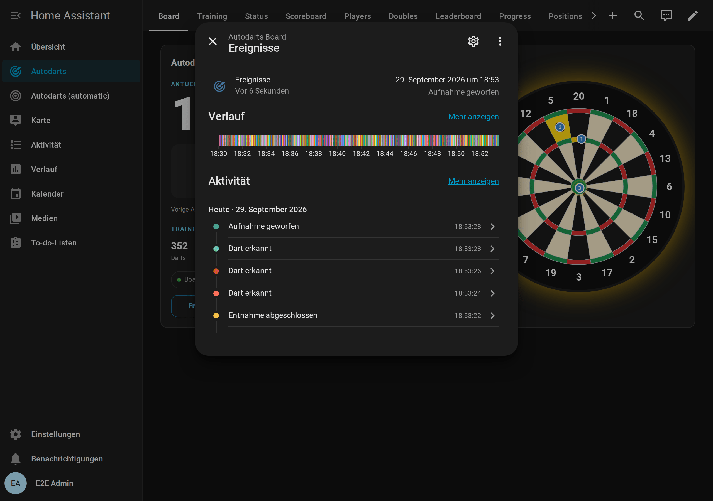

# Automationen

[← Dokumentation](README.de.md) · [English](automations.md)

Dein Board ist schnell genug für Automationen, die *während* des Spiels passieren. Das Licht flackert in dem Moment, in dem der dritte Dart einer 180 landet, und der Lautsprecher ruft die Punkte, bevor du am Board bist.

**Auf dieser Seite:** [Blueprints](#blueprints) · [Einstellungen der Blueprints](#einstellungen-der-blueprints) · [Board-Ereignisse](#board-ereignisse) · [Beispiele](#beispiele) · [Online-Matches](#online-matches-experimentell) · [Automationen älterer Versionen anpassen](#automationen-älterer-versionen-anpassen)

## Blueprints

Blueprints sind fertige Automationen. Importieren, Board und Geräte auswählen, fertig. Sie brauchen Home Assistant ab 2026.8 und folgen der aktuellen Version der Integration: Aktualisiere beide zusammen.

| Blueprint | Was er macht | Import |
| --- | --- | --- |
| **Celebrate a visit score** | Führt deine Aktionen für Aufnahmen ab einer Mindestpunktzahl aus (Standard 180), sobald der dritte Dart landet. Die Aktionen können `score`, `darts`, `segments` und `game` nutzen. Die Aufnahmen des Bots zählen nur auf Wunsch. | [](https://my.home-assistant.io/redirect/blueprint_import/?blueprint_url=https%3A%2F%2Fgithub.com%2FDennis-Otto%2Fha-autodarts%2Fblob%2Fmain%2Fblueprints%2Fautomation%2Fautodarts%2Fvisit_score.yaml) |
| **Dart caller** | Sagt jede Aufnahme mit einer beliebigen Sprachausgabe auf deinen Lautsprechern an, mit eigener Ansage für 180, auf Wunsch auch jeden einzelnen Dart. Während eines Übungsspiels schweigt er, das sagt der Übungs-Caller an. Die Texte sind Vorlagen. | [](https://my.home-assistant.io/redirect/blueprint_import/?blueprint_url=https%3A%2F%2Fgithub.com%2FDennis-Otto%2Fha-autodarts%2Fblob%2Fmain%2Fblueprints%2Fautomation%2Fautodarts%2Fdart_caller.yaml) |
| **Takeout actions** | Aktionen, wenn du die Darts ziehst und wenn das Board wieder frei ist, zum Beispiel für helleres Boardlicht. | [](https://my.home-assistant.io/redirect/blueprint_import/?blueprint_url=https%3A%2F%2Fgithub.com%2FDennis-Otto%2Fha-autodarts%2Fblob%2Fmain%2Fblueprints%2Fautomation%2Fautodarts%2Ftakeout.yaml) |
| **Start and stop detection automatically** | Startet die Erkennung, sobald jemand am Board ist, und stoppt sie nach einer frei wählbaren Pause. Kameras und Board-PC können so ruhen. | [](https://my.home-assistant.io/redirect/blueprint_import/?blueprint_url=https%3A%2F%2Fgithub.com%2FDennis-Otto%2Fha-autodarts%2Fblob%2Fmain%2Fblueprints%2Fautomation%2Fautodarts%2Fauto_detection.yaml) |
| **Board problem alert** | Warnt nach einer Karenzzeit, wenn das Board offline geht oder eine Kamera ausfällt. Eine Entwarnung kommt nur nach einer echten Warnung. Die Aktionen können `problem` und `recovered` nutzen. | [](https://my.home-assistant.io/redirect/blueprint_import/?blueprint_url=https%3A%2F%2Fgithub.com%2FDennis-Otto%2Fha-autodarts%2Fblob%2Fmain%2Fblueprints%2Fautomation%2Fautodarts%2Fboard_alert.yaml) |
| **Training report** | Tägliche Zusammenfassung mit Darts, 3-Dart-Average, höchster Aufnahme und 180ern; Tage ohne Darts werden übersprungen. Die Variable `summary` enthält den fertigen Satz. | [](https://my.home-assistant.io/redirect/blueprint_import/?blueprint_url=https%3A%2F%2Fgithub.com%2FDennis-Otto%2Fha-autodarts%2Fblob%2Fmain%2Fblueprints%2Fautomation%2Fautodarts%2Ftraining_report.yaml) |
| **Training session routine** | Beginnt eine [Trainingssession](entities.de.md#trainingssession), führt sie deine Aktionen aus, schaltet die Erkennung ein und kalibriert nach kurzer Wartezeit die Kameras. Endet sie, schaltet sie die Erkennung aus und führt deine Aktionen mit `reason`, `darts`, `average` und `duration_minutes` aus. Erkennungsschalter und Kalibrierungstaste sind optional. | [](https://my.home-assistant.io/redirect/blueprint_import/?blueprint_url=https%3A%2F%2Fgithub.com%2FDennis-Otto%2Fha-autodarts%2Fblob%2Fmain%2Fblueprints%2Fautomation%2Fautodarts%2Ftraining_session.yaml) |
| **Practice caller** | Sagt das [Übungsspiel](entities.de.md#übungsspiel) auf deinen Lautsprechern an: "Sam, you require 81", wenn ein Checkout möglich ist, "No score" nach dem Überwerfen, den Game shot eines Legs oder Matches und auf Wunsch den Rest, den ein Stellwurf stellt, wenn kein Checkout möglich ist, und das Ausbullen. Die Texte sind Vorlagen. | [](https://my.home-assistant.io/redirect/blueprint_import/?blueprint_url=https%3A%2F%2Fgithub.com%2FDennis-Otto%2Fha-autodarts%2Fblob%2Fmain%2Fblueprints%2Fautomation%2Fautodarts%2Fpractice_caller.yaml) |
| **Weekly report** | Schickt deine [Trainingswoche](entities.de.md#wochenbericht), wenn das Board sie beendet, standardmäßig montags um Mitternacht: Darts, Trainingszeit, Sessions, den 3-Dart-Average und seine Veränderung zur Vorwoche, beste Aufnahme, 180er, Checkout-Quote, Serie und neue Bestleistungen. Die Nachricht ist eine Vorlage; ohne eigene Aktionen erscheint der Bericht in den Benachrichtigungen von Home Assistant. | [](https://my.home-assistant.io/redirect/blueprint_import/?blueprint_url=https%3A%2F%2Fgithub.com%2FDennis-Otto%2Fha-autodarts%2Fblob%2Fmain%2Fblueprints%2Fautomation%2Fautodarts%2Fweekly_report.yaml) |
| **Highlight photo** | Macht ein Bild mit einer Board-Kamera nach einer Aufnahme ab 180 Punkten (einstellbar) oder einem Checkout im Übungsspiel, solange die Darts noch im Board stecken. Es speichert das Bild in der [Highlight-Galerie](#highlight-galerie) und führt deine Aktionen aus, die `photo_url`, `photo`, `image`, `message`, `score`, `checkout` und `who` nutzen können. | [](https://my.home-assistant.io/redirect/blueprint_import/?blueprint_url=https%3A%2F%2Fgithub.com%2FDennis-Otto%2Fha-autodarts%2Fblob%2Fmain%2Fblueprints%2Fautomation%2Fautodarts%2Fhighlight_photo.yaml) |
| **Light show** | Spielt deine Lichteffekte, etwa WLED-Presets oder die Raumbeleuchtung, bei einer 180, einem High Finish, beim Überwerfen, bei einem gewonnenen Leg oder Match, einer Bestleistung, dem Tagesziel, einem gewonnenen Ausbullen, einem Erfolg und dem Sieger eines Turniers, auf Wunsch auch bei der Entnahme und in [Online-Matches](online-matches.de.md). Danach kann er dein Licht wiederherstellen und die Erkennung während eines Effekts pausieren. | [](https://my.home-assistant.io/redirect/blueprint_import/?blueprint_url=https%3A%2F%2Fgithub.com%2FDennis-Otto%2Fha-autodarts%2Fblob%2Fmain%2Fblueprints%2Fautomation%2Fautodarts%2Flight_show.yaml) |
| **Start a game by voice** | Startet ein Übungsspiel, wenn du es Assist sagst, etwa „Starte 501 für Alex und Sam“, „Starte das Spiel Cricket für Alex“ oder „Spiele 501 gegen den Bot“, auf Deutsch oder Englisch. Assist antwortet mit Spiel und Spielern oder mit dem, was nicht gepasst hat. | [](https://my.home-assistant.io/redirect/blueprint_import/?blueprint_url=https%3A%2F%2Fgithub.com%2FDennis-Otto%2Fha-autodarts%2Fblob%2Fmain%2Fblueprints%2Fautomation%2Fautodarts%2Fstart_game_by_voice.yaml) |

Ohne My Home Assistant öffnest du **Einstellungen → Automationen & Szenen → Blueprints → Blueprint importieren**. Dort fügst du den Link zur Datei aus [`blueprints/automation/autodarts`](https://github.com/Dennis-Otto/ha-autodarts/tree/main/blueprints/automation/autodarts) ein. Um einen früher importierten Blueprint zu aktualisieren, importierst du ihn über sein Menü auf der Blueprint-Seite erneut; deine Automationen behalten ihre Einstellungen.

Die Blueprints sind auf Englisch beschriftet; ihre Texte kannst du beim Anlegen frei wählen.


### Welcher Caller?

- **Dart caller:** sagt jede Aufnahme an, in jedem Spiel am Board, etwa auch bei einem Online-Match. Während ein [Übungsspiel](entities.de.md#übungsspiel) der Integration läuft, schweigt er, damit er dem Übungs-Caller nie ins Wort fällt. Schalte *Stay silent in practice games* aus, wenn du den Übungs-Caller nicht nutzt.
- **Practice caller:** sagt an, worauf es im Übungsspiel ankommt: Rest, Überwerfen, Game shot und auf Wunsch das Ausbullen.
- **Caller der Anzeigetafel:** Die [Anzeigetafel](scoreboard.de.md#der-caller) sagt Aufnahmen und Übungsspiel mit einer Stimme an, über den Browser des Bildschirms am Board. Dafür brauchst du keine Lautsprecher in Home Assistant.

## Einstellungen der Blueprints

Jeder Blueprint zeigt diese Einstellungen, wenn du eine Automation daraus anlegst: Wähle den Blueprint auf der Blueprint-Seite, fülle das Formular aus und speichere. Einstellungen mit Standardwert sind optional.


### Celebrate a visit score

| Einstellung | Standard | Was sie bewirkt |
| --- | --- | --- |
| Board events | | Die Entität *Ereignisse* deines Boards. |
| Minimum score | 180 | Die niedrigste Punktzahl einer Aufnahme, die die Aktionen auslöst. Eine Aufnahme aus drei Darts zählt, sobald ihr dritter Dart landet, eine kürzere beim Ziehen der Darts. |
| Actions | | Was nach einer solchen Aufnahme passiert. Nutzbar sind `score`, `darts`, `segments` und `game` (das Übungsspiel oder leer). |
| Also for the bot | aus | Führt die Aktionen auch für die Aufnahmen des [Bots](entities.de.md#bot) im Übungsspiel aus. Seine Darts stecken nicht im Board, deshalb bleiben seine Aufnahmen standardmäßig außen vor. |

### Dart caller

| Einstellung | Standard | Was sie bewirkt |
| --- | --- | --- |
| Board events | | Die Entität *Ereignisse* deines Boards. |
| Text-to-speech engine | | Die Sprachausgabe, etwa Home Assistant Cloud oder Piper. |
| Speakers | | Die Mediaplayer, die die Ansagen abspielen. |
| Language | leer | Die Sprache der Stimme, etwa `de-DE`; leer nutzt die Sprache der Sprachausgabe. |
| Voice options | leer | Optionen der Sprachausgabe, etwa `voice: ...` für eine andere Stimme. |
| Call every dart | aus | Sagt zusätzlich jeden Dart an, sobald er landet. Der dritte Dart wird nicht einzeln angesagt, weil gleich die Aufnahme folgt. |
| Stay silent in practice games | an | Überlässt die Ansagen dem Übungs-Caller, solange ein X01-, Cricket- oder Partyspiel der Integration läuft. |
| Visit message | `{{ score }}` | Wird nach einer Aufnahme gesagt. Nutzbar sind `score`, `darts` und `segments`. |
| Message for 180 | `One hundred and eighty!` | Wird nach einer 180 statt der normalen Ansage gesagt. |
| Dart message | `{{ dart_name }}` | Wird für jeden Dart gesagt. Nutzbar sind `dart_name` (etwa `Treble 20`, `5`, `Bull` oder `Miss`), `segment` (etwa `T20`), `dart_score` und `dart_index`. |

Ein leerer Text bleibt stumm.

### Takeout actions

| Einstellung | Standard | Was sie bewirkt |
| --- | --- | --- |
| Board events | | Die Entität *Ereignisse* deines Boards. |
| When the takeout starts | keine | Läuft, wenn eine Hand zum Board greift, um die Darts zu ziehen. |
| When the board is clear | keine | Läuft, wenn alle Darts aus dem Board sind. |

Fülle mindestens eines der beiden Felder aus.

### Start and stop detection automatically

| Einstellung | Standard | Was sie bewirkt |
| --- | --- | --- |
| Presence | | Eine beliebige Ein/Aus-Entität, die an ist, solange jemand am Board ist: ein Präsenzmelder, das Raumlicht oder ein Input Boolean. |
| Detection switch | | Der Schalter *Erkennung* deines Boards. |
| Stop after | 10 Minuten | Wie lange die Präsenz aus sein muss, bevor die Erkennung stoppt. |

Kombiniere diesen Blueprint nicht mit einem Erkennungsschalter in der *Training session routine*: Beide würden die Erkennung schalten.

### Board problem alert

| Einstellung | Standard | Was sie bewirkt |
| --- | --- | --- |
| Board connection | | Der Sensor *Lokale Verbindung* deines Boards. |
| Camera problem | | Der Sensor *Kamerastörung* deines Boards. |
| Grace period | 2 Minuten | Wie lange ein Problem dauern muss, bevor gewarnt wird, damit ein Neustart des Board Managers oder eine kurze Kalibrierung ruhig bleibt. |
| Alert actions | | Zum Beispiel eine Benachrichtigung aufs Handy. `problem` ist `offline` oder `cameras`. |
| Recovery actions | keine | Laufen, wenn ein Problem vorbei ist, vor dem gewarnt wurde; `recovered` ist dann `true`. |

Ein Problem zählt auch, wenn es beginnt, während der Sensor nicht verfügbar ist, etwa eine Kamera, die beim Neustart des Boards ausfällt. Endet ein Problem, während das Board offline ist, gibt es dafür keine eigene Entwarnung. War das Board länger als die Karenzzeit offline, folgt die Entwarnung der Verbindung; nach einem kürzeren Neustart bleibt eine Kamerastörung, die der Neustart behoben hat, ohne Entwarnung.

### Training report

| Einstellung | Standard | Was sie bewirkt |
| --- | --- | --- |
| Time | 21:00 | Wann der Bericht kommt. Wähle eine späte Uhrzeit: Darts zählen für den Tag, an dem sie geworfen werden. |
| Minimum darts | 1 | Kein Bericht, wenn heute weniger Darts geworfen wurden. |
| Training darts | | Der Sensor *Training Darts* deines Boards. |
| Training 3-dart average | | Der Sensor *Training 3-Dart-Average* deines Boards. |
| Training highest visit | | Der Sensor *Training höchste Aufnahme* deines Boards. |
| Training 180s | | Der Sensor *Training 180er* deines Boards. |
| Actions | | Zum Beispiel eine Benachrichtigung mit `summary`. Nutzbar sind auch `darts`, `average`, `highest`, `scores_180` und `darts_today`. |

Eine beendete Session behält ihre Summen bis zur nächsten. Deshalb prüft der Bericht den Sensor *Darts heute* desselben Boards und überspringt Tage ohne Darts. Ist dieser Sensor deaktiviert, entscheiden die Darts der Session. Für jeden Tag eine neue Session füge *Neue Trainingssession* deines Boards als letzte Aktion hinzu.

### Training session routine

| Einstellung | Standard | Was sie bewirkt |
| --- | --- | --- |
| Board events | | Die Entität *Ereignisse* deines Boards. |
| Detection switch | keiner | Wird beim Start einer Session ein- und am Ende ausgeschaltet. |
| Calibration button | keine | Die Taste *Automatische Kalibrierung starten*, gedrückt nach dem Start der Erkennung. Hat der erste Dart die Session gestartet, entfällt sie, weil dieser Dart noch im Board steckt. |
| Wait before calibrating | 5 Sekunden | Gibt den Kameras Zeit zum Öffnen. |
| When a session starts | keine | Läuft zuerst, zum Beispiel um das Boardlicht einzuschalten. Das Board wird auch vorbereitet, wenn eine dieser Aktionen fehlschlägt. |
| When a session ends | keine | Läuft, nachdem die Erkennung gestoppt ist, mit `reason`, `darts`, `average` und `duration_minutes`. |
| Run for a new training session | aus | *Neue Trainingssession* beendet eine Session und startet sofort die nächste, etwa jeden Morgen per Automation. Standardmäßig läuft das Board dann einfach weiter; schalte das ein, damit auch dann der ganze Ablauf läuft. |

Lass die Kalibrierungstaste leer, wenn die Board-Einstellung *Beim Start kalibrieren* an ist: Das Board kalibriert dann beim Start der Erkennung von selbst. Kombiniere einen Erkennungsschalter hier nicht mit dem Blueprint, der die Erkennung automatisch startet und stoppt.

### Practice caller

| Einstellung | Standard | Was sie bewirkt |
| --- | --- | --- |
| Board events | | Die Entität *Ereignisse* deines Boards. |
| Text-to-speech engine, Speakers, Language, Voice options | | Wie beim Dart caller. |
| Checkout possible | `{{ who ~ ', you' if who else 'You' }} require {{ remaining }}` | Wird gesagt, wenn die nächste Aufnahme das Leg beenden kann. |
| No checkout, a setup | leer | Wird gesagt, wenn die nächste Aufnahme das Leg nicht beenden, aber ein Finish stellen kann, mit `leave` und `setup`, etwa `{{ who ~ ', leave' if who else 'Leave' }} yourself {{ leave }}`. Leer nutzt den Text von *Next player*. |
| Next player | leer | Wird gesagt, wenn die nächste Aufnahme das Leg nicht beenden kann. Leer bleibt stumm. |
| Bust | `No score` | Wird gesagt, wenn ein Dart die Aufnahme überwirft. |
| Leg won | `Game shot, and the leg{{ ', ' ~ (team or who) if team or who }}!` | Wird gesagt, wenn ein Dart ein Leg gewinnt, das nicht das Match entscheidet; im Team-Match mit dem Namen des Teams. |
| Match won | `Game shot, and the match, {{ team or who }}!` | Wird gesagt, wenn ein Dart das Match entscheidet; im Team-Match mit dem Namen des Teams. |
| Bull-off throw | leer | Wird gesagt, wenn der nächste Spieler zum Ausbullen wirft, etwa `{{ who }}, throw for the bull`. Der erste Spieler des Ausbullens wird nicht aufgerufen. Leer nutzt den Text von *Next player*. |
| Bull-off won | leer | Wird gesagt, wenn das Ausbullen entscheidet, wer beginnt, zusammen mit der ersten Ansage des Matches, etwa `{{ who }} to throw first. Game on!`. Leer bleibt stumm. |
| Word for a player without a name | `Player` | Ergibt „Player 2“ in einem Match ohne Namen. |
| Word for the bot | `Bot` | Der Name des [Bots](entities.de.md#bot) im Übungsspiel in `who`, so wie die Anzeigetafel ihn zeigt, etwa „Bot, you require 40“. |

Die erste Aufnahme eines Spiels wird nicht angesagt, weil ein Spiel ohne Spielerwechsel beginnt. Mit [Ausbullen](games.de.md#ausbullen) eröffnet stattdessen die Ansage des Siegers das Spiel.

### Weekly report

| Einstellung | Standard | Was sie bewirkt |
| --- | --- | --- |
| Board events | | Die Entität *Ereignisse* deines Boards. |
| Minimum darts | 1 | Überspringt den Bericht einer Woche mit weniger Darts, etwa einer Urlaubswoche. Mit 0 kommt jede Woche. |
| Title | `Your darts week` | Der Titel der Benachrichtigung, verfügbar als `title`. |
| Message | `{{ summary }}` | Der Text der Benachrichtigung, verfügbar als `message`. |
| Notification actions | eine Benachrichtigung in Home Assistant | Wie der Bericht verschickt wird, etwa aufs Handy, siehe [unten](#deutscher-wochenbericht). |

Die Nachricht kann `darts`, `visits`, `sessions`, `training_minutes`, `average`, `average_change`, `highest_visit`, `scores_180`, `checkout_rate`, `legs`, `matches`, `streak`, `daily_goals`, `personal_bests` (wie viele es waren), `week_start`, `week_end` und `summary` nutzen, eine fertige Zusammenfassung auf Englisch. Einen deutschen Text zeigt der [deutsche Wochenbericht](#deutscher-wochenbericht). Das Board beendet die Woche an seinem *Tag des Wochenberichts* zur *Uhrzeit des Wochenberichts*, standardmäßig montags um Mitternacht.

### Highlight photo

| Einstellung | Standard | Was sie bewirkt |
| --- | --- | --- |
| Board events | | Die Entität *Ereignisse* deines Boards. |
| Camera | | Die Board-Kamera, die das Foto macht. Aktiviere vorher die Kamera-Entität; Kamera-Entitäten sind standardmäßig deaktiviert. |
| Visits from | 180 | Eine Aufnahme mit mindestens diesen Punkten bekommt ein Foto, sobald ihr dritter Dart landet. |
| Checkouts | an | Auch ein Foto, wenn ein Übungsleg mit einem Checkout gewonnen wird. Beendet derselbe Dart eine Aufnahme und ein Leg, bekommst du ein Foto, mit dem Checkout-Text. |
| Save to the gallery | an | Speichert jedes Foto im Ordner darunter, für die [Highlight-Galerie](#highlight-galerie) der Medienansicht. |
| Folder | `/media/autodarts/highlights` | Wohin die Fotos kommen. Home Assistant OS und Container nutzen `/media`; andere Installationen den Ordner `media` im Konfigurationsordner, etwa `/config/media/autodarts/highlights`. |
| Actions | keine | Zum Beispiel eine Benachrichtigung, siehe [unten](#highlight-foto-aufs-handy). Optional, solange die Fotos in die Galerie gehen. |
| Message for a visit | `{{ score }}!` | Die `message` eines Aufnahme-Fotos. |
| Message for a checkout | `Checkout {{ checkout }}{{ ' by ' ~ who if who }}!` | Die `message` eines Checkout-Fotos. |

Deine Aktionen können nutzen:

- `photo_url`: die Adresse des gespeicherten Fotos, für eine Benachrichtigung der Home-Assistant-App, etwa `/media/local/autodarts/highlights/2026-09-26_21-05-33_Alex_180.jpg`.
- `photo`: die Datei, in der das Bild gespeichert wird.
- `image`: das Live-Bild der Kamera, für Fotos, die nicht gespeichert werden.
- `message`, `score`, `checkout` und `who` (der Spieler am Board, wenn das Übungsspiel ihn nennt).

`photo` und `photo_url` sind leer, wenn kein Foto gespeichert wurde: *Save to the gallery* ist aus, oder Home Assistant konnte nicht in den Ordner schreiben. `photo_url` ist außerdem leer für einen Ordner außerhalb des Medienordners, aus dem die App nicht laden kann.

### Light show

| Einstellung | Standard | Was sie bewirkt |
| --- | --- | --- |
| Board events | | Die Entität *Ereignisse* deines Boards. |
| Actions for a 180 | keine | Laufen, sobald der dritte Dart einer 180 landet. |
| High finish from | 100 | Ein Übungsleg, das mit einem Checkout ab diesen Punkten gewonnen wird, ist ein High Finish. |
| Actions for a high finish | keine | Laufen bei einem High Finish, statt der Aktionen für ein gewonnenes Leg. |
| Actions for a bust | keine | Laufen, wenn ein Dart im Übungsspiel die Aufnahme überwirft. |
| Actions for a won leg | keine | Laufen, wenn ein Dart ein Übungsleg gewinnt. Das Leg, das ein Match entscheidet, spielt stattdessen die Aktionen für das Match. |
| Actions for a won match | keine | Laufen, wenn ein Dart ein Übungsmatch entscheidet. |
| Actions for a personal best | keine | Laufen, wenn ein Wert deine [Bestleistung](entities.de.md#bestleistungen-serie-und-tagesziel) übertrifft. |
| Actions for the daily goal | keine | Laufen, wenn die Darts von heute das Tagesziel erreichen. |
| Actions for a won bull-off | keine | Laufen, wenn das Ausbullen entscheidet, wer beginnt. |
| Actions for an achievement | keine | Laufen, wenn ein benannter Spieler eine neue Stufe eines [Erfolgs](entities.de.md#erfolge) erreicht. |
| Actions for a won tournament | keine | Laufen, wenn das letzte Match eines [Turniers](entities.de.md#turniere) zählt, nach den Aktionen für das gewonnene Match; `who` ist der Turniersieger. |
| React to the takeout | aus | Führt die beiden folgenden Aktionen aus, während du die Darts ziehst. Lass die Einstellung ohne solche Aktionen aus, damit eine Entnahme nie hinter einem Effekt wartet. |
| When the takeout starts | keine | Läuft, wenn eine Hand zum Board greift. Wird nicht wiederhergestellt. |
| When the board is clear | keine | Läuft, wenn alle Darts aus dem Board sind. Wird nicht wiederhergestellt. |
| Also for the bot | aus | Spielt auch die Momente des [Bots](entities.de.md#bot) im Übungsspiel: seine 180, sein Überwerfen, sein gewonnenes Leg oder Match und sein gewonnenes Ausbullen. Ein Leg oder Match, das der Bot im Team-Match gewinnt, spielt immer, weil sein Partner am Board es mitgewinnt. |
| Word for the bot | `Bot` | Der Name des Bots in `who`. |
| Word for a player without a name | `Player` | Ergibt „Player 2“ in `who`. |
| Moments with an effect | keine | Die Momente, deren Aktionen einen Effekt starten. Nur für sie wird das Licht wiederhergestellt und die Erkennung pausiert. |
| Restore these lights | keine | Ihr Zustand wird vor einem Effekt gespeichert und danach wiederhergestellt. |
| Effect duration | 10 Sekunden | Wie lange ein Effekt spielt, bevor das Licht wiederhergestellt wird und die Erkennung wieder startet. |
| Pause the detection during effects | aus | Schaltet die Erkennung während eines Effekts aus und danach wieder ein, wenn sie an war. Das Tagesziel pausiert sie nie, weil es mitten in einer Aufnahme erreicht wird. |
| Detection switch | keiner | Der Schalter *Erkennung* deines Boards, zum Pausieren. |
| Also react to online matches | aus | Spielt auch die Aktionen für Überwerfen, ein gewonnenes Leg und ein gewonnenes Match eines [Online-Matches](online-matches.de.md). Eine 180 und die Entnahme deiner eigenen Darts kommen sowieso von deinem Board. |

Die Aktionen können `moment` (`maximum`, `high_finish`, `bust`, `leg`, `match`, `personal_best`, `daily_goal`, `bull_off`, `achievement`, `tournament`, `takeout` oder `board_clear`), `who` (der Name des Spielers, das Wort für den Bot oder „Player 2“), `player`, `score` (einer 180), `checkout` (eines gewonnenen Legs) und `trigger.to_state.attributes` für alle Details des [Board-Ereignisses](entities.de.md#board-ereignisse) nutzen. Siehe [Lichtshow mit WLED und anderem Licht](#lichtshow-mit-wled-und-anderem-licht).

### Start a game by voice

| Einstellung | Standard | Was sie bewirkt |
| --- | --- | --- |
| Sentences | Deutsch und Englisch | Was du zu Assist sagst. `{game}` ist das Spiel und `{players}` die Spieler; Teile in [Klammern] sind optional, (a\|b) heißt a oder b. |
| Bot level | 60 | Der 3-Dart-Average, den der Bot spielt, wenn ein Satz auf „Bot“ endet. |
| Board | | Das Board, auf dem gespielt wird. Nur bei mehr als einem Board nötig. |

Sag zum Beispiel:

- „Starte 501 für Alex und Sam“, „Spiele 301 mit Alex, Sam und Kim“ oder „Starte fünfhunderteins“
- „Starte das Spiel Cricket für Alex und Sam“, „Spiele das Spiel Around the Clock“
- „Starte 501 für Alex gegen den Bot“, „Spiele das Spiel Cricket gegen den Bot“
- auf Englisch „Start 501 for Alex and Sam“, „Start the game Doubles training“ oder „Play 501 against the bot“

Assist antwortet „Game on: 501 mit Alex und Sam.“ in der Sprache von Home Assistant oder sagt, was nicht gepasst hat, etwa ein Spiel, das es nicht kennt, oder Killer mit einem Spieler.

- **Das Spiel:** X01 ist eine Zahl von 101 bis 1001, als Ziffern oder gesprochen. Jedes andere Spiel folgt auf das Wort „Spiel“ oder „game“ und heißt so, wie die Spielauswahl es zeigt, in jeder Sprache der Integration: „Around the Clock“, „Bob's 27“, „Doppeltraining“, „Doubles training“. Der Anfang eines Namens genügt, wo er nur zu einem Spiel passt, etwa „Cut Throat“.
- **Die Spieler:** je ein Wort, verbunden mit „und“, „and“ oder einem Komma. Ein Spieler, der schon ein Profil hat, behält dessen Schreibweise, auch wenn der Sprachassistent den Namen kleinschreibt. Ohne Spieler bleiben die Spieler, wie sie sind.
- **Der Bot:** Ein Satz, der auf „Bot“ endet, spielt gegen den Bot, der nach den Spielern einen Platz bekommt; jeder andere Satz startet das Spiel ohne Bot.
- **Warum eine Zahl oder das Wort „Spiel“:** Assist hört die Sätze einer Automation vor seinen eigenen Befehlen. Ein Satz wie „Starte {game} für {players}“ würde auch „Starte einen Timer für 5 Minuten“ abfangen, und der Timer liefe nie los. Mit einer Zahl oder dem Wort „Spiel“ bleiben deine anderen Befehle, wie sie sind.

### Deutscher Dart-Caller

Wähle eine deutsche Stimme für die Sprachausgabe und trage zum Beispiel ein:

| Feld | Beispiel |
| --- | --- |
| Visit message | `{{ score }} Punkte` |
| Message for 180 | `Einhundertachtzig!` |
| Dart message | `DanebenTriple {{ segment[1:] }}Doppel {{ segment[1:] }}{{ segment[1:] }}{{ segment }}` |

### Deutscher Übungs-Caller

Die Texte des Übungs-Callers sind Vorlagen mit diesen Variablen:

| Variable | Inhalt |
| --- | --- |
| `who` | Der Name des Spielers, „Bot“ für den [Bot](entities.de.md#bot) (siehe *Word for the bot*), „Spieler 2“ in einem Match ohne Namen, leer, wenn du allein spielst |
| `team` | Das Team des Spielers im [Team-Match](entities.de.md#teams-und-startpunkte), etwa `Alex & Kim`, wenn beide Partner einen Namen haben; sonst leer |
| `remaining` | Der Rest |
| `checkout` | Der Weg, wenn ein Checkout möglich ist, etwa `T20 T20 BULL`; bei *Leg won* die ausgecheckten Punkte, etwa `121` |
| `darts`, `average` | Darts und 3-Dart-Average des Legs, bei *Leg won* |
| `points` | Punkte bei den Cricket- und Partyspielen; Schläge beim Golf, Runs beim Baseball. Killer zählt keine Punkte: Seine Ereignisse bringen die `lives` des Spielers mit und ob er `killer` ist, etwa `trigger.to_state.attributes.lives` |
| `target` | Das nächste Ziel eines Partyspiels, etwa `20`, `D` oder `D16`; das Loch beim Golf und das Inning beim Baseball |
| `leave`, `setup` | Wo kein Checkout möglich ist: der Rest, den ein [Stellwurf](entities.de.md#stellwürfe) stellt, etwa `32`, und seine Darts, etwa `T20 T20 S17`; sonst leer |
| `hit` | Das Feld des siegreichen Darts beim Ausbullen, bei *Bull-off won*: `BULL`, `25` oder etwa `S20` |
| `distance` | Wie weit der siegreiche Dart beim Ausbullen von der Mitte entfernt landete, in Millimetern, bei *Bull-off won*; leer, wenn das Board für ihn keine Position gemeldet hat, nie `None` |

Zum Beispiel:

| Feld | Beispiel |
| --- | --- |
| Checkout possible | `{{ who ~ ', du' if who else 'Du' }} brauchst {{ remaining }}` |
| No checkout, a setup | `{{ who ~ ', stell' if who else 'Stell' }} dir die {{ leave }}` |
| Next player | `{{ who }} ist dran`, bei Partyspielen `{{ who }} ist dran, {{ target }}` |
| Bust | `Überworfen` |
| Leg won | `Game shot und das Leg{{ ' für ' ~ (team or who) if team or who }}!` |
| Match won | `Game shot und das Match für {{ team or who }}!` |
| Bull-off throw | `{{ who }}, dein Wurf aufs Bull` |
| Bull-off won | `{{ who }} beginnt. Game on!`, oder `{{ who }} gewinnt das Ausbullen{{ ' mit ' ~ (distance \| round \| int) ~ ' Millimetern' if distance is number }}` |
| Word for a player without a name | `Spieler` |

### Deutscher Wochenbericht

Die fertige Variable `summary` ist englisch. Für einen deutschen Bericht trägst du bei *Title* und *Message* eigene Texte ein, im YAML-Modus der Automation zum Beispiel:

```yaml
use_blueprint:
  path: autodarts/weekly_report.yaml
  input:
    board_events: event.autodarts_board_ereignisse
    report_title: Deine Dartwoche
    report_message: >-
      {{ darts }} Darts{{ ' in ' ~ training_minutes ~ ' Minuten' if training_minutes else '' }}{{ ', 3-Dart-Average ' ~ (average | replace('.', ',')) ~ (' (' ~ ('+' if average_change > 0 else '') ~ (average_change | replace('.', ',')) ~ ')' if average_change is not none else '') if average is not none else '' }}{{ ', ' ~ scores_180 ~ ' × 180' if scores_180 else '' }}{{ ', ' ~ streak ~ (' Tag' if streak == 1 else ' Tage') ~ ' in Folge' if streak else '' }}.
```

Daraus wird etwa: *312 Darts in 95 Minuten, 3-Dart-Average 54,2 (+2,1), 1 × 180, 4 Tage in Folge.* Teile ohne Wert, etwa ohne 180er, lässt die Vorlage weg.


Aufs Handy kommt der Bericht, wenn du unter *Notification actions* eine Benachrichtigung der Home-Assistant-App einträgst:

```yaml
action: notify.mobile_app_dein_handy
data:
  title: "{{ title }}"
  message: "{{ message }}"
```

### Highlight-Foto aufs Handy

Füge unter *Actions* des Highlight-Fotos eine Benachrichtigung der Home-Assistant-App hinzu und gib ihr das Bild mit:

```yaml
action: notify.mobile_app_dein_handy
data:
  message: "{{ message }}"
  data:
    image: "{{ photo_url or image }}"
```

Die App lädt das gespeicherte Foto, aufgenommen, als die Darts noch im Board steckten, auch wenn die Benachrichtigung ein schlafendes Handy erst Minuten später erreicht. Ohne gespeichertes Foto nimmt sie `image`, das Live-Bild der Kamera, das sie erst lädt, wenn die Benachrichtigung ankommt, womöglich nachdem die Darts gezogen sind. Aktiviere vorher die Kamera-Entität auf der Geräteseite; Kamera-Entitäten sind standardmäßig deaktiviert.

### Highlight-Galerie

Das Highlight-Foto speichert jedes Bild als Datei, benannt nach Zeitpunkt, Spieler und Punkten, etwa `2026-09-26_21-05-33_Alex_180.jpg` oder `2026-09-26_21-07-10_Alex_checkout-121.jpg`. Öffne **Medien → Autodarts** in der Seitenleiste: Die Galerie listet die Monate, die neuesten zuerst, und jedes Foto mit einem Titel wie *180 · Alex · 26.09.*


- Die Galerie zeigt den Ordner `autodarts/highlights` im Medienordner von Home Assistant, also `/media/autodarts/highlights` unter Home Assistant OS und im Container. [So funktioniert die Galerie](how-it-works.de.md#highlight-galerie).
- Fotos, die du selbst dorthin kopierst, erscheinen auch; ohne einen solchen Namen mit ihrem Dateinamen und der Zeit, zu der sie gespeichert wurden.
- Um ein Foto zu löschen, öffne **Medien → Meine Medien → autodarts → highlights**.
- Die Galerie braucht die Medienansicht, die zur Standardkonfiguration von Home Assistant gehört.

### Lichtshow mit WLED und anderem Licht

Gib jedem Moment, den du magst, eigene Aktionen; Momente ohne Aktionen bleiben dunkel. Ein WLED-Preset, das du in WLED als „180“ gespeichert hast, für eine 180:

```yaml
action: select.select_option
target:
  entity_id: select.wled_preset
data:
  option: "180"
```

Ein WLED-Effekt in voller Helligkeit, etwa für ein gewonnenes Match:

```yaml
action: light.turn_on
target:
  entity_id: light.wled
data:
  effect: Fireworks
  brightness_pct: 100
```

Normale Raumbeleuchtung in der Farbe des Spielers, der das Leg gewonnen hat, von Spieler 1 bis 4; beim Überwerfen färbt `rgb_color: [255, 0, 0]` sie rot:

```yaml
action: light.turn_on
target:
  entity_id: light.dartraum
data:
  rgb_color: "{{ [[255, 0, 0], [0, 90, 255], [0, 200, 80], [255, 200, 0]][player - 1] }}"
  brightness_pct: 100
```

- **Zurück zum normalen Licht:** Wähle unter *Moments with an effect* die Momente mit Aktionen und trage deine Lampen unter *Restore these lights* ein, bei WLED die WLED-Lampe, nicht die Preset-Auswahl. Vor einem Effekt speichert der Blueprint ihren Zustand in einer Szene und stellt nach *Effect duration* Farbe, Helligkeit und Effekt wieder her. Lass die Lampen leer, wenn deine Aktionen den Effekt selbst beenden. Nicht gewählte Momente führen nur ihre Aktionen aus, ein Moment ohne Aktionen hält das Board also nie an.
- **Erkennung pausieren:** Blinkendes Licht neben dem Board kann die Kameras Darts sehen lassen, die nicht da sind. Schalte *Pause the detection during effects* ein und wähle den Schalter *Erkennung*: Die Erkennung stoppt für die Effekte der gewählten Momente und startet danach wieder, aber nur, wenn sie lief. Stoppt die Erkennung, gilt die Aufnahme im Board als beendet, wie nach einer Entnahme: Das Übungsspiel verbucht sie, und der nächste Spieler ist dran.
- **Einer nach dem anderen:** Ein Moment, der während eines Effekts passiert, wartet auf ihn, und jeder Effekt stellt das Licht wieder her, das er vorgefunden hat. Bis zu neun Momente warten, genug für das Match, das ein Turnier entscheidet, mit seinen Bestleistungen und Erfolgen. Die Automation läuft im Modus „queued“, weil ein neu gestarteter Effekt das Licht nie wiederherstellen würde und parallele Effekte sich auf denselben Lampen mischen würden.
- **Das Tagesziel** erreicht ein Dart mitten in einer Aufnahme, deshalb pausiert sein Effekt die Erkennung nie: Der Rest der Aufnahme zählt weiter.
- **Entnahme und freies Board** setzen ein eigenes Licht, etwa helles Boardlicht beim Ziehen der Darts und danach dein normales Licht. Schalte dafür *React to the takeout* ein. Sie werden nicht wiederhergestellt und pausieren die Erkennung nicht; solange die Einstellung aus ist, wartet keine Entnahme in der Warteschlange.
- **Der Bot:** Seine Darts stecken nicht im Board, deshalb bleiben seine Momente dunkel, bis du *Also for the bot* einschaltest. Ein Leg oder Match, das er im Team-Match gewinnt, spielt trotzdem.

## Board-Ereignisse

Alle Echtzeitmomente kommen über die Entität **Ereignisse** des Boards. Jedes Ereignis hat einen `event_type` und seine Details, siehe [Ereignisse](entities.de.md#board-ereignisse). Die Beispiele nutzen `event.autodarts_board_ereignisse`, die Entitäts-ID eines Boards namens *Autodarts Board* in einem deutschsprachigen Home Assistant. Home Assistant bildet die Entitäts-IDs aus den Namen in seiner Sprache, auf Englisch heißt dieselbe Entität etwa `event.autodarts_board_events`. Ein mit einer früheren Version eingerichtetes Board behält die ID von damals, etwa `event.autodarts_board_board_ereignisse`.



Öffne die Entität auf der Geräteseite, um die Ereignisse beim Werfen ankommen zu sehen; ihre Aktivität listet jedes Ereignis mit seiner Uhrzeit.

Im Automationseditor wählst du den Auslöser **Ereignis empfangen** (*Entität → Ereignis*), die Entität *Ereignisse* deines Boards und die gewünschten Ereignistypen. In YAML:

```yaml
triggers:
  - trigger: event.received
    target:
      entity_id: event.autodarts_board_ereignisse
    options:
      event_type:
        - visit_thrown
```

Eine Aufnahme aus drei Darts kommt als `visit_thrown`, sobald ihr dritter Dart landet, und als `visit_completed`, wenn die Darts gezogen werden. Für Feiern und Ansagen nutzt du `visit_thrown` und für Aufnahmen mit weniger Darts zusätzlich `visit_completed`, dessen Attribut `thrown` gleich `false` ist.

In Home Assistant eingegebene oder korrigierte Darts tragen `manual: true`, die Ereignisse des [Bots](entities.de.md#bot) `bot: true`; siehe [Den Bot auslassen](#den-bot-auslassen).

Lies die Details aus `trigger.to_state.attributes`, nicht aus dem aktuellen Zustand der Entität. Zwei Ereignisse können innerhalb von Millisekunden aufeinander folgen, etwa `visit_completed` und `takeout_finished`. Der aktuelle Zustand zeigt dann womöglich schon das zweite.

## Beispiele

Die Entitäts-IDs in den Beispielen gehören zu einem Board namens *Autodarts Board* in einem deutschsprachigen Home Assistant; deine hängen vom Namen deines Boards und der Sprache von Home Assistant bei der Einrichtung ab. Du findest sie auf der Geräteseite des Boards.

### Lichtshow bei einer 180

```yaml
alias: Darts – 180-Lichtshow
triggers:
  - trigger: event.received
    target:
      entity_id: event.autodarts_board_ereignisse
    options:
      event_type:
        - visit_thrown
conditions:
  - condition: template
    value_template: "{{ trigger.to_state.attributes.get('score') == 180 }}"
actions:
  - action: light.turn_on
    target:
      entity_id: light.dartraum
    data:
      effect: colorloop
  - delay: 10
  - action: light.turn_on
    target:
      entity_id: light.dartraum
    data:
      effect: none
      brightness_pct: 100
mode: single
```

### Boardlicht bei der Entnahme

```yaml
alias: Darts – Licht bei der Entnahme
triggers:
  - trigger: event.received
    id: started
    target:
      entity_id: event.autodarts_board_ereignisse
    options:
      event_type:
        - takeout_started
  - trigger: event.received
    id: finished
    target:
      entity_id: event.autodarts_board_ereignisse
    options:
      event_type:
        - takeout_finished
actions:
  - choose:
      - conditions:
          - condition: trigger
            id: started
        sequence:
          - action: light.turn_on
            target:
              entity_id: light.boardlicht
            data:
              brightness_pct: 100
    default:
      - action: light.turn_on
        target:
          entity_id: light.boardlicht
        data:
          brightness_pct: 60
mode: queued
```

### Kamerastörung melden

```yaml
alias: Darts – Kamerastörung
triggers:
  - trigger: state
    entity_id: binary_sensor.autodarts_board_kamerastorung
    to: "on"
    for:
      minutes: 2
actions:
  - action: notify.mobile_app_handy
    data:
      title: Autodarts
      message: Eine Board-Kamera liefert keine Bilder. Prüfe Kamera und Kabel.
mode: single
```

### Erkennung nachts stoppen

```yaml
alias: Darts – Erkennung nachts stoppen
triggers:
  - trigger: time
    at: "01:00:00"
conditions:
  - condition: state
    entity_id: switch.autodarts_board_erkennung
    state: "on"
actions:
  - action: switch.turn_off
    target:
      entity_id: switch.autodarts_board_erkennung
mode: single
```

### Das Board zum Start einer Trainingssession vorbereiten

Schalte beim Start einer Session das Boardlicht ein, starte die Erkennung und kalibriere die Kameras; beim Ende schaltest du alles wieder aus. Schalte *Sessions automatisch starten* aus und starte Sessions mit dem Schalter *Trainingssession*, zum Beispiel über die Trainingskarte. Lass die Kalibrierung weg, wenn die Board-Einstellung *Beim Start kalibrieren* an ist, und kombiniere das nicht mit Automationen, die die Erkennung nach Anwesenheit schalten.

```yaml
alias: Darts – Ablauf der Trainingssession
triggers:
  - trigger: event.received
    target:
      entity_id: event.autodarts_board_ereignisse
    options:
      event_type:
        - session_started
    id: started
  - trigger: event.received
    target:
      entity_id: event.autodarts_board_ereignisse
    options:
      event_type:
        - session_ended
    id: ended
conditions:
  # „Neue Trainingssession“ beendet eine Session und startet sofort die nächste.
  - condition: template
    value_template: "{{ trigger.to_state.attributes.get('reason') != 'new_session' }}"
actions:
  - choose:
      - conditions:
          - condition: trigger
            id: started
        sequence:
          - action: light.turn_on
            target:
              entity_id: light.dart_board
          - action: switch.turn_on
            target:
              entity_id: switch.autodarts_board_erkennung
          # Der Dart, der eine Session gestartet hat, steckt noch im Board.
          - if:
              - condition: template
                value_template: "{{ trigger.to_state.attributes.get('reason') != 'first_dart' }}"
            then:
              # Gib den Kameras Zeit zum Öffnen.
              - delay: 5
              - action: button.press
                target:
                  entity_id: button.autodarts_board_automatische_kalibrierung_starten
      - conditions:
          - condition: trigger
            id: ended
        sequence:
          - action: switch.turn_off
            target:
              entity_id: switch.autodarts_board_erkennung
          - action: light.turn_off
            target:
              entity_id: light.dart_board
mode: queued
```

### Jeden Montag eine neue Trainingssession

```yaml
alias: Darts – wöchentliche Trainingssession
triggers:
  - trigger: time
    at: "04:00:00"
conditions:
  - condition: time
    weekday: mon
actions:
  - action: button.press
    target:
      entity_id: button.autodarts_board_neue_trainingssession
mode: single
```

### Game shot im Übungsspiel ansagen

Sagt ein gewonnenes Leg und ein Überwerfen im [Übungsspiel](entities.de.md#übungsspiel) mit dem Namen des Spielers auf deinen Lautsprechern an.

```yaml
alias: Darts – Ansage im Übungsspiel
triggers:
  - trigger: event.received
    target:
      entity_id: event.autodarts_board_ereignisse
    options:
      event_type:
        - leg_won
        - bust
actions:
  - action: tts.speak
    target:
      entity_id: tts.home_assistant_cloud
    data:
      media_player_entity_id: media_player.dartraum
      message: >-
        
        {# Im Team-Match gewinnt das Team das Leg. #}
        
        
          Game shot, das Leg für {{ spieler }} mit {{ event.darts }} Darts.
        
          Überworfen. {{ spieler }}, du brauchst weiter {{ event.remaining }}.
        
mode: queued
```

### Die Zusammenfassung eines Matches senden

Schickt nach einem Übungsmatch mehrerer Spieler die Zahlen jedes Spielers aufs Handy. `match_won` bringt die [Match-Zusammenfassung](entities.de.md#übungsspiel) in `summary` mit; X01 hat Averages und Checkouts, Cricket `mpr` und `marks`.

```yaml
alias: Darts – Match-Zusammenfassung
triggers:
  - trigger: event.received
    target:
      entity_id: event.autodarts_board_ereignisse
    options:
      event_type:
        - match_won
actions:
  - action: notify.mobile_app_handy
    data:
      title: "{{ trigger.to_state.attributes.name or 'Spieler ' ~ trigger.to_state.attributes.player }} gewinnt"
      message: >-
        
        {{ player.name or 'Spieler ' ~ player.player }}: Legs {{ player.legs }}
        , Average {{ player.average }}
        , 180er {{ player.scores_180 }}
        , Checkout {{ player.checkout_rate }} %
        , MPR {{ player.mpr }}.
        
mode: queued
```

### Bestleistung und Tagesziel feiern

```yaml
alias: Darts – Bestleistung
triggers:
  - trigger: event.received
    target:
      entity_id: event.autodarts_board_ereignisse
    options:
      event_type:
        - personal_best
        - daily_goal_reached
actions:
  - action: notify.mobile_app_handy
    data:
      message: >-
        
        
          Neue Bestleistung: {{ event.record | replace('_', ' ') }} {{ event.value }}
          (vorher {{ event.previous }}){{ ' von ' ~ event.name if event.name }}!
        
          Tagesziel erreicht: {{ event.darts }} Darts, {{ event.streak }} Tage in Folge.
        
mode: queued
```

### Trainingssessions des Monats zählen

Der [Trainingskalender](entities.de.md#trainingskalender) beantwortet Fragen zur Vergangenheit, etwa in einem Skript:

```yaml
sequence:
  - action: calendar.get_events
    target:
      entity_id: calendar.autodarts_board_trainingskalender
    data:
      start_date_time: "{{ now().replace(day=1, hour=0, minute=0, second=0) }}"
      end_date_time: "{{ now() }}"
    response_variable: kalender
  - variables:
      sessions: >-
        {{ kalender['calendar.autodarts_board_trainingskalender'].events
           | selectattr('summary', 'match', 'Training') | list | count }}
```

### Einen Erfolg feiern

Eine Benachrichtigung mit Spieler, Erfolg und Stufe. Das Attribut `achievement` ist der Schlüssel des [Erfolgs](entities.de.md#erfolge), etwa `maximum` oder `short_leg`; die Tabelle dort nennt jeden.

```yaml
alias: Darts – Erfolg
triggers:
  - trigger: event.received
    target:
      entity_id: event.autodarts_board_ereignisse
    options:
      event_type:
        - achievement_unlocked
actions:
  - action: notify.mobile_app_handy
    data:
      message: >-
        
        
        
        {{ event.name }}: {{ titles.get(event.achievement, event.achievement) }}, {{ medal }}!
mode: queued
```

### Spiel per Sprache starten

Der Blueprint [Start a game by voice](#start-a-game-by-voice) macht das mit Sätzen auf Deutsch und Englisch. Für eigene Sätze lass die Aktion antworten: Sie kennt die Spiele unter ihren Namen in jeder Sprache der Integration und sagt mit `response_variable`, was gestartet ist oder was nicht gepasst hat, in Worten, die Assist aussprechen kann. Setze ein festes Wort wie „Spiel“ vor `{game}`, damit der Satz nie einen anderen Befehl von Assist abfängt.

```yaml
alias: Darts – per Sprache starten
triggers:
  - trigger: conversation
    command:
      - "lass uns [das] Spiel {game} mit {names} spielen"
actions:
  - action: autodarts.start_game
    data:
      game: "{{ trigger.slots.game }}"
      players: "{{ trigger.slots.names | regex_replace(' und ', ' ') | regex_findall('[^ ]+') }}"
    response_variable: result
  - set_conversation_response: "{{ result.message }}"
mode: single
```

### Ergebnisse eines Turniers ansagen

Sag jedes Ergebnis eines [Turniers](entities.de.md#turniere), das nächste Match und den Sieger auf deinen Lautsprechern an.

```yaml
alias: Darts – Turnieransage
triggers:
  - trigger: event.received
    target:
      entity_id: event.autodarts_board_ereignisse
    options:
      event_type:
        - tournament_match_finished
        - tournament_finished
actions:
  - action: tts.speak
    target:
      entity_id: tts.home_assistant_cloud
    data:
      media_player_entity_id: media_player.dartraum
      message: >-
        
        
          {{ event.winner }} gewinnt das Turnier vor {{ event.runner_up }}!
        
          {{ event.winner }} schlägt {{ event.loser }},
          {{ event.legs | max }} zu {{ event.legs | min }} Legs.
          Als Nächstes: {{ event.next | join(' gegen ') }}.
        
mode: queued
```

### Eine Aufnahme von Hand eingeben

Für einen Spieler ohne Kameras oder ein Board mit ausgeschalteter Erkennung: Ein Skript gibt eine ganze Aufnahme ein, etwa „T20 T20 S20“ aus einem Textfeld im Dashboard oder von Assist, und gibt weiter. Schalte zuerst *Übungsspiel manuelle Eingabe* ein; die Darts zählen wie erkannte und sind mit `manual` markiert.

```yaml
script:
  darts_enter_visit:
    alias: Darts - Aufnahme von Hand eingeben
    fields:
      darts:
        description: Die Felder der Aufnahme, etwa T20 T20 S20
        example: T20 T20 S20
        selector:
          text: {}
    sequence:
      - repeat:
          for_each: "{{ darts.split() }}"
          sequence:
            - action: autodarts.throw_dart
              data:
                segment: "{{ repeat.item }}"
      - action: autodarts.next_player
    mode: single
```

Eine Taste im Dashboard nimmt die letzte Aufnahme zurück, für eine falsche Erkennung, die erst nach dem Ziehen der Darts auffällt; die [Anzeigetafel](cards.de.md#darts-korrigieren-und-eingeben) hat eine eingebaut:

```yaml
type: button
name: Letzte Aufnahme zurück
icon: mdi:undo
tap_action:
  action: perform-action
  perform_action: autodarts.undo_visit
  confirmation:
    text: Die letzte Aufnahme zurücknehmen?
```

### Den Bot auslassen

Die Darts des [Bots](entities.de.md#bot) lösen die üblichen Ereignisse mit `bot: true` aus, und sein Platz hat keinen Namen. Die Blueprints kennen ihn:

- Celebrate a visit score und die Light show lassen den Bot aus; mit *Also for the bot* nehmen sie ihn mit.
- Der Highlight-Foto-Blueprint macht kein Foto von den Darts des Bots, die nicht im Board stecken.
- Die Caller rufen den Bot mit dem *Word for the bot*, standardmäßig „Bot“, wie die Anzeigetafel.

Eine Automation aus einem Blueprint nimmt keine eigenen Bedingungen, solange du nicht die Kontrolle über sie übernimmst; nutze dort diese Einstellungen. Um in einer eigenen Automation nur deine eigenen Aufnahmen zu feiern, ergänze eine Bedingung:

```yaml
conditions:
  - condition: template
    value_template: "{{ not trigger.to_state.attributes.get('bot', false) }}"
```

## Online-Matches (experimentell)

In Online-Matches auf play.autodarts.io kommen deine eigenen Darts wie gewohnt an. Überwerfen, gewonnene Legs und Matches und die Darts deiner Gegner bringt die optionale Online-Brücke mit der Browser-Erweiterung Tools for Autodarts, als Board-Ereignisse, deren Typ mit `online_` beginnt. Die [Anleitung zu Online-Matches](online-matches.de.md) erklärt die Einrichtung.

## Automationen älterer Versionen anpassen

Automationen, die eine 180 feiern oder eine Aufnahme mit `visit_completed` ansagen, reagieren erst beim Ziehen der Darts. Stelle sie auf `visit_thrown` um, dann reagieren sie, sobald der dritte Dart landet, wie in den [Beispielen](#lichtshow-bei-einer-180).

Ab Version 1.0 meldet der Sensor **Erkennungsstatus** übersetzbare Zustände wie `stopped`, `throw` oder `takeout_in_progress`. Ältere Versionen meldeten den Rohtext des Board Managers, etwa `Stopped` oder `Takeout in progress`. Passe Automationen an, die mit dem alten Text vergleichen:

| Vorher | Jetzt |
| --- | --- |
| `Stopped` | `stopped` |
| `Starting`, `Stopping` | `starting`, `stopping` |
| `Throw` | `throw` |
| `Takeout`, `Takeout in progress` | `takeout`, `takeout_in_progress` |
| `Calibrating` | `calibrating` |
| `Error` | `error` |

Die Oberfläche zeigt diese Zustände übersetzt an. Der Sensor *Letztes Ereignis* liefert weiterhin den Rohtext. Er ist jetzt ein Diagnose-Sensor und startet wie *CPU-Auslastung* auf einem Board, das mit Version 1.6.0 oder neuer eingerichtet wurde, deaktiviert: Aktiviere ihn auf der Geräteseite, bevor eine Automation ihn nutzt. Früher eingerichtete Boards behalten beide Entitäten, wie sie sind.
