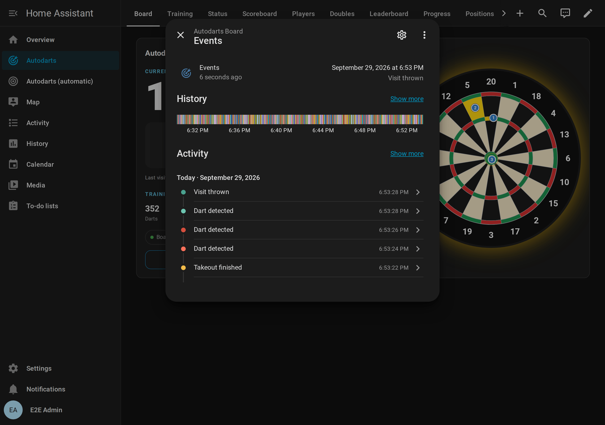

# Automations

[← Documentation](README.md) · [Deutsch](automations.de.md)

Your board is fast enough for automations that happen *while* you play. The light flashes the moment the third dart of a 180 lands, and the speaker calls the score before you reach the board.

**On this page:** [Blueprints](#blueprints) · [Blueprint settings](#blueprint-settings) · [Board events](#board-events) · [Examples](#examples) · [Online matches](#online-matches-experimental) · [Adapting automations from older versions](#adapting-automations-from-older-versions)

## Blueprints

Blueprints are ready-made automations. Import one, choose your board and the devices to use, and you're done. They require Home Assistant 2026.8 or newer, and they follow the current version of the integration: update both together.

| Blueprint | What it does | Import |
| --- | --- | --- |
| **Celebrate a visit score** | Runs your actions for visits from a minimum score (default 180), the moment the third dart lands. The actions can use `score`, `darts`, `segments` and `game`. The bot's visits count only if you ask for them. | [](https://my.home-assistant.io/redirect/blueprint_import/?blueprint_url=https%3A%2F%2Fgithub.com%2FDennis-Otto%2Fha-autodarts%2Fblob%2Fmain%2Fblueprints%2Fautomation%2Fautodarts%2Fvisit_score.yaml) |
| **Dart caller** | Announces every visit on your speakers with any text-to-speech engine, with a special message for 180, and optionally every dart. It stays silent during a practice game, which the practice caller calls. The messages are templates. | [](https://my.home-assistant.io/redirect/blueprint_import/?blueprint_url=https%3A%2F%2Fgithub.com%2FDennis-Otto%2Fha-autodarts%2Fblob%2Fmain%2Fblueprints%2Fautomation%2Fautodarts%2Fdart_caller.yaml) |
| **Takeout actions** | Runs actions when you start pulling darts and when the board is clear, for example to brighten the board light. | [](https://my.home-assistant.io/redirect/blueprint_import/?blueprint_url=https%3A%2F%2Fgithub.com%2FDennis-Otto%2Fha-autodarts%2Fblob%2Fmain%2Fblueprints%2Fautomation%2Fautodarts%2Ftakeout.yaml) |
| **Start and stop detection automatically** | Starts the detection when someone is at the board and stops it after an idle time you choose, so the cameras and board PC can rest. | [](https://my.home-assistant.io/redirect/blueprint_import/?blueprint_url=https%3A%2F%2Fgithub.com%2FDennis-Otto%2Fha-autodarts%2Fblob%2Fmain%2Fblueprints%2Fautomation%2Fautodarts%2Fauto_detection.yaml) |
| **Board problem alert** | Alerts you after a grace period when the board goes offline or a camera fails. An optional all-clear is sent only after a real alert. The actions can use `problem` and `recovered`. | [](https://my.home-assistant.io/redirect/blueprint_import/?blueprint_url=https%3A%2F%2Fgithub.com%2FDennis-Otto%2Fha-autodarts%2Fblob%2Fmain%2Fblueprints%2Fautomation%2Fautodarts%2Fboard_alert.yaml) |
| **Training report** | Sends a daily summary of darts, 3-dart average, highest visit and 180s, skipping days without darts. The `summary` variable has the sentence ready. | [](https://my.home-assistant.io/redirect/blueprint_import/?blueprint_url=https%3A%2F%2Fgithub.com%2FDennis-Otto%2Fha-autodarts%2Fblob%2Fmain%2Fblueprints%2Fautomation%2Fautodarts%2Ftraining_report.yaml) |
| **Training session routine** | When a [training session](entities.md#training-session) starts, runs your actions, turns on the detection and calibrates the cameras after a short wait; when it ends, turns off the detection and runs your actions with `reason`, `darts`, `average` and `duration_minutes`. The detection switch and the calibration button are optional. | [](https://my.home-assistant.io/redirect/blueprint_import/?blueprint_url=https%3A%2F%2Fgithub.com%2FDennis-Otto%2Fha-autodarts%2Fblob%2Fmain%2Fblueprints%2Fautomation%2Fautodarts%2Ftraining_session.yaml) |
| **Practice caller** | Calls the [practice game](games.md) on your speakers: "Sam, you require 81" when a checkout is possible, "No score" after a bust, the game shot of a leg or the match, and optionally the score to leave when no checkout is possible and the bull-off. The messages are templates. | [](https://my.home-assistant.io/redirect/blueprint_import/?blueprint_url=https%3A%2F%2Fgithub.com%2FDennis-Otto%2Fha-autodarts%2Fblob%2Fmain%2Fblueprints%2Fautomation%2Fautodarts%2Fpractice_caller.yaml) |
| **Weekly report** | Sends your [training week](entities.md#weekly-report) when the board ends it, by default on Monday at midnight: darts, training time, sessions, the 3-dart average and its change since the week before, best visit, 180s, checkout rate, streak and new personal bests. The message is a template; by default the report appears in Home Assistant's notifications. | [](https://my.home-assistant.io/redirect/blueprint_import/?blueprint_url=https%3A%2F%2Fgithub.com%2FDennis-Otto%2Fha-autodarts%2Fblob%2Fmain%2Fblueprints%2Fautomation%2Fautodarts%2Fweekly_report.yaml) |
| **Highlight photo** | Takes a picture with a board camera after a visit of at least 180 points (adjustable) or a checkout of the practice game, while the darts are still in the board. It saves the picture to the [highlight gallery](#highlight-gallery) and runs your actions, which can use `photo_url`, `photo`, `image`, `message`, `score`, `checkout` and `who`. | [](https://my.home-assistant.io/redirect/blueprint_import/?blueprint_url=https%3A%2F%2Fgithub.com%2FDennis-Otto%2Fha-autodarts%2Fblob%2Fmain%2Fblueprints%2Fautomation%2Fautodarts%2Fhighlight_photo.yaml) |
| **Light show** | Plays your light effects, such as WLED presets or room lights, for a 180, a high finish, a bust, a won leg or match, a personal best, the daily goal, a won bull-off, an achievement and the winner of a tournament, and optionally during the takeout and in [online matches](online-matches.md). It can restore your lights afterwards and pause the detection while an effect plays. | [](https://my.home-assistant.io/redirect/blueprint_import/?blueprint_url=https%3A%2F%2Fgithub.com%2FDennis-Otto%2Fha-autodarts%2Fblob%2Fmain%2Fblueprints%2Fautomation%2Fautodarts%2Flight_show.yaml) |
| **Start a game by voice** | Starts a practice game when you tell Assist, for example "Start 501 for Alex and Sam", "Start the game Cricket for Alex" or "Play 501 against the bot", in English or German. Assist answers with the game and the players, or with what was wrong. | [](https://my.home-assistant.io/redirect/blueprint_import/?blueprint_url=https%3A%2F%2Fgithub.com%2FDennis-Otto%2Fha-autodarts%2Fblob%2Fmain%2Fblueprints%2Fautomation%2Fautodarts%2Fstart_game_by_voice.yaml) |

Without My Home Assistant, go to **Settings → Automations & scenes → Blueprints → Import blueprint** and paste the link to the file in [`blueprints/automation/autodarts`](https://github.com/Dennis-Otto/ha-autodarts/tree/main/blueprints/automation/autodarts). To update a blueprint you imported before, choose **Re-import blueprint** in its menu on the blueprints page; your automations keep their settings.


### Which caller?

- **Dart caller:** calls every visit, in any game on the board, for example during an online match. While a [practice game](entities.md#practice-game) of the integration is played, it stays silent, so that it never talks over the practice caller. Turn off *Stay silent in practice games* if you don't use the practice caller.
- **Practice caller:** calls what matters in the practice game: requirements, busts, game shots and, if you like, the bull-off.
- **Caller of the scoreboard card:** the [scoreboard](scoreboard.md#the-caller) calls visits and the practice game in one voice, through the browser of the screen at the board. It needs no speakers in Home Assistant.

## Blueprint settings

Every blueprint shows these settings when you create an automation from it: select the blueprint on the blueprints page, fill in the form and save. Settings with a default are optional.


### Celebrate a visit score

| Setting | Default | What it does |
| --- | --- | --- |
| Board events | | The *Events* entity of your board. |
| Minimum score | 180 | The lowest visit score that runs the actions. A visit of three darts counts when its third dart lands; a shorter visit when the darts are pulled. |
| Actions | | What happens after such a visit. It can use `score`, `darts`, `segments` and `game` (the practice game, or empty). |
| Also for the bot | off | Also runs the actions for the visits of the practice game's [bot](entities.md#bot). Its darts are not in the board, so its visits are left out by default. |

### Dart caller

| Setting | Default | What it does |
| --- | --- | --- |
| Board events | | The *Events* entity of your board. |
| Text-to-speech engine | | The engine that speaks, for example Home Assistant Cloud or Piper. |
| Speakers | | The media players that play the calls. |
| Language | empty | The language of the voice, for example `en-GB`; empty uses the language of the engine. |
| Voice options | empty | Options of the engine, for example `voice: ...` for another voice. |
| Call every dart | off | Also calls each dart when it lands. The third dart is not called on its own, because the visit follows right away. |
| Stay silent in practice games | on | Leaves the calls to the practice caller while an X01, Cricket or party game of the integration is played. |
| Visit message | `{{ score }}` | Said after a visit. It can use `score`, `darts` and `segments`. |
| Message for 180 | `One hundred and eighty!` | Said instead of the visit message after a 180. |
| Dart message | `{{ dart_name }}` | Said for each dart. It can use `dart_name` (such as `Treble 20`, `5`, `Bull` or `Miss`), `segment` (such as `T20`), `dart_score` and `dart_index`. |

An empty message stays silent.

### Takeout actions

| Setting | Default | What it does |
| --- | --- | --- |
| Board events | | The *Events* entity of your board. |
| When the takeout starts | none | Runs when a hand reaches the board to pull the darts. |
| When the board is clear | none | Runs when all darts are out of the board. |

Fill in at least one of the two.

### Start and stop detection automatically

| Setting | Default | What it does |
| --- | --- | --- |
| Presence | | Any on/off entity that is on while someone is at the board: an occupancy sensor, the room light or an input boolean. |
| Detection switch | | The *Detection* switch of your board. |
| Stop after | 10 minutes | How long the presence has to be off before the detection stops. |

Don't combine this blueprint with a detection switch in the *training session routine*: both would switch the detection.

### Board problem alert

| Setting | Default | What it does |
| --- | --- | --- |
| Board connection | | The *Local connection* sensor of your board. |
| Camera problem | | The *Camera problem* sensor of your board. |
| Grace period | 2 minutes | How long a problem has to last before the alert, so that a Board Manager restart or a short calibration stays quiet. |
| Alert actions | | For example a notification to your phone. `problem` is `offline` or `cameras`. |
| Recovery actions | none | Run when a problem you were alerted about is gone, with `recovered` set to `true`. |

A problem also counts when it starts while the sensor is unavailable, for example a camera that fails while the board restarts. A problem that ends while the board is offline gets no all-clear of its own. If the board was offline for longer than the grace period, the all-clear of the connection follows; after a shorter restart, a camera problem that the restart solved stays without an all-clear.

### Training report

| Setting | Default | What it does |
| --- | --- | --- |
| Time | 21:00 | When the report is sent. Choose a time late in the day: darts count for the day on which they are thrown. |
| Minimum darts | 1 | Skips the report when fewer darts were thrown today. |
| Training darts | | The *Training darts* sensor of your board. |
| Training 3-dart average | | The *Training 3-dart average* sensor of your board. |
| Training highest visit | | The *Training highest visit* sensor of your board. |
| Training 180s | | The *Training 180s* sensor of your board. |
| Actions | | For example a notification with `summary`. They can also use `darts`, `average`, `highest`, `scores_180` and `darts_today`. |

A finished session keeps its totals until the next one starts, so the report checks the *Darts today* sensor of the same board and skips days without darts. If that sensor is disabled, the darts of the session decide. To start a new session every day, add *New training session* of your board as the last action.

### Training session routine

| Setting | Default | What it does |
| --- | --- | --- |
| Board events | | The *Events* entity of your board. |
| Detection switch | none | Turned on when a session starts and off when it ends. |
| Calibration button | none | The *Start automatic calibration* button, pressed after the detection has started. It is skipped when the first dart started the session, because that dart is still in the board. |
| Wait before calibrating | 5 seconds | Gives the cameras time to open. |
| When a session starts | none | Runs first, for example to switch on the board light. The board is prepared even if one of these actions fails. |
| When a session ends | none | Runs after the detection has stopped, with `reason`, `darts`, `average` and `duration_minutes`. |
| Run for a new training session | off | *New training session* ends a session and starts the next one at once, for example every morning by an automation. By default the board keeps running then; turn this on to run the whole routine. |

Leave the calibration button empty when the board's *Calibrate on start* setting is on: the board calibrates by itself when the detection starts. Don't combine a detection switch here with the blueprint that starts and stops the detection automatically.

### Practice caller

| Setting | Default | What it does |
| --- | --- | --- |
| Board events | | The *Events* entity of your board. |
| Text-to-speech engine, Speakers, Language, Voice options | | As in the dart caller. |
| Checkout possible | `{{ who ~ ', you' if who else 'You' }} require {{ remaining }}` | Said when the next visit can finish the leg. |
| No checkout, a setup | empty | Said when the next visit cannot finish the leg but can leave a finish, with `leave` and `setup`, for example `{{ who ~ ', leave' if who else 'Leave' }} yourself {{ leave }}`. Empty uses the *Next player* message. |
| Next player | empty | Said when the next visit cannot finish the leg. Empty stays silent. |
| Bust | `No score` | Said when a dart busts the visit. |
| Leg won | `Game shot, and the leg{{ ', ' ~ (team or who) if team or who }}!` | Said when a dart wins a leg that does not decide the match; in a team match with the team's name. |
| Match won | `Game shot, and the match, {{ team or who }}!` | Said when a dart decides the match; in a team match with the team's name. |
| Bull-off throw | empty | Said when the next player throws for the bull, for example `{{ who }}, throw for the bull`. The first player of the bull-off is not called. Empty uses the *Next player* message. |
| Bull-off won | empty | Said when the bull-off decides who starts, in one call with the first call of the match, for example `{{ who }} to throw first. Game on!`. Empty stays silent. |
| Word for a player without a name | `Player` | Makes "Player 2" in a match without names. |
| Word for the bot | `Bot` | The name of the practice game's [bot](entities.md#bot) in `who`, as the scoreboard shows it, for example "Bot, you require 40". |

The first visit of a game is not called, because a game starts without a change of turn. With a [bull-off](games.md#bull-off), the call of the winner starts the game instead.

### Weekly report

| Setting | Default | What it does |
| --- | --- | --- |
| Board events | | The *Events* entity of your board. |
| Minimum darts | 1 | Skips the report of a week with fewer darts, for example a week on holiday. With 0, every week is reported. |
| Title | `Your darts week` | The title of the notification, available as `title`. |
| Message | `{{ summary }}` | The text of the notification, available as `message`. |
| Notification actions | a notification in Home Assistant | How the report is sent, for example to your phone, see [below](#weekly-report-on-your-phone). |

The message can use `darts`, `visits`, `sessions`, `training_minutes`, `average`, `average_change`, `highest_visit`, `scores_180`, `checkout_rate`, `legs`, `matches`, `streak`, `daily_goals`, `personal_bests` (how many were set), `week_start`, `week_end` and `summary`, a ready-made summary in English. The board ends the week at its *Weekly report day* and *Weekly report time*, by default on Monday at midnight.

### Highlight photo

| Setting | Default | What it does |
| --- | --- | --- |
| Board events | | The *Events* entity of your board. |
| Camera | | The board camera that takes the photo. Enable the camera entity first; camera entities are disabled by default. |
| Visits from | 180 | A visit with at least this score gets a photo when its third dart lands. |
| Checkouts | on | Also a photo when a practice leg is won with a checkout. When the same dart finishes a visit and a leg, you get one photo, with the checkout message. |
| Save to the gallery | on | Saves every photo in the folder below, for the [highlight gallery](#highlight-gallery) of the media browser. |
| Folder | `/media/autodarts/highlights` | Where the photos go. Home Assistant OS and containers use `/media`; other installations the `media` folder in the configuration folder, for example `/config/media/autodarts/highlights`. |
| Actions | none | For example a notification, see [below](#highlight-photo-on-your-phone). Optional while the photos go to the gallery. |
| Message for a visit | `{{ score }}!` | The `message` of a visit photo. |
| Message for a checkout | `Checkout {{ checkout }}{{ ' by ' ~ who if who }}!` | The `message` of a checkout photo. |

Your actions can use:

- `photo_url`: the address of the saved photo, for a notification of the Home Assistant app, for example `/media/local/autodarts/highlights/2026-09-26_21-05-33_Alex_180.jpg`.
- `photo`: the file the picture is saved to.
- `image`: the live picture of the camera, for photos that are not saved.
- `message`, `score`, `checkout` and `who` (the player at the board, when the practice game names them).

`photo` and `photo_url` are empty when no photo was saved: *Save to the gallery* is off, or Home Assistant could not write to the folder. `photo_url` is also empty for a folder outside the media folder, which the app cannot load from.

### Light show

| Setting | Default | What it does |
| --- | --- | --- |
| Board events | | The *Events* entity of your board. |
| Actions for a 180 | none | Run the moment the third dart of a 180 lands. |
| High finish from | 100 | A practice leg won with a checkout of at least this score is a high finish. |
| Actions for a high finish | none | Run for a high finish, instead of the actions for a won leg. |
| Actions for a bust | none | Run when a dart of the practice game busts the visit. |
| Actions for a won leg | none | Run when a dart wins a practice leg. The leg that decides a match plays the actions for the match instead. |
| Actions for a won match | none | Run when a dart decides a practice match. |
| Actions for a personal best | none | Run when a value beats your [personal best](entities.md#personal-bests-streak-and-daily-goal). |
| Actions for the daily goal | none | Run when today's darts reach the daily goal. |
| Actions for a won bull-off | none | Run when the bull-off decides who starts. |
| Actions for an achievement | none | Run when a named player unlocks a new tier of an [achievement](entities.md#achievements). |
| Actions for a won tournament | none | Run when the last match of a [tournament](entities.md#tournaments) counts, after the actions for the won match; `who` is the winner of the tournament. |
| React to the takeout | off | Runs the two actions below while you pull the darts. Leave it off without them, so that takeouts never wait behind an effect. |
| When the takeout starts | none | Run when a hand reaches the board. Not restored. |
| When the board is clear | none | Run when all darts are out of the board. Not restored. |
| Also for the bot | off | Also plays the moments of the practice game's [bot](entities.md#bot): its 180, bust, won leg or match and won bull-off. A leg or match the bot wins in a team match plays anyway, because its partner at the board wins it, too. |
| Word for the bot | `Bot` | The bot's name in `who`. |
| Word for a player without a name | `Player` | Makes "Player 2" in `who`. |
| Moments with an effect | none | The moments whose actions start an effect. Only for them are the lights restored and the detection paused. |
| Restore these lights | none | Their state is saved before an effect and restored after it. |
| Effect duration | 10 seconds | How long an effect plays before the lights are restored and the detection starts again. |
| Pause the detection during effects | off | Turns the detection off while an effect plays and on again afterwards, if it was on. The daily goal never pauses it, because it is reached in the middle of a visit. |
| Detection switch | none | The *Detection* switch of your board, for pausing it. |
| Also react to online matches | off | Also plays the actions for a bust, a won leg and a won match of an [online match](online-matches.md). A 180 and the takeout of your own darts come from your board anyway. |

The actions can use `moment` (`maximum`, `high_finish`, `bust`, `leg`, `match`, `personal_best`, `daily_goal`, `bull_off`, `achievement`, `tournament`, `takeout` or `board_clear`), `who` (the player's name, the word for the bot, or "Player 2"), `player`, `score` (of a 180), `checkout` (of a won leg) and `trigger.to_state.attributes` for every detail of the [board event](entities.md#board-events). See [light show with WLED and other lights](#light-show-with-wled-and-other-lights).

### Start a game by voice

| Setting | Default | What it does |
| --- | --- | --- |
| Sentences | German and English | What you say to Assist. `{game}` is the game and `{players}` the players; parts in [brackets] are optional, (a\|b) means a or b. |
| Bot level | 60 | The 3-dart average the bot plays when a sentence ends in "bot". |
| Board | | The board to play on. Needed only with more than one board. |

Say for example:

- "Start 501 for Alex and Sam", "Play 301 with Alex, Sam and Kim" or "Start five hundred one"
- "Start the game Cricket for Alex and Sam", "Play a game of Around the Clock"
- "Start 501 for Alex against the bot", "Play the game Cricket against the bot"
- in German "Starte 501 für Alex und Sam", "Starte das Spiel Doppeltraining" or "Spiele 501 gegen den Bot"

Assist answers "Game on: 501 with Alex and Sam." in the language of Home Assistant, or says what was wrong, such as a game it does not know or Killer with one player.

- **The game:** X01 is a number from 101 to 1001, as digits or spoken. Every other game follows the word "Spiel" or "game" and is named as the game list shows it, in any language of the integration: "Around the Clock", "Bob's 27", "Doubles training", "Doppeltraining". The beginning of a name is enough where it fits one game alone, such as "Cut Throat".
- **The players:** one word each, joined by "and", "und" or a comma. A player who already has a profile keeps its spelling, even when the voice assistant writes the name in lower case. Without players, the players stay as they are.
- **The bot:** a sentence that ends in "bot" plays against the bot, which takes a seat after the players; any other sentence starts the game without the bot.
- **Why a number or the word "game":** Assist hears the sentences of an automation before its own commands. A sentence such as "Start {game} for {players}" would also catch "Start a timer for 5 minutes", and the timer would never run. With a number or the word "game", your other commands stay as they are.

### Dart caller messages

The messages of the dart caller are templates. For example:

| Setting | Example |
| --- | --- |
| Visit message | `{{ score }}`, or `{{ score }} points` |
| Message for 180 | `One hundred and eighty!` |
| Dart message | `{{ dart_name }}` says "Treble 20", "5", "Bull" or "Miss"; `{{ dart_score }}` says the points |

For a German caller, see the [German guide](automations.de.md#deutscher-dart-caller).

### Practice caller messages

The practice caller's messages are templates with these variables:

| Variable | Content |
| --- | --- |
| `who` | The player's name, "Bot" for the [bot](entities.md#bot) (see *Word for the bot*), "Player 2" in a match without names, empty when you play alone |
| `team` | The team of the player in a [team match](entities.md#teams-and-start-scores), for example `Alex & Kim` when both partners have a name; empty otherwise |
| `remaining` | The score left |
| `checkout` | The route when a checkout is possible, for example `T20 T20 BULL`; in *Leg won*, the score checked out, for example `121` |
| `darts`, `average` | Darts and 3-dart average of the leg, in *Leg won* |
| `points` | Points in the Cricket and party games; strokes in Golf, runs in Baseball. Killer keeps no points: its events carry the player's `lives` and whether they are a `killer`, for example `trigger.to_state.attributes.lives` |
| `target` | The next target of a party game, for example `20`, `D` or `D16`; the hole in Golf and the inning in Baseball |
| `leave`, `setup` | Where no checkout is possible: the score a [setup](entities.md#setup-hints) leaves, for example `32`, and its darts, for example `T20 T20 S17`; empty otherwise |
| `hit` | The bed of the winning bull-off dart in *Bull-off won*: `BULL`, `25` or for example `S20` |
| `distance` | How far the winning bull-off dart landed from the center, in millimeters, in *Bull-off won*; empty when the board reported no position for it, never `None` |

For example:

| Setting | Example |
| --- | --- |
| Checkout possible | `{{ who ~ ', you' if who else 'You' }} require {{ remaining }}` |
| No checkout, a setup | `{{ who ~ ', leave' if who else 'Leave' }} yourself {{ leave }}` |
| Next player | `{{ who }}`, or `{{ who }}, {{ target }}` in party games |
| Bust | `No score` |
| Leg won | `Game shot, and the leg{{ ', ' ~ (team or who) if team or who }}! {{ checkout }} checkout in {{ darts }} darts.` |
| Match won | `Game shot, and the match, {{ team or who }}!` |
| Bull-off throw | `{{ who }}, throw for the bull` |
| Bull-off won | `{{ who }} to throw first. Game on!`, or `{{ who }} wins the bull{{ ' by ' ~ distance ~ ' millimeters' if distance is number }}` |
| Word for a player without a name | `Player` |

### Highlight photo on your phone

In *Actions* of the highlight photo, add a notification of the Home Assistant app and give it the picture:

```yaml
action: notify.mobile_app_your_phone
data:
  message: "{{ message }}"
  data:
    image: "{{ photo_url or image }}"
```

The app loads the saved photo, taken while the darts were still in the board, even when the notification reaches a sleeping phone minutes later. Without a saved photo it falls back to `image`, the live picture of the camera, which the app loads only when the notification arrives, possibly after the darts are pulled. Enable the camera entity on the device page first; camera entities are disabled by default.

### Highlight gallery

The highlight photo saves every picture as a file named by the moment, the player and the score, for example `2026-09-26_21-05-33_Alex_180.jpg` or `2026-09-26_21-07-10_Alex_checkout-121.jpg`. Open **Media → Autodarts** in the sidebar: the gallery lists the months, newest first, and every photo with a title such as *180 · Alex · Sep 26*.


- The gallery shows the folder `autodarts/highlights` of the media folder of Home Assistant, which is `/media/autodarts/highlights` on Home Assistant OS and in a container. [How the gallery works](how-it-works.md#highlight-gallery).
- Photos you copy there yourself show, too; without a name of this kind, by their file name and the time they were saved.
- To delete a photo, open **Media → My media → autodarts → highlights**.
- The gallery needs the media browser, which the default configuration of Home Assistant includes.

### Light show with WLED and other lights

Give every moment you like its own actions; moments without actions stay dark. A WLED preset that you saved in WLED as "180", for a 180:

```yaml
action: select.select_option
target:
  entity_id: select.wled_preset
data:
  option: "180"
```

A WLED effect at full brightness, for example for a won match:

```yaml
action: light.turn_on
target:
  entity_id: light.wled
data:
  effect: Fireworks
  brightness_pct: 100
```

Plain room lights in the color of the player who won the leg, from player 1 to 4; for a bust, `rgb_color: [255, 0, 0]` turns them red:

```yaml
action: light.turn_on
target:
  entity_id: light.dartroom
data:
  rgb_color: "{{ [[255, 0, 0], [0, 90, 255], [0, 200, 80], [255, 200, 0]][player - 1] }}"
  brightness_pct: 100
```

- **Back to normal:** choose the moments with actions under *Moments with an effect*, and add your lights to *Restore these lights*, for WLED the WLED light rather than the preset select. Before an effect, the blueprint saves their state in a scene, and after *Effect duration* it restores color, brightness and effect. Leave the lights empty if your actions end the effect themselves. Moments you don't choose run their actions and nothing else, so a moment without actions never pauses the board.
- **Pause the detection:** flashing light next to the board can make the cameras see darts that are not there. Turn on *Pause the detection during effects* and choose the *Detection* switch: the detection stops for the effects of the chosen moments and starts again afterwards, but only if it was running. When the detection stops, the visit on the board counts as finished, as after a takeout: the practice game books it and the next player is up.
- **One after the other:** a moment that happens while an effect plays waits for it, and each effect restores the lights it found. Up to nine moments wait, enough for the match that wins a tournament with its personal bests and achievements. The automation runs in queued mode, because a restarted effect would never restore the lights and parallel effects would mix on the same lights.
- **The daily goal** is reached with a dart in the middle of a visit, so its effect never pauses the detection: the rest of the visit still counts.
- **Takeout and board clear** set a look of their own, for example a bright board light while you pull the darts and your normal light afterwards. Turn on *React to the takeout* for them. They are not restored and don't pause the detection; while the setting is off, takeouts never wait in the queue.
- **The bot:** its darts are not in the board, so its moments stay dark unless you turn on *Also for the bot*. A leg or match it wins in a team match plays anyway.

### Weekly report on your phone

Replace the *Notification actions* of the weekly report with a notification of the Home Assistant app:

```yaml
action: notify.mobile_app_your_phone
data:
  title: "{{ title }}"
  message: "{{ message }}"
```

The ready-made `summary` reads, for example: *312 darts in 95 minutes at the board, 3 sessions. 3-dart average 54.2 (+2.1 on the week before). Best visit 140, 1 × 180. Checkout rate 31.2 %. 4 days in a row. 2 new personal bests.* Parts without a value, such as a week without 180s, are left out.


For a report in another language, write your own *Title* and *Message*. In German, in the YAML mode of the automation:

```yaml
use_blueprint:
  path: autodarts/weekly_report.yaml
  input:
    board_events: event.autodarts_board_events
    report_title: Deine Dartwoche
    report_message: >-
      {{ darts }} Darts{{ ' in ' ~ training_minutes ~ ' Minuten' if training_minutes else '' }}{{ ', 3-Dart-Average ' ~ (average | replace('.', ',')) ~ (' (' ~ ('+' if average_change > 0 else '') ~ (average_change | replace('.', ',')) ~ ')' if average_change is not none else '') if average is not none else '' }}{{ ', ' ~ scores_180 ~ ' × 180' if scores_180 else '' }}{{ ', ' ~ streak ~ (' Tag' if streak == 1 else ' Tage') ~ ' in Folge' if streak else '' }}.
```

## Board events

All realtime moments arrive through the **Events** entity of the board. Each event carries an `event_type` and its details; see the [event reference](entities.md#board-events). The examples use `event.autodarts_board_events`, the entity ID of a board named *Autodarts Board* in a Home Assistant set to English. Home Assistant forms entity IDs from the names in its language, so in German, Dutch, French or Spanish the IDs read differently, for example `event.autodarts_board_ereignisse` in German. A board set up with an earlier version keeps the ID it got then, such as `event.autodarts_board_board_events`.



Open the entity on the device page to watch the events arrive while you throw; its activity lists every event with the time it happened.

In the automation editor, choose the trigger **Event received** (*Entity → Event*), select the *Events* entity of your board and the event types you want. In YAML:

```yaml
triggers:
  - trigger: event.received
    target:
      entity_id: event.autodarts_board_events
    options:
      event_type:
        - visit_thrown
```

A visit of three darts arrives as `visit_thrown` the moment its third dart lands, and as `visit_completed` when the darts are pulled. For celebrations and calls, use `visit_thrown`, and add `visit_completed` whose `thrown` attribute is `false` for visits with fewer darts.

Darts entered or corrected in Home Assistant carry `manual: true`, and the events of the [bot](entities.md#bot) `bot: true`; see [leave the bot out](#leave-the-bot-out).

Read the details from `trigger.to_state.attributes`, not from the current state of the entity. Two events can follow each other within milliseconds, for example `visit_completed` and `takeout_finished`, and the current state may already show the second one.

## Examples

The entity IDs in the examples are those of a board named *Autodarts Board* in a Home Assistant set to English; yours depend on the name of your board and on the language of Home Assistant during setup. You find them on the device page of the board.

### Flash the lights for a 180

```yaml
alias: Darts - 180 light show
triggers:
  - trigger: event.received
    target:
      entity_id: event.autodarts_board_events
    options:
      event_type:
        - visit_thrown
conditions:
  - condition: template
    value_template: "{{ trigger.to_state.attributes.get('score') == 180 }}"
actions:
  - action: light.turn_on
    target:
      entity_id: light.dartroom
    data:
      effect: colorloop
  - delay: 10
  - action: light.turn_on
    target:
      entity_id: light.dartroom
    data:
      effect: none
      brightness_pct: 100
mode: single
```

### Light up the board while you pull the darts

```yaml
alias: Darts - takeout light
triggers:
  - trigger: event.received
    id: started
    target:
      entity_id: event.autodarts_board_events
    options:
      event_type:
        - takeout_started
  - trigger: event.received
    id: finished
    target:
      entity_id: event.autodarts_board_events
    options:
      event_type:
        - takeout_finished
actions:
  - choose:
      - conditions:
          - condition: trigger
            id: started
        sequence:
          - action: light.turn_on
            target:
              entity_id: light.board_light
            data:
              brightness_pct: 100
    default:
      - action: light.turn_on
        target:
          entity_id: light.board_light
        data:
          brightness_pct: 60
mode: queued
```

### Notify a camera problem

```yaml
alias: Darts - camera problem
triggers:
  - trigger: state
    entity_id: binary_sensor.autodarts_board_camera_problem
    to: "on"
    for:
      minutes: 2
actions:
  - action: notify.mobile_app_phone
    data:
      title: Autodarts
      message: A board camera delivers no images. Check the camera and its cable.
mode: single
```

### Stop the detection at night

```yaml
alias: Darts - stop detection at night
triggers:
  - trigger: time
    at: "01:00:00"
conditions:
  - condition: state
    entity_id: switch.autodarts_board_detection
    state: "on"
actions:
  - action: switch.turn_off
    target:
      entity_id: switch.autodarts_board_detection
mode: single
```

### Prepare the board when a training session starts

Switch on the board light, start the detection and calibrate the cameras when a session starts, and switch everything off when it ends. Turn off *Start sessions automatically* and start sessions with the *Training session* switch, for example from the training card. Leave out the calibration when the board's *Calibrate on start* setting is on, and don't combine this with automations that switch the detection by presence.

```yaml
alias: Darts - training session routine
triggers:
  - trigger: event.received
    target:
      entity_id: event.autodarts_board_events
    options:
      event_type:
        - session_started
    id: started
  - trigger: event.received
    target:
      entity_id: event.autodarts_board_events
    options:
      event_type:
        - session_ended
    id: ended
conditions:
  # "New training session" ends a session and starts the next one at once.
  - condition: template
    value_template: "{{ trigger.to_state.attributes.get('reason') != 'new_session' }}"
actions:
  - choose:
      - conditions:
          - condition: trigger
            id: started
        sequence:
          - action: light.turn_on
            target:
              entity_id: light.dart_board
          - action: switch.turn_on
            target:
              entity_id: switch.autodarts_board_detection
          # The dart that started a session is still in the board.
          - if:
              - condition: template
                value_template: "{{ trigger.to_state.attributes.get('reason') != 'first_dart' }}"
            then:
              # Give the cameras time to open.
              - delay: 5
              - action: button.press
                target:
                  entity_id: button.autodarts_board_start_automatic_calibration
      - conditions:
          - condition: trigger
            id: ended
        sequence:
          - action: switch.turn_off
            target:
              entity_id: switch.autodarts_board_detection
          - action: light.turn_off
            target:
              entity_id: light.dart_board
mode: queued
```

### Start a new training session every Monday

```yaml
alias: Darts - weekly training session
triggers:
  - trigger: time
    at: "04:00:00"
conditions:
  - condition: time
    weekday: mon
actions:
  - action: button.press
    target:
      entity_id: button.autodarts_board_new_training_session
mode: single
```

### Call the game shot in a practice game

Announce a won leg and a bust of the [practice game](entities.md#practice-game) on your speakers, with the name of the player.

```yaml
alias: Darts - practice caller
triggers:
  - trigger: event.received
    target:
      entity_id: event.autodarts_board_events
    options:
      event_type:
        - leg_won
        - bust
actions:
  - action: tts.speak
    target:
      entity_id: tts.home_assistant_cloud
    data:
      media_player_entity_id: media_player.darts_room
      message: >-
        
        {# In a team match, the team wins the leg. #}
        
        
          Game shot, and the leg, {{ player }}, in {{ event.darts }} darts.
        
          Bust. {{ player }}, you still need {{ event.remaining }}.
        
mode: queued
```

### Send the summary of a match

After a practice match of several players, send every player's numbers to your phone. `match_won` carries the [match summary](entities.md#practice-game) in `summary`; X01 has averages and checkouts, Cricket `mpr` and `marks`.

```yaml
alias: Darts - match summary
triggers:
  - trigger: event.received
    target:
      entity_id: event.autodarts_board_events
    options:
      event_type:
        - match_won
actions:
  - action: notify.mobile_app_phone
    data:
      title: "{{ trigger.to_state.attributes.name or 'Player ' ~ trigger.to_state.attributes.player }} wins"
      message: >-
        
        {{ player.name or 'Player ' ~ player.player }}: legs {{ player.legs }}
        , average {{ player.average }}
        , 180s {{ player.scores_180 }}
        , checkout {{ player.checkout_rate }} %
        , MPR {{ player.mpr }}.
        
mode: queued
```

### Celebrate a personal best and the daily goal

```yaml
alias: Darts - personal best
triggers:
  - trigger: event.received
    target:
      entity_id: event.autodarts_board_events
    options:
      event_type:
        - personal_best
        - daily_goal_reached
actions:
  - action: notify.mobile_app_phone
    data:
      message: >-
        
        
          New personal best: {{ event.record | replace('_', ' ') }} {{ event.value }}
          (before {{ event.previous }}){{ ' by ' ~ event.name if event.name }}!
        
          Daily goal reached: {{ event.darts }} darts, {{ event.streak }} days in a row.
        
mode: queued
```

### Count the training sessions of the month

The [training calendar](entities.md#training-calendar) answers questions about the past, for example in a script:

```yaml
sequence:
  - action: calendar.get_events
    target:
      entity_id: calendar.autodarts_board_training_calendar
    data:
      start_date_time: "{{ now().replace(day=1, hour=0, minute=0, second=0) }}"
      end_date_time: "{{ now() }}"
    response_variable: calendar
  - variables:
      sessions: >-
        {{ calendar['calendar.autodarts_board_training_calendar'].events
           | selectattr('summary', 'match', 'Training') | list | count }}
```

### Celebrate an achievement

A notification with the player, the achievement and its tier. The `achievement` attribute is the key of the [achievement](entities.md#achievements), such as `maximum` or `short_leg`; the table there names each one.

```yaml
alias: Darts - achievement
triggers:
  - trigger: event.received
    target:
      entity_id: event.autodarts_board_events
    options:
      event_type:
        - achievement_unlocked
actions:
  - action: notify.mobile_app_phone
    data:
      message: >-
        
        
        {{ event.name }}: {{ event.achievement | replace('_', ' ') }}, {{ medal }}!
mode: queued
```

### Start a game by voice

The blueprint [Start a game by voice](#start-a-game-by-voice) does this with sentences in English and German. For sentences of your own, let the action answer: it knows the games by their names in every language of the integration, and with `response_variable` it tells what started, or what was wrong, in words Assist can say. Keep a fixed word such as "game" before `{game}`, so the sentence never catches another command of Assist.

```yaml
alias: Darts - start by voice
triggers:
  - trigger: conversation
    command:
      - "let's play [a] game [of] {game} with {names}"
actions:
  - action: autodarts.start_game
    data:
      game: "{{ trigger.slots.game }}"
      players: "{{ trigger.slots.names | regex_replace(' and ', ' ') | regex_findall('[^ ]+') }}"
    response_variable: result
  - set_conversation_response: "{{ result.message }}"
mode: single
```

### Announce the results of a tournament

Call every result of a [tournament](entities.md#tournaments), the next match and the winner on your speakers.

```yaml
alias: Darts - tournament announcer
triggers:
  - trigger: event.received
    target:
      entity_id: event.autodarts_board_events
    options:
      event_type:
        - tournament_match_finished
        - tournament_finished
actions:
  - action: tts.speak
    target:
      entity_id: tts.home_assistant_cloud
    data:
      media_player_entity_id: media_player.darts_room
      message: >-
        
        
          {{ event.winner }} wins the tournament, ahead of {{ event.runner_up }}!
        
          {{ event.winner }} beats {{ event.loser }},
          {{ event.legs | max }} legs to {{ event.legs | min }}.
          Next up: {{ event.next | join(' against ') }}.
        
mode: queued
```

### Enter a visit by hand

For a player without cameras, or a board with the detection switched off: a script enters a whole visit, for example "T20 T20 S20" from a text field on the dashboard or from Assist, and passes the turn. Switch on *Practice manual entry* first; the darts count like detected darts and are marked `manual`.

```yaml
script:
  darts_enter_visit:
    alias: Darts - enter a visit by hand
    fields:
      darts:
        description: The beds of the visit, for example T20 T20 S20
        example: T20 T20 S20
        selector:
          text: {}
    sequence:
      - repeat:
          for_each: "{{ darts.split() }}"
          sequence:
            - action: autodarts.throw_dart
              data:
                segment: "{{ repeat.item }}"
      - action: autodarts.next_player
    mode: single
```

A button on the dashboard takes back the last visit, for a wrong reading noticed after the darts were pulled; the [scoreboard](cards.md#correcting-and-entering-darts) has one built in:

```yaml
type: button
name: Undo last visit
icon: mdi:undo
tap_action:
  action: perform-action
  perform_action: autodarts.undo_visit
  confirmation:
    text: Take the last visit back?
```

### Leave the bot out

The darts of the [bot](entities.md#bot) fire the usual events with `bot: true`, and its seat has no name. The blueprints know it:

- The visit score and the light show leave the bot out; turn on *Also for the bot* to include it.
- The highlight photo takes no photo of the bot's darts, which are not in the board.
- The callers call the bot by the *Word for the bot*, "Bot" by default, like the scoreboard.

An automation made from a blueprint takes no conditions of its own unless you take control of it, so use these settings there. To celebrate only your own visits in an automation of your own, add a condition:

```yaml
conditions:
  - condition: template
    value_template: "{{ not trigger.to_state.attributes.get('bot', false) }}"
```

## Online matches (experimental)

In online matches on play.autodarts.io, your own darts arrive as usual. Busts, won legs and matches and the darts of your opponents arrive through the optional online bridge and the browser extension Tools for Autodarts, as board events whose type starts with `online_`. The [online matches guide](online-matches.md) explains how to set it up.

## Adapting automations from older versions

Automations that celebrate a 180 or call a visit on `visit_completed` react only when the darts are pulled. Switch them to `visit_thrown` to react the moment the third dart lands, as in the [examples](#flash-the-lights-for-a-180).

Since version 1.0, the **Detection status** sensor reports translatable states: `stopped`, `throw`, `takeout_in_progress` and so on. Older versions reported the raw text of the Board Manager, such as `Stopped` or `Takeout in progress`. Update automations that compare against the old text:

| Before | Now |
| --- | --- |
| `Stopped` | `stopped` |
| `Starting`, `Stopping` | `starting`, `stopping` |
| `Throw` | `throw` |
| `Takeout`, `Takeout in progress` | `takeout`, `takeout_in_progress` |
| `Calibrating` | `calibrating` |
| `Error` | `error` |

The UI shows these states in your language. The *Last event* sensor still reports the raw Board Manager text. It is a diagnostic sensor now and, like *CPU usage*, starts disabled on a board set up with version 1.6.0 or later: enable it on the device page before an automation uses it. Boards set up before keep both entities as they are.
