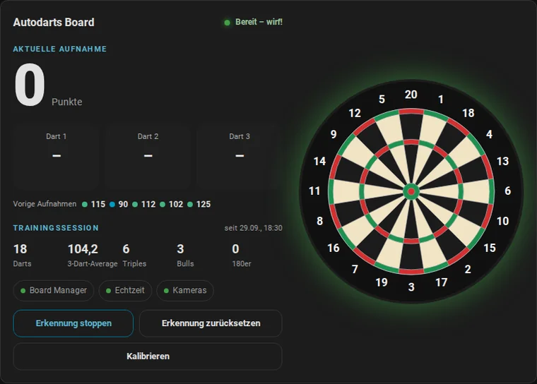
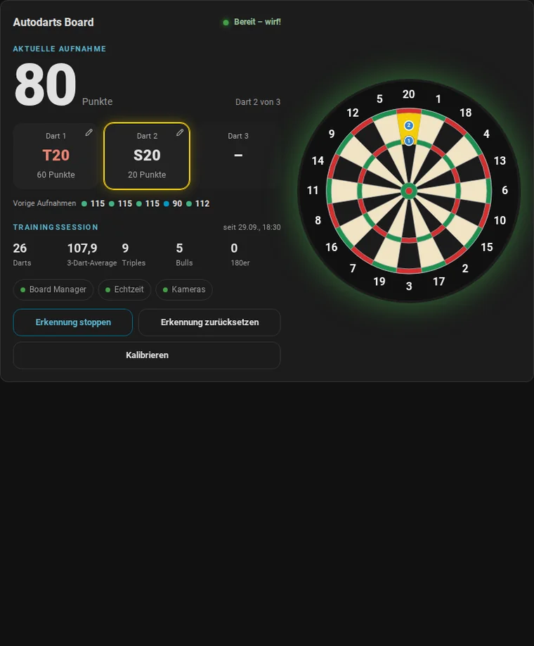
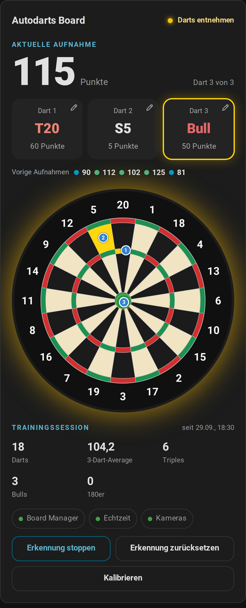
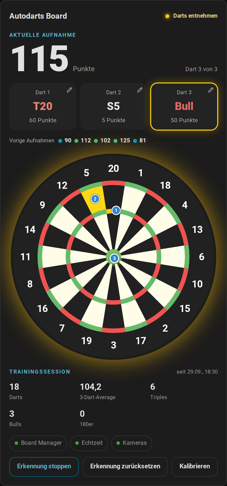
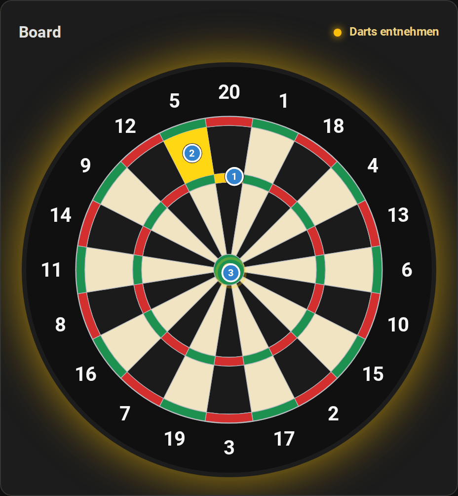
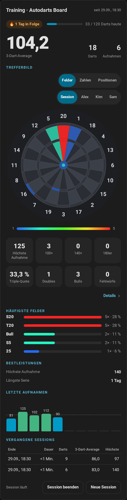
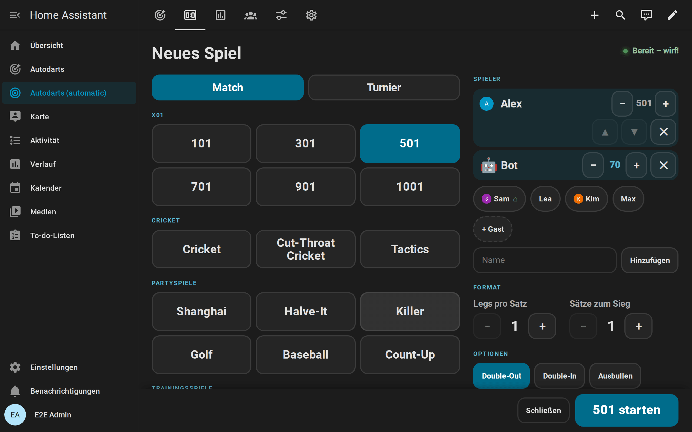
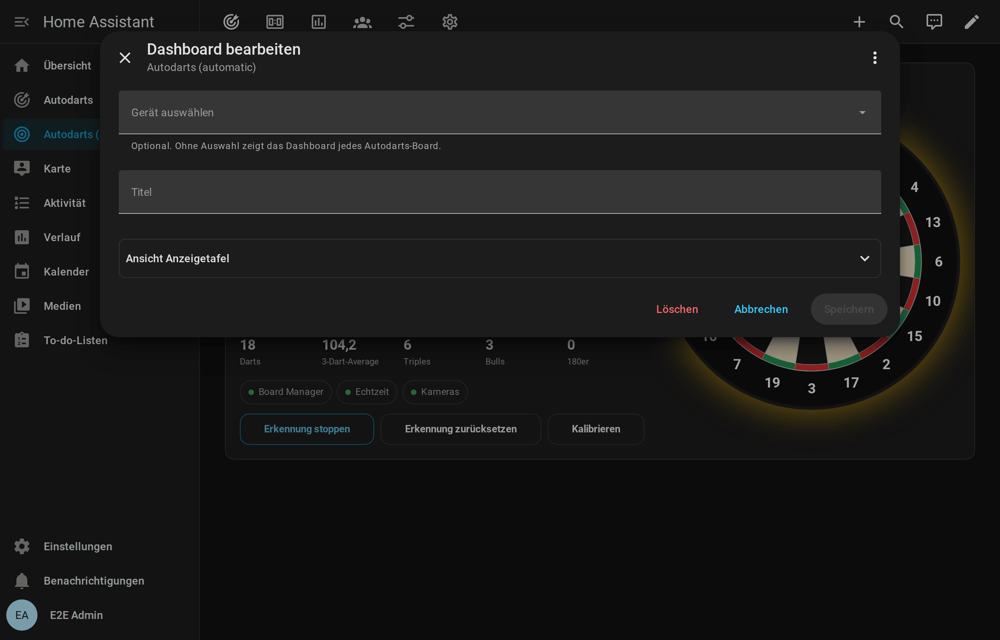

# Dashboard-Karten

[← Dokumentation](README.de.md) · [English](cards.md)

Die Integration bringt sieben Karten mit. Home Assistant lädt sie automatisch; eine Dashboard-Ressource oder ein eigener HACS-Download ist nicht nötig. Jede Karte:

- hat einen visuellen Editor und folgt deinem Design (hell oder dunkel) und deiner [Sprache](README.de.md#sprachen) (Deutsch, Englisch, Niederländisch, Französisch oder Spanisch);
- passt sich ihrer Breite an, vom Handy bis zum Wandtablet;
- findet dein Board selbst. Bei mehreren Boards wählst du eines im Editor aus.

Zum Hinzufügen bearbeitest du ein Dashboard, wählst **Karte hinzufügen** und suchst nach **Autodarts**. Die Kartenauswahl nennt die Karten in deiner Sprache und verlinkt jede auf ihren Abschnitt unten.

**Auf dieser Seite:** [Live-Karte](#live-karte) · [Trainingskarte](#trainingskarte) · [Board-Status](#board-status) · [Anzeigetafel](#anzeigetafel) · [Doubles-Karte](#doubles-karte) · [Spielerkarte](#spielerkarte) · [Bestenliste](#bestenliste) · [Automatisches Dashboard](#automatisches-dashboard) · [Karteneditor](#karteneditor) · [Barrierefreiheit](#barrierefreiheit) · [Tipps](#tipps)

Die Anleitungen zeigen die Karten im Einsatz: [Spiele und Regeln](games.de.md), [Anzeigetafel am Board](scoreboard.de.md) und [Statistik und Spieler](statistics.de.md).

## Live-Karte

`custom:autodarts-card` zeigt die aktuelle Aufnahme Dart für Dart auf einer Scheibe mit der Geometrie des Autodarts Board Managers.

<picture>
  <source media="(prefers-color-scheme: light)" srcset="images/de/card-light.png">
  
</picture>

- **Aufnahme:** Punkte, die drei Dart-Felder und der Fortschritt. Der jüngste Dart ist hervorgehoben. Ein Dart mit einem Stift oben rechts wird mit einem Tipp korrigiert: Das [Tastenfeld der Anzeigetafel](#darts-korrigieren-und-eingeben) öffnet sich unter den Dart-Feldern, mit seinen Tasten, seiner Scheibe, der Lupe und dem Zoom. Die Darts des Bots und Darts, die ältere Integrationen ohne ihre Nummer melden, haben keinen Stift.
- **Vorige Aufnahmen:** die Punkte deiner letzten fünf Aufnahmen, eingefärbt wie im Diagramm der Trainingskarte. Mit dem Mauszeiger siehst du die Darts.
- **Übungsspiel:** Läuft ein [Übungsspiel](games.de.md), stehen Restpunkte, Checkout-Weg und Überwerfen über den Dart-Feldern, und die Scheibe umrandet das nächste Zielfeld. Wo kein Checkout möglich ist, tritt der [Stellwurf](entities.de.md#stellwürfe) an seine Stelle, etwa *T20 T20 S17 Rest 32*, und die Scheibe umrandet seinen ersten Dart; „Kein Checkout möglich“ erscheint nur, wenn es keinen Stellwurf gibt, bei einem Rest, der sich in einer Aufnahme beenden ließe: bis 170 mit Double-Out, bis 180 ohne. Der [Bot](entities.de.md#bot) steht als *Bot* in der Liste. Im Match listet der Bereich alle Spieler mit Restpunkten, Legs, Sätzen und Average und hebt den Spieler am Board hervor; eigene [Startpunkte](games.de.md#startpunkte-handicap) stehen neben den Namen, und ein Team-Match listet die beiden Teams. Ein gewonnenes Match zeigt sein Ergebnis in großer Schrift, etwa 2 : 1, und statt der Liste die [Match-Zusammenfassung](#match-zusammenfassung). Bei den [Partyspielen](games.de.md#partyspiele) zeigt der Bereich Runde oder Loch, Ziel und die Punkte aller Spieler, bei Killer ihre Zahl und Leben und wer raus ist. Das Bull bei Around the Clock und Halve-It, bei dem auch das äußere Bull zählt, heißt *Bull (25/50)*, und beide Bull-Felder sind umrandet. Beim Ausbullen listet er Feld und Abstand jedes Darts und wer führt, und er sagt, wenn ein Gleichstand neu wirft. Bei den [Cricket-Spielen](games.de.md#cricket-spiele) zeigt eine Kreidetafel die Marks aller Spieler oder Teams auf den Zahlen des Spiels, die Punkte und die Marks pro Runde, blendet Zahlen ab, die alle geschlossen haben, und umrandet die nächste offene Zahl auf der Scheibe. Screenreader lesen die Marks als Wörter vor. In einem [Trainingsspiel](games.de.md#trainingsspiele) zeigt der Bereich Ziel, Fortschritt, Darts und Trefferquote (Bob's 27: Punkte und Runde; Checkout-Training und 121-Checkout: Weg, oder wo die übrigen Darts den Rest nicht beenden können, der [Stellwurf](entities.de.md#stellwürfe) mit dem Rest, den er lässt, und Checkout-Quote; Catch 40, JDC Challenge und Singles-Training: Runde oder Teil und Punkte), und die Scheibe umrandet die Felder des Ziels. Live-Karte und [Anzeigetafel](#anzeigetafel) zeigen ein Spiel auf dieselbe Weise an und sagen daher immer dasselbe.
- **Scheibe:**
  - Getroffene Felder blinken in der Hervorhebungsfarbe.
  - Nummerierte Markierungen zeigen, wo jeder Dart steckt.
  - Die Scheibe leuchtet in der Statusfarbe deines Designs: grün (Erfolg) für bereit, bernsteinfarben bei der Entnahme, orange (Warnung) bei gestoppter Erkennung, lila bei der Kalibrierung, rot (Fehler) bei einer Störung oder ohne Verbindung.
- **Trainingsstatistik:** Darts, 3-Dart-Average, Triple, Bulls und 180er der Session.
- **Verbindungen:** Board Manager, Echtzeit und Kameras; ein Tipp öffnet die Details.
- **Steuerung:** Erkennung starten oder stoppen, zurücksetzen und kalibrieren. Zurücksetzen und Kalibrieren brauchen einen zweiten Tipp zur Bestätigung. Boards ohne Erkennungsschalter bekommen die Start- oder Stopp-Taste, die zum Board-Status passt.

Die Scheibe zeigt die Aufnahme; ein Tipp darauf bewirkt nichts. Zahlen, Daten und Uhrzeiten folgen deinen [Profileinstellungen](https://www.home-assistant.io/docs/configuration/user-configuration/): Zahlenformat, 12- oder 24-Stunden-Uhr und die Zeitzone des Servers oder des Browsers.






Auf dem Handy stapelt die Live-Karte Aufnahme, Scheibe, Statistik und Steuerung:




### Optionen

| Option | Werte | Standard | Beschreibung |
| --- | --- | --- | --- |
| `device_id` | Gerät | erstes Board | Das angezeigte Board |
| `title` | Text | Board-Name | Kartentitel |
| `layout` | `auto`, `horizontal`, `vertical`, `board` | `auto` | Scheibe rechts, Scheibe unten oder nur die Scheibe. `auto` wechselt bei schmalen Karten auf unten |
| `board_style` | `classic`, `autodarts` | `classic` | Klassische Scheibe mit Drähten oder der flache Autodarts-Stil |
| `highlight` | `visit`, `last`, `none` | `visit` | Alle Darts der Aufnahme, nur den letzten oder keinen hervorheben |
| `blink` | Wahrheitswert | `true` | Getroffene Felder blinken |
| `show_markers` | Wahrheitswert | `true` | Dart-Positionen anzeigen |
| `show_numbers` | Wahrheitswert | `true` | Zahlen um die Scheibe anzeigen |
| `show_stats` | Wahrheitswert | `true` | Trainingsstatistik anzeigen |
| `show_recent` | Wahrheitswert | `true` | Vorige Aufnahmen anzeigen |
| `show_practice` | Wahrheitswert | `true` | Übungsspiel und nächstes Zielfeld anzeigen |
| `show_summary` | Wahrheitswert | `true` | Die [Match-Zusammenfassung](#match-zusammenfassung) anzeigen, wenn ein X01- oder Cricket-Match endet |
| `summary_seconds` | 0–600 | `0` | Wie lange die Zusammenfassung bleibt, in Sekunden; `0` zeigt sie bis zum nächsten Spiel |
| `corrections` | Wahrheitswert | `true` | Einen Dart der Aufnahme mit einem Tipp darauf korrigieren |
| `show_connection` | Wahrheitswert | `true` | Verbindungen anzeigen |
| `show_controls` | Wahrheitswert | `true` | Steuerung anzeigen |
| `accent_color` | [Farbe](#farben) | Primärfarbe des Designs | Beschriftungen und Haupttaste |
| `highlight_color` | [Farbe](#farben) | `#ffd60a` (Gold) | Getroffene Felder und jüngster Dart |

<table>
  <tr>
    <td></td>
    <td></td>
  </tr>
  <tr>
    <td align="center"><code>layout: vertical</code>, <code>board_style: autodarts</code></td>
    <td align="center"><code>layout: board</code></td>
  </tr>
</table>

```yaml
type: custom:autodarts-card
layout: vertical
board_style: autodarts
highlight: last
highlight_color: "#00e5ff"
```

## Trainingskarte

`custom:autodarts-training-card` macht aus der lokalen [Trainingssession](entities.de.md#trainingssession) ein Dashboard, das du nach jedem Training ansehen willst.

<picture>
  <source media="(prefers-color-scheme: light)" srcset="images/de/training-card-light.png">
  
</picture>

- **3-Dart-Average**, Anzahl der Darts und Aufnahmen und der Beginn der Session.
- **Serie und Tagesziel:** die [Trainingsserie](entities.de.md#bestleistungen-serie-und-tagesziel) in Tagen und die Darts von heute mit einem Balken zum Tagesziel, der grün wird, sobald du es erreichst.
- **Trefferbild:**
  - Jedes Feld ist nach Trefferhäufigkeit eingefärbt, von blau (selten) bis rot (am häufigsten).
  - Mit dem Mauszeiger oder einem Tipp auf ein Feld siehst du Anzahl und Anteil. Screenreader bekommen die Anzahlen aller getroffenen Felder als Liste, das häufigste zuerst.
  - Im Modus `numbers` werden Single, Double und Triple jeder Zahl zusammengefasst.
  - Im Modus `positions` zeigt es, wo die Darts gelandet sind, aus den Positionen, die das Board meldet: eine geglättete Dichte von Blau (wenige Darts) bis Rot (viele), dazu die neuesten 300 Darts als Punkte. Bei der Session erscheinen die Darts der aktuellen Aufnahme sofort als blaue Pins und gehen beim Ziehen in die gespeicherten Darts über. Unter der Scheibe steht die [Streuung](how-it-works.de.md#streuung) auf bis zu drei Zielfeldern, etwa *T20: Streuung 38 mm · 80 % innerhalb 61 mm · 6 mm links der Mitte*, mit *4 mm enger*, wenn die neueren Darts enger liegen.
  - Die Umschalter über der Scheibe wählen den Modus und wessen Darts es zeigt: die der Session oder die eines benannten Spielers mit allen seinen Treffern und den Positionen seiner letzten 1000 Darts. Die häufigsten Felder folgen der Wahl. [Wie Positionen gespeichert werden](how-it-works.de.md#dart-positionen).
- **Statistik:** höchste Aufnahme, 100+, 140+ und 180er, Triple-Quote, Doubles, Bulls und Fehlwürfe. 180er leuchten golden. Die Zahlen für 100+, 140+ und 180er wachsen, wenn du die Darts ziehst und die Aufnahme damit abgeschlossen ist. *Details ›* unter den Kacheln öffnet die Details der Darts der Session. Screenreader lesen jede Kachel vor.
- **Häufigste Felder:** die fünf meistgetroffenen Felder mit Anzahl und Anteil: an den Darts der Session oder an den Treffern, die das Profil eines Spielers gezählt hat.
- **Bestleistungen:** jede [Bestleistung](entities.de.md#bestleistungen-serie-und-tagesziel), die einen Wert hat: höchste Aufnahme und höchster Checkout, die wenigsten Darts je Startwert, die beste MPR eines Cricket-Legs, der beste Session-Average, Around the Clock, das Doppeltraining, Bob's 27, der 121-Checkout, Catch 40, die JDC Challenge, das Singles-Training und die längste Trainingsserie. Der Abschnitt erscheint mit der ersten Bestleistung.
- **Letzte Aufnahmen:** ein Balkendiagramm deiner letzten Aufnahmen mit dem Average der Session als gestrichelter Linie.
  - Farben: grau unter 60, Akzentfarbe ab 60, grün ab 100, orange ab 140 und gold für 180.
  - Die Aufnahmen kommen aus dem Recorder und bleiben daher auch nach dem Neuladen der Seite erhalten, und jede Aufnahme erscheint, auch wenn im selben Moment der nächste Spieler an der Reihe ist wie im Übungsspiel.
  - Eine [zurückgenommene Aufnahme](entities.de.md#aufnahme-zurücknehmen-autodartsundo_visit) verschwindet aus dem Diagramm; korrigiert kommt sie als neue Aufnahme zurück. Die Aufnahmen des Bots fehlen, denn sie zählen für niemanden.
- **Vergangene Sessions:** Ende, Dauer, Darts, 3-Dart-Average und höchste Aufnahme deiner letzten fünf beendeten Sessions.
- **Session-Steuerung:**
  - *Session starten* und *Session beenden* schalten die [Trainingssession](entities.de.md#trainingssession) ein und aus. Das Beenden braucht einen zweiten Tipp zur Bestätigung.
  - *Neue Session* beendet die laufende Session und startet die nächste, ebenfalls nach einem zweiten Tipp.
  - Die Zeile neben den Tasten zeigt, ob eine Session läuft oder wann die letzte endete.

### Optionen

| Option | Werte | Standard | Beschreibung |
| --- | --- | --- | --- |
| `device_id` | Gerät | erstes Board | Das angezeigte Board |
| `title` | Text | *Training · Board-Name* | Kartentitel |
| `mode` | `beds`, `numbers`, `positions` | `beds` | Trefferbild pro Feld, pro Zahl oder der Dart-Positionen |
| `player` | Text | die Session | Ein Spielername: Das Trefferbild beginnt mit den Darts dieses Spielers. Der Editor listet die benannten Spieler und nimmt auch jeden anderen Namen |
| `board_style` | `muted`, `classic`, `autodarts` | `muted` | Die dezente Scheibe lässt das Trefferbild hervortreten |
| `history_size` | 5–60 | `20` | Aufnahmen im Diagramm; Zahlen stehen bis 30 Aufnahmen darüber |
| `show_heatmap` | Wahrheitswert | `true` | Trefferbild anzeigen |
| `show_heatmap_controls` | Wahrheitswert | `true` | Die Umschalter für den Modus und wessen Darts das Trefferbild zeigt anzeigen |
| `show_stats` | Wahrheitswert | `true` | Statistik anzeigen |
| `show_bests` | Wahrheitswert | `true` | Bestleistungen anzeigen |
| `show_top` | Wahrheitswert | `true` | Häufigste Felder anzeigen |
| `show_history` | Wahrheitswert | `true` | Letzte Aufnahmen anzeigen |
| `show_sessions` | Wahrheitswert | `true` | Vergangene Sessions anzeigen |
| `show_reset` | Wahrheitswert | `true` | Session-Steuerung anzeigen |
| `accent_color` | [Farbe](#farben) | Primärfarbe des Designs | Beschriftungen und Aufnahmen ab 60 |

```yaml
type: custom:autodarts-training-card
mode: numbers
history_size: 40
show_reset: false
```



<table>
  <tr>
    <td></td>
    <td></td>
  </tr>
  <tr>
    <td align="center"><code>mode: positions</code>, <code>player: Alex</code></td>
    <td align="center">Die Umschalter über der Scheibe</td>
  </tr>
</table>

## Board-Status

`custom:autodarts-status-card` zeigt den Zustand des Boards und bündelt die Wartung an einem Ort.

<picture>
  <source media="(prefers-color-scheme: light)" srcset="images/de/status-card-light.png">
  
</picture>

- **Erkennung:** ein Schalter mit dem aktuellen Status, eingefärbt in der Statusfarbe. Boards ohne Erkennungsschalter starten und stoppen die Erkennung mit ihren Tasten; der Schalter folgt dann dem Board-Status.
- **Board Manager:** die installierte Version. Mit Board Manager 2 zeigt ein Hinweis ein verfügbares Update an, *Update auf 2.0.2 ›*; ein Tipp darauf öffnet die Details.
- **Verbindungen:** Board Manager, Echtzeit und die Cloud-Verbindung des Boards.
- **Board-PC** (Board Manager 2): CPU- und Speicherlast, die Erkennungsbildrate und der Anteil der Darts, die das Board korrigiert hat, jeweils wenn du den Sensor aktiviert hast. Ein Wert mit Pfeil öffnet seinen Verlauf, ebenso die Systemzeile. Ohne Werte bleibt die Kachel verborgen.
- **Kameras:** eine Kachel pro Kamera mit Status, Bildrate (wenn der Bildraten-Sensor aktiv ist) und eigener Kalibrierung. Ihr Name mit Pfeil öffnet die Kamera. Eine gestörte Kamera wird rot. Der Tastaturfokus bleibt auf der Kalibrieren-Taste, während sie um Bestätigung bittet.
- **Wartung:** Alle kalibrieren, Erkennung zurücksetzen und Board Manager neu starten, jeweils mit zweitem Tipp zur Bestätigung.

### Optionen

| Option | Werte | Standard | Beschreibung |
| --- | --- | --- | --- |
| `device_id` | Gerät | erstes Board | Das angezeigte Board |
| `title` | Text | Board-Name | Kartentitel |
| `show_connection` | Wahrheitswert | `true` | Verbindungen anzeigen |
| `show_system` | Wahrheitswert | `true` | Board-PC anzeigen |
| `show_cameras` | Wahrheitswert | `true` | Kameras anzeigen |
| `show_controls` | Wahrheitswert | `true` | Wartungstasten anzeigen |
| `accent_color` | [Farbe](#farben) | Primärfarbe des Designs | Beschriftungen und Erkennungsschalter |

```yaml
type: custom:autodarts-status-card
show_system: false
```

## Anzeigetafel

`custom:autodarts-scoreboard-card` ist für ein Tablet oder einen Fernseher neben dem Board gemacht: groß genug, um sie vom Abwurf aus zu lesen, und sie zeigt immer, was gerade gespielt wird.


- **X01:** eine Kachel pro Spieler mit Restpunkten, Legs, Sätzen und Average. Der Spieler am Board ist hervorgehoben und bekommt den Checkout-Weg, das Überwerfen oder das Game shot; wo kein Checkout möglich ist, den [Stellwurf](entities.de.md#stellwürfe) mit dem Rest, den er stellt, etwa *T20 T20 S17 Rest 32*. Spieler mit eigenen [Startpunkten](entities.de.md#teams-und-startpunkte) zeigen sie neben dem Namen, der [Bot](entities.de.md#bot) seine Stärke.
- **Teams:** im Team-Match zwei Team-Kacheln wie *Alex & Kim* gegen *Sam & Lea*, mit dem gemeinsamen Rest, dem Average jedes Partners und dem Partner am Board in Fettschrift. Das Banner nennt das Siegerteam.
- **Cricket:** eine große Kreidetafel mit den Marks aller Spieler, den Punkten und den Marks pro Runde; die nächste offene Zahl steht in der Ecke oben links, über den Zahlen. Tactics füllt sie von 20 bis 10 in kleinerer Schrift, Wild Mouse ergänzt Zeilen für Doubles, Triples und 3 in a Bed, Cut-Throat Cricket erinnert daran, dass die wenigsten Punkte gewinnen, und ein Team-Match hat eine Spalte pro Team.
- **Partyspiele:** Runde und Ziel, die Punkte aller Spieler oder bei Killer ihre Zahl und Leben als rote Herzen. Golf und Baseball ergänzen eine Scorekarte aller Löcher oder Innings mit der Summe; nach einem Gleichstand erscheinen die Zusatzrunden als Stechen, und wer nicht mehr dabei ist, wird abgeblendet.
- **Ausbullen:** das Feld jedes Darts und sein Abstand zur Mitte, wenn das Board ihn gemessen hat. Sobald zwei Darts stecken, ist der führende markiert. Ein Gleichstand zeigt das Banner *Gleichstand – noch einmal werfen*.
- **Trainingsspiele:** das Ziel in großer Schrift mit Fortschritt, Darts und Trefferquote (Bob's 27: Punkte und Runde; Checkout-Training und 121-Checkout: Rest, Weg, oder wo die übrigen Darts ihn nicht beenden können, der Stellwurf mit dem Rest, den er lässt, Checkout-Quote und das beste erreichte Ziel; Catch 40: Rest, Aufnahme und Punkte; JDC Challenge: Teil und Punkte; Singles-Training: Runde und Punkte).
- **Zwischen den Spielen:** der Titel (der Board-Name, wenn du keinen `title` setzt) und die Punkte der aktuellen Aufnahme zusammen mit Darts, 3-Dart-Average, höchster Aufnahme und 180ern der Trainingssession, der Trainingsserie und den Darts von heute zum Tagesziel.
- **Sieger:** Ein Banner nennt den Matchgewinner mit dem Ergebnis, etwa *Alex gewinnt das Match 3 : 2!*, bis zum nächsten Dart. Das Ergebnis zählt Legs, in einem Match mit Sätzen die Sätze; ein Match über ein Leg hat keins.
- **Match-Zusammenfassung:** Endet ein X01- oder Cricket-Match, tritt die [Match-Zusammenfassung](#match-zusammenfassung) an die Stelle der Spieler.
- **Turniere:** die Runde des Matches und zwischen den Matches Tabelle oder Turnierbaum; siehe [Turniere](#turniere).
- **Bilder:** Spieler, die [mit einer Person verknüpft](entities.de.md#spieler-mit-einer-person-verknüpfen-autodartslink_player) sind, zeigen das Bild der Person neben ihrem Namen.
- **Aufnahme:** Unten stehen die drei Darts der aktuellen Aufnahme und daneben ihre Punkte. Solange das Board leer ist, und zwischen den Spielen, wo die große Zahl die Aufnahme ist, zeigt diese Kachel stattdessen die letzte Aufnahme, die ein Tipp zurücknimmt. Ein Tipp auf einen Dart korrigiert ihn; siehe [Darts korrigieren und eingeben](#darts-korrigieren-und-eingeben). Während eines Spiels ändert nichts auf der Karte seine Höhe: Die Zeilen für Weg, Hinweis und Details behalten ihren Platz auch leer, und eine schmale Kachel hält von Anfang an zwei Zeilen für einen langen Weg frei.
- **Caller:** Mit `caller: true` sagt der Bildschirm am Board das Spiel selbst an, in der Sprache von Home Assistant: Deutsch, Englisch, Niederländisch, Französisch oder Spanisch (andere Sprachen hören Englisch). Er sagt nur an, was zählt:
  - X01: die Punkte, die eine Aufnahme gebracht hat, „Überworfen“ nach dem Überwerfen, „Keine Punkte“ für eine Aufnahme vor dem öffnenden Double, „du brauchst 81“, sobald sich der Rest beenden lässt (bis 170 mit Double-Out, 180 ohne), „stell dir die 32“, wenn nur ein [Stellwurf](entities.de.md#stellwürfe) möglich ist, das Game shot von Leg und Match und eine Fanfare bei einer 180, die gezählt hat. Der Bot heißt *Bot*.
  - Cricket-Spiele: die Marks einer Aufnahme, etwa „5 Marks“. Shanghai und Halve-It: die Punkte auf dem Ziel; Count-Up: die Punkte der Aufnahme; Baseball: die Runs, etwa „3 Runs“. Killer, Golf, wo der letzte Dart zählt, und die Trainingsspiele bekommen keine Punkteansagen.
  - Checkout-Training, 121-Checkout und Catch 40: was der nächste Versuch oder die nächste Aufnahme braucht, etwa „Du brauchst 121“.
  - Darts nach dem Überwerfen oder dem Game shot werden nicht angesagt.

  Er nutzt die Sprachausgabe des Browsers, in Home Assistant muss nichts eingerichtet werden. Browser spielen Ton erst nach einem Tippen: Tippe einmal auf *Caller* auf der Anzeigetafel, um ihn einzuschalten, und noch einmal zum Stummschalten. Die Taste behält ihren Namen; ihr gedrückter Zustand und das Lautsprechersymbol zeigen, ob der Caller an ist.


Das [automatische Dashboard](#automatisches-dashboard) hat eine Ansicht *Anzeigetafel*, die die Karte über den ganzen Bildschirm zeigt. Mit `full_height` ist die Anzeigetafel genau einen Bildschirm hoch: Zahlen und Tabellen wachsen und schrumpfen mit dem Platz, den Banner, Aufnahme und Tastenfeld lassen, sodass nichts gescrollt werden muss, vom 800 × 480-Display bis zum Fernseher. Ein Tablet im Hochformat zeigt zwei Spieler übereinander, drei oder vier zu zweit nebeneinander. Auf dem Handy lässt die bildschirmfüllende Anzeigetafel Platz für die Adresszeile des Browsers. Die Anleitung [Anzeigetafel am Board](scoreboard.de.md) zeigt Schritt für Schritt, wie du ein Tablet oder einen Fernseher, den Caller und den Ruhemodus einrichtest.

### Spielauswahl

Wähle das nächste Spiel direkt am Board, ohne Handy: Tippe zwischen den Spielen auf **Neues Spiel** unter den Punkten, während eines Spiels oben rechts. Einige Sekunden nach dem Ende eines Matches oder Trainingsspiels, oder nach seiner [Match-Zusammenfassung](#match-zusammenfassung), öffnet sich die Auswahl auch von selbst, mit der letzten Wahl für eine Revanche; wirft stattdessen jemand einen Dart, schließt sie sich wieder.


- **Spiel:** jedes Spiel von *Übungsspiel*, gruppiert in X01, Cricket, Partyspiele und Trainingsspiele. `lobby_games` schränkt die Auswahl ein.
- **Spieler:** bis zu vier, in Wurfreihenfolge. Tippe auf einen Namen, um den Spieler hinzuzufügen, auf ▲ und ▼, um ihn zu verschieben, und auf ✕, um ihn zu entfernen. Die Namen kommen aus den Spielerprofilen und den Namensfeldern der Spieler; Spieler, die [mit einer Person verknüpft](entities.de.md#spieler-mit-einer-person-verknüpfen-autodartslink_player) sind, die zu Hause ist, stehen vorn, mit ihrem Bild und ⌂. Tippe einen neuen Namen ein oder füge einen Gast ohne Namen hinzu. Ist niemand gewählt, wirft ein Spieler ohne Namen. Bei X01 und den Cricket-Spielen setzt *+ Bot* den [Bot](entities.de.md#bot) nach den Spielern dazu, mit Stärke 60; − und + ändern seine Stärke in Zehnerschritten von 20 bis 120, und ✕ schickt ihn nach Hause. Mit dem Bot spielen bis zu drei Spieler. Killer braucht zwei Spieler; Trainingsspiele nehmen nur den ersten Spieler. Bei X01 stellen − und + neben einem Spieler eigene [Startpunkte](games.de.md#startpunkte-handicap) in Schritten von 100 ein, von 101 bis 1001.
- **Format:** Legs pro Satz und Sätze zum Sieg, für ein Match mehrerer Spieler.
- **Optionen:** Double-Out und Double-In bei X01 und das Ausbullen für ein Match, mit Ausbullen nach Abstand, wo das Board es anbietet. Mit vier Spielern bei X01 oder einem Cricket-Spiel spielt *Teams* Spieler 1 und 3 gegen 2 und 4.
- **Start:** startet das Spiel mit [`autodarts.start_game`](entities.de.md#übungsspiel-starten-autodartsstart_game), und die Anzeigetafel zeigt es sofort. Ist die Erkennung gestoppt, schaltet der Start sie ein, denn ohne sie zählt kein Dart; die Auswahl sagt es vorher über der Taste. Die Starttaste bleibt am unteren Bildschirmrand, während die Seite scrollt. Während eines Spiels beendet *Spiel beenden* es nach einem zweiten Tippen.

In der Vorschau des Karteneditors öffnet sich die Auswahl nie.




### Darts korrigieren und eingeben

Die Darts der Aufnahme unten sind Tasten, solange `corrections` an ist, und das ist es standardmäßig.


- **Dart korrigieren:** Tippe auf einen Dart, den das Board falsch erkannt hat. Ein Tastenfeld öffnet sich mit S, D und T, den Zahlen 1 bis 20, 25, Bull und Fehlwurf; S, D oder T steht auf dem Feld des Darts. Tippe den Multiplikator und dann die Zahl, oder 25, Bull oder Fehlwurf, und [`autodarts.correct_dart`](entities.de.md#dart-korrigieren-autodartscorrect_dart) legt den Dart dorthin. Restpunkte und Aufnahme folgen sofort. Ein zweiter Tipp auf den Dart oder *Abbrechen* schließt das Tastenfeld. Die Darts des Bots lassen sich nicht korrigieren.
- **Wo der Dart steckt:** *Tasten | Scheibe* oben im Tastenfeld wechselt von den Tasten zur Scheibe. Tippe die Stelle an, an der der Dart steckt: Das Feld ergibt sich daraus, und der Dart wird dort in den [Dart-Positionen](how-it-works.de.md#dart-positionen) gespeichert. Der gestrichelte Ring zeigt, wo das Board den Dart gesehen hat. Ein mit den Tasten korrigierter Dart hat keine Position, weil das Board auch die Stelle falsch gesehen hat. Die Scheibe bleibt die Ansicht des Tastenfelds, bis du *Tasten* wählst, und das Tastenfeld für die Eingabe nutzt sie auch.

  

- **Kleine Bildschirme:** Auf einer Karte schmaler als 600 Pixel oder einem Bildschirm niedriger als das, etwa auf dem Handy hochkant oder quer, öffnet sich die Scheibe einer Korrektur zweieinhalbfach vergrößert um die Stelle, an der das Board den Dart gesehen hat; ein Dart ohne Position und das Tastenfeld öffnen die ganze Scheibe. Eine runde Lupen-Taste wechselt auf jedem Bildschirm zwischen beidem, auf dem Handy aus der Ecke der Scheibe wie bei einer Karte: Mit ihrem Plus vergrößert sie um den Dart, der korrigiert wird, sonst um den letzten Dart mit Position, mit ihrem Minus zeigt sie die ganze Scheibe. Ein Finger auf der Scheibe zeigt eine Lupe über ihm, nahe dem oberen Rand neben ihm, mit der Stelle unter dem Finger vergrößert und einem Kreuz darauf; der Dart landet dort, wo der Finger loslässt. Zwei Finger zoomen bis zum Fünffachen und verschieben die Scheibe, ohne einen Dart zu setzen. Lupe und Finger funktionieren auf jedem Touchscreen, auch einem großen Monitor; eine Maus klickt wie bisher.

  

- **Tastenfeld:** Mit `keypad: true` erscheint ein Tastenfeld, solange *Übungsspiel manuelle Eingabe* an ist, für Darts, die das Board übersehen hat, oder einen Spieler ohne Kameras: Jeder Tipp auf ein Feld gibt mit [`autodarts.throw_dart`](entities.de.md#dart-eingeben-autodartsthrow_dart) einen Dart ein, und der nächste Dart beginnt wieder bei S. *Nächster Spieler* beendet die Aufnahme ohne Entnahme, und *Letzte Aufnahme zurück* nimmt die letzte Aufnahme zurück, um sie zu korrigieren; beides braucht einen zweiten Tipp. Solange der Bot am Board ist, wartet das Tastenfeld.
- **Zurücknehmen:** Ohne Tastenfeld zeigt die Kachel *Zuletzt* neben den Darts die letzte Aufnahme mit einem gebogenen Pfeil, solange [`autodarts.undo_visit`](entities.de.md#aufnahme-zurücknehmen-autodartsundo_visit) sie zurücknehmen kann, für eine falsche Erkennung, die erst nach dem Ziehen der Darts auffällt. Ein Tipp färbt sie rot und fragt *Zurück?*, ein zweiter Tipp nimmt die Aufnahme zurück; sie kommt zurück, um ihre Darts zu korrigieren, und *Nächster Spieler* des Tastenfelds oder [`autodarts.next_player`](entities.de.md#weitergeben-autodartsnext_player) beendet sie wieder.
- **Markierungen:** Ein Dart, den ein Tipp korrigiert, hat einen Rahmen und einen Stift oben rechts; ein von Hand eingegebener oder korrigierter einen gestrichelten Rahmen, und die Darts des Bots sind in der Akzentfarbe getönt.

Auf einer bildschirmfüllenden Anzeigetafel im Querformat stehen Tastenfeld und Korrektur neben den Punkten, sodass Spieler, Aufnahme und Tastenfeld zusammen auf den Bildschirm passen. Tastenfeld und Korrektur machen Platz für die Spielauswahl, den Ruhemodus, die Match-Zusammenfassung und die Tabelle eines Turniers und reagieren in der Vorschau des Karteneditors nie.


### Turniere

Während eines [Turniers](entities.de.md#turniere) folgt ihm die Anzeigetafel:

- **Während eines Matches:** Die Titelzeile nennt Runde und Match, etwa *Turnier · Halbfinale · Match 5 von 7*.
- **Zwischen den Matches:** Die [Zusammenfassung](#match-zusammenfassung) eines Matches bleibt für die *Turnier Dauer der Zusammenfassung* (8 Sekunden) stehen, dann erscheint während der *Turnierpause* die Tabelle (jeder gegen jeden) oder der Turnierbaum (K.-o.-System), mit dem nächsten Match, seiner Runde und einem Countdown bis zum Beginn. *Jetzt starten* startet es sofort. Während eines Turniers öffnet sich die Spielauswahl nicht von selbst.
- **Tabelle:** Platz, gespielte, gewonnene und verlorene Matches, gewonnene und verlorene Legs, die Leg-Differenz, der 3-Dart-Average (Cricket: MPR) und die Punkte. Die Spieler des nächsten Matches sind hervorgehoben, der Turniersieger bekommt 🏆.
- **Turnierbaum:** eine Spalte pro Runde, das Spiel um Platz 3 unter dem Finale; Freilose, offene Plätze und Ergebnisse; das nächste Match ist umrandet. Wer weiterkommt, gleitet in die nächste Runde; auf Geräten, die weniger Bewegung wünschen, füllen sich die Plätze ohne Bewegung.
- **Sieger:** Nach dem letzten Match nennt ein Banner den Turniersieger, und Tabelle oder Turnierbaum bleiben stehen, bis ein neues Match beginnt.
- **Caller:** Mit eingeschaltetem Caller und `call_results` sagt er jedes Match beim Start an, „Nächstes Match: Alex gegen Sam“, und den Sieger des Turniers.
- **Spielauswahl:** *Turnier* schaltet die Auswahl auf ein Turnier mit bis zu acht Spielern mit Namen um: X01, mit Startpunkten als Handicap, oder ein Cricket-Spiel, jeder gegen jeden oder K.-o.-System, Legs und Sätze, die Regeln, das Spiel um Platz 3 und eine zufällige Auslosung. *Turnier starten* startet es mit [`autodarts.start_tournament`](entities.de.md#turnier-starten-autodartsstart_tournament). Während eines Turniers beendet *Turnier beenden* es samt seinem Spiel nach einem zweiten Tippen. Ein neues Turnier, das während eines laufenden startet, beendet zuerst das laufende: Die Auswahl sagt es vorher, und der Start braucht einen zweiten Tipp.
- **Ruhemodus:** Die Seite `tournament` zeigt Tabelle oder Turnierbaum des laufenden oder gerade beendeten Turniers.


### Ruhemodus

Läuft kein Spiel oder ist ein Match oder Trainingsspiel entschieden, und wirft oder tippt niemand für `idle_after` Sekunden (3 Minuten), zeigt die Anzeigetafel diese Tafeln im Wechsel, jede für `idle_interval` Sekunden:

| Seite | Zeigt |
| --- | --- |
| `tournament` | Tabelle oder Turnierbaum des laufenden oder gerade beendeten Turniers |
| `leaderboard` | Die fünf besten Spieler nach 3-Dart-Average, dann nach gewonnenen Legs, mit ihren Bildern |
| `records` | Die Bestleistungen des Boards und die längste Trainingsserie |
| `today` | Die Darts von heute zum Tagesziel, 3-Dart-Average, höchste Aufnahme und 180er der Session sowie die Serie |
| `last_match` | Das letzte Match mehrerer Spieler: das Spiel, wann es endete, und die Legs, in einem Match mit Sätzen die Sätze, und den Average aller Spieler |
| `clock` | Uhrzeit und Datum |

Seiten ohne Inhalt werden übersprungen. Ein Dart, ein neues Spiel oder ein Tippen irgendwo beendet den Ruhemodus; eine Spielauswahl, die du selbst geöffnet hattest, kommt so zurück, wie du sie verlassen hast, mit dem gewählten Spiel und den Spielern. Der Bildschirm ändert sich nur, wenn die nächste Seite fällig ist oder die Minute der Uhr endet. Auf Geräten, die weniger Bewegung wünschen, wechseln die Seiten ohne Überblenden.


### Optionen

| Option | Werte | Standard | Beschreibung |
| --- | --- | --- | --- |
| `device_id` | Gerät | erstes Board | Das anzuzeigende Board |
| `title` | Text | Board-Name | Titel zwischen den Spielen; während eines Spiels nennt der Titel das Spiel |
| `full_height` | Wahrheitswert | `false` | Die Höhe des Bildschirms füllen, für eine Ansicht im Panel-Modus |
| `show_visit` | Wahrheitswert | `true` | Die Darts der aktuellen Aufnahme anzeigen |
| `show_status` | Wahrheitswert | `true` | Den Board-Status anzeigen |
| `caller` | Wahrheitswert | `false` | Den Caller einschalten: Der Bildschirm sagt Aufnahmen, den Rest eines Spielers, Überwerfen und Game shot an |
| `call_scores` | Wahrheitswert | `true` | Die Punkte jeder Aufnahme ansagen (Cricket: ihre Marks) |
| `call_checkouts` | Wahrheitswert | `true` | Ansagen, was der nächste Spieler braucht, wenn ein Checkout möglich ist |
| `call_results` | Wahrheitswert | `true` | Überwerfen und Game shot ansagen |
| `call_sounds` | Wahrheitswert | `true` | Eine Fanfare bei einer 180 spielen |
| `lobby` | Wahrheitswert | `true` | Die [Spielauswahl](#spielauswahl) anbieten |
| `lobby_games` | Liste von Spielen | jedes Spiel | Die Spiele, die die Spielauswahl anbietet, etwa `["501", cricket, killer]` |
| `idle` | Wahrheitswert | `true` | Den [Ruhemodus](#ruhemodus) einschalten |
| `idle_after` | Sekunden, 10–3600 | `180` | Zeit ohne Darts und Tippen, bis der Ruhemodus beginnt |
| `idle_interval` | Sekunden, 3–120 | `10` | Zeit, die jede Seite zu sehen ist |
| `idle_panels` | Liste von Seiten | jede Seite | Die Seiten des Ruhemodus in dieser Reihenfolge: `tournament`, `leaderboard`, `records`, `today`, `last_match`, `clock` |
| `show_summary` | Wahrheitswert | `true` | Die [Match-Zusammenfassung](#match-zusammenfassung) anzeigen, wenn ein X01- oder Cricket-Match endet |
| `summary_seconds` | 0–600 | `0` | Wie lange die Zusammenfassung bleibt, in Sekunden; `0` zeigt sie bis zum nächsten Spiel |
| `corrections` | Wahrheitswert | `true` | Ein Tipp auf einen Dart der Aufnahme [korrigiert ihn](#darts-korrigieren-und-eingeben); ein Tipp auf die letzte Aufnahme neben den Darts nimmt sie zurück, solange es geht |
| `keypad` | Wahrheitswert | `false` | Das [Tastenfeld](#darts-korrigieren-und-eingeben) für von Hand eingegebene Darts zeigen, solange *Übungsspiel manuelle Eingabe* an ist |
| `accent_color` | [Farbe](#farben) | Primärfarbe des Designs | Spieler am Board, Wege und Aufnahmepunkte |

Im Editor stehen die vier `call_…`-Optionen im eingeklappten Abschnitt *Caller-Optionen*; Spielauswahl, Ruhemodus sowie Darts korrigieren und eingeben haben eigene eingeklappte Abschnitte.

```yaml
type: custom:autodarts-scoreboard-card
full_height: true
caller: true
lobby_games: ["301", "501", cricket, killer]
idle_after: 300
idle_panels: [leaderboard, today, clock]
summary_seconds: 60
```

### Match-Zusammenfassung

Endet ein X01- oder Cricket-Match mehrerer Spieler, fassen Anzeigetafel und Live-Karte es zusammen: eine Spalte pro Spieler, die des Siegers hervorgehoben, mit dem Ergebnis in der ersten Zeile.


- **X01:** Legs (und Sätze), 3-Dart-Average, First-9-Average, Checkout-Quote mit den ausgecheckten Legs und den Darts aufs Double, höchster Checkout, 180er, Aufnahmen mit 140+ und 100+, bestes Leg in Darts, Darts aufs Double und alle Darts. Ohne Double-Out fehlen Checkout-Quote und Darts aufs Double.
- **Cricket:** Legs (und Sätze), Marks pro Runde, Marks, bestes Leg in Darts und alle Darts.
- **Wie lange:** bis zum ersten Dart des nächsten Spiels oder `summary_seconds` nachdem die Karte sie zuerst gezeigt hat. Danach sind Spieler und Ergebnis wieder zu sehen, und auf der Anzeigetafel öffnet sich einige Sekunden später die [Spielauswahl](#spielauswahl). Solange die Zusammenfassung zu sehen ist, öffnet sich die Spielauswahl nur durch Tippen, und der [Ruhemodus](#ruhemodus) kann nach seiner Wartezeit übernehmen. `show_summary: false` schaltet die Zusammenfassung ab. Zwischen den Matches eines [Turniers](#turniere) folgen nach der *Turnierzusammenfassung* Tabelle oder Turnierbaum.

Partyspiele behalten ihre Punkte auf dem Bildschirm. Die Zahlen stammen aus dem Attribut `summary` der [Übungsspiel-Restpunkte](entities.de.md#übungsspiel); [wie sie gezählt werden](how-it-works.de.md#match-zusammenfassung).

## Doubles-Karte

`custom:autodarts-doubles-card` zeigt die [Doppelanalyse](entities.de.md#doppelanalyse): jedes getroffene Double auf dem Doppelring der Scheibe, gefärbt nach seiner Quote von Rot (selten getroffen) bis Grün (etwa jeder zweite Dart), wo Darts darauf zielten, und sonst in der Akzentfarbe, je kräftiger, desto öfter getroffen. Die Liste darunter zeigt jedes Double, die beste Quote zuerst, mit den Treffern aller Darts, den Treffern und Darts beim Zielen darauf und der Quote. Das Lieblingsdouble ist ausgefüllt. Mit `player` zeigt sie die Doubles eines benannten Spielers statt die aller; ein Name ohne Profil bekommt den Hinweis, die Schreibweise zu prüfen.


### Optionen

| Option | Werte | Standard | Beschreibung |
| --- | --- | --- | --- |
| `device_id` | Gerät | erstes Board | Das anzuzeigende Board |
| `title` | Text | *Doubles* | Kartentitel |
| `player` | Text | alle | Ein Spielername, für die Doubles dieses Spielers. Der Editor listet die benannten Spieler und nimmt auch jeden anderen Namen |
| `accent_color` | [Farbe](#farben) | Primärfarbe des Designs | Beschriftungen |

## Spielerkarte

`custom:autodarts-players-card` zeigt die [Spielerprofile](entities.de.md#spielerprofile): eine Kachel pro benanntem Spieler mit gewonnenen Legs und Matches, 3-Dart-Average, First 9, Checkout-Quote, Marks pro Runde und der besten MPR eines Cricket-Legs, höchster Aufnahme und höchstem Checkout sowie den wenigsten Darts pro Startwert. Spieler, die [mit einer Person verknüpft](entities.de.md#spieler-mit-einer-person-verknüpfen-autodartslink_player) sind, zeigen das Bild der Person. Darunter die direkten Vergleiche mit Balken und die letzten Matches mit ihrem Ergebnis und dem Sieger in Fett: die Legs, die jeder Spieler gewonnen hat, in einem Match mit Sätzen die Sätze, etwa *Cricket · Sätze*. Auf Wunsch lädt eine Taste *Exportieren* alles als Datei herunter; nur Administratoren sehen sie, denn der Export ist eine Aktion für Administratoren.


- **Abzeichen:** die [Erfolge](entities.de.md#erfolge) jedes Spielers. Ein erreichtes Abzeichen zeigt seine Stufe in Bronze, Silber, Gold oder Platin, das nächste Ziel und wie weit der Spieler ist; ein noch nicht erreichtes ist ausgegraut, mit dem Fortschritt, wo er sich zählen lässt. Die Galerie eines Spielers zeigt die erreichten Abzeichen und die drei Ziele, die am nächsten sind; *Alle 18 Abzeichen ▾* öffnet den Rest, *Weniger anzeigen* schließt ihn wieder.
- **Trends:** für jeden Spieler, der in den gezeigten Wochen geübt hat, eine Kachel pro Kennzahl: 3-Dart-Average, First 9, Checkout-Quote, Doppelquote und Darts über die Wochen, eine Linie der Wochenwerte und ein Pfeil, der die neuere Hälfte der Wochen mit der älteren vergleicht (↗ besser, ↘ schlechter, → etwa gleich). Wochen ohne Training sind ein gestrichelter Abschnitt der Linie; fehlt eine Hälfte zum Vergleich, zeigt die Kachel keinen Pfeil.
- **Streuung:** wo die Darts jedes Spielers um die Felder landen, auf die er am häufigsten gezielt hat, in Millimetern, mit der Änderung der neueren Darts. [Wie die Streuung gemessen wird](how-it-works.de.md#streuung).


### Optionen

| Option | Werte | Standard | Beschreibung |
| --- | --- | --- | --- |
| `device_id` | Gerät | erstes Board | Das anzuzeigende Board |
| `title` | Text | *Spieler* | Kartentitel |
| `show_head_to_head` | Wahrheitswert | `true` | Direkte Vergleiche anzeigen |
| `show_matches` | Wahrheitswert | `true` | Letzte Matches anzeigen |
| `show_badges` | Wahrheitswert | `true` | Abzeichen anzeigen |
| `show_locked` | Wahrheitswert | `true` | Die nächsten Ziele und auf Wunsch alle noch nicht erreichten Abzeichen anzeigen; ohne sie fehlen Spieler ohne Abzeichen |
| `show_trends` | Wahrheitswert | `true` | Trends anzeigen |
| `trend_weeks` | 4–12 | `12` | Wochen in den Trends |
| `show_spread` | Wahrheitswert | `true` | Streuung anzeigen |
| `export` | Wahrheitswert | `false` | Eine Taste *Exportieren* anzeigen. Sie exportiert Sessions, Matches und Profile mit [`autodarts.export`](entities.de.md#trainingsdaten-exportieren-autodartsexport) nach `autodarts/exports` im Medienordner und lädt die Datei mit deiner Anmeldung über Home Assistant herunter. Exporte enthalten Spielernamen, deshalb dürfen nur Administratoren exportieren und herunterladen; für andere Benutzer, etwa den eines Wandtablets, schlägt der Export fehl. |
| `export_format` | `csv`, `json` | `csv` | Format des Exports; CSV kommt als ZIP-Datei mit je einer Tabelle |
| `accent_color` | [Farbe](#farben) | Primärfarbe des Designs | Beschriftungen, Balken, Fortschritt und Trendlinien |

## Bestenliste

`custom:autodarts-leaderboard-card` ordnet die Rekorde aller benannten Spieler. Der Führende jedes Rekords bekommt die Krone, die nächsten Plätze folgen.


| Rekord | Gesamt | Letzte 4 Wochen, diese Woche |
| --- | --- | --- |
| Bester Average | Der 3-Dart-Average des Spielers in X01 | Der Average der X01-Legs, die im Zeitraum endeten |
| Höchster Checkout | Der höchste Checkout mit Double-Out | Dasselbe im Zeitraum |
| Meiste 180er | X01-Aufnahmen mit 180 Punkten | Dasselbe im Zeitraum |
| Wenigste Darts, 501 | Die wenigsten Darts eines gewonnenen 501-Legs mit Double-Out | Dasselbe im Zeitraum |
| Beste Cricket-MPR | Die beste MPR eines gewonnenen Cricket-Legs | Dasselbe im Zeitraum |
| Längste Serie | Die längste Folge von Tagen mit Darts | – |
| Meiste Abzeichen | Freigeschaltete Stufen von Erfolgen | Im Zeitraum freigeschaltete Stufen |
| Meiste Darts | Geworfene Darts in Übungs- und Trainingsspielen | Dasselbe im Zeitraum |

Ein Zeitraum umfasst ganze Wochen ab Montag: *Diese Woche* die laufende Woche, *Letzte 4 Wochen* die laufende und die drei davor. Bei gleichen Werten teilen sich Spieler den Platz. Der Umschalter oben wechselt den Zeitraum, bis sich die Konfiguration der Karte ändert.

### Optionen

| Option | Werte | Standard | Beschreibung |
| --- | --- | --- | --- |
| `device_id` | Gerät | erstes Board | Das anzuzeigende Board |
| `title` | Text | *Bestenliste* | Kartentitel |
| `period` | `all`, `month`, `week` | `all` | Gesamt, die letzten vier Wochen oder diese Woche |
| `show_period` | Wahrheitswert | `true` | Den Umschalter des Zeitraums anzeigen |
| `limit` | 1–5 | `3` | Angezeigte Plätze je Rekord |
| `accent_color` | [Farbe](#farben) | Primärfarbe des Designs | Beschriftungen und der Umschalter des Zeitraums |

```yaml
type: custom:autodarts-leaderboard-card
period: month
limit: 5
```

## Automatisches Dashboard

Statt die Karten selbst anzuordnen, kann die Integration ein komplettes Dashboard erzeugen:

1. Öffne **Einstellungen → Dashboards → Dashboard hinzufügen**.
2. Wähle **Autodarts**.

Pro Board entstehen bis zu sechs Ansichten. Sie aktualisieren sich selbst, wenn du ein Board hinzufügst oder Entitäten aktivierst:

| Ansicht | Inhalt |
| --- | --- |
| **Live** | Die Live-Karte über die volle Breite, damit Board und Spiel auch auf dem Handy im Blick bleiben |
| **Anzeigetafel** | Die [Anzeigetafel](#anzeigetafel) über den ganzen Bildschirm, für ein Tablet oder einen Fernseher am Board |
| **Training** | Die Trainingskarte mit den Bestleistungen, die [Doubles-Karte](#doubles-karte), das Tagesziel mit den Darts von heute, die Serie und die letzte Bestleistung, Darts pro Tag der letzten 30 Tage (aus den Langzeitstatistiken, die Home Assistant stündlich berechnet), der 3-Dart-Average der letzten 7 Tage, Übungslegs pro Tag, First-9-Average, Checkout- und Doppelquote des Übungsspiels sowie die Trainingseinstellungen: Sessions automatisch starten und nach einer Pause beenden |
| **Spieler** | Die [Spielerkarte](#spielerkarte) und die [Bestenliste](#bestenliste), sobald der erste benannte Spieler ein Profil hat |
| **Spieleinstellungen** | Die Steuerung des Übungsspiels mit Teams und den Optionen für Golf und Count-Up, die Spielernamen, ihre Startpunkte und das [Turnier](entities.de.md#turniere) mit seinen Einstellungen und Tasten, für alles, was die Spielauswahl der Anzeigetafel nicht einstellt |
| **Board** | Der Board-Status, die Board-Einstellungen, das Board-Manager-Update und der Anteil der Darts, die das Board korrigiert hat |


Die Spieleinstellungen haben außerdem *Ausbullen nach Abstand* bei den Regeln des Übungsspiels und *Turnier Dauer der Zusammenfassung* bei den Turniereinstellungen. Die meisten Spiele brauchen nichts davon: Die [Spielauswahl](#spielauswahl) der Anzeigetafel stellt Spiel, Spieler und Regeln ein.

In YAML ist das ganze Dashboard eine Zeile; `device_id`, `title` und `scoreboard` sind optional. `scoreboard` setzt Optionen der Karte in der Ansicht *Anzeigetafel*: `caller`, `keypad`, `corrections`, `idle`, `lobby_games` und `idle_panels`, wie bei der [Anzeigetafel](#anzeigetafel) beschrieben. Was du weglässt, behält den Standard der Karte.

```yaml
strategy:
  type: custom:autodarts
  device_id: 0123456789abcdef   # nur dieses Board
  title: Darts
  scoreboard:
    caller: true
    keypad: true
    lobby_games: ["501", cricket, killer]
    idle_panels: [leaderboard, clock]
```

Um später Board, Titel oder die Optionen der Anzeigetafel zu wählen, öffnest du im Dashboard das Menü (⋮) → **Dashboard bearbeiten**. Home Assistant zeigt dann den eigenen Editor des Dashboards, die Optionen der Anzeigetafel im Abschnitt *Ansicht Anzeigetafel*:



Wird das gewählte Board aus Home Assistant entfernt, sagt das Dashboard das, statt leere Ansichten zu zeigen; wähle ein anderes Board oder leere die Auswahl, um jedes Board zu zeigen. Um die Ansichten selbst anzupassen, wählst du im Menü (⋮) dieses Editors **Kontrolle übernehmen**. Home Assistant macht aus den erzeugten Ansichten dann ein normales, frei bearbeitbares Dashboard; es bekommt die Ansichten späterer Versionen nicht mehr, also nutze lieber die Einstellungen des Dashboards, wo sie reichen.

## Karteneditor

Alle Optionen lassen sich im visuellen Editor einstellen. Er ist ein Formular von Home Assistant und sieht daher aus und funktioniert wie die Editoren der eingebauten Karten:

- Die Geräteauswahl bietet nur Autodarts-Boards an.
- Schalter zeigen ihren Standard, bis du sie änderst; Listen nennen ihren Standard unter dem Feld.
- Caller-Optionen, Spielauswahl, Ruhemodus sowie Darts korrigieren und eingeben der Anzeigetafel stehen in eingeklappten Abschnitten; die Doubles-Karte bietet die benannten Spieler an.
- Eine Option, die das Formular nicht darstellen kann, etwa ein vertipptes `layout`, schickt den Editor in die Code-Ansicht, mit einer Meldung, die sie nennt.


### Farben

`accent_color` und `highlight_color` nutzen die Farbauswahl von Home Assistant. Wähle eine Theme-Farbe wie *Primär*, *Akzent* oder *Rot*, die deinem Design folgt, oder tippe eine beliebige CSS-Farbe ein, zum Beispiel `#00e5ff`, `rgb(0 229 255)` oder `var(--accent-color)`. Eine Theme-Variable zählt nur ohne Ersatzwert, als `var(--name)`. Ein leeres Feld oder ein Wert, der keine Farbe ist, nutzt den Standard.

Text in der Akzentfarbe wird mit der Textfarbe deines Designs gemischt, und Tasten, die mit ihr gefüllt sind, werden abgedunkelt, sodass beides auch mit den hellen Primärfarben der Standard-Designs von Home Assistant lesbar bleibt.

## Barrierefreiheit

Die Karten funktionieren mit Tastatur, mit Screenreader und ohne Animationen:

- **Tastatur:** Jedes Bedienelement ist eine Taste mit sichtbarem Fokusrahmen in der Akzentfarbe. Die Scheibe der Live-Karte öffnet ihre Details mit der Eingabe- oder Leertaste, die Statistik der Trainingskarte mit einer eigenen Taste. Die Kalibrieren-Tasten des Board-Status behalten den Fokus, während sie um Bestätigung bitten. In der Spielauswahl und im Tastenfeld der Anzeigetafel behält eine Taste den Fokus, nachdem sie gedrückt wurde, und ein Name, den du tippst, behält Text und Cursor, während sich die Anzeige ändert; die Eingabetaste fügt den eingetippten Namen hinzu. Scrollen die Punkte einer Anzeigetafel in voller Höhe, etwa auf dem Handy mit offenem Tastenfeld, erreicht und scrollt sie auch die Tastatur.
- **Screenreader:** Tasten ohne Text haben eine Beschriftung, etwa „Alex nach oben“ in der Spielauswahl. Die Live-Scheibe liest die Darts der Aufnahme vor, etwa „Dartscheibe mit der aktuellen Aufnahme: T20, S5, Bull“, das Diagramm der letzten Aufnahmen ihre Punkte, ein Dart der Aufnahme auf der Anzeigetafel sein Feld, seine Punkte und was ein Tipp bewirkt; Cricket-Marks werden als Wörter gelesen und die Herzen im Killer als Leben. Der Spieler am Board ist als aktueller markiert und der Sieger wird genannt, nicht nur eingefärbt. Der Status des Boards und der Sieger eines Matches werden angesagt, sobald sie sich ändern, und nur dann; die Spielauswahl liest einen neuen Wert der Tasten − und + vor und was den Start aufhält. Der Erkennungsschalter des Board-Status ist ein Schalter, und die Caller-Taste und die Optionen der Spielauswahl sagen, ob sie an sind.
- **Reduzierte Bewegung:** Wünscht das Gerät reduzierte Bewegung, blinken getroffene Felder nicht mehr und der jüngste Dart pulsiert nicht; beide bleiben hervorgehoben. Die Seiten des Ruhemodus wechseln ohne Überblendung, und die Plätze eines Turnierbaums füllen sich ohne Gleiten.
- **Farbe und Kontrast:** Die Karten nehmen ihre Farben aus deinem Design, hell oder dunkel, und verlassen sich nie allein auf Farbe: Der Board-Status kommt mit einem Text, das Trefferbild zeigt die Anzahl eines Feldes beim Überfahren oder Antippen, und die Cricket-Marks sind Symbole. Text in der Akzentfarbe, grauer Text auf getönten Kacheln und die Farben der Doubles-Karte sind für einen Kontrast von mindestens 4,5:1 gemischt; ausgeschiedene Spieler werden über die Farbe blasser, nicht durch Transparenz. Im Kontrastmodus von Windows bekommen gedrückte Tasten einen Rahmen. Wähle `accent_color` und `highlight_color` mit genug Kontrast zu deinem Design, oder nutze ein Design mit hohem Kontrast, dem die Karten folgen.
- **Touch:** Auf einem Touchscreen sind die kleinen Tasten wie *Neues Spiel*, der Caller, der Zeitraum-Umschalter und *Exportieren* mindestens 40 Pixel hoch.
- **Hinweise per Tipp:** Was die Maus als Tooltip zeigt, zeigt ein Tipp mit Finger oder Stift in einer kleinen Blase über der Karte, ohne dass sich etwas verschiebt: die Darts einer vorigen Aufnahme auf der Live-Karte, eine Aufnahme im Trainingsdiagramm und seine Average-Linie, ein Trendpfeil der Spielerkarte, die Spaltennamen der Turniertabelle, ein Double auf der Doubles-Karte, der Punkt einer Kamera auf der Statuskarte und der Hinweis eines Stellwurfs. Ein weiterer Tipp, Escape oder fünf Sekunden schließen sie. Bedienelemente wie der Caller tun, was sie tun; ihr Tooltip bleibt der Maus.
- **Sprache:** Die Karten folgen der Sprache deines Home-Assistant-Profils, Zahlen, Daten und Uhrzeiten seinen Formaten.
- **Bei jeder Änderung geprüft:** [axe-core](https://github.com/dequelabs/axe-core) prüft jede Karte in einem echten Browser nach WCAG 2.1 in den Stufen A und AA, auf Laptop und Handy, im hellen und im dunklen Design ([Prüfung der Barrierefreiheit](development.de.md#prüfung-der-barrierefreiheit)).

## Tipps

- **Wandtablet:** Die Live-Karte mit `layout: vertical` füllt einen Bildschirm im Hochformat; die Scheibe skaliert mit. Für einen Bildschirm im Querformat am Board nimm die [Anzeigetafel](#anzeigetafel).
- **Kombinieren:** Setze Live-Karte und Trainingskarte in einer Abschnittsansicht mit zwei Spalten nebeneinander.
- **Mehrere Boards:** Lege pro Board eine Karte an und wähle das Board im Editor der Karte.
- **Alte Version im Cache:** Nach einem Update ändert sich die Adresse der Karte automatisch. Zeigt ein Browser trotzdem eine alte Karte, lade die Seite neu. In der Companion-App hilft *Einstellungen → Companion-App → Fehlerbehebung → Frontend-Cache zurücksetzen*.
