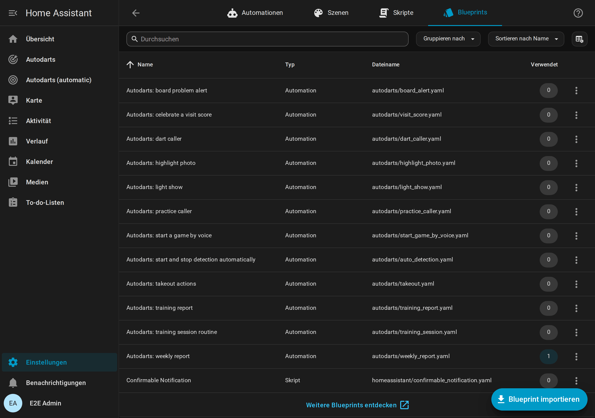

# Creator-Kit

[← Dokumentation](README.de.md) · [English](creator-kit.md)

Für YouTuber, Streamer, Blogger und alle, die die Autodarts-Integration für Home Assistant zeigen möchten. Alles auf dieser Seite darfst du frei in Videos, Artikeln und Beiträgen über die Integration verwenden; fragen musst du nicht.


**Auf dieser Seite:** [Kurz gesagt](#kurz-gesagt) · [Fakten](#fakten) · [Die Geschichte](#die-geschichte) · [Ohne Board ausprobieren](#ohne-board-ausprobieren) · [Videos und Animationen](#videos-und-animationen) · [Bilder](#bilder) · [So nennst du sie](#so-nennst-du-sie) · [Kontakt](#kontakt)

## Kurz gesagt

Ein Satz:

```text
Dein Autodarts-Board wird Teil deines Smart Homes: Anzeigetafel auf jedem Tablet, Licht-Show beim 180er, Bot, Turniere und Statistik. Lokal, ohne Cloud, kostenlos.
```

Eine kurze Beschreibung:

```text
Autodarts für Home Assistant ist eine kostenlose Open-Source-Integration, die ein Autodarts-Board in Echtzeit mit Home Assistant verbindet, lokal und ohne Konto. Sie bringt eine Anzeigetafel für das Tablet am Board, X01, Cricket, Party- und Trainingsspiele, einen Bot, Turniere, Spielerstatistik mit Trefferbildern und Ereignisse für eigene Automationen, etwa Licht, das beim 180er aufblitzt.
```

## Fakten

| | |
| --- | --- |
| Name | Autodarts für Home Assistant (`ha-autodarts`) |
| Preis | Kostenlos, Open Source unter der MIT-Lizenz |
| Verbindung | Lokal und in Echtzeit mit dem Board Manager auf dem Board-PC; kein Autodarts-Konto, keine Cloud |
| Spiele | X01 von 101 bis 1001, vier Cricket-Spiele, sechs Partyspiele und acht Trainingsspiele |
| Spielen | Bis zu vier Spieler oder zwei Teams zu zweit, Handicap-Startpunkte, ein Bot von Stufe 20 bis 120, Turniere für drei bis acht Spieler |
| Anzeigetafel | Eine Vollbild-Ansicht für Tablet oder Fernseher, mit Spielauswahl, Korrekturen, Caller und Ruhemodus |
| Statistik | Bestleistungen, Trefferbilder der echten Dart-Positionen, Trends, Erfolge, Bestenliste, Wochenbericht und Exporte |
| Zuhause | Sieben Dashboard-Karten, ein automatisches Dashboard und zwölf Blueprints, etwa eine Licht-Show beim 180er |
| Sprachen | Englisch, Deutsch, Niederländisch, Französisch und Spanisch |
| Qualität | 100 % Testabdeckung, in Docker gegen beide Board-Manager-Generationen getestet; alle Regeln der Home-Assistant-Qualitätsskala bis Platin (Selbsteinschätzung) |
| Voraussetzungen | Home Assistant ab 2026.8 mit HACS; die getesteten Setups stehen unter [Unterstützte Geräte](README.de.md#unterstützte-geräte) |
| Online-Matches | Ereignisse direkt aus der Autodarts-Cloud folgen, sobald Autodarts die Freigabe erteilt; bis dahin bringt eine experimentelle Brücke über Tools for Autodarts sie herein |

## Die Geschichte

```text
Ich spiele selbst auf einem Autodarts-Board. Ich wollte es in Home Assistant haben, habe lange nach einer vollständigen Lösung gesucht und keine gefunden. Also habe ich in meiner Freizeit selbst eine geschrieben. Von der Community, für die Community: Ich entwickle sie ständig weiter, und die Rückmeldungen echter Spieler entscheiden, was als Nächstes kommt. – Dennis Otto
```

## Ohne Board ausprobieren

Eine Demo mit simuliertem Board und erfundenen Spielern zeigt alle Karten, die Anzeigetafel und eine Trainingshistorie. Du brauchst Docker und Git; unter Windows startest du sie in der Git Bash.

```sh
git clone https://github.com/Dennis-Otto/ha-autodarts.git
cd ha-autodarts
DEMO_LANGUAGE=de bash tests/e2e/demo.sh
```

Öffne <http://127.0.0.1:18124/autodarts-demo/board>; vom eigenen Rechner aus ist keine Anmeldung nötig. Ohne `DEMO_LANGUAGE=de` startet die Demo auf Englisch. Das Skript zeigt am Ende den Befehl, der sie wieder stoppt. Mehr dazu in der [Entwickler-Dokumentation](development.md#demo-instance-and-browser-test), auf Englisch.

## Videos und Animationen

In der Demo mit simuliertem Board aufgenommen. MP4 funktioniert in Schnittprogrammen, auf Reddit und in Discord; GIF funktioniert in jedem Forum.

| Szene | Deutsch | Englisch |
| --- | --- | --- |
| Ein 301-Match auf der Live-Karte und der Anzeigetafel | [MP4](media/hero-de.mp4) · [GIF](media/hero-de.gif) | [MP4](media/hero-en.mp4) · [GIF](media/hero-en.gif) |
| Die Anzeigetafel in einem 501-Match | [MP4](media/scoreboard-de.mp4) · [GIF](media/scoreboard-de.gif) | [MP4](media/scoreboard-en.mp4) · [GIF](media/scoreboard-en.gif) |
| Ein Match gegen den Bot | [MP4](media/bot-match-de.mp4) · [GIF](media/bot-match-de.gif) | [MP4](media/bot-match-en.mp4) · [GIF](media/bot-match-en.gif) |
| Das nächste Spiel auf dem Tablet wählen | [MP4](media/lobby-de.mp4) · [GIF](media/lobby-de.gif) | [MP4](media/lobby-en.mp4) · [GIF](media/lobby-en.gif) |
| Ein Turnier mit Turnierbaum | [MP4](media/tournament-bracket-de.mp4) · [GIF](media/tournament-bracket-de.gif) | [MP4](media/tournament-bracket-en.mp4) · [GIF](media/tournament-bracket-en.gif) |

## Bilder

Alle Screenshots der Dokumentation liegen in [`docs/images/de`](https://github.com/Dennis-Otto/ha-autodarts/tree/main/docs/images/de) und [`docs/images/en`](https://github.com/Dennis-Otto/ha-autodarts/tree/main/docs/images/en), alle in der Demo aufgenommen. Einige, die die Integration auf einen Blick zeigen:

| | |
| --- | --- |
|  |  |
|  |  |

## So nennst du sie

- Nenne sie **Autodarts für Home Assistant** oder **ha-autodarts** und verlinke <https://github.com/Dennis-Otto/ha-autodarts>.
- Sag dazu, dass es ein **inoffizielles Community-Projekt** ist, ohne Verbindung zu Autodarts. Namen und Logos von Autodarts und Winmau gehören ihren Inhabern; bitte nutze sie nicht so, dass es nach einer Empfehlung aussieht, etwa in einem Vorschaubild.
- Autodarts unterstützt die lokale Schnittstelle des Board Managers ab Version 2 nicht mehr offiziell. Die Integration funktioniert weiterhin damit; unter [Unterstützte Geräte](README.de.md#unterstützte-geräte) steht, was getestet ist.

## Kontakt

Fragen und Ideen gehören in die [GitHub Discussions](https://github.com/Dennis-Otto/ha-autodarts/discussions), damit jede Antwort allen hilft; Deutsch und Englisch sind willkommen. Du hast ein Video oder einen Artikel gemacht? Teile ihn unter [Show and tell](https://github.com/Dennis-Otto/ha-autodarts/discussions/categories/show-and-tell), dann verlinken wir ihn in der Dokumentation.
