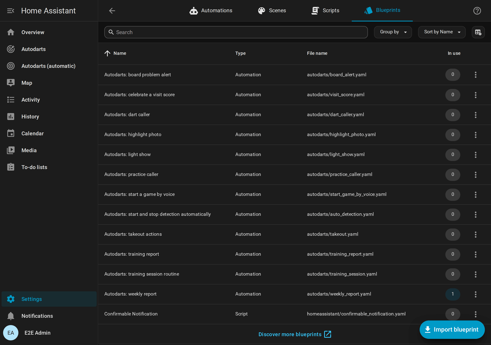

# Creator kit

[← Documentation](README.md) · [Deutsch](creator-kit.de.md)

For YouTubers, streamers, bloggers and everyone who wants to show the Autodarts integration for Home Assistant. Everything on this page is free to use in videos, articles and posts about the integration; no need to ask.


**On this page:** [In short](#in-short) · [Facts](#facts) · [The story](#the-story) · [Try it without a board](#try-it-without-a-board) · [Videos and animations](#videos-and-animations) · [Pictures](#pictures) · [How to name it](#how-to-name-it) · [Contact](#contact)

## In short

One sentence:

```text
Make your Autodarts board part of your smart home: a scoreboard on any tablet, a light show on every 180, a bot, tournaments and stats. Local, no cloud, free.
```

A short description:

```text
Autodarts for Home Assistant is a free, open-source integration that connects an Autodarts board to Home Assistant in real time, locally and without an account. It brings a scoreboard for the tablet at the board, X01, Cricket, party and training games, a bot, tournaments, player statistics with heatmaps, and events for your own automations, such as lights that flash on a 180.
```

## Facts

| | |
| --- | --- |
| Name | Autodarts for Home Assistant (`ha-autodarts`) |
| Price | Free, open source under the MIT license |
| Connection | Local and in real time with the Board Manager on the board PC; no Autodarts account, no cloud |
| Games | X01 from 101 to 1001, four Cricket games, six party games and eight training games |
| Play | Up to four players or two teams of two, handicap start scores, a bot from level 20 to 120, tournaments of three to eight players |
| Scoreboard | A full-screen view for a tablet or TV, with the new game screen, dart corrections, a caller and idle mode |
| Statistics | Personal bests, heatmaps of the real dart positions, trends, achievements, a leaderboard, a weekly report and exports |
| Home | Seven dashboard cards, an automatic dashboard and twelve blueprints, for example a light show on a 180 |
| Languages | English, German, Dutch, French and Spanish |
| Quality | 100 % test coverage, tested against both Board Manager generations in Docker; every rule of the Home Assistant quality scale up to Platinum (self-assessed) |
| Requirements | Home Assistant 2026.8 or newer with HACS; the tested setups are under [supported devices](README.md#supported-devices) |
| Online matches | Events straight from the Autodarts cloud follow once Autodarts grants access; until then an experimental bridge through Tools for Autodarts brings them in |

## The story

```text
I play on an Autodarts board myself. I wanted it in Home Assistant, looked for a complete solution for a long time and didn't find one. So I wrote my own, in my spare time. By the community, for the community: I keep developing it, and feedback from real players decides what comes next. – Dennis Otto
```

## Try it without a board

A demo with a simulated board and made-up players shows every card, the scoreboard and a training history. You need Docker and Git; on Windows, run it in Git Bash.

```sh
git clone https://github.com/Dennis-Otto/ha-autodarts.git
cd ha-autodarts
bash tests/e2e/demo.sh
```

Open <http://127.0.0.1:18124/autodarts-demo/board>; no login is needed from your own computer. `DEMO_LANGUAGE=de bash tests/e2e/demo.sh` starts it in German. The script prints the command that stops it. More in the [development guide](development.md#demo-instance-and-browser-test).

## Videos and animations

Recorded in the demo with a simulated board. MP4 works in video editors, on Reddit and on Discord; GIF works in every forum.

| Scene | English | German |
| --- | --- | --- |
| A 301 match on the live card and the scoreboard | [MP4](media/hero-en.mp4) · [GIF](media/hero-en.gif) | [MP4](media/hero-de.mp4) · [GIF](media/hero-de.gif) |
| The scoreboard during a 501 match | [MP4](media/scoreboard-en.mp4) · [GIF](media/scoreboard-en.gif) | [MP4](media/scoreboard-de.mp4) · [GIF](media/scoreboard-de.gif) |
| A match against the bot | [MP4](media/bot-match-en.mp4) · [GIF](media/bot-match-en.gif) | [MP4](media/bot-match-de.mp4) · [GIF](media/bot-match-de.gif) |
| Choosing the next game on the tablet | [MP4](media/lobby-en.mp4) · [GIF](media/lobby-en.gif) | [MP4](media/lobby-de.mp4) · [GIF](media/lobby-de.gif) |
| A tournament with its bracket | [MP4](media/tournament-bracket-en.mp4) · [GIF](media/tournament-bracket-en.gif) | [MP4](media/tournament-bracket-de.mp4) · [GIF](media/tournament-bracket-de.gif) |

## Pictures

Every screenshot of the documentation is in [`docs/images/en`](https://github.com/Dennis-Otto/ha-autodarts/tree/main/docs/images/en) and [`docs/images/de`](https://github.com/Dennis-Otto/ha-autodarts/tree/main/docs/images/de), all taken in the demo. A few that show the integration at a glance:

| | |
| --- | --- |
|  |  |
|  |  |

## How to name it

- Call it **Autodarts for Home Assistant** or **ha-autodarts** and link <https://github.com/Dennis-Otto/ha-autodarts>.
- Say that it is an **unofficial community project**, not affiliated with Autodarts. Autodarts and Winmau names and logos belong to their owners; please don't use them in a way that looks like an endorsement, for example in a thumbnail.
- Autodarts no longer supports the local interface of the Board Manager officially from version 2 on. The integration still works with it; the [supported devices](README.md#supported-devices) say what is tested.

## Contact

Questions and ideas go to [GitHub Discussions](https://github.com/Dennis-Otto/ha-autodarts/discussions), so every answer helps everyone; English and German are welcome. Made a video or an article? Share it in [Show and tell](https://github.com/Dennis-Otto/ha-autodarts/discussions/categories/show-and-tell), and it gets a link in the documentation.
