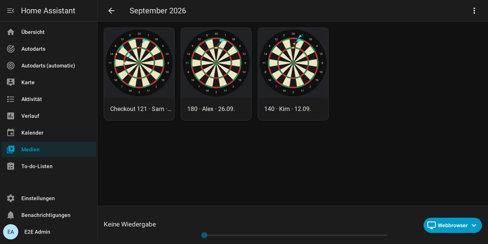
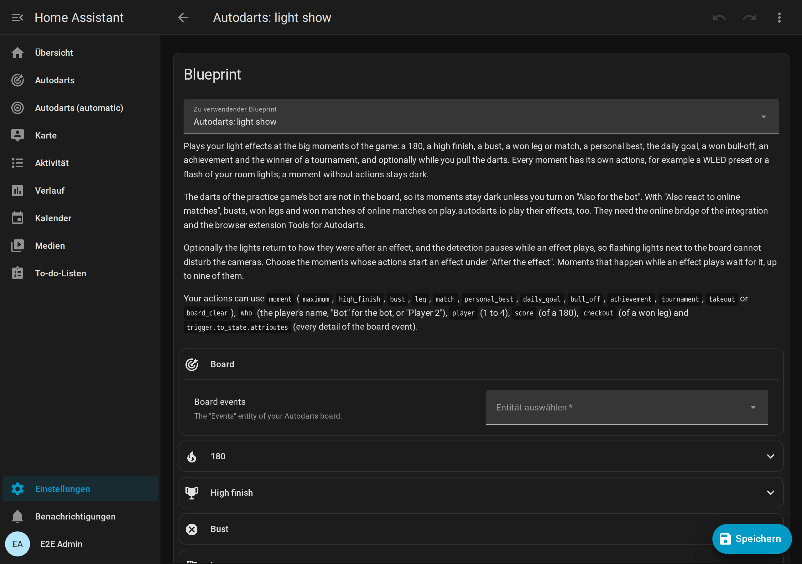

# Autodarts für Home Assistant

[← Projektseite](../../README.md) · [English documentation](../README.md)

**Dein Autodarts-Board live in Home Assistant: lokal, in Echtzeit und bereit für Automationen.**

**Schnell zu:** [Schnellstart](#schnellstart) · [Anleitungen](#anleitungen) · [Anwendungsfälle](#anwendungsfälle) · [Blueprints](#blueprints) · [Glossar](glossar.md) · [Änderungen](../../CHANGELOG.md)

## Warum

- **Sofort und lokal.** Darts erscheinen in Home Assistant Sekundenbruchteile, nachdem sie landen, direkt vom Board Manager in deinem Netzwerk. Kein Konto, keine Cloud, keine Client-ID.
- **Ein ganzer Dartabend.** X01 von 101 bis 1001, drei Cricket-Spiele, sechs Partyspiele und acht Trainingsspiele, allein, als Match mit bis zu vier Spielern oder als Turnier mit bis zu acht, mit einer Anzeigetafel für das Tablet am Board.
- **Deine Entwicklung in Zahlen.** Averages, Trefferbilder der echten Dart-Positionen, Bestleistungen, Abzeichen, Wochentrends, Spielerprofile, ein Wochenbericht und ein Jahr Verlauf, alles bei dir zu Hause.
- **Dein Zuhause spielt mit.** Licht für eine 180, ein Caller auf deinen Lautsprechern, das Boardlicht bei der Entnahme, ein Foto deines besten Checkouts.

## Das kann die Integration

<table>
  <tr>
    <td width="55%" valign="top">
      <h3>Spielen</h3>
      <ul>
        <li>X01 von 101 bis 1001 mit Double-Out, Double-In und dem Checkout-Weg nach jedem Dart</li>
        <li>Cricket, Cut-Throat Cricket und Tactics auf einer Kreidetafel</li>
        <li>Partyspiele: Shanghai, Halve-It, Killer, Golf, Baseball und Count-Up</li>
        <li>Matches mit bis zu vier Spielern, Legs und Sätzen, zwei Teams zu zwei, Startpunkten als Handicap und Ausbullen, und eine Zusammenfassung jedes Matches</li>
        <li>Turniere mit drei bis acht Spielern: jeder gegen jeden mit Tabelle oder K.-o.-System mit Turnierbaum</li>
        <li>Ein Bot mit Stärke 20 bis 120 als Gegner bei X01 und Cricket</li>
        <li>Ein Tipp korrigiert einen falsch erkannten Dart; ein Tastenfeld gibt Darts von Hand ein, und die letzte Aufnahme lässt sich zurücknehmen</li>
        <li>Stellwürfe, wo kein Checkout möglich ist, etwa T20 T20 S17 für Rest 32</li>
      </ul>
      
<a href="spiele.md">Spiele und Regeln →</a>

    </td>
    <td width="45%"></td>
  </tr>
  <tr>
    <td width="55%" valign="top">
      <h3>Trainieren</h3>
      <ul>
        <li>Trainingssessions, die mit dem ersten Dart beginnen und die letzten 20 Sessions behalten</li>
        <li>Acht Trainingsspiele: Around the Clock, Doppeltraining, Checkout-Training, Bob's 27, der 121-Checkout, Catch 40, die JDC Challenge und das Singles-Training</li>
        <li>Ein Tagesziel, eine Trainingsserie und Bestleistungen mit einem Ereignis, sobald du eine übertriffst</li>
      </ul>
      
<a href="spiele.md#trainingsspiele">Trainingsspiele →</a>

    </td>
    <td width="45%"></td>
  </tr>
  <tr>
    <td width="55%" valign="top">
      <h3>Auswerten</h3>
      <ul>
        <li>3-Dart-Average, First-9-Average, Checkout- und Doppelquote und ein Trefferbild jedes Feldes oder der echten Dart-Positionen, mit der Streuung in Millimetern</li>
        <li>Spielerprofile mit Abzeichen in Bronze, Silber, Gold und Platin, Wochentrends, direkten Vergleichen, dem Match-Verlauf und einer Bestenliste</li>
        <li>Die Quote jedes Doubles, ein Wochenbericht, ein Trainingskalender und Exporte als CSV oder JSON</li>
        <li>Langzeitstatistik für Grafiken über Wochen und Monate</li>
      </ul>
      
<a href="statistik.md">Statistik und Spieler →</a>

    </td>
    <td width="45%"></td>
  </tr>
  <tr>
    <td width="55%" valign="top">
      <h3>Bildschirm am Board</h3>
      <ul>
        <li>Eine Anzeigetafel für Tablet oder Fernseher, lesbar vom Abwurf aus</li>
        <li>Eine Spielauswahl, um Spiel, Spieler und Format direkt am Board zu wählen oder ein Turnier zu starten</li>
        <li>Ein Caller, der das Spiel über den Browser des Bildschirms ansagt</li>
        <li>Ein Ruhemodus mit Bestenliste, Bestleistungen, den Darts von heute und einer Uhr</li>
      </ul>
      
<a href="anzeigetafel.md">Anzeigetafel am Board →</a>

    </td>
    <td width="45%"></td>
  </tr>
  <tr>
    <td width="55%" valign="top">
      <h3>Automatisieren</h3>
      <ul>
        <li>Board-Ereignisse für jeden Dart, jede Aufnahme, Entnahme, jedes Überwerfen, gewonnene Leg und Match, jede Bestleistung und mehr</li>
        <li>Elf Blueprints: Lichtshow, Dart- und Übungs-Caller, Highlight-Fotos, Berichte, Warnungen und Routinen</li>
        <li>Jedes Spiel mit einer Aktion starten, auch per Sprache</li>
        <li>Online-Matches auf play.autodarts.io über eine optionale Brücke <i>(experimentell)</i></li>
      </ul>
      
<a href="automationen.md">Automationen →</a>

    </td>
    <td width="45%"></td>
  </tr>
  <tr>
    <td width="55%" valign="top">
      <h3>Lokal und privat</h3>
      <ul>
        <li>Mit Board Manager 2 automatisch gefunden; Board Manager 1 funktioniert auch</li>
        <li>Nichts verlässt dein Netzwerk, außer du nutzt die Board-Suche, die Cloud-Verknüpfung oder die Online-Brücke; Geheimnisse des Boards werden nie gespeichert</li>
        <li>Sieben Dashboard-Karten und ein automatisches Dashboard, auf Deutsch, Englisch, Niederländisch, Französisch und Spanisch (<a href="#sprachen">Sprachen</a>)</li>
        <li>Alle Regeln der Qualitätsskala von Home Assistant bis Platin, 100 % Testabdeckung</li>
      </ul>
      
<a href="funktionsweise.md">Funktionsweise →</a>

    </td>
    <td width="45%">
      <picture>
        <source media="(prefers-color-scheme: dark)" srcset="../images/de/architecture-dark.png">
        
      </picture>
    </td>
  </tr>
</table>

## Voraussetzungen

**Home Assistant ab 2026.8** mit [HACS](https://hacs.xyz) und ein Autodarts-Board in deinem Netzwerk: **Board Manager 2**, also Autodarts 2 ohne Bildschirm (empfohlen, getestet bis 2.0.2), oder der klassische **Board Manager 1**. Laut dem Bericht eines Spielers funktioniert auch **Autodarts Desktop** 2.0.2 unter Linux. Autodarts Desktop unter Windows und die Winmau-Autodarts-Geräte wie Autodarts X oder Lens sind noch nicht getestet; ein [Kompatibilitätsbericht](https://github.com/Dennis-Otto/ha-autodarts/issues/new?template=board_compatibility.yml) hilft, ob es klappt oder nicht. Ein Autodarts-Konto brauchst du nicht.

## Schnellstart

1. **Mit HACS installieren.**

   

   Alternativ fügst du `https://github.com/Dennis-Otto/ha-autodarts` in HACS als benutzerdefiniertes Repository vom Typ **Integration** hinzu und lädst **Autodarts** herunter.
2. **Home Assistant neu starten.**
3. **Board hinzufügen.** Mit Board Manager 2 erscheint dein Board meist schon unter **Einstellungen → Geräte & Dienste → Entdeckt**. Sonst:

   

   Wähle **Boards im Netzwerk suchen** oder **Board-Adresse eingeben** und bestätige.
4. **Karten hinzufügen.** Erzeuge in einem Schritt ein komplettes Dashboard: **Einstellungen → Dashboards → Dashboard hinzufügen → Autodarts**. Oder bearbeite ein Dashboard, wähle **Karte hinzufügen** und suche nach *Autodarts*.

Neu bei Home Assistant? [Von null bis zur Anzeigetafel](erste-schritte.md) führt dich von null bis zur Anzeigetafel neben deinem Board. Die [Installationsanleitung](installation.md) beschreibt die manuelle Installation, die Neukonfiguration, Updates und das Entfernen.

## Anleitungen

### Erste Schritte

| Anleitung | Inhalt |
| --- | --- |
| [Von null bis zur Anzeigetafel](erste-schritte.md) | Für Autodarts-Spieler ohne Home Assistant: Home Assistant und HACS aufsetzen, die Integration installieren, das Board hinzufügen und das erste Spiel auf der Anzeigetafel |
| [Installation und Einrichtung](installation.md) | Voraussetzungen, HACS und manuelle Installation, die drei Wege, ein Board hinzuzufügen, die optionale Cloud-Verknüpfung, Neukonfiguration, Updates und Entfernen |

### Anleitungen

| Anleitung | Inhalt |
| --- | --- |
| [Spiele und Regeln](spiele.md) | Alle Spiele im Überblick, vier Wege, eines zu starten, Matches, Teams, Handicaps, das Ausbullen, die Match-Zusammenfassung, Turniere und die Regeln von X01, den Cricket-Spielen, den Partyspielen und den Trainingsspielen |
| [Anzeigetafel am Board](anzeigetafel.md) | Ein Tablet oder Fernseher neben dem Board: Einrichtung, Quer- und Hochformat, Spielauswahl, Turniere, Caller und Ruhemodus |
| [Statistik und Spieler](statistik.md) | Trainingssessions, Bestleistungen, Trefferbild und Dart-Positionen, Fortschritt über die Zeit, Doubles, Spielerprofile, Erfolge, Trends, Bestenliste, Wochenbericht, Trainingskalender und Exporte |
| [Automationen](automationen.md) | Elf Blueprints, ihre Einstellungen, Board-Ereignisse und fertige Beispiele |
| [Online-Matches](online-matches.md) | Überwerfen, gewonnene Legs und Matches von Online-Matches als Board-Ereignisse, mit der Browser-Erweiterung Tools for Autodarts *(experimentell)* |

### Nachschlagen

| Seite | Inhalt |
| --- | --- |
| [Dashboard-Karten](karten.md) | Live-Karte, Trainingskarte, Board-Status, Anzeigetafel, Doubles-Karte, Spielerkarte, Bestenliste und automatisches Dashboard, mit allen Optionen und Barrierefreiheit |
| [Entitäten und Ereignisse](entitaeten.md) | Alle Entitäten, Board-Ereignisse, Zustände, Attribute und Aktionen, und welche Board-Manager-Generation sie liefert |
| [Funktionsweise](funktionsweise.md) | Architektur, Aktualisierung, Verbindungsverhalten, Board-Manager-Generationen, Adresswechsel, Training und Bestleistungen, gespeicherte Daten und Datenschutz |
| [Fehlerbehebung](fehlerbehebung.md) | Meldungen bei der Einrichtung, Reparaturen, nicht verfügbare Entitäten, fehlgeschlagene Aktionen, Diagnose und Logs |
| [Sicherheit](sicherheit.md) | Schutzgüter, Vertrauensgrenzen, Bedrohungen und Gegenmaßnahmen |
| [Glossar](glossar.md) | Die Begriffe des Dartsports und dieser Integration, mit ihren englischen Entsprechungen |

### Projekt

| Seite | Inhalt |
| --- | --- |
| [Änderungen](../../CHANGELOG.md) | Was jede Version gebracht hat (auf Englisch) |
| [Roadmap](roadmap.md) | Erschienene Versionen und was als Nächstes kommt |
| [Development](../development.md), [Releases](../releases.md) | Die Entwickler-Dokumentation, auf Englisch |
| [Creator-Kit](creator-kit.md) | Fakten, Beschreibungen, Videos, Animationen und Bilder für YouTuber, Streamer und Blogger, frei nutzbar |

## Anwendungsfälle

<table>
  <tr>
    <td width="50%" valign="top"> <b>Gezielt trainieren.</b> Verfolge nach jeder Session deinen Average, deine 180er und wohin deine Darts fliegen, und lass dich von Tagesziel und Trainingsserie antreiben. <a href="statistik.md">Statistik</a></td>
    <td width="50%" valign="top"> <b>Ein Dartabend mit Freunden.</b> Wähle das Spiel am Tablet neben dem Board oder starte ein Turnier, lass die Anzeigetafel zählen und ansagen, und sieh zwischen den Spielen Tabelle oder Bestenliste. <a href="anzeigetafel.md">Anzeigetafel</a></td>
  </tr>
  <tr>
    <td width="50%" valign="top"> <b>Atmosphäre.</b> Lichtshows für eine 180 oder ein gewonnenes Match, ein Dart-Caller auf deinen Lautsprechern und das Boardlicht bei der Entnahme. <a href="automationen.md">Automationen</a></td>
    <td width="50%" valign="top"> <b>Highlights festhalten.</b> Ein Foto des Boards nach jeder 180 oder jedem Checkout, auf dem Handy und in einer Galerie nach Monaten. <a href="automationen.md#highlight-galerie">Highlight-Galerie</a></td>
  </tr>
  <tr>
    <td width="50%" valign="top"> <b>Fortschritt über Monate.</b> Langzeitgrafiken, ein Wochenbericht aufs Handy und ein Trainingskalender mit einem Jahr Sessions und Matches. <a href="statistik.md#fortschritt-über-die-zeit">Fortschritt über die Zeit</a></td>
    <td width="50%" valign="top">
      <picture>
        <source media="(prefers-color-scheme: light)" srcset="../images/de/status-card-light.png">
        
      </picture>
       <b>Ein Board, das sich selbst kümmert.</b> Starte die Erkennung, wenn du den Dartraum betrittst, stoppe sie, wenn du gehst, und erfahre, wenn das Board offline geht oder eine Kamera ausfällt. <a href="automationen.md#blueprints">Blueprints</a></td>
  </tr>
</table>

## Blueprints

Importiere einen Blueprint mit einem Klick, wähle dein Board und fertig:

| Blueprint | Import |
| --- | --- |
| **Light show.** Deine WLED-Presets oder Raumlichter bei einer 180, einem High Finish, beim Überwerfen, einem gewonnenen Leg oder Match, einer Bestleistung, einem Erfolg, dem Sieger eines Turniers und mehr, und danach zurück zu deinem normalen Licht. |  |
| **Celebrate a visit score.** Deine Aktionen für jede 180, jede Aufnahme ab 100 oder eine Punktzahl deiner Wahl, sobald der dritte Dart landet. |  |
| **Dart caller.** Jede Aufnahme auf deinen Lautsprechern, mit einer eigenen Ansage für die 180. |  |
| **Practice caller.** Wer was braucht, Überwerfen und Game shots des Übungsspiels auf deinen Lautsprechern. |  |
| **Highlight photo.** Ein Bild des Boards nach einer 180 oder einem Checkout, aufs Handy und in eine Galerie der Medienansicht. |  |
| **Takeout actions.** Licht am Board, während du die Darts ziehst. |  |
| **Start and stop detection automatically**, je nachdem, ob jemand im Dartraum ist. |  |
| **Training session routine.** Licht, Erkennung und Kalibrierung folgen deinen Trainingssessions. |  |
| **Weekly report.** Deine Trainingswoche mit dem Trend deines 3-Dart-Averages, als Benachrichtigung. |  |
| **Training report.** Deine Tageszusammenfassung mit dem 3-Dart-Average. |  |
| **Board problem alert**, wenn das Board offline geht oder eine Kamera ausfällt, mit optionaler Entwarnung. |  |

Die Blueprints sind auf Englisch beschriftet; ihre Texte, etwa die Ansagen, wählst du beim Anlegen selbst. Die [Anleitung zu Automationen](automationen.md) enthält deutsche Beispiele.

## Unterstützte Geräte

| | Unterstützt | Getestet mit |
| --- | --- | --- |
| Board Manager 2: Autodarts 2 ohne Bildschirm (Headless) | 2.x | 2.0.0 und 2.0.2 |
| Board Manager 1 (klassische App) | 1.x | 1.0.7 |
| Autodarts Desktop unter Linux | Funktioniert laut Spielerbericht | 2.0.2 unter Ubuntu 24.04 ([Bericht](https://github.com/Dennis-Otto/ha-autodarts/issues/105)) |
| Autodarts Desktop unter Windows und anderen Systemen | Noch nicht getestet | – |
| Winmau-Autodarts-Geräte wie Autodarts X oder Lens | Noch nicht getestet | – |
| Kameras | Jede Anzahl, die der Board Manager unterstützt | 3 |
| Home Assistant | ab 2026.8 | 2026.8.0 und 2026.9.4 |

Jede Board-Hardware, auf der der Autodarts Board Manager läuft, funktioniert, weil die Integration mit dem Board Manager spricht, nicht mit den Kameras. Einträge „laut Spielerbericht“ hat ein Spieler an seinem eigenen Board getestet, nicht das Projekt.

Seit September 2026 beschreibt die Doku von Autodarts den Board Manager als Browser-Oberfläche von Autodarts 0.x, die ab Version 2 nicht mehr unterstützt wird. Die lokale Schnittstelle auf Port 3180, die die Integration nutzt, antwortet mit Autodarts 2.0.2 weiterhin. Ändert ein Update sie, zeigt die Integration eine Reparaturmeldung, statt still auszufallen (siehe [Fehlerbehebung](fehlerbehebung.md#reparaturen)). Läuft dein Setup nicht in der Tabelle, hilft ein [Kompatibilitätsbericht](https://github.com/Dennis-Otto/ha-autodarts/issues/new?template=board_compatibility.yml), auch wenn alles klappt.

## Sprachen

Die Integration spricht Deutsch, Englisch, Niederländisch, Französisch und Spanisch: Einrichtung, Optionen, Entitäten und ihre Zustände, Aktionen, Meldungen und Reparaturen, die Karten mit ihren Editoren und der Caller der Anzeigetafel. Sie folgt der Sprache von Home Assistant, eine regionale Variante wie `de-CH` oder `es-419` zählt zu ihrer Sprache. Andere Sprachen sehen Englisch.

- Die Namen der Entitäten legt Home Assistant in der Sprache des Servers fest (**Einstellungen → System → Allgemein**), Zustände und Karten folgen der Sprache deines Benutzerprofils.
- Der Caller spricht die Sprache der Karte mit einer Stimme deines Browsers oder Tablets für diese Sprache.
- Die Dokumentation gibt es auf Englisch und Deutsch, die Blueprints auf Englisch, weil Home Assistant Blueprints nicht übersetzt.

Eine Übersetzung verbessern oder eine Sprache hinzufügen: [Übersetzungen in CONTRIBUTING.md](../../CONTRIBUTING.md#translations).

## Bekannte Einschränkungen

- **Cloud-Spieldaten sind noch nicht verfügbar.** Sie brauchen eine OAuth-Client-ID, die Autodarts für diese Integration vergibt, und noch ist keine enthalten. Alles Lokale funktioniert ohne sie.
- **Online-Matches über eine Browser-Erweiterung.** Überwerfen und Game shots von Online-Matches kommen nur an, solange die Autodarts-Seite mit Tools for Autodarts offen ist, einer Erweiterung von Dritten. [Grenzen](online-matches.md#grenzen).
- **Trainingssessions zählen Darts, keine Spiele.** Eine Session zählt jeden Dart, den das Board erkennt; Spieler, Legs und Checkouts gehören zum Übungsspiel, das seine eigene Statistik führt.
- **Board-Manager-Updates installierst du auf dem Board-PC.** Die Update-Entität meldet neue Versionen von Board Manager 2.
- **Liveansicht der Kameras nur mit Board Manager 2.** Mit Board Manager 1 zeigen die Kamera-Entitäten Standbilder.

## Hilfe und Mitmachen

- **Fragen und Ideen:** [GitHub Discussions](https://github.com/Dennis-Otto/ha-autodarts/discussions), gern auf Deutsch. **Fehler:** [Issues](https://github.com/Dennis-Otto/ha-autodarts/issues/new/choose), mit den Diagnosedaten deines Boards. [SUPPORT.md](../../SUPPORT.md) erklärt, wo du was fragst.
- **Ausprobiert?** Ein [Erfahrungsbericht](https://github.com/Dennis-Otto/ha-autodarts/issues/new?template=tester_report.yml) sagt uns, was geklappt hat, was nicht und was dir fehlt; kurze Antworten genügen, gern auf Deutsch.
- **Sicherheit:** Melde Schwachstellen vertraulich, wie in [SECURITY.md](../../SECURITY.md) beschrieben.
- **Zeigen:** Für Videos und Artikel gibt es ein [Creator-Kit](creator-kit.md) mit Fakten, Videos und Bildern zur freien Verwendung.
- **Mitmachen:** Beiträge sind willkommen; [CONTRIBUTING.md](../../CONTRIBUTING.md) erklärt die Prüfungen. Die Mitarbeit folgt dem [Verhaltenskodex](../../CODE_OF_CONDUCT.md) und der [Governance](../../GOVERNANCE.md) des Projekts.

## Qualität und Sicherheit

- Erfüllt jede Regel der [Qualitätsskala für Home-Assistant-Integrationen](https://developers.home-assistant.io/docs/core/integration-quality-scale/) bis Platin ([Selbstbewertung](../../custom_components/autodarts/quality_scale.yaml)), einschließlich strikter Typisierung.
- 100 % Zeilen- und Zweigabdeckung der Integration, Fuzz-Tests der Karten, ein Docker-End-to-End-Test gegen beide Board-Manager-Generationen und das älteste unterstützte Home Assistant sowie ein echter Browsertest jeder Karte. [Entwicklung](../development.md) (englisch).
- Signierte Release-Pakete mit SLSA-Herkunftsnachweis. [Releases](../releases.md#signed-release-packages) (englisch).

## Herkunft und Lizenz

Diese Integration begann als Fork von [Trkal/HACSAutodarts](https://github.com/Trkal/HACSAutodarts), einem cloudbasierten Prototyp vom April 2026. Seit September 2026 ist sie neu geschrieben und wird unabhängig von [@Dennis-Otto](https://github.com/Dennis-Otto) gepflegt: lokale Echtzeitsteuerung für beide Board-Manager-Generationen, Spiele, Trainingsauswertung, Dashboard-Karten, Blueprints, Tests und Dokumentation. Beide nutzen die Domain `autodarts`; die [Installationsanleitung](installation.md#von-der-ursprünglichen-integration-umsteigen) erklärt den Wechsel. Danke an Trkal für die ursprüngliche Arbeit und an das Autodarts-Team für seine offene lokale Schnittstelle.

Lizenziert unter der [MIT-Lizenz](../../LICENSE). Namen und Markengrafiken von Autodarts und Winmau gehören ihren Inhabern; die mitgelieferten Markenbilder kennzeichnen das unterstützte Produkt und fallen nicht unter die MIT-Lizenz. Dies ist eine inoffizielle Community-Integration ohne Verbindung zu Autodarts.
