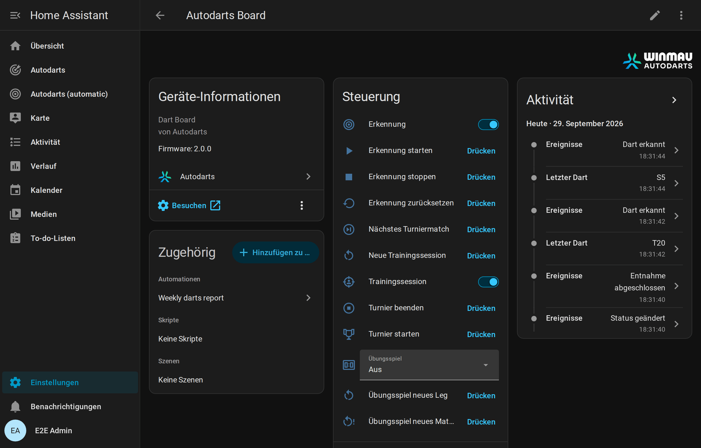
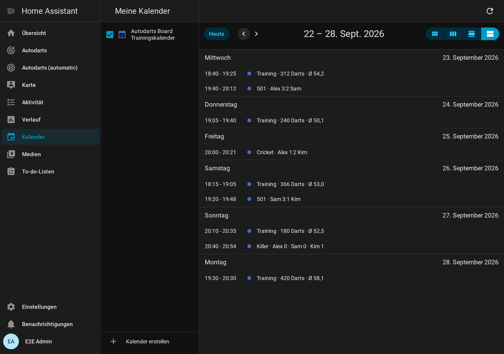
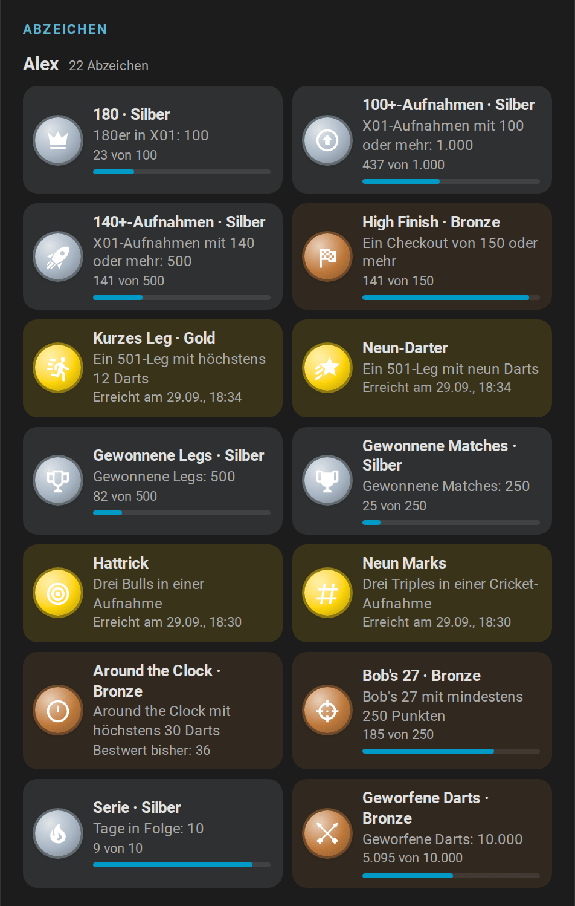

# Entitäten und Ereignisse

[← Dokumentation](README.de.md) · [English](entities.md)

Jedes Board ist ein Gerät mit den folgenden Entitäten. Es heißt so wie das Board in Autodarts, wenn die Board-Suche oder die Cloud es gefunden hat, sonst *Autodarts Board*. Die Namen der Entitäten folgen der Sprache von Home Assistant und wiederholen den Gerätenamen nicht. Die Entitäts-IDs leiten sich beim Anlegen einer Entität aus beiden ab, zum Beispiel `sensor.autodarts_board_training_3_dart_average`, und bleiben erhalten, wenn eine spätere Version eine Entität umbenennt.

**Legende:**

| Spalte oder Markierung | Bedeutung |
| --- | --- |
| **BM** | Die Board-Manager-Generation, die die Entität liefert: 1, 2 oder beide |
| *Deaktiviert* | Wird deaktiviert angelegt; bei Bedarf aktivierst du sie in den Entitätseinstellungen |
| *Diagnose*, *Konfiguration* | Die Entitätskategorie; solche Entitäten stehen auf der Geräteseite in eigenen Bereichen |



## Aktuelle Aufnahme

| Entität | Typ | Beschreibung |
| --- | --- | --- |
| Erkennungsstatus | Sensor (Aufzählung) | `offline`, `starting`, `stopping`, `stopped`, `throw` (bereit), `takeout`, `takeout_in_progress`, `calibrating`, `error`. Unbekannte Zustände künftiger Board-Manager-Versionen erscheinen als *unbekannt*. |
| Letzter Dart | Sensor | Feld des letzten Darts, zum Beispiel `T20`, `D16`, `S5`, `25`, `Bull`. |
| Punkte letzter Dart | Sensor, Punkte | Punkte des letzten Darts. |
| Darts in der Aufnahme | Sensor, Darts | Darts, die gerade im Board erkannt sind (0–3). |
| Erkannte Aufnahmepunkte | Sensor, Punkte | Summe der erkannten Darts. Das Attribut `throws` listet jeden Dart mit `segment`, `number`, `multiplier`, `score`, `bed` und der normierten Position `x`/`y`. In Home Assistant korrigierte oder eingegebene Darts und die Darts des [Bots](#bot) gehören zur Aufnahme, markiert mit `corrected`, `manual` oder `bot`; `dart` nummeriert die Darts der aktuellen Aufnahme (1–3), so wie [`autodarts.correct_dart`](#dart-korrigieren-autodartscorrect_dart) sie zählt. Das Attribut `recent_visits` listet die letzten zehn abgeschlossenen Aufnahmen, die neueste zuerst, mit `time`, `score`, `darts`, `segments` und `manual` bei einer Aufnahme mit von Hand eingegebenen oder korrigierten Darts. Der Recorder speichert beide Attribute nicht. |
| Letztes Ereignis | Sensor, *Diagnose*, *Deaktiviert* | Der letzte Ereignistext des Board Managers, etwa `Throw detected` oder `Takeout started`, auf Englisch, wie das Board ihn schreibt; *Erkennungsstatus* zeigt dasselbe übersetzt. Er ändert sich mit jedem Dart und ist daher anfangs deaktiviert. |

Die Aufnahmepunkte sind die reine Summe der Darts, ohne Spielregeln wie Überwerfen. Letzter Dart, seine Punkte und die Aufnahmepunkte folgen Korrekturen, von Hand eingegebenen Darts und den Darts des Bots; *Darts in der Aufnahme* zählt die Darts, die das Board selbst sieht.

## Board-Ereignisse

Die Entität **Ereignisse** (etwa `event.autodarts_board_ereignisse` in einem deutschsprachigen Home Assistant, `event.autodarts_board_events` in einem englischen, bei einem mit einer früheren Version eingerichteten Board etwa `event.autodarts_board_board_ereignisse`) löst native Home-Assistant-Ereignisse aus. Das Attribut `event_type` sagt, was passiert ist; weitere Attribute enthalten die Details. Jedes Ereignis hat zusätzlich `source`: `websocket` für Echtzeit, `poll` beim Abgleich per HTTP, `training` für Session-Ereignisse und den Start eines Turniers, `schedule` für den Wochenbericht, `manual` für [Korrekturen, von Hand eingegebene Darts](#korrekturen-und-von-hand-eingegebene-darts) und was daraus folgt, `bot` für die Darts des [Bots](#bot) und `online` für die Momente von [Online-Matches](online-matches.de.md), die die optionale Online-Brücke von der Browser-Erweiterung Tools for Autodarts empfängt. Die Entität bleibt verfügbar, während das Board fehlt; Ereignisse von Home Assistant selbst wie `session_ended` oder `personal_best` kommen also immer an.

| `event_type` | Wann | Attribute |
| --- | --- | --- |
| `dart_detected` | Ein neuer Dart landet, wird von Hand eingegeben oder vom Bot geworfen | `dart_index` (1–3), `segment` (etwa `T20`, `S5`, `Bull`, `25` oder `M` für einen Fehlwurf), `score`, `game`, `name`; `manual` bei einem von Hand eingegebenen Dart, `bot` bei einem Dart des Bots |
| `dart_corrected` | Das Board oder [`autodarts.correct_dart`](#dart-korrigieren-autodartscorrect_dart) korrigiert einen Dart | `dart_index`, `segment`, `score`, `previous` (das Feld davor), `game`, `name`; `manual`, wenn der Dart in Home Assistant korrigiert wurde |
| `takeout_started` | Du beginnst, die Darts zu ziehen | keine |
| `takeout_finished` | Das Board ist wieder frei | keine |
| `visit_thrown` | Der dritte Dart einer Aufnahme landet, solange die Darts noch im Board stecken; einmal pro Aufnahme | `score`, `darts` (3), `segments` (etwa `["T20", "T20", "S20"]`), `game`, `name`; `manual`, wenn ein Dart der Aufnahme von Hand eingegeben oder korrigiert wurde, `bot` bei einer Aufnahme des Bots |
| `visit_completed` | Eine Aufnahme endet: bei der Entnahme, wenn nach einer verpassten Entnahme neue Darts folgen, wenn die Erkennung stoppt oder mit [`autodarts.next_player`](#weitergeben-autodartsnext_player) | `score`, `darts`, `segments`, `game`, `name`, `thrown` (`true`, wenn `visit_thrown` die Aufnahme schon gemeldet hat); `manual` und `bot` wie bei `visit_thrown` |
| `visit_undone` | [`autodarts.undo_visit`](#aufnahme-zurücknehmen-autodartsundo_visit) nimmt die letzte Aufnahme zurück | `score`, `darts`, `segments` (die Darts, die wieder die aktuelle Aufnahme sind), `game`, `name` |
| `status_changed` | Der Erkennungsstatus ändert sich | `status` |
| `session_started` | Eine Trainingssession beginnt: mit dem Schalter *Trainingssession*, der Taste *Neue Trainingssession* oder mit dem ersten Dart, wenn *Sessions automatisch starten* an ist | `started` und `reason` (`manual`, `new_session` oder `first_dart`) |
| `session_ended` | Eine Trainingssession endet: mit dem Schalter, der Taste oder nach der Pause aus *Session-Timeout* | `reason` (`manual`, `new_session` oder `idle`), `started`, `ended`, `duration_minutes`, `darts`, `points`, `average`, `visits`, `highest_visit` und die übrigen Trainingssummen |
| `bust` | Ein Dart im [Übungsspiel](#übungsspiel) geht unter null, lässt mit Double-Out 1 übrig oder erreicht 0 ohne Double | `game`, `player`, `name`, `players`, `remaining` (der Rest zu Beginn der Aufnahme, der bleibt) |
| `leg_won` | Ein Dart beendet das Übungsleg | `game`, `player`, `name`, `players`, `darts` und `average` des Legs, `checkout` (der ausgecheckte Rest), `start` (die Punkte, mit denen das Leg begann), `double_out` und `double_in` (die Regeln des Legs), `legs` des Gewinners im Satz einschließlich dieses Legs und `sets` danach, `match` (`true`, wenn das Leg das Match entscheidet); bei den [Cricket-Spielen](#cricket) `points` und `mpr` statt `average`, `checkout`, `start` und der Regeln, bei [Partyspielen](#partyspiele) `points`; im [Team-Match](#teams-und-startpunkte) zusätzlich `team` und `team_name` sowie `darts`, `average` und `mpr` des Teams |
| `match_won` | Ein Dart entscheidet ein Übungsmatch mehrerer Spieler | `game`, `player`, `name`, `players`, `legs` (des Gewinners im entscheidenden Satz) und `sets`, `scores` mit `player`, `name`, `legs` und `sets` aller Spieler, etwa 3 : 2, und der `average` des Matches; bei Cricket `mpr`; im Team-Match zusätzlich `team` und `team_name`, ein `team` für jeden in `scores` und der Average des Teams; `summary` mit den Zahlen jedes Spielers für die [Match-Zusammenfassung](#übungsspiel), wie sie nach dem Buchen der entscheidenden Aufnahme sind |
| `turn_changed` | Im Übungsspiel wurden die Darts gezogen und die nächste Aufnahme ist dran: im Match der nächste Spieler, allein derselbe | `game`, `player`, `name`, `players`, `remaining`, `checkout` (der Weg für drei Darts oder keiner), `setup` (bei X01 ohne Checkout der [Stellwurf](#stellwürfe) mit `route` und `leave`, sonst keiner); bei Cricket `points`, bei [Partyspielen](#partyspiele) `points` und `target` des nächsten Spielers; beim Ausbullen `bull_off`; im Team-Match `team` und `team_name` |
| `drill_finished` | Ein [Trainingsspiel](#trainingsspiele) endet: Around the Clock, Doppeltraining, Catch 40, JDC Challenge oder Singles-Training sind durch, oder Bob's 27 ist vorbei | `drill`, `darts`, `hits`, `hit_rate` (Prozent); Bob's 27 ergänzt `score` und `completed`; Catch 40 hat `score`, `checkouts` und `darts`, die JDC Challenge `score`, `parts` (die Punkte ihrer drei Teile) und `darts`, das Singles-Training zusätzlich `score` |
| `checkout_attempt` | Ein Versuch im Checkout-Training oder im 121-Checkout endet | `drill`, `target`, `success`, `darts`, `attempts`, `successes`, `rate` (Prozent); der 121-Checkout ergänzt `next`, das nächste Ziel |
| `bull_off_won` | Das [Ausbullen](#übungsspiel) entscheidet, wer das Match beginnt | `game`, `player`, `name`, `players`, `hit` (das Feld des Siegerdarts: `BULL`, `25` oder etwa `S20`), `distance` (Millimeter von der Mitte, oder keiner ohne Position vom Board) |
| `tournament_started` | Ein [Turnier](#turniere) beginnt | `format` (`round_robin` oder `knockout`), `game`, `matches` (die Zahl der Matches), `players` (in der Reihenfolge der Auslosung), `start_scores` (in derselben Reihenfolge), `legs_to_win`, `sets_to_win`, `seed` (einer zufälligen Auslosung, sonst keiner) |
| `tournament_match_finished` | Ein Match des Turniers zählt: Die Darts der entscheidenden Aufnahme sind gezogen | `format`, `game`, `matches`, `match` (seine Nummer im Spielplan), `round`, `stage` (`round_1` bis `round_7`, `quarter_final`, `semi_final`, `third_place` oder `final`), `players`, `winner`, `loser`, `legs` und `sets` beider Spieler, `next` (die Spieler des nächsten Matches, nach dem letzten keiner) |
| `tournament_finished` | Das letzte Match des Turniers zählt | `format`, `game`, `matches`, `winner`, `runner_up`, `third` (keiner im K.-o.-System ohne Spiel um Platz 3), `players` |
| `personal_best` | Ein Wert übertrifft deine [Bestleistung](#bestleistungen-serie-und-tagesziel) | `record`, `value`, `previous`, `name` (der Spieler, falls bekannt) |
| `daily_goal_reached` | Die Darts von heute erreichen das [Tagesziel](#bestleistungen-serie-und-tagesziel), einmal pro Tag | `goal`, `darts`, `streak` |
| `weekly_report` | Die [Berichtswoche](#wochenbericht) endet, standardmäßig montags um Mitternacht | `week_start`, `week_end`, `darts`, `visits`, `sessions`, `training_minutes`, `average`, `average_change`, `highest_visit`, `scores_180`, `checkout_rate`, `darts_at_double`, `checkouts`, `legs`, `matches`, `streak`, `daily_goals`, `personal_bests` |
| `achievement_unlocked` | Ein Spieler mit Namen erreicht eine neue Stufe eines [Erfolgs](#erfolge) | `player` (der Platz 1–4 des Spielers am Board oder keiner), `name`, `achievement` (etwa `maximum`), `tier` (1–4), `tiers` (wie viele Stufen der Erfolg hat) und `threshold` (der Wert der Stufe, etwa 10 für zehn 180er) |
| `online_game_on` | [Online-Match](online-matches.de.md): Eine Aufnahme beginnt, oder ein Moment ohne eigenen Effekt | `trigger`, `name` |
| `online_visit` | Online-Match: eine Aufnahme | `trigger`, `score`; bei drei Darts auch `darts` und `segments`; bei einem Bereich `score_min` und `score_max` statt `score` |
| `online_dart` | Online-Match: ein Dart | `trigger`, `segment` (`T20`, `D16`, `S5`, `25`, `BULL` oder `MISS`), `score` |
| `online_busted` | Online-Match: überworfen | `trigger`, `name` |
| `online_game_shot` | Online-Match: ein gewonnenes Leg | `trigger`, `segment` des Siegerdarts und `name`, wenn der Trigger sie nennt |
| `online_match_shot` | Online-Match: ein gewonnenes Match | `trigger`, `segment`, `name` wie bei `online_game_shot` |
| `online_bull_off` | Online-Match: Das Ausbullen beginnt | `trigger` |
| `online_tournament_ready` | Ein Turniermatch von dir ist bereit | `trigger` |
| `online_match_left` | Du hast das Online-Match verlassen | `trigger` |

`game` ist das [Übungsspiel](#übungsspiel), das beim Landen des Darts läuft, etwa `501`, `cricket` oder `shanghai`, und leer ohne Übungsspiel und bei [Trainingsspielen](#trainingsspiele). `name` ist der Name des Spielers am Board in diesem Spiel, auch beim Ausbullen; leer ohne Spiel oder Namen. Eine Aufnahme aus drei Darts wird zweimal gemeldet: mit `visit_thrown`, sobald ihr dritter Dart landet, für 180-Feiern und Caller, und mit `visit_completed`, wenn sie endet, mit den Punkten nach allen Korrekturen. Um auf jede Aufnahme genau einmal und so früh wie möglich zu reagieren, nutze `visit_thrown` und `visit_completed` mit `thrown` gleich `false`; die [Blueprints](automations.de.md#blueprints) machen es so.

Ereignisse des Platzes des [Bots](#bot) tragen `bot: true` und keinen `name`, von seinen Darts bis zu einem Leg oder Match, das er gewinnt. Nach einem Neustart oder Verbindungsabbruch werden Ereignisse nie wiederholt. Beispiele stehen unter [Automationen](automations.de.md).

## Trainingssession

Die Integration zählt deine Darts in Trainingssessions, in Home Assistant und unabhängig von Autodarts-Spielen. Sessions überstehen Neustarts.

- **Starten und beenden:** Der Schalter *Trainingssession* startet eine Session bei null und beendet sie. *Neue Trainingssession* beendet die laufende Session und startet die nächste.
- **Automatisch:** Ist *Sessions automatisch starten* an, startet der erste Dart eine Session, wenn keine läuft. *Session-Timeout* beendet eine Session so viele Minuten nach ihrem letzten Dart; `0` lässt sie weiterlaufen.
- **Ohne Session** werden Darts und Aufnahmen weiter als [Board-Ereignisse](#board-ereignisse) gemeldet, etwa für eine 180-Feier im Online-Spiel, aber nicht gezählt.
- **Von Hand und der Bot:** Von Hand eingegebene Darts zählen wie erkannte, ein korrigierter Dart zählt korrigiert; die Darts des Bots zählen für keine Session.
- **Historie:** Eine beendete Session behält ihre Summen, bis die nächste beginnt. *Average der letzten Session* hält den 3-Dart-Average jeder beendeten Session mit Darts fest; sein Verlauf zeigt deine Entwicklung.

Mit den Standardwerten, automatischer Start an und keine Pausengrenze, zählt jeder Dart wie in Version 1.0.

| Entität | Typ | Beschreibung |
| --- | --- | --- |
| Training Darts | Sensor, Summe | Darts der Session. Das Attribut `hits` zählt die Treffer pro Feld, etwa `{"T20": 12, "S20": 30, "BULL": 2, "MISS": 3}`; das Trefferbild nutzt es. Der Recorder speichert `hits` nicht. |
| Training Punkte | Sensor, Summe | Summe aller Punkte. |
| Training 3-Dart-Average | Sensor | Punkte pro drei Darts, der übliche Durchschnitt im Darts. Vor dem ersten Dart *unbekannt*. |
| Training Aufnahmen | Sensor, Summe | Aufnahmen mit mindestens einem gezählten Dart. |
| Training höchste Aufnahme | Sensor | Höchste Aufnahme der Session. |
| Training 100+ Aufnahmen | Sensor, Summe | Aufnahmen mit 100–139 Punkten. |
| Training 140+ Aufnahmen | Sensor, Summe | Aufnahmen mit 140–179 Punkten. |
| Training 180er | Sensor, Summe | Aufnahmen mit drei Triple 20. |
| Training Triples | Sensor, Summe | Darts in einem Triple-Feld. |
| Training Doubles | Sensor, Summe | Darts in einem Double-Feld (ohne Bull). |
| Training Bull-Treffer | Sensor, Summe | Darts im Bull oder Single Bull. |
| Training Fehlwürfe | Sensor, Summe | Darts außerhalb der Wertungsfelder. |
| Beginn der Trainingssession | Sensor, Zeitstempel | Wann die Session begonnen hat. |
| Trainingssession | Schalter | An, solange eine Session läuft. Einschalten startet eine Session bei null, Ausschalten beendet sie. |
| Neue Trainingssession | Taste | Beendet die laufende Session und startet die nächste; das Board selbst bleibt unberührt. |
| Sessions automatisch starten | Schalter, *Konfiguration* | Der erste Dart startet eine Session, wenn keine läuft. Standardmäßig an. |
| Session-Timeout | Zahl, *Konfiguration* | Minuten ohne Darts, 0–240, nach denen eine Session von selbst endet. `0`, der Standard, lässt sie weiterlaufen. |
| Average der letzten Session | Sensor, Punkte | 3-Dart-Average der letzten beendeten Session. Attribute: `started`, `ended`, `duration_minutes`, die Summen, `manual_darts` (von Hand eingegebene Darts) und `sessions` mit den letzten 20 Sessions, die der Recorder nicht speichert. |

Die Summen nutzen die Zustandsklasse *total* mit dem Start der Session als `last_reset`: Die Statistik von Home Assistant summiert sie pro Session, und eine Korrektur oder eine zurückgenommene Aufnahme kann sie senken. Die Aufnahmen mit 100+, 140+ und 180 zählen, sobald eine Aufnahme abgeschlossen ist, wenn ihre Darts gezogen werden. [So wird gezählt](how-it-works.de.md#trainingssession).

## Bestleistungen, Serie und Tagesziel

Home Assistant merkt sich deine besten Werte, die Tage, an denen du trainiert hast, und deine Darts pro Tag. Jeder erkannte Dart zählt für den Tag, mit oder ohne Session. Der erste Wert eines Rekords setzt ihn still; wer ihn übertrifft, löst `personal_best` aus, gleiche Werte zählen nicht. Die Rekorde eines Legs zählen, wenn das Leg verbucht wird, also wenn seine Darts gezogen werden; ein Sieg, den eine Korrektur zurücknimmt, setzt also keinen.

| Rekord | Bester Wert | Aus |
| --- | --- | --- |
| `highest_visit` | höchster | einer Aufnahme mit bis zu drei Darts |
| `highest_checkout` | höchster | einem gewonnenen X01-Leg mit Double-Out |
| `fewest_darts_101` bis `fewest_darts_1001` | wenigste | einem gewonnenen X01-Leg mit Double-Out, das mit 101, 301, 501, 701, 901 oder 1001 begann, allein gespielt, nicht als Team |
| `best_cricket_mpr` | höchster | den Marks pro Runde eines gewonnenen Cricket-Legs, allein gespielt |
| `around_the_clock`, `doubles` | wenigste | Darts eines beendeten Trainingsspiels |
| `bobs_27` | höchster | den Punkten eines geschafften Bob's 27 |
| `checkout_121` | höchster | dem höchsten Rest, der im 121-Checkout gecheckt wurde |
| `catch_40`, `jdc_challenge`, `singles` | höchster | den Punkten eines beendeten Spiels Catch 40, JDC Challenge oder Singles-Training |
| `best_session_average` | höchster | einer beendeten Trainingssession mit mindestens 30 Darts |

| Entität | Typ | Beschreibung |
| --- | --- | --- |
| Letzte Bestleistung | Sensor, Zeitstempel | Wann die letzte Bestleistung fiel; vor der ersten *unbekannt*. Attribute: `record`, `value`, `previous` und `name` dieser Bestleistung sowie der beste Wert jedes Rekords unter seinem Schlüssel, etwa `highest_checkout`. |
| Darts heute | Sensor, Darts, Summe | Heute erkannte Darts; beginnt um Mitternacht bei 0. Attribute: `goal`, `goal_reached`, `progress` (Prozent des Ziels). |
| Trainingsserie | Sensor, Dauer in Tagen | Tage in Folge mit mindestens einem Dart. Sie bleibt, bis ein ganzer Tag ohne Darts vergeht. Attribute: `best_streak`, `trained_today`, `last_day`. |
| Tagesziel | Zahl, Darts, *Konfiguration* | Darts, die du jeden Tag werfen willst, 0–2000 in Zehnerschritten; `0`, der Standard, setzt kein Ziel. Erreichen die Darts von heute das Ziel, löst `daily_goal_reached` einmal aus. Ein höheres Ziel, das du danach setzt, wird erneut erreicht, mit dem Ereignis. |

## Wochenbericht

Home Assistant fasst deine Trainingswoche zusammen. Jeder erkannte Dart zählt, mit oder ohne Session, wie bei den Darts des Tages. Endet die Woche, standardmäßig montags um Mitternacht in der Zeitzone von Home Assistant, meldet das Ereignis `weekly_report` die Woche, und die nächste Woche beginnt bei null. Der [Blueprint Weekly report](automations.de.md#weekly-report) schickt ihn auf dein Handy.

| Wert | Bedeutung |
| --- | --- |
| `darts` | In der Woche erkannte Darts |
| `visits`, `average` | Abgeschlossene Aufnahmen und ihr 3-Dart-Average |
| `average_change` | Der Average minus dem Average der Vorwoche; `null`, außer beide Wochen haben einen |
| `highest_visit`, `scores_180` | Die höchste Aufnahme mit bis zu drei Darts und die Aufnahmen aus drei Triple 20 |
| `sessions` | [Trainingssessions](#trainingssession) mit Darts, die in der Woche endeten |
| `training_minutes` | Zeit am Board: die Zeit von Dart zu Dart, ohne Pausen von mehr als fünf Minuten |
| `checkout_rate`, `darts_at_double`, `checkouts` | X01-Übungslegs: ausgecheckte Legs pro Dart aufs Double, wie bei *Übungsspiel Checkout-Quote* |
| `legs`, `matches` | Beendete Übungslegs und entschiedene Übungsmatches mehrerer Spieler, verbucht, wenn die Darts gezogen werden |
| `streak`, `daily_goals` | Die Trainingsserie am Ende der Woche und die Tage, an denen das Tagesziel erreicht wurde |
| `personal_bests` | Die Bestleistungen der Woche mit `record`, `value` und `name`, die neueste zuerst, höchstens 10 |
| `week_start`, `week_end` | Beginn und Ende der Woche, in UTC |

| Entität | Typ | Beschreibung |
| --- | --- | --- |
| Wochenbericht | Sensor, Darts, Summe | Darts der laufenden Woche; jede Woche beginnt bei 0, mit ihrem Beginn als `last_reset`. Attribute: die Werte oben für die bisherige Woche, `average_change` gegenüber dem letzten Bericht und `last_week` mit dem letzten Bericht. Der Recorder speichert weder `last_week` noch `personal_bests`. |
| Tag des Wochenberichts | Auswahl, *Konfiguration* | Der Tag, der die Woche beendet, `monday` bis `sunday`; standardmäßig `monday`. |
| Uhrzeit des Wochenberichts | Uhrzeit, *Konfiguration* | Die Uhrzeit an diesem Tag, auf die Minute; standardmäßig Mitternacht. |

Ein neuer Tag oder eine neue Uhrzeit beendet die laufende Woche bei ihrem nächsten Eintreten. Ein Bericht, der fällig wurde, während Home Assistant aus war, folgt beim nächsten Start; die Wochen dazwischen hatten keine Darts und entfallen. [Wie die Woche gezählt wird](how-it-works.de.md#wochenbericht).

## Trainingskalender

Der **Trainingskalender** (`calendar.*_trainingskalender`) zeigt deine beendeten Trainingssessions und Übungsmatches im Kalender von Home Assistant, etwa *Training · 312 Darts · Ø 54,2* oder *501 · Alex 3:2 Sam*. Er ist nur lesbar. Seine Titel folgen auf Deutsch, Niederländisch, Französisch und Spanisch der Sprache von Home Assistant, mit dem Dezimalkomma; andere Sprachen lesen sich wie Englisch, etwa *Training · 312 Darts · Ø 54.2*.



- **Sessions** reichen von ihrem Beginn bis zu ihrem Ende. Die Beschreibung nennt die 180er, die 140+- und 100+-Aufnahmen und die höchste Aufnahme (*Max*).
- **Matches** mehrerer Spieler, in jedem Spiel, reichen vom ersten bis zum entscheidenden Dart. Der Titel zeigt die gewonnenen Sätze, oder die Legs, wenn ein Satz das Match entscheidet; Spieler ohne Namen erscheinen als `#1` bis `#4` und der Bot als *Bot*, und ein Team-Match nennt beide Teams, etwa *501 · Alex & Kim 1:0 Sam & Lea*. Die Beschreibung nennt Average, Marks pro Runde oder Punkte jedes Spielers. Matches von vor Version 1.6 kennen ihren ersten Dart nicht und erscheinen als eine Minute.
- **Ein Jahr Verlauf.** Der Kalender behält die Sessions und Matches der letzten 365 Tage, höchstens je 3.000. Nach dem Update übernimmt er die letzten 20 bereits gespeicherten Sessions und Matches.
- **Zustand:** Der Kalender ist *aus*, weil nichts bevorsteht. Seine Attribute zeigen die Session oder das Match, das zuletzt endete.

Kalender-Auslöser und die Aktion `calendar.get_events` funktionieren wie bei jedem Kalender, etwa um die Sessions eines Monats in einer Vorlage zu zählen.

## Übungsspiel

Spiele X01, [Cricket](#cricket) oder ein [Partyspiel](#partyspiele) am lokalen Board ohne Autodarts-Spiel. Home Assistant zählt herunter, erkennt Überwerfen und zeigt den Checkout-Weg. Das Spiel braucht keine Cloud und übersteht Neustarts. Die [Anleitung zu Spielen und Regeln](games.de.md) erklärt, wie du ein Spiel startest, und die Regeln jedes Spiels; dieser Abschnitt ist die Referenz seiner Entitäten.


- **Starten:** Wähle 101, 301, 501, 701, 901 oder 1001 in *Übungsspiel*. Darts, die schon im Board stecken, zählen nicht. *Übungsspiel neues Leg* beginnt das Leg wieder beim vollen Rest.
- **Startpunkte und Teams:** Jeder Spieler kann mit eigenen Startpunkten beginnen, und vier Spieler können als zwei Teams spielen; siehe [Teams und Startpunkte](#teams-und-startpunkte).
- **Double-In:** Mit *Übungsspiel Double-In* beginnt die Zählung eines Spielers mit dem ersten Double oder Bullseye des Legs; Darts davor zählen nichts, und ein Überwerfen nimmt die Öffnung zurück. Die Karte fordert ein Double und umrandet den Doppelring.
- **Ausbullen:** Mit *Übungsspiel Ausbullen* und zwei oder mehr Spielern beginnt ein Match mit einem Dart pro Spieler aufs Bull. Wie in den offiziellen Regeln schlägt das Bullseye das Single-Bull und dieses jedes andere Feld; zwei Darts im selben Bull-Feld werfen noch einmal, in umgekehrter Reihenfolge. Außerhalb des Bulls, und mit *Übungsspiel Ausbullen nach Abstand* auch darin, gewinnt der Dart, der der Mitte am nächsten ist, gemessen an den Dart-Positionen, die das Board meldet; ein Dart ohne Position schlägt nie einen gemessenen. [Die Regeln fürs Ausbullen](games.de.md#ausbullen).
- **Aufnahmen:** Eine Aufnahme endet, wenn du die Darts ziehst. Nach dem Überwerfen bleibt der Rest vom Beginn der Aufnahme. Darts nach dem Überwerfen oder nach dem Checkout zählen nicht.
- **Checkout:** der Weg für die restlichen Darts der Aufnahme, etwa `T20 T20 BULL` für 170. [So wird der Weg gewählt](how-it-works.de.md#übungsspiel).
- **Matches:** Stelle *Übungsspiel Spielerzahl* auf 2, 3 oder 4. Nach einer Aufnahme wirft der nächste Spieler; auch beim Überwerfen ist der Nächste dran. Wer zuerst *Übungsspiel Legs pro Satz* Legs gewinnt, holt den Satz, und wer zuerst *Übungsspiel Sätze zum Sieg* Sätze holt, gewinnt das Match. Der Anwurf wechselt innerhalb eines Satzes jedes Leg, und jeder Satz beginnt mit dem nächsten Spieler. Das Ergebnis mit den Legs des entscheidenden Satzes bleibt in der Karte stehen, bis der nächste Dart ein neues Match beginnt. Mit einem Spieler zählen die Legs hoch; es gibt keine Sätze und kein Match. [Die Regeln für Matches](games.de.md#matches-legs-und-sätze).
- **Match-Zusammenfassung:** Ein beendetes Match mehrerer Spieler wird für jeden Spieler zusammengefasst: Legs, Sätze und Darts; bei X01 3-Dart- und First-9-Average, Checkout-Quote, höchster Checkout, Aufnahmen mit 100+, 140+ und 180, bestes Leg und Darts aufs Double; bei Cricket Marks pro Runde und Marks. Die [Anzeigetafel](cards.de.md#match-zusammenfassung) zeigt sie nach einem X01- oder Cricket-Match, `match_won` meldet sie, und *Übungsspiel Restpunkte* behält sie in `summary`, bis das nächste Match endet. [Wie die Zahlen gezählt werden](how-it-works.de.md#match-zusammenfassung).
- **Sessions:** Übungsspiel und [Trainingssessions](#trainingssession) sind unabhängig. Ein Dart zählt in beiden.
- **Korrekturen und von Hand eingegebene Darts:** Einen falsch erkannten Dart korrigierst du mit einer Aktion oder einem Tipp auf der Anzeigetafel, übersehene Darts gibst du von Hand ein, und die letzte Aufnahme lässt sich zurücknehmen; siehe [Korrekturen und von Hand eingegebene Darts](#korrekturen-und-von-hand-eingegebene-darts).
- **Bot:** X01 und die Cricket-Spiele lassen sich gegen den Computer in einer Stärke deiner Wahl spielen; siehe [Bot](#bot).
- **Stellwurf:** Wo die übrigen Darts nicht checken können, schlägt das Spiel vor, wohin du stattdessen wirfst; siehe [Stellwürfe](#stellwürfe).
- **Weitere Spiele:** *Übungsspiel* bietet auch die [Cricket-Spiele](#cricket), sechs [Partyspiele](#partyspiele) und acht [Trainingsspiele](#trainingsspiele).

| Entität | Typ | Beschreibung |
| --- | --- | --- |
| Übungsspiel | Auswahl | `off` (*Aus*), `101`, `301`, `501`, `701`, `901`, `1001`, ein Cricket-Spiel (`cricket`, `cut_throat`, `tactics`, `wild_mouse`), ein Partyspiel (`shanghai`, `halve_it`, `killer`, `golf`, `baseball`, `count_up`) oder ein Trainingsspiel: `around_the_clock`, `doubles` (*Doppeltraining*), `checkout` (*Checkout-Training*), `bobs_27`, `checkout_121` (*121-Checkout*), `catch_40`, `jdc_challenge`, `singles` (*Singles-Training*). Die Wahl startet ein neues Match oder Spiel. |
| Übungsspiel Restpunkte | Sensor | Restpunkte des Spielers am Board; ohne Spiel *unbekannt*. Attribute: `game`, `double_out`, `double_in`, `opened` (der Spieler am Board hat mit Double-In geöffnet oder spielt ohne), `player` und `name` des Spielers am Board, `checkout`, `bust`, `won`, `visit` (die Felder der aktuellen Aufnahme), `darts` und `average` des Legs, `players`, `legs_to_win`, `sets_to_win`, `winner` (der Matchgewinner bis zum nächsten Dart), `start` (die Startpunkte des Spielers am Board), `teams` im [Team-Match](#teams-und-startpunkte) (`team`, `name` und `players` beider Teams, sonst keins), `scores` mit `player`, `name`, `remaining`, `opened`, `start`, `legs` (im laufenden Satz oder im entscheidenden Satz eines beendeten Matches), `sets`, `match_legs` (Legs des ganzen Matches), dem Match-`average` und im Team-Match dem `team` jedes Spielers, `bull_off` beim Ausbullen (der `player` am Board, `rethrow`, `by_distance` und `throws` mit `player`, `name`, `hit` und `distance`) sowie `legs` mit den letzten 10 Legs (`game`, `player`, `name`, `darts`, `average`, `checkout`, `ended`) sowie `summary` mit dem letzten beendeten Match mehrerer Spieler: `game`, `ended`, `winner`, `legs_to_win`, `sets_to_win`, `double_out` und `players` mit `player`, `name`, `legs` (im ganzen Match gewonnen), `sets` und `darts` aller Spieler; X01 ergänzt `average`, `first_9_average`, `checkouts`, `darts_at_double`, `checkout_rate`, `highest_checkout`, `scores_100`, `scores_140`, `scores_180` und `best_leg` (wenigste Darts eines gewonnenen Legs), Cricket `mpr`, `marks` und `best_leg`. `double_out` ist die Regel des laufenden Legs. Mit dem [Bot](#bot) nennt `bot` dessen `player` und `level` (sonst keins), und seine Einträge in `scores`, in den `throws` des Ausbullens und in den `players` der Zusammenfassung tragen `bot: true`. `setup` enthält den [Stellwurf](#stellwürfe), wo kein Checkout möglich ist, und `undo` ist `true`, solange [`autodarts.undo_visit`](#aufnahme-zurücknehmen-autodartsundo_visit) die letzte Aufnahme zurücknehmen kann. Der Recorder speichert weder `visit`, `scores`, `legs` noch `summary`. |
| Übungsspiel Checkout-Weg | Sensor | Der Checkout-Weg, etwa `T20 25 D18`; *unbekannt*, wenn es keinen gibt. |
| Übungsspiel Ziel | Sensor | Das Ziel des [Trainingsspiels](#trainingsspiele), etwa `7`, `D16`, `BULL` oder der Checkout-Rest `81`, oder bei [Cricket](#cricket) die nächste offene Zahl, etwa `T19`, bei Wild Mouse auch `D` oder `T` für jedes Double oder Triple; ohne Ziel *unbekannt*. Attribute: `drill`, `finished`, `visit`, `progress` und `targets`, `darts`, `hits`, `hit_rate`, das beste Ergebnis als `best` und `results` mit den letzten 10 Ergebnissen, die der Recorder nicht speichert. Bob's 27 ergänzt `score`; Checkout-Training und 121-Checkout ergänzen `remaining`, `checkout`, `bust`, `won`, `attempt_visit`, `attempt_visits`, `attempts`, `successes` und `rate`; Catch 40 ergänzt `score`, `checkouts` und dieselben Werte des Rests, der gerade gecheckt wird; die JDC Challenge ergänzt `part`, `score` und `parts`, das Singles-Training `score`. |
| Übungsspiel neues Leg | Taste | Beginnt das Leg wieder beim vollen Rest; Legs und Sätze bleiben. Nach einem beendeten Match beginnt es das nächste Match. |
| Übungsspiel neues Match | Taste | Beginnt das Match wieder bei null Legs und Sätzen. |
| Übungsspiel First-9-Average | Sensor, Punkte | 3-Dart-Average der ersten neun Darts jedes Legs, über die letzten 10 Legs aller Spieler am Board. |
| Übungsspiel Checkout-Quote | Sensor, % | Gewonnene Legs pro Dart auf ein Double, über die letzten 10 Legs. Ein Dart zählt als Dart aufs Double, wenn ein Double den Rest checken könnte: 2 bis 40 bei geraden Zahlen oder 50. Nur mit Double-Out. |
| Übungsspiel Doppelquote | Sensor, % | Dieselben Darts aufs Double zusammen mit den letzten 10 Ergebnissen aus Doppeltraining und Bob's 27. |
| Übungsspiel gespielte Legs | Sensor, Summe | Beendete Legs in X01, den Cricket-Spielen und den Partyspielen; die Langzeitstatistik zeigt die Legs pro Tag. Eine zurückgenommene Aufnahme, die ein Leg gewonnen hat, nimmt das Leg mit zurück. |
| Übungsspiel Spielerzahl | Zahl, *Konfiguration* | 1–4 Spieler; mit dem [Bot](#bot) 1–3 neben ihm. Eine Änderung startet ein neues Match. |
| Übungsspiel Legs pro Satz | Zahl, *Konfiguration* | 1–11 Legs gewinnen einen Satz. Eine Änderung startet ein neues Match. |
| Übungsspiel Sätze zum Sieg | Zahl, *Konfiguration* | 1–7 Sätze gewinnen das Match. Eine Änderung startet ein neues Match. |
| Übungsspiel Spieler *N* | Text, *Konfiguration* | Name von Spieler 1–4, höchstens 20 Zeichen, für Anzeigetafel und Ereignisse. Ohne Namen zeigt die Karte *Spieler N*. |
| Übungsspiel Double-Out | Schalter, *Konfiguration* | Checkout auf einem Double oder dem Bullseye. Standardmäßig an. Vor dem ersten Dart eines Legs gilt eine Änderung sofort, während eines Legs ab dem nächsten Leg; das laufende Leg behält seine Regeln. |
| Übungsspiel Double-In | Schalter, *Konfiguration* | Die Zählung beginnt mit einem Double oder dem Bullseye. Standardmäßig aus; eine Änderung startet ein neues Match. |
| Übungsspiel Ausbullen | Schalter, *Konfiguration* | Ausbullen entscheidet, wer ein Match mehrerer Spieler beginnt. Standardmäßig aus; eine Änderung startet ein neues Match. |
| Übungsspiel Ausbullen nach Abstand | Schalter, *Konfiguration* | Zwei Darts im selben Bull-Feld entscheidet der Abstand, den das Board gemessen hat, statt eines neuen Wurfs. Standardmäßig aus, wie es die offiziellen Regeln wollen; gilt sofort. |
| Übungsspiel Teams | Schalter, *Konfiguration* | Vier Spieler spielen X01 oder ein Cricket-Spiel als zwei Teams. Standardmäßig aus; eine Änderung startet ein neues Match. |
| Übungsspiel Wild Mouse Three in a Bed | Schalter, *Konfiguration* | [Wild Mouse](games.de.md#wild-mouse) mit 3 in a Bed, wie es die Regeln vorsehen. Standardmäßig an; eine Änderung startet Wild Mouse neu. |
| Übungsspiel Startpunkte Spieler *N* | Zahl, *Konfiguration* | Die X01-Startpunkte von Spieler 1–4 für ein Handicap, 2–1001; `0`, der Standard, spielt die Startpunkte des Spiels. Eine Änderung startet ein neues Match. |
| Übungsspiel Golf-Löcher | Auswahl, *Konfiguration* | `9` oder `18` Löcher [Golf](#partyspiele); standardmäßig `9`. Eine Änderung startet eine Runde Golf neu. |
| Übungsspiel Count-Up-Runden | Zahl, *Konfiguration* | 1–20 Runden [Count-Up](#partyspiele); standardmäßig `8`. Eine Änderung startet ein Count-Up neu. |
| Übungsspiel manuelle Eingabe | Schalter, *Konfiguration* | Darts lassen sich [von Hand eingeben](#korrekturen-und-von-hand-eingegebene-darts), mit [`autodarts.throw_dart`](#dart-eingeben-autodartsthrow_dart) oder dem Tastenfeld der Anzeigetafel. Standardmäßig aus. |
| Übungsspiel Bot-Stärke | Zahl, *Konfiguration* | Der 3-Dart-Average, den der [Bot](#bot) spielt, 20–120; `0`, der Standard, spielt ohne Bot. Eine Änderung startet ein neues Match. |
| Übungsspiel Bot-Pause | Zahl, *Konfiguration* | Sekunden vor jedem Dart des Bots und bevor seine Aufnahme endet, 0–10 in Schritten von 0,5; standardmäßig `2`. |

## Teams und Startpunkte


- **Teams:** Schalte *Übungsspiel Teams* ein und stelle *Übungsspiel Spielerzahl* auf 4. Spieler 1 und 3 spielen gegen Spieler 2 und 4, in X01 und den [Cricket-Spielen](#cricket); geworfen wird in der Reihenfolge der Plätze, die Teams wechseln sich also ab. Partner teilen sich einen Stand: den Rest in X01, Marks und Punkte bei Cricket. Die Anzeigetafel zeigt zwei Team-Kacheln, *Alex & Kim* gegen *Sam & Lea*, mit dem Partner am Board in Fettschrift. Beide Partner gewinnen Leg und Match; die Ereignisse ergänzen `team` und `team_name`.
- **Statistik:** Averages, First 9 und Checkout-Quote bleiben pro Person, und die [Spielerprofile](#spielerprofile) zählen Leg und Match für beide Partner. Direkte Vergleiche zählen nur zwischen Gegnern. Ein Team-Leg setzt keine Bestleistung für die wenigsten Darts und für Marks pro Runde, weder in den Bestleistungen noch in den Profilen oder im Wochenfortschritt; sein Checkout zählt für den Partner, der ihn geworfen hat.
- **Startpunkte:** Für ein Handicap stellst du *Übungsspiel Startpunkte Spieler N* ein, etwa 301 für eine Anfängerin gegen 501. `0` spielt die Startpunkte des Spiels. Die Anzeigetafel zeigt eigene Startpunkte neben den Namen, und `leg_won` nennt sie in `start`. Ein Team spielt mit den Startpunkten seines ersten Spielers. Ein Leg zählt für die Bestleistung der wenigsten Darts der Punkte, mit denen es begann: ab 301 für `fewest_darts_301`, ab 401 für keine.
- Party- und Trainingsspiele spielt jeder für sich; mit weniger oder mehr als vier Spielern bewirkt *Übungsspiel Teams* nichts.


[Die Regeln für Teams und Startpunkte](games.de.md#teams).

## Korrekturen und von Hand eingegebene Darts


- **Dart korrigieren:** Erkennt das Board einen Dart falsch, legt [`autodarts.correct_dart`](#dart-korrigieren-autodartscorrect_dart) oder ein Tipp auf den Dart auf der [Anzeigetafel](cards.de.md#darts-korrigieren-und-eingeben) ihn ins richtige Feld. Übungsspiel und Trainingssession zählen den korrigierten Dart sofort: Restpunkte, Überwerfen oder Sieg, die Marks und die Statistik folgen. Das Board behält seine eigene Erkennung; die Korrektur gilt, bis die Darts gezogen sind oder das Board den Dart selbst korrigiert. `dart_corrected` meldet sie mit `previous` und `manual`. Ein Dart, der in ein anderes Feld korrigiert wird, hat keine Position, weil das Board auch die Stelle falsch gesehen hat, außer die Korrektur sagt, wo er steckt: die Ansicht *Scheibe* im Tastenfeld der Anzeigetafel oder `x` und `y` der Aktion.
- **Dart eingeben:** Ist *Übungsspiel manuelle Eingabe* an, fügen [`autodarts.throw_dart`](#dart-eingeben-autodartsthrow_dart) oder das Tastenfeld der Anzeigetafel einen Dart hinzu, den das Board übersehen hat, oder die Darts eines Spielers ohne Kameras, als hätte das Board ihn erkannt, markiert mit `manual`. Die Erkennung muss nicht laufen: Ist sie gestoppt, bilden die eingegebenen Darts die Aufnahme allein.
- **Weitergeben:** [`autodarts.next_player`](#weitergeben-autodartsnext_player) beendet die Aufnahme, ohne die Darts zu ziehen. Die Darts im Board gehören zu keiner Aufnahme, bis sie gezogen sind, und neue Darts zählen für den nächsten Spieler. Ohne Darts setzt der Spieler am Board in X01 und den Cricket-Spielen aus.
- **Aufnahme zurücknehmen:** Wurden die Darts gezogen, bevor jemand die falsche Erkennung bemerkt hat, nimmt [`autodarts.undo_visit`](#aufnahme-zurücknehmen-autodartsundo_visit) die letzte Aufnahme zurück: Das Spiel kehrt zum Stand davor zurück, auch nach einem gewonnenen Leg, und die Darts der Aufnahme verlassen die Trainingssummen und werden wieder die aktuelle Aufnahme, um sie zu korrigieren und die Aufnahme mit *Nächster Spieler* zu beenden. Der Fortschritt der Spieler, der Wochenbericht und der Trainingskalender kehren mit zurück, damit die Aufnahme einmal zählt, wenn sie erneut endet. Aufnahmen des [Bots](#bot) danach werden mit zurückgenommen. `visit_undone` meldet es.

[Die Regeln für Korrekturen und von Hand eingegebene Darts](how-it-works.de.md#korrekturen-und-von-hand-eingegebene-darts).

## Bot


- **Gegen den Computer spielen** in X01 und den Cricket-Spielen: Stell *Übungsspiel Bot-Stärke* auf den 3-Dart-Average, den er spielen soll, von 20 bis 120, starte ein Spiel mit `bot_level` oder setz ihn in der [Spielauswahl](cards.de.md#spielauswahl) der Anzeigetafel dazu. `0` spielt ohne ihn.
- **Sein Platz:** Der Bot sitzt nach den Spielern; mit *Übungsspiel Spielerzahl* auf 1 spielt also einer gegen den Bot, und mit dem Bot spielen bis zu drei Spieler. Partyspiele, Trainingsspiele und Turniere laufen ohne ihn.
- **Sein Zug:** Der Bot wirft *Übungsspiel Bot-Pause* Sekunden, nachdem die Darts des Spielers vor ihm gezogen sind, Dart für Dart, und beendet seine Aufnahme nach derselben Pause. Seine Darts erscheinen auf den Karten wie erkannte, mit ihren Positionen, und lösen die üblichen Ereignisse mit `bot: true` aus. Wirft ein Spieler, während der Bot noch am Board ist, wirft der Bot den Rest seiner Aufnahme sofort, und die neuen Darts zählen für den Spieler.
- **Wohin er zielt:** wie ein Spieler auf die Triple 20 zum Punkten, entlang des Checkout-Wegs und auf den [Stellwurf](#stellwürfe), wo es keinen Weg gibt; bei Cricket schließt er die Zahlen und punktet, solange er zurückliegt. Seine Darts streuen um den Zielpunkt, sodass sein Average seiner Stärke entspricht. [Wie der Bot spielt](how-it-works.de.md#bot).
- **Seine Darts zählen für niemanden:** nicht für die Trainingssession, die Statistik, die Bestleistungen, die Spielerprofile, die Erfolge, den Wochenbericht oder die Korrekturquote, und sie starten keine Trainingssession. Das Ergebnis eines Matches gegen den Bot zählt in den Profilen der Spieler.

## Stellwürfe


Können die übrigen Darts einer Aufnahme nicht checken, bei 169, über 170 oder bei 100 mit einem Dart, nennt *Übungsspiel Restpunkte* in `setup` einen Stellwurf: seine Darts in `route`, etwa `T20 T20 S17`, und den Rest, den sie für die nächste Aufnahme stellen, in `leave`, etwa `32`. Die [Anzeigetafel](cards.de.md#anzeigetafel) und die [Live-Karte](cards.de.md#live-karte) zeigen ihn, wo sonst der Checkout steht, und umranden seinen ersten Dart; `turn_changed` enthält ihn, und der Caller der Anzeigetafel sagt *Stell dir die 32*. Über 170 mit drei Darts lohnt nur ein Double; darunter auch ein Finish mit zwei Darts. Mit *Übungsspiel persönliche Checkout-Wege* kommen die stärksten Doubles des Spielers zuerst. [Wie der Stellwurf gewählt wird](how-it-works.de.md#stellwürfe).

## Cricket

Wähle `cricket` in *Übungsspiel*, allein oder als Match mit bis zu vier Spielern, Legs und Sätzen wie bei X01.


- **Marks:** Nur 20 bis 15 und das Bull zählen. Ein Single ist ein Mark, ein Double zwei, ein Triple drei; das Single-Bull ist ein Mark, das Bullseye zwei. Drei Marks schließen eine Zahl.
- **Punkte:** Treffer auf einer geschlossenen Zahl bringen ihren Wert (25 beim Bull), solange ein anderer Spieler sie noch offen hat.
- **Sieg:** Schließe alle Zahlen und hab mindestens so viele Punkte wie alle anderen. Allein gewinnt das Schließen aller Zahlen das Leg.
- **Ziel:** *Übungsspiel Ziel* zeigt die nächste offene Zahl von 20 abwärts bis zum Bull, etwa `T19` oder `BULL`, und die Karte umrandet sie auf der Scheibe.
- **Marks pro Runde (MPR):** gezählte Marks pro drei Darts, die übliche Cricket-Statistik. Marks auf einer Zahl, die niemand mehr braucht, zählen nicht.

Drei Varianten zählen dieselben Treffer:

| Spiel | Regeln |
| --- | --- |
| **Cut-Throat Cricket** (`cut_throat`) | Marks auf einer geschlossenen Zahl geben ihren Wert jedem anderen Spieler, der sie noch offen hat. Wer alle Zahlen mit den wenigsten Punkten schließt, gewinnt. |
| **Tactics** (`tactics`) | Cricket auf 20 bis 10 und das Bull, zwölf Zahlen insgesamt. |
| **Wild Mouse** (`wild_mouse`) | Cricket plus Doubles, Triples und 3 in a Bed: Ein Dart markiert seine Zahl, solange sie offen ist, sonst Doubles oder Triples; drei Darts in einem Feld schließen 3 in a Bed sofort. [Regeln](games.de.md#wild-mouse) |


Die Karte zeigt eine Kreidetafel mit den Marks aller Spieler (`/`, `X`, `Ⓧ`), den Punkten und der MPR, mit den Zahlen des Spiels. *Übungsspiel Restpunkte* bleibt bei den Cricket-Spielen *unbekannt*; seine Attribute tragen das Spiel: `game` ist `cricket`, `cut_throat`, `tactics` oder `wild_mouse`, dazu `points`, `mpr`, `target`, `numbers` (20 bis 15 und 25, bei Tactics 20 bis 10 und 25) und `scores` mit `marks`, `points`, `legs`, `sets` und `mpr` jedes Spielers. Wild Mouse ergänzt `targets`, die Ziele nach den Zahlen (`doubles`, `triples` und mit Three in a Bed `bed`), deren Marks in `marks` auf die der Zahlen folgen; `target_row`, die Zeile des Ziels; `counted`, wofür jeder Dart der Aufnahme gezählt hat (`20` bis `15`, `25`, `doubles`, `triples` oder `null`); und `bed`, ob die Aufnahme ein Bed war, das gezählt hat. Cricket-Legs zählen nicht für die X01-Statistik; die MPR der [Spielerprofile](#spielerprofile) und `best_cricket_mpr` kommen nur aus Cricket.

## Spielerprofile

Jeder Spieler eines Übungsspiels mit Namen bekommt ein Profil mit Gesamtwerten. Ein Name ist derselbe Spieler, gleich ob groß oder klein geschrieben; Spieler ohne Namen zählen für niemanden. Jedes Leg von X01, den Cricket-Spielen und den Partyspielen zählt; X01-Legs ergänzen Averages und Checkout-Quote, Cricket-Legs die Marks pro Runde. Im [Team-Match](#teams-und-startpunkte) gewinnen beide Partner Leg und Match.

| Entität | Typ | Beschreibung |
| --- | --- | --- |
| Spielerprofile | Sensor, Spieler | Die Zahl der Profile. Attribut `players` mit, für jeden Spieler: `name`, `legs_played`, `legs_won`, `matches_played`, `matches_won`, `average`, `first_9_average`, `checkout_rate`, `mpr`, `highest_visit`, `highest_checkout`, `best_mpr`, `fewest_darts` (Startwert → wenigste Darts für ein gewonnenes Leg), `last_played` und `person` (die [verknüpfte Person](#spieler-mit-einer-person-verknüpfen-autodartslink_player) oder keine), dazu der [Fortschritt](#fortschritt-der-spieler) des Spielers: `darts_thrown`, `maximums`, `streak`, `best_streak`, `hits`, `spread` und `trend`. `highest_visit` ist die höchste X01-Aufnahme des Spielers; `highest_checkout` und `fewest_darts` kommen nur aus Legs mit Double-Out. Der Recorder speichert die Liste nicht. |
| Letztes Match | Sensor, Zeitstempel | Wann das letzte Match mehrerer Spieler endete. Attribute: `game` und `winner` dieses Matches, `matches` mit den letzten 20 Matches (`ended`, `game`, `legs_to_win`, `sets_to_win`, `winner`, im Team-Match `winners` mit beiden Gewinnern, und `name`, `legs` und `sets` am Ende, `match_legs` sowie `average`, `mpr` oder `points` und im Team-Match `team` jedes Spielers) und `head_to_head` mit den Siegen jedes Paars benannter Gegner. Der Recorder speichert keine der Listen. |

Die [Spielerkarte](cards.de.md#spielerkarte) zeigt alles davon. Um ein Profil zu entfernen, etwa nach einem Tippfehler im Namen, nutze [`autodarts.delete_player`](#spielerprofil-löschen-autodartsdelete_player).

**Spieler und Personen:** Verknüpfe einen Spieler mit [`autodarts.link_player`](#spieler-mit-einer-person-verknüpfen-autodartslink_player) mit einer Person von Home Assistant. Anzeigetafel, Spielerkarte und [Spielauswahl](cards.de.md#spielauswahl) zeigen dann das Bild der Person, und die Spielauswahl nennt die Spieler, die zu Hause sind, zuerst. Die Verknüpfung wird mit dem Profil gespeichert und übersteht Neustarts.

### Fortschritt der Spieler

Neben den Gesamtwerten trägt der Eintrag jedes benannten Spielers in *Spielerprofile* seinen Fortschritt. Er zählt, was der Spieler in Übungs- und Trainingsspielen wirft; Trainingsspiele zählen für *Übungsspiel Spieler 1*. [Wie der Fortschritt zählt](how-it-works.de.md#fortschritt-der-spieler).

| Attribut | Inhalt |
| --- | --- |
| `darts_thrown` | Geworfene Darts in Übungs- und Trainingsspielen |
| `maximums` | X01-Aufnahmen mit 180 Punkten |
| `streak`, `best_streak` | Tage in Folge mit Darts in einem Übungs- oder Trainingsspiel, aktuell und am längsten; `streak` bleibt, bis ein ganzer Tag ohne Darts vergeht |
| `hits` | Treffer pro Feld, wie `hits` von *Training Darts*, für das Trefferbild des Spielers |
| `spread` | Die [Streuung](how-it-works.de.md#streuung) auf bis zu sechs Zielfeldern, die mit den meisten Darts zuerst: `target`, `darts`, `offset_x` und `offset_y` (Millimeter von der Mitte des Felds, nach rechts und oben), `r50` und `r80` (Radien mit 50 und 80 % der Darts) und `change` (der Radius der neueren Hälfte der Darts minus der älteren; negativ ist enger) |
| `trend` | Die letzten 12 Wochen, die älteste zuerst: `weeks` mit dem Montag jeder Woche und eine Liste pro Summe mit einem Wert für jede Woche: `darts`, `x01_darts`, `x01_points`, `first9_points`, `first9_darts`, `at_double`, `checkouts`, `double_attempts`, `double_hits`, `cricket_darts`, `cricket_marks`, `legs`, `legs_won`, `maximums` sowie `highest_checkout`, `best_501` (wenigste Darts eines 501-Legs) und `best_mpr` der Woche, die ohne ein solches Leg leer sind |

Aus den Summen lässt sich jeder Durchschnitt über beliebige Wochen berechnen, etwa der 3-Dart-Average der letzten vier Wochen als dreimal die Summe von `x01_points` geteilt durch die Summe von `x01_darts`.

## Erfolge

Spieler mit Namen schalten Erfolge frei, die meisten in Stufen: Bronze, Silber, Gold und bei der Serie Platin. Sie kommen aus dem, was der Spieler in Übungs- und Trainingsspielen wirft; ein Spieler ohne Namen schaltet nichts frei. Jede neue Stufe löst [`achievement_unlocked`](#board-ereignisse) aus, und die [Spielerkarte](cards.de.md#spielerkarte) zeigt die Abzeichen.



| Erfolg | `achievement` | Stufen | Gemessen an |
| --- | --- | --- | --- |
| 180 | `maximum` | 1, 10, 100 | X01-Aufnahmen mit 180 Punkten |
| 100+-Aufnahmen | `ton_plus` | 10, 100, 1000 | X01-Aufnahmen mit 100 oder mehr Punkten; Überwerfen zählt nichts |
| 140+-Aufnahmen | `ton_forty` | 10, 100, 500 | X01-Aufnahmen mit 140 oder mehr Punkten |
| High Finish | `high_finish` | 100, 150, 170 | Der höchste Checkout eines gewonnenen X01-Legs mit Double-Out oder ein Finish des Checkout-Trainings in einer Aufnahme |
| Kurzes Leg | `short_leg` | 18, 15, 12 Darts | Die wenigsten Darts eines gewonnenen 501-Legs mit Double-Out |
| Neun-Darter | `nine_darter` | 9 Darts | Dasselbe mit neun Darts |
| Gewonnene Legs | `legs_won` | 1, 50, 500 | Gewonnene Legs in X01, Cricket und den Partyspielen |
| Gewonnene Matches | `matches_won` | 1, 25, 250 | Gewonnene Matches mehrerer Spieler |
| Hattrick | `hat_trick` | 1 | Drei Darts im Single-Bull oder Bullseye in einer Aufnahme eines beliebigen Spiels |
| Alle Doubles | `all_doubles` | 21 | Jedes Double von D1 bis D20 und das Bullseye mindestens einmal getroffen |
| Neun Marks | `cricket_nine` | 1 | Eine Aufnahme aus drei Triples auf den Zahlen von Cricket oder seinen Varianten: 15 bis 20, bei Tactics 10 bis 20 |
| Shanghai | `shanghai` | 1 | Shanghai mit Single, Double und Triple der Zahl der Runde gewonnen |
| Around the Clock | `around_the_clock` | 40, 30, 21 Darts | Die wenigsten Darts eines beendeten Around the Clock; 21 ist perfekt |
| Bob's 27 | `bobs_27` | 100, 250, 500 Punkte | Das beste abgeschlossene Bob's 27 |
| Serie | `streak` | 3, 7, 10, 30 Tage | Die längste Folge von Tagen mit Darts in Übungs- oder Trainingsspielen |
| Geworfene Darts | `darts_thrown` | 1.000, 10.000, 100.000 | Geworfene Darts in Übungs- und Trainingsspielen |

- **Leise.** Ein Erfolg löst nur das Ereignis aus. Nichts spricht, spielt oder blinkt, außer eine Automation tut es.
- **Schon erreicht.** Beim ersten Start nach dem Update werden alle Erfolge, die die Spielerprofile schon belegen, leise freigeschaltet, mit dem Datum dieses Tages: gewonnene Legs und Matches, der höchste Checkout, die wenigsten Darts eines 501-Legs, getroffene Doubles und die Darts der X01- und Cricket-Legs. Was die Profile nie gezählt haben, etwa 180er, beginnt bei null.
- **Mehrere Stufen auf einmal**, etwa ein erstes 501-Leg mit 12 Darts, lösen ein Ereignis mit der höchsten Stufe aus.
- **Trainingsspiele** zählen für *Übungsspiel Spieler 1*.

| Entität | Typ | Beschreibung |
| --- | --- | --- |
| Erfolge | Sensor, Abzeichen (`badges`) | Die von allen Spielern zusammen freigeschalteten Stufen. Attribute: `latest` mit `name`, `achievement`, `tier` und `date` der letzten Freischaltung; `catalogue` mit `id`, `tiers` und `lower` (wahr, wenn weniger besser ist) jedes Erfolgs; `players` mit `name`, `unlocked` (Stufen), `badges` (Erfolg → `tier` und die `dates` seiner Stufen) und `progress` (Erfolg → der Wert, an dem er gemessen wird) jedes Spielers. Der Recorder speichert Katalog und Spieler nicht. |
| Erfolge freischalten | Schalter, *Konfiguration* | Erfolge freischalten und `achievement_unlocked` auslösen. Standardmäßig an. Solange er aus ist, wird nichts freigeschaltet und nichts gemeldet, der Fortschritt zählt aber weiter; wieder an, wird das inzwischen Erreichte leise freigeschaltet. |

## Doppelanalyse

Home Assistant zählt jeden Dart, der auf ein Double geworfen wurde, und ob er traf: im X01, wenn ein Double den Rest checken könnte (2 bis 40 bei geraden Zahlen oder 50 fürs Bullseye), im Doppeltraining auf das aktuelle Double, bei Bob's 27 auf das Double der Runde und im Double-Teil der JDC Challenge auf das Double jedes Darts. Die Zahlen gibt es für alle zusammen und in den [Spielerprofilen](#spielerprofile) für jeden benannten Spieler.

| Entität | Typ | Beschreibung |
| --- | --- | --- |
| Lieblingsdouble | Sensor | Das Double mit der besten Quote unter denen mit mindestens 10 Darts, etwa `D16`; vorher *unbekannt*. Attribute: `attempts`, `hits`, `rate` (Prozent), `doubles` mit `double`, `attempts`, `hits` und `rate` jedes geworfenen Doubles und `landed` damit, wie oft jedes Double von irgendeinem Dart getroffen wurde, etwa `{"D16": 12}`. Der Recorder speichert beides nicht. |
| Übungsspiel persönliche Checkout-Wege | Schalter, *Konfiguration* | Checkout-Wege bevorzugen die stärksten Doubles des Spielers am Board (sein Profil, sonst die Darts aller): Ein Weg mit gleich vielen Darts zu einem Double mit besserer Quote gewinnt, ohne Double als Stellwurf; es zählen nur Doubles mit mindestens 10 Darts. Standardmäßig aus. |

Die [Doubles-Karte](cards.de.md#doubles-karte) zeichnet die Quote jedes Doubles auf die Scheibe.

## Partyspiele


Sechs Kneipenklassiker für einen bis vier Spieler, gewählt in *Übungsspiel*. Sie folgen den Darts wie X01, verbuchen eine Aufnahme beim Ziehen der Darts und gewinnen Legs und Sätze wie jedes Match. Live-Karte und [Anzeigetafel](cards.de.md#anzeigetafel) zeigen Runde, Ziel, Punkte oder Leben aller Spieler und umranden die Felder, auf die es ankommt; bei Golf und Baseball führt die Anzeigetafel eine Scorekarte aller Löcher und Innings.

| Spiel | Regeln |
| --- | --- |
| **Shanghai** (`shanghai`) | Sieben Runden auf die Zahlen 1 bis 7. Jeder Dart in einem Feld der Zahl der Runde zählt seinen Wert, ein Fehlwurf daneben nicht. Single, Double und Triple dieser Zahl in einer Aufnahme (ein *Shanghai*) gewinnen das Leg sofort; sonst gewinnen die meisten Punkte nach sieben Runden. |
| **Halve-It** (`halve_it`) | Alle beginnen mit 40 Punkten. Die Runden zielen auf 15, 16, ein beliebiges Double (das Bullseye eingeschlossen), 17, 18, ein beliebiges Triple, 19, 20 und das Bull (`25`: das Single-Bull bringt 25, das Bullseye 50); Treffer zählen ihre Punkte. Eine Aufnahme ohne Treffer auf das Ziel halbiert die Punkte, abgerundet. Die meisten Punkte nach neun Runden gewinnen. |
| **Killer** (`killer`) | Zwei bis vier Spieler. Jeder wirft zuerst einen Dart für eine eigene Zahl (ein beliebiges Feld einer Zahl, die noch niemand hat; nach einem Fehlwurf, dem Bull oder einer vergebenen Zahl noch einmal). Danach zählen nur Doubles: Wer das Double der eigenen Zahl trifft, ist für den Rest des Legs Killer. Killer nehmen mit jedem Treffer auf das Double eines anderen ein Leben und verlieren selbst eines, wenn sie ihr eigenes treffen. Alle haben 3 Leben; wer keines mehr hat, ist raus, und der Rest seiner Aufnahme bewirkt nichts. Wer als Letzter noch eines hat, gewinnt. |
| **Golf** (`golf`) | Neun oder 18 Löcher (*Übungsspiel Golf-Löcher*), Loch *n* auf die Zahl *n*. Der letzte Dart einer Aufnahme zählt, zieh deine Darts also nach einem guten Wurf: Ein Double ist 1 Schlag, ein Triple 2, ein inneres Single 3, ein äußeres Single 4, alles andere 5. Die wenigsten Schläge gewinnen. |
| **Baseball** (`baseball`) | Neun Innings, Inning *n* auf die Zahl *n*. Jeder Dart in einem Feld der Zahl bringt Runs: ein Single 1, ein Double 2, ein Triple 3. Die meisten Runs gewinnen. |
| **Count-Up** (`count_up`) | Jeder Dart bringt seinen Wert, über 1 bis 20 Runden (*Übungsspiel Count-Up-Runden*, standardmäßig 8). Die meisten Punkte gewinnen. |


Bei Shanghai und Halve-It entscheidet bei Punktgleichheit die Zahl der Treffer; ist auch die gleich, wird das Leg neu gespielt. Bei Golf, Baseball und Count-Up spielen die Gleichauf-Liegenden an der Spitze Zusatzrunden, bis einer von ihnen nach einer Runde vorn liegt. Shanghai und Killer gewinnt ein einzelner Dart; spätere Darts der Aufnahme zählen nicht. [Alle Regeln](games.de.md#partyspiele). *Übungsspiel Restpunkte* bleibt *unbekannt*; seine Attribute tragen `game`, `round`, `rounds`, `target` (`D` und `T` stehen für ein beliebiges Double und Triple), `phase` (bei Killer `choose` oder `play`), `playoff` (die Spieler der Zusatzrunden nach einem Gleichstand, sonst keins), `points` und `scores` mit `points`, `legs`, `sets`, bei Killer `number`, `lives` und `killer` und bei Golf und Baseball der `scorecard` mit dem Ergebnis jeder Runde jedes Spielers. *Übungsspiel Ziel* zeigt das Ziel, bei Killer das eigene Double, bis du Killer bist. Partyspiele zählen nicht für die X01-Statistik.

## Trainingsspiele

Acht klassische Übungen, gewählt in *Übungsspiel*. Jede folgt den Darts der aktuellen Aufnahme und verbucht die Aufnahme, wenn du die Darts ziehst. Darts, die beim Start schon im Board stecken, zählen nicht. Ein beendetes Spiel bleibt in der Karte stehen, bis der nächste Dart es neu startet; *Übungsspiel neues Leg* startet es sofort neu. Jedes Spiel behält seine letzten 10 Ergebnisse.


| Spiel | Ziel |
| --- | --- |
| **Around the Clock** (`around_the_clock`) | Triff der Reihe nach 1, 2, … 20 und dann das Bull, mit jedem Feld der Zahl. Das Bull-Ziel heißt `25`: Single-Bull und Bullseye zählen beide. Weniger Darts sind besser. |
| **Doppeltraining** (`doubles`) | Dasselbe nur mit den Doubles: D1 bis D20, dann das Bullseye (`BULL`). |
| **Checkout-Training** (`checkout`) | Ein zufälliger Rest von 2 bis 170, der mit drei Darts checkbar ist, auf einem Double in höchstens drei Aufnahmen ausgecheckt. Überwerfen macht wie bei X01 nur seine Aufnahme ungültig; der Weg steht nur, solange der Versuch läuft. Die Checkout-Quote zählt erfolgreiche Versuche. |
| **Bob's 27** (`bobs_27`) | Start mit 27 Punkten, je eine Aufnahme auf jedes Double von D1 bis D20 und dann aufs Bullseye. Jeder Treffer bringt den Wert des Doubles; eine Aufnahme ohne Treffer zieht ihn ab. Das Spiel ist verloren, sobald die Punkte null oder weniger erreichen, und geschafft nach dem Bullseye. |
| **121-Checkout** (`checkout_121`) | Checke 121 mit höchstens neun Darts. Ein Checkout hebt das Ziel auf den nächsten Rest bis 170, ein Fehlversuch senkt es um eins, nie unter 121; Überwerfen macht nur seine Aufnahme ungültig. Der höchste gecheckte Rest ist die Bestleistung. |
| **Catch 40** (`catch_40`) | Checke 61 bis 100 der Reihe nach, mit je zwei Aufnahmen: 3 Punkte für einen Checkout mit zwei Darts (bei 99 mit drei), 2 mit drei Darts, 1 mit vier bis sechs Darts; Überwerfen macht nur seine Aufnahme ungültig. Höchstens 120 Punkte. |
| **JDC Challenge** (`jdc_challenge`) | Das 57-Dart-Programm der Junior Darts Corporation: Shanghai-Aufnahmen auf 10 bis 15, ein Dart auf jedes Double und das Bullseye, Shanghai-Aufnahmen auf 15 bis 20. Höchstens 3.380 Punkte. |
| **Singles-Training** (`singles`) | Eine Aufnahme auf jede Zahl von 1 bis 20 und das Bull; ein Single bringt 1 Punkt, ein Double 2, ein Triple 3. Höchstens 186 Punkte. |


[Alle Regeln der Trainingsspiele](games.de.md#trainingsspiele).

Trainingsspiele sind für einen Spieler; *Übungsspiel Spielerzahl* gilt für X01, die Cricket-Spiele und die Partyspiele.

## Turniere

Ein Turnier für drei bis acht Spieler mit Namen an einem Board: **jeder gegen jeden**, bei dem alle einmal gegeneinander spielen und eine Tabelle die Spieler ordnet, oder das **K.-o.-System**, bei dem die Sieger über einen Turnierbaum bis ins Finale weiterkommen. Jedes Match ist ein [Übungsmatch](#übungsspiel) zwischen zwei Spielern mit den Legs, Sätzen und Regeln des Turniers: X01, bei dem jeder Spieler als Handicap von eigenen Startpunkten beginnen kann, oder [Cricket](#cricket), Cut-Throat Cricket oder Tactics. Die Ergebnisse fließen wie bei jedem Match in die [Spielerprofile](#spielerprofile), den Match-Verlauf und die direkten Vergleiche. [Regeln und Entscheidung bei Gleichstand](games.de.md#turniere).


- **Start:** Tippe in der [Spielauswahl](cards.de.md#turniere) der Anzeigetafel auf *Turnier* und wähle Spieler, Format und Spiel; oder stelle die *Turnier*-Entitäten unten ein und drücke *Turnier starten*; oder rufe die Aktion [`autodarts.start_tournament`](#turnier-starten-autodartsstart_tournament) auf:

  ```yaml
  action: autodarts.start_tournament
  data:
    players: [Dennis, Lea, Max, Kim]
    format: knockout
    game: "501"
    legs: 2
    third_place: true
  ```

- **Matches:** Das Turnier richtet das Übungsspiel für jedes Match ein: das Spiel, die beiden Spieler mit ihren Startpunkten, Legs und Sätze, Double-Out, Double-In und das Ausbullen. Der zuerst genannte Spieler hat den Anwurf, wenn kein Ausbullen entscheidet; der Spielplan verteilt den Anwurf möglichst gleichmäßig.
- **Zwischen den Matches:** Das Ergebnis zählt, wenn die Darts der entscheidenden Aufnahme gezogen sind. Zuerst steht die [Zusammenfassung](cards.de.md#match-zusammenfassung) des Matches für die *Turnier Dauer der Zusammenfassung*, standardmäßig 8 Sekunden; dann beginnt die *Turnierpause*, standardmäßig 10 Sekunden, in der die Anzeigetafel Tabelle oder Turnierbaum mit dem nächsten Match zeigt. Das nächste Match beginnt also 18 Sekunden nach dem Ende des letzten, aber nie, solange Darts im Board stecken: Dann beginnt es, sobald sie gezogen sind. Mit einer Pause von 0 wartet es auf *Nächstes Turniermatch*. Darts, die in der Pause geworfen werden, zählen für kein Match; die Trainingssession zählt sie wie immer.
- **Andere Spiele:** Ein Spiel, das während eines Turniers gewählt wird, läuft wie gewohnt und zählt nicht fürs Turnier. Nach der Pause wartet das nächste Match, bis dieses Spiel entschieden oder beendet ist; *Nächstes Turniermatch* startet es sofort und richtet während eines Turniermatches dieses Match wieder ein. *Turnier beenden* beendet das Turnier; das laufende Match geht als Übungsmatch weiter.
- **Neustarts:** Turnier, Ergebnisse und Pause überstehen einen Neustart von Home Assistant. Ist die Pause inzwischen abgelaufen, beginnt das nächste Match sofort.

| Entität | Typ | Beschreibung |
| --- | --- | --- |
| Turnier | Sensor (Aufzählung) | Die Runde, die gespielt wird, während einer Pause die nächste: `no_tournament`, `round_1` bis `round_7`, `quarter_final`, `semi_final`, `third_place`, `final` oder `finished`. Die Attribute stehen unten. |
| Turnierformat | Auswahl, *Konfiguration* | `round_robin` (jeder gegen jeden, Standard) oder `knockout` (K.-o.-System). |
| Turnierspiel | Auswahl, *Konfiguration* | `101` bis `1001`, `cricket`, `cut_throat`, `tactics` oder `wild_mouse`; standardmäßig `501`. |
| Turnierspieler | Text, *Konfiguration* | Drei bis acht Namen, durch Kommas getrennt, etwa `Dennis, Lea, Max`. |
| Turnierpause | Zahl, Sekunden, *Konfiguration* | 0–600 Sekunden zwischen zwei Matches nach der Zusammenfassung, standardmäßig 10; 0 wartet auf *Nächstes Turniermatch*. Eine Änderung gilt sofort. |
| Turnier Dauer der Zusammenfassung | Zahl, Sekunden, *Konfiguration* | 0–60 Sekunden, die die Zusammenfassung eines Matches zu sehen ist, bevor die Pause beginnt, standardmäßig 8. Eine Änderung gilt sofort. |
| Turnier Spiel um Platz 3 | Schalter, *Konfiguration* | Im K.-o.-System mit mindestens vier Spielern spielen die Verlierer der Halbfinals um Platz 3. Standardmäßig aus. |
| Turnier zufällige Auslosung | Schalter, *Konfiguration* | Lost die Reihenfolge der Spieler zufällig aus, statt die Reihenfolge der Namen zu nehmen. Standardmäßig aus. |
| Turnier starten | Taste | Startet ein Turnier mit diesen Einstellungen und den Legs pro Satz, Sätzen zum Sieg und Regeln des [Übungsspiels](#übungsspiel). |
| Nächstes Turniermatch | Taste | Startet das nächste Match, ohne das Ende der Pause abzuwarten. |
| Turnier beenden | Taste | Beendet das Turnier. |

*Turnier* hat die Attribute `status` (`playing`, `waiting` oder `finished`), `format`, `game`, `legs_to_win`, `sets_to_win`, `double_out`, `double_in`, `bull_off`, `bull_off_distance`, `third_place`, `seed`, `players` (in der Reihenfolge der Auslosung), `start_scores` (der Spieler in derselben Reihenfolge; 0 spielt die des Spiels), `round` und `rounds`, `matches_played` und `matches_total`, `current` (das Match am Board), `next` (das Match danach), `last_result`, `pause`, `summary`, `next_at` (wann das nächste Match beginnt: Ende des letzten Matches, Zusammenfassung und Pause), `winner`, `started`, `ended` und `fixtures` (alle Matches in der Reihenfolge des Spielplans). Jeder gegen jeden ergänzt `standings`, das K.-o.-System `bracket`: seine Runden mit ihren Matches, Freilose eingeschlossen, und das Spiel um Platz 3.

- Ein **Match** hat `match` (seine Nummer im Spielplan; keine bei einem Freilos), `round`, `stage`, `players`, `winner`, `bye`, `legs` (des ganzen Matches) und `sets` beider Spieler, `ended` und, sobald gespielt, den `average` (X01) oder `mpr` (Cricket) beider Spieler.
- Eine Zeile der **Tabelle** (`standings`) hat `position`, `name`, `played`, `won`, `lost`, `legs_for`, `legs_against`, `leg_difference`, `points` und `average` oder `mpr`.

Der Recorder speichert weder `fixtures`, `standings`, `bracket`, `current`, `next` noch `last_result`. Die [Anzeigetafel](cards.de.md#turniere) zeigt während eines Matches die Runde und zwischen den Matches die Tabelle oder den Turnierbaum.

## Steuerung

| Entität | Typ | Beschreibung |
| --- | --- | --- |
| Erkennung | Schalter | Startet oder stoppt die Dart-Erkennung. |
| Erkennung starten, Erkennung stoppen | Tasten | Dieselben Aktionen als Tasten, für Skripte und Dashboards. |
| Erkennung zurücksetzen | Taste | Verwirft die im Board erkannten Darts. |
| Automatische Kalibrierung starten | Taste, *Konfiguration* | Kalibriert alle Kameras. |
| Kamera *N* kalibrieren | Taste, *Konfiguration* | Kalibriert eine Kamera. |
| Board Manager neu starten | Taste, *Konfiguration* | Startet den Board-Manager-Dienst neu. |
| Kamerastreams starten, Kamerastreams stoppen | Tasten, *Konfiguration*, *Deaktiviert* | Steuert die Kamerastreams des Board Managers. |
| Cloud-Verbindung | Schalter, **BM 1** | Stellt die eigene Verbindung des Boards zu Autodarts her oder trennt sie. |
| Cloud-Verbindung herstellen, Cloud-Verbindung trennen | Tasten, **BM 1**, *Deaktiviert* | Dasselbe als Tasten. |

Jede Aktion wird **genau einmal** gesendet. Lehnt das Board sie ab oder antwortet es nicht, meldet Home Assistant einen Fehler, statt es erneut zu versuchen. So wird keine Aktion doppelt ausgeführt.

## Board-Einstellungen

| Entität | Typ | Beschreibung |
| --- | --- | --- |
| Beim Start kalibrieren | Schalter, *Konfiguration* | Kalibriert beim Start der Erkennung. |
| Automatisch nachkalibrieren | Schalter, *Konfiguration* | Der Board Manager kalibriert bei Bedarf selbst nach. |
| Verzerrungskorrektur | Schalter, *Konfiguration* | Korrigiert die Linsenverzerrung bei der Kalibrierung. |
| Kamera-Standby | Auswahl, *Konfiguration* | Versetzt die Kameras nach 5, 10, 15, 30 oder 60 Minuten ohne Nutzung in den Standby. |

Änderungen werden in die Board-Manager-Konfiguration geschrieben; gesendet wird nur die geänderte Einstellung.

## Zustand und Verbindungen

| Entität | Typ | Beschreibung |
| --- | --- | --- |
| Lokale Verbindung | Binärsensor, *Diagnose* | Home Assistant erreicht den Board Manager. Ein oder zwei verpasste Lesevorgänge, also wenige Sekunden, lassen ihn an. |
| Echtzeitverbindung | Binärsensor, *Diagnose* | Die Verbindung für Echtzeitereignisse steht. Bis darüber Ereignisse ankommen, liest die Integration alle 2 Sekunden. |
| Cloud-Verbindung | Binärsensor, **BM 2**, *Diagnose* | Die Verbindung des Boards zu Autodarts. |
| Kameras aktiv | Binärsensor | Die Kameras laufen. |
| Kalibrierung läuft | Binärsensor | Eine Kalibrierung läuft. |
| Kamerastörung | Binärsensor, *Diagnose* | An, wenn eine Kamera bei laufender Erkennung 15 Sekunden lang keine Bilder liefert. Normales Stoppen, Kalibrieren und Standby zählen nicht. |
| Störung Kamera *N* | Binärsensor, *Diagnose* | Dasselbe für eine einzelne Kamera. |
| Erkennungsbildrate | Sensor, fps, *Diagnose*, *Deaktiviert* | Bilder pro Sekunde der Erkennung. |
| Korrekturquote der Erkennung | Sensor, %, *Diagnose* | Anteil der letzten 100 erkannten Darts, die nachträglich korrigiert wurden: vom Board, auf der Anzeigetafel oder mit `autodarts.correct_dart`. Ab 20 % bei mindestens 50 Darts schlägt eine [Reparatur](troubleshooting.de.md#reparaturen) das Nachkalibrieren vor. Attribute: `darts`, `corrected`. |
| Bildrate Kamera *N* | Sensor, fps, *Diagnose*, *Deaktiviert* | Bilder pro Sekunde einer Kamera. |
| CPU-Auslastung | Sensor, %, **BM 2**, *Diagnose*, *Deaktiviert* | CPU-Last des Board-PCs. |
| Speichernutzung | Sensor, **BM 2**, *Diagnose*, *Deaktiviert* | Speichernutzung laut Board Manager 2. |
| Betriebssystem | Sensor, **BM 2**, *Diagnose* | Distribution und Version des Board-PCs, etwa *Debian 13*. Attribute: `kernel`, `architecture`. |
| Prozessor | Sensor, **BM 2**, *Diagnose* | Prozessormodell des Board-PCs. Attribut: `cores`. |
| Version der Erkennungssoftware | Sensor, **BM 2**, *Diagnose* | Version der Autodarts-Erkennungssoftware. Attribut: `opencv_version`. |
| Software | Update, **BM 2** | Installierte und neueste Board-Manager-Version. Updates installierst du auf dem Board-PC. |
| Letztes Ereignis der Online-Brücke | Sensor, Zeitstempel, *Diagnose* | Wann der letzte Moment eines [Online-Matches](online-matches.de.md) ankam; vor dem ersten *unbekannt*. Nur, solange die Online-Brücke an ist. Attribute: `trigger`, `event_type`. |

Die Entitäten einer einzelnen Kamera tragen das Attribut `camera` mit der Kameranummer. Die [Board-Status-Karte](cards.de.md#board-status) nutzt es.

## Bewegung

| Entität | Typ | Beschreibung |
| --- | --- | --- |
| Hand erkannt | Binärsensor, *Diagnose* | Eine Hand ist vor dem Board. |
| Bild stabil | Binärsensor, *Diagnose*, *Deaktiviert* | Das Kamerabild ist ruhig. |
| Darts teilweise entfernt | Binärsensor, *Diagnose* | Einige Darts sind entfernt. |
| Darts vollständig entfernt | Binärsensor, *Diagnose*, *Deaktiviert* | Alle Darts sind entfernt. |

Während die Erkennung gestoppt ist, startet, stoppt oder kalibriert, sind diese Sensoren *aus*. Sie ändern sich mit fast jedem Dart und jeder Entnahme, und jede Änderung wird aufgezeichnet. Die Live-Karte zeigt eine Hand am Board und eine Entnahme mit dem ersten und dritten Sensor, deshalb sind diese beiden aktiv; die anderen beiden werden deaktiviert angelegt. Bei einem mit einer früheren Version eingerichteten Board bleiben alle vier aktiv; nicht benötigte deaktivierst du in den Entitätseinstellungen.

## Kameras

| Entität | Typ | Beschreibung |
| --- | --- | --- |
| Kamera *N* | Kamera, *Deaktiviert* | Eine Board-Kamera, etwa für eine Bildkarte oder den Kameradialog. Mit **BM 2** leitet die Liveansicht den Kamerastream des Boards über Home Assistant weiter; läuft der Stream nicht, und mit BM 1, zeigt sie Standbilder. Um eine Kamera zu zeigen, startet oder stoppt die Integration weder die Erkennung noch die Streams. |

## Cloud-Spieldaten (optional)

Diese Entitäten gibt es nur mit [verknüpftem Autodarts-Konto](installation.de.md#autodarts-cloud-verknüpfen-optional). Sie werden während eines Matches alle 5 Sekunden gelesen, sonst einmal pro Minute.

| Entität | Typ | Beschreibung |
| --- | --- | --- |
| Cloud-Status | Sensor (Aufzählung), *Diagnose* | `connected` oder `disconnected` in der Autodarts-Cloud. |
| Spielmodus | Sensor | Variante des laufenden Spiels, etwa `X01` oder `Cricket`. |
| Match-Status | Sensor (Aufzählung) | `no_match`, `active` oder `finished`. |
| Runde | Sensor | Aktuelle Runde. |
| Punkte der Aufnahme | Sensor, Punkte | Punkte der aktuellen Aufnahme im Spiel. |
| Geworfene Darts | Sensor, Darts | Im Spiel geworfene Darts. |

Ohne lokales Board kommen auch *Letztes Ereignis*, *Letzter Dart* und *Darts in der Aufnahme* aus der Cloud.

## Aktionen

Mit den Aktionen kann jeder angemeldete Benutzer spielen. `autodarts.delete_player`, `autodarts.link_player`, `autodarts.unlink_player` und `autodarts.export` ändern die Daten der Spieler oder geben sie heraus und sind Administratoren vorbehalten: Ein Benutzer ohne Administratorrechte, etwa der eines Wandtablets, bekommt eine Fehlermeldung. Automationen führen sie aus, ebenso Skripte, die ein Administrator oder eine Automation startet.

### Übungsspiel starten: `autodarts.start_game`

Richtet ein Spiel mit einem Aufruf ein und startet es, für Automationen, Skripte, Dashboard-Tasten und Sprachsteuerung. Werte, die du weglässt, bleiben, wie sie sind.

| Feld | Werte | Beschreibung |
| --- | --- | --- |
| `game` | `101`, `301`, `501`, `701`, `901`, `1001`, `cricket`, `cut_throat`, `tactics`, `wild_mouse`, `shanghai`, `halve_it`, `killer`, `golf`, `baseball`, `count_up`, `around_the_clock`, `doubles`, `checkout`, `bobs_27`, `checkout_121`, `catch_40`, `jdc_challenge`, `singles` oder der Name eines Spiels | Das Spiel; Pflichtfeld. Auch ein Name, wie ihn die Spielauswahl zeigt, in jeder Sprache der Integration, unabhängig von Groß- und Kleinschreibung, Leer- und Satzzeichen: `Around the Clock`, `Bobs 27`, `Doppeltraining`. Der Anfang eines Namens genügt, wo er nur zu einem Spiel passt, etwa `Cut Throat` |
| `players` | 1–4 Namen | Spieler in Wurfreihenfolge; die Zahl der Namen legt die Spielerzahl fest. Ein Name, den ein Spielerprofil schon hat, behält dessen Schreibweise, `alex` spielt also als Alex |
| `legs` | 1–11 | Legs, die einen Satz gewinnen |
| `sets` | 1–7 | Sätze, die das Match gewinnen |
| `double_out` | `true`, `false` | X01-Legs auf einem Double oder dem Bullseye beenden |
| `double_in` | `true`, `false` | X01-Legs mit einem Double oder dem Bullseye beginnen |
| `bull_off` | `true`, `false` | Ausbullen entscheidet, wer ein Match mehrerer Spieler beginnt |
| `bull_off_distance` | `true`, `false` | Zwei Darts im selben Bull-Feld entscheidet der gemessene Abstand statt eines neuen Wurfs |
| `teams` | `true`, `false` | Vier Spieler spielen X01 oder ein Cricket-Spiel als zwei Teams: Spieler 1 und 3 gegen 2 und 4 |
| `three_in_a_bed` | `true`, `false` | Wild Mouse mit 3 in a Bed |
| `start_scores` | bis zu 4 Zahlen, `0` oder 2–1001 | X01-Startpunkte in Wurfreihenfolge, für ein Handicap: einer pro Spieler und einer für den Platz des Bots nach ihnen. Teams spielen von den Startpunkten der Spieler 1 und 2, gib also höchstens zwei an. `0` oder ein fehlender Wert spielt die Startpunkte des Spiels. Mit Double-In und Double-Out lassen sich Startpunkte von 3 nicht gewinnen und werden abgelehnt. |
| `holes` | `9`, `18` | Löcher beim Golf |
| `rounds` | 1–20 | Runden beim Count-Up |
| `bot_level` | `0` oder 20–120 | Gegen den [Bot](#bot) spielen, in X01 und den Cricket-Spielen, mit diesem 3-Dart-Average; `0` spielt ohne ihn |
| `config_entry_id` | Autodarts-Eintrag | Nur bei mehreren Boards nötig |

```yaml
action: autodarts.start_game
data:
  game: "501"
  players: [Dennis, Lea]
  legs: 3
```

Gegen den Bot mit einem 3-Dart-Average von 60:

```yaml
action: autodarts.start_game
data:
  game: "501"
  players: [Dennis]
  bot_level: 60
```

Ein Team-Match zu viert:

```yaml
action: autodarts.start_game
data:
  game: "501"
  players: [Alex, Sam, Kim, Lea]
  teams: true
```

Ein Handicap, Mia beginnt mit 301:

```yaml
action: autodarts.start_game
data:
  game: "501"
  players: [Dennis, Mia]
  start_scores: [501, 301]
```

Die Aktion bricht mit einer klaren Meldung ab, wenn kein Board geladen ist, wenn mehrere Boards eingerichtet sind und keines gewählt ist, wenn der gewählte Eintrag unbekannt ist, zu einer anderen Integration gehört oder nicht geladen ist, wenn ein Name zweimal unter den Spielern steht oder geschweifte Klammern, ein Prozentzeichen, eine Raute oder Steuerzeichen enthält, wenn Killer weniger als zwei Spieler hätte, wenn `teams` Teams ohne vier Spieler oder in einem anderen Spiel als X01 und den Cricket-Spielen verlangt, wenn vier Spieler dem Bot keinen Platz lassen, wenn Startpunkte nicht `0` oder 2–1001 sind, wenn es mehr Startpunkte als Plätze gibt oder bei Teams mehr als zwei, wenn Startpunkte von 3 auf Double-In und Double-Out treffen oder wenn die Bot-Stärke 1–19 oder über 120 ist. Werte außerhalb der Grenzen oben werden abgelehnt, bevor sich etwas ändert.

**Antwort:** Mit `response_variable` antwortet die Aktion, statt abzubrechen, damit ein Sprachassistent sagen kann, was passiert ist. `started` ist `true` mit dem Schlüssel des Spiels in `game`, den benannten `players`, `bot` und der `message` „Game on: 501 mit Alex und Sam.“; oder `started` ist `false`, und `message` sagt, was nicht gepasst hat, in der Sprache von Home Assistant. Der Blueprint [Start a game by voice](automations.de.md#start-a-game-by-voice) spricht die Nachricht aus.

```yaml
action: autodarts.start_game
data:
  game: Around the Clock
  players: [alex, sam]
response_variable: result
```

### Dart korrigieren: `autodarts.correct_dart`

Legt einen Dart der aktuellen Aufnahme für Übungsspiel und Trainingssession in ein anderes Feld, als hätte das Board ihn dort erkannt. Das Board behält seine eigene Erkennung. Wo das Board das Feld falsch gelesen hat, lag es auch bei der Stelle daneben: Der korrigierte Dart verliert die Position des Boards und bleibt aus den [Dart-Positionen](how-it-works.de.md#dart-positionen) heraus, außer `x` und `y` sagen, wo er steckt. [Korrekturen](#korrekturen-und-von-hand-eingegebene-darts).

| Feld | Werte | Beschreibung |
| --- | --- | --- |
| `dart` | 1–3 | Der Dart der aktuellen Aufnahme; Pflicht |
| `segment` | `S1`–`S20`, `D1`–`D20`, `T1`–`T20`, `25` (äußeres Bull, auch `S25`, `SB` oder `OB`), `BULL` (Bullseye, auch `D25`, `DB` oder `50`), `MISS` | Das Feld, in beliebiger Groß- und Kleinschreibung; Pflicht ohne `x` und `y` |
| `x`, `y` | -3 bis 3 | Wo der Dart steckt, wie das Board Positionen meldet: 0 ist die Mitte, 1 der äußere Rand des Doppelrings, und `y` zeigt zur 20. Das Feld ergibt sich aus der Position; ein zusätzlich angegebenes `segment` muss dieses Feld sein |
| `config_entry_id` | Autodarts-Eintrag | Nur bei mehreren Boards nötig |

```yaml
action: autodarts.correct_dart
data:
  dart: 2
  segment: T20
```

Mit der Stelle, an der der Dart steckt, ergibt sich das Feld daraus:

```yaml
action: autodarts.correct_dart
data:
  dart: 2
  x: 0.02
  y: 0.61
```

Die Aktion bricht mit einer klaren Meldung ab, die bei einem unbekannten Feld die gültigen Felder nennt, wenn weder Feld noch Position angegeben sind, wenn nur `x` oder `y` angegeben ist oder ein Wert außerhalb von -3 bis 3 liegt, wenn das Feld nicht das Feld an der Position ist, und wenn die Aufnahme keinen solchen Dart hat oder der Dart dem Bot gehört.

### Dart eingeben: `autodarts.throw_dart`

Fügt der aktuellen Aufnahme einen Dart hinzu, als hätte das Board ihn erkannt, markiert mit `manual`: einen Dart, den das Board übersehen hat, oder die Darts eines Spielers ohne Kameras. Braucht *Übungsspiel manuelle Eingabe*.

| Feld | Werte | Beschreibung |
| --- | --- | --- |
| `segment` | `S1`–`S20`, `D1`–`D20`, `T1`–`T20`, `25`, `BULL`, `MISS` und die anderen Namen der Bulls wie bei `autodarts.correct_dart` | Das Feld; Pflicht ohne `x` und `y` |
| `x`, `y` | -3 bis 3 | Wo der Dart steckt, wie bei `autodarts.correct_dart`; das Feld ergibt sich daraus, und der Dart wird in den [Dart-Positionen](how-it-works.de.md#dart-positionen) gespeichert |
| `config_entry_id` | Autodarts-Eintrag | Nur bei mehreren Boards nötig |

```yaml
action: autodarts.throw_dart
data:
  segment: D16
```

Die Aktion bricht mit einer klaren Meldung ab, wenn das Feld unbekannt ist, wenn weder Feld noch eine vollständige Position zwischen -3 und 3 angegeben ist, wenn das Feld nicht das Feld an der Position ist, wenn die manuelle Eingabe aus ist, wenn die Aufnahme schon drei Darts hat oder solange der Bot am Board ist.

### Weitergeben: `autodarts.next_player`

Beendet die aktuelle Aufnahme, ohne die Darts zu ziehen, damit der nächste Spieler wirft; die Darts im Board zählen für niemanden, bis sie gezogen sind. Ohne Darts setzt der Spieler am Board in X01 und den Cricket-Spielen aus; in anderen Spielen bricht die Aktion dann mit einer klaren Meldung ab.

```yaml
action: autodarts.next_player
```

Nimmt `config_entry_id`, wenn es mehr als ein Board gibt.

### Aufnahme zurücknehmen: `autodarts.undo_visit`

Nimmt die letzte abgeschlossene Aufnahme zurück: Das Spiel kehrt zum Stand davor zurück, und ihre Darts werden wieder die aktuelle Aufnahme, um sie zu korrigieren und die Aufnahme mit `autodarts.next_player` zu beenden. Aufnahmen des Bots danach werden mit zurückgenommen. Eine Aufnahme lässt sich zurücknehmen, solange kein Dart im Board steckt und sich Spiel und Trainingssession seitdem nicht geändert haben; ein Neustart vergisst sie. Sonst bricht die Aktion mit einer klaren Meldung ab; `undo` von *Übungsspiel Restpunkte* sagt, ob es geht.

```yaml
action: autodarts.undo_visit
```

Nimmt `config_entry_id`, wenn es mehr als ein Board gibt.

### Spielerprofil löschen: `autodarts.delete_player`

Vergisst Statistik, Bestleistungen, direkte Vergleiche, Fortschritt und Abzeichen eines Spielers und seine Verknüpfung mit einer Person. Der Name verschwindet auch aus den [Bestleistungen](#bestleistungen-serie-und-tagesziel) des Boards, deren Werte bleiben, und aus den Spielernamen des Übungsspiels, damit das nächste Leg das Profil nicht wieder anlegt. Der Match-Verlauf behält den Namen. Nur für Administratoren.

| Feld | Werte | Beschreibung |
| --- | --- | --- |
| `name` | Text | Der Spielername, in beliebiger Groß- und Kleinschreibung; Pflichtfeld |
| `config_entry_id` | Autodarts-Eintrag | Nur bei mehreren Boards nötig |

Die Aktion bricht mit einer klaren Meldung ab, wenn es kein Profil mit diesem Namen gibt, und solange der Spieler im laufenden Turnier mitspielt: Beende zuerst das Turnier. Der Spieler verschwindet auch aus den Spielern des nächsten Turniers.

### Trainingsdaten exportieren: `autodarts.export`

Schreibt deine Trainingssessions, Übungsmatches oder Spielerprofile in eine Datei und gibt zurück, wo sie liegt, für Tabellenkalkulationen, Sicherungen oder eigene Auswertungen. Nur für Administratoren; Automationen können sie ebenfalls nutzen.

| Feld | Werte | Beschreibung |
| --- | --- | --- |
| `format` | `csv` (Standard), `json` | CSV für Tabellenkalkulationen, in UTF-8 mit Byte-Order-Mark; mit `what: all` eine ZIP-Datei mit `sessions.csv`, `matches.csv` und `profiles.csv`. JSON ist eine Datei mit einer Liste pro Tabelle. |
| `what` | `sessions`, `matches`, `profiles`, `all` (Standard) | Die Sessions und Matches der letzten 365 Tage (die des [Trainingskalenders](#trainingskalender)), die [Spielerprofile](#spielerprofile) oder alles |
| `folder` | Ordner | Ein Ordner, in den Home Assistant schreiben lässt: `www`, ein Medienordner oder ein Ordner aus [`allowlist_external_dirs`](https://www.home-assistant.io/integrations/homeassistant/#allowlist_external_dirs), relativ zum Konfigurationsordner oder als absoluter Pfad. Ohne Angabe `autodarts/exports` im Medienordner, unter Home Assistant OS `/media/autodarts/exports`. Versteckte Ordner wie `.storage`, Steuerzeichen und Ordner, zu denen `..` oder ein symbolischer Link woandershin führt, werden abgelehnt. |
| `config_entry_id` | Autodarts-Eintrag | Nur bei mehreren Boards nötig |

```yaml
action: autodarts.export
data:
  format: json
  what: matches
response_variable: export
```

Die Antwort enthält `path` (die Datei), `url` (ihre `/local/`-Adresse, wenn der Ordner in `www` liegt, sonst `null`), `download` (eine Adresse unter `/api/`, von der Administratoren die Datei bis zum nächsten Neustart von Home Assistant herunterladen), `format`, `what` und `rows` mit den Zeilen jeder Tabelle. Jeder Export ist eine neue Datei mit einem Namen wie `autodarts-all-20260927-201500-<zufällig>.zip`. Home Assistant liefert `www` unter `/local/` nur aus, wenn der Ordner beim Start schon existierte: Nach dem ersten Export in einen neuen Ordner `www` funktioniert `url` nach dem nächsten Neustart, `download` sofort. Pro Stunde werden höchstens 20 Exporte geschrieben.

| Tabelle | Spalten |
| --- | --- |
| Sessions | `started`, `ended`, `duration_minutes`, `average`, `darts`, `points`, `visits`, `highest_visit`, `scores_100`, `scores_140`, `scores_180`, `triples`, `doubles`, `bulls`, `misses` |
| Matches | `started` (der erste Dart, falls bekannt), `ended`, `game`, `legs_to_win`, `sets_to_win`, `winner` (Spielernummer), `winner_name` und für jeden Spieler `name`, `legs` (im entscheidenden Satz gewonnen), `sets`, `match_legs` (im ganzen Match gewonnen; leer bei Matches vor Version 1.6) und `average`, `mpr` oder `points`; in CSV als `player_1_name` bis `player_4_points` |
| Profile | Die Werte von *Spielerprofile*; in CSV ist jeder einfache Wert eine Spalte, und die wenigsten Darts pro Startwert heißen `fewest_darts_101` bis `fewest_darts_1001` |

> **Datenschutz:** Exporte enthalten Spielernamen. Der Medienordner, in dem sie standardmäßig landen, braucht eine Anmeldung. Dateien in `www` liefert Home Assistant unter `/local/` **ohne Anmeldung** an jeden aus, der Home Assistant erreicht und den Dateinamen kennt; der zufällige Teil des Namens macht ihn unerratbar. Exportiere nur bewusst nach `www` und lösche Exporte dort, die du nicht mehr brauchst.

Die Aktion bricht mit einer klaren Meldung ab, wenn der Ordner nicht erlaubt ist, wenn in der letzten Stunde schon 20 Exporte geschrieben wurden oder wenn die Datei nicht geschrieben werden kann.

### Spieler mit einer Person verknüpfen: `autodarts.link_player`

Macht einen Spieler zu einer Person von Home Assistant. [Anzeigetafel](cards.de.md#anzeigetafel), [Spielerkarte](cards.de.md#spielerkarte) und [Spielauswahl](cards.de.md#spielauswahl) zeigen das Bild der Person, und die Spielauswahl nennt die Spieler, die zu Hause sind, zuerst. Ein Spieler ohne Profil bekommt eines. Eine Person ist ein Spieler: Verknüpfst du die Person mit einem anderen Spieler, wandert die Verknüpfung dorthin. Nur für Administratoren.

| Feld | Werte | Beschreibung |
| --- | --- | --- |
| `player` | Text | Der Spielername, in beliebiger Groß- und Kleinschreibung; Pflichtfeld |
| `person` | Personen-Entität | Etwa `person.dennis`; Pflichtfeld |
| `config_entry_id` | Autodarts-Eintrag | Nur bei mehreren Boards nötig |

```yaml
action: autodarts.link_player
data:
  player: Dennis
  person: person.dennis
```

Die Aktion bricht mit einer klaren Meldung ab, wenn Home Assistant diese Person nicht kennt oder der Spielername geschweifte Klammern, ein Prozentzeichen, eine Raute oder Steuerzeichen enthält.

### Spieler-Verknüpfung lösen: `autodarts.unlink_player`

Vergisst, welche Person ein Spieler ist. Die Statistik des Spielers bleibt. Nur für Administratoren.

| Feld | Werte | Beschreibung |
| --- | --- | --- |
| `player` | Text | Der Spielername, in beliebiger Groß- und Kleinschreibung; Pflichtfeld |
| `config_entry_id` | Autodarts-Eintrag | Nur bei mehreren Boards nötig |

Die Aktion bricht mit einer klaren Meldung ab, wenn es kein Profil mit diesem Namen gibt.

### Turnier starten: `autodarts.start_tournament`

Lost ein [Turnier](#turniere) aus und startet sein erstes Match. Werte, die du weglässt, kommen aus den *Turnier*-Entitäten, Legs, Sätze und Regeln aus dem [Übungsspiel](#übungsspiel); die Werte, die du angibst, bleiben in den *Turnier*-Entitäten fürs nächste Turnier.

| Feld | Werte | Beschreibung |
| --- | --- | --- |
| `players` | 3–8 Namen | Die Spieler, in der Reihenfolge der Auslosung |
| `format` | `round_robin`, `knockout` | Jeder gegen jeden oder ein Turnierbaum bis ins Finale |
| `start_scores` | 0 oder 2–1001 pro Spieler | X01-Startpunkte der Spieler in der Reihenfolge von `players`, für ein Handicap, höchstens einer pro Spieler; 0 oder ein fehlender Wert spielt die Startpunkte des Spiels. Mit Double-In und Double-Out lassen sich Startpunkte von 3 nicht gewinnen und werden abgelehnt. |
| `game` | `101`, `301`, `501`, `701`, `901`, `1001`, `cricket`, `cut_throat`, `tactics`, `wild_mouse` | Das Spiel jedes Matches |
| `legs` | 1–11 | Legs, die einen Satz gewinnen |
| `sets` | 1–7 | Sätze, die ein Match gewinnen |
| `double_out` | `true`, `false` | X01-Legs auf einem Double oder dem Bullseye beenden |
| `double_in` | `true`, `false` | X01-Legs mit einem Double oder dem Bullseye beginnen |
| `bull_off` | `true`, `false` | Ausbullen entscheidet, wer jedes Match beginnt |
| `bull_off_distance` | `true`, `false` | Zwei Darts im selben Bull-Feld entscheidet der gemessene Abstand statt eines neuen Wurfs |
| `third_place` | `true`, `false` | Im K.-o.-System mit mindestens vier Spielern spielen die Verlierer der Halbfinals um Platz 3 |
| `random_draw` | `true`, `false` | Die Reihenfolge der Spieler zufällig auslosen |
| `seed` | 1–999999 | Eine Zahl für eine zufällige Auslosung: Dieselbe Zahl lost dieselbe Reihenfolge aus |
| `pause` | 0–600 | Sekunden zwischen zwei Matches, nach der Zusammenfassung; 0 wartet auf *Nächstes Turniermatch* |
| `summary` | 0–60 | Sekunden, die die Zusammenfassung eines Matches zu sehen ist, bevor die Pause beginnt |
| `config_entry_id` | Autodarts-Eintrag | Nur bei mehreren Boards nötig |

```yaml
action: autodarts.start_tournament
data:
  players: [Dennis, Lea, Max, Kim, Sam]
  format: round_robin
  game: cricket
  legs: 3
  pause: 30
```

Ein laufendes Turnier muss beendet sein, bevor das nächste beginnt; ein abgeschlossenes wird ersetzt. Die Aktion bricht mit einer klaren Meldung ab, solange ein Turnier läuft, wenn weniger als drei oder mehr als acht Spieler genannt sind, wenn ein Name zweimal vorkommt oder geschweifte Klammern, ein Prozentzeichen, eine Raute oder Steuerzeichen enthält oder wenn die Startpunkte wie oben nicht passen.

### Nächstes Turniermatch starten: `autodarts.next_tournament_match`

Startet in der Pause das nächste Match des Turniers oder richtet das Match des Turniers wieder ein, wenn inzwischen ein anderes Spiel gewählt wurde. Die Aktion bricht mit einer klaren Meldung ab, solange das Match des Turniers läuft, und wenn kein Turnier läuft.

```yaml
action: autodarts.next_tournament_match
```

### Turnier beenden: `autodarts.stop_tournament`

Beendet das Turnier; das laufende Match geht als Übungsmatch weiter. Die Aktion bricht mit einer klaren Meldung ab, wenn es kein Turnier gibt.

Beide Aktionen nehmen `config_entry_id`, wenn es mehr als ein Board gibt.

## Verfügbarkeit

- Lokale Entitäten werden *nicht verfügbar*, wenn der Board Manager nicht antwortet, und erholen sich selbst.
- Trainingsentitäten bleiben verfügbar, weil die Session in Home Assistant gespeichert ist.
- Antwortet unter der eingerichteten Adresse ein **anderes Board**, bleiben die Entitäten nicht verfügbar, und Home Assistant zeigt einen Reparaturhinweis.
- Beim Umstieg von Board Manager 1 auf 2 lädt sich die Integration selbst neu und ergänzt oder entfernt die generationsspezifischen Entitäten.
