# Entities and events

[← Documentation](README.md) · [Deutsch](entities.de.md)

Every board is one device with the entities below. Its name is the one the board has in Autodarts when the board search or the cloud found it, otherwise *Autodarts Board*. The entity names follow your Home Assistant language and do not repeat the device name. Entity IDs are derived from both when an entity is created, for example `sensor.autodarts_board_training_3_dart_average`, and stay as they are when a later version renames an entity.

**Legend:**

| Column or mark | Meaning |
| --- | --- |
| **BM** | The Board Manager generation that provides the entity: 1, 2 or both |
| *Disabled* | Created disabled; enable it in the entity settings if you need it |
| *Diagnostic*, *Configuration* | The entity category; these entities are grouped separately on the device page |

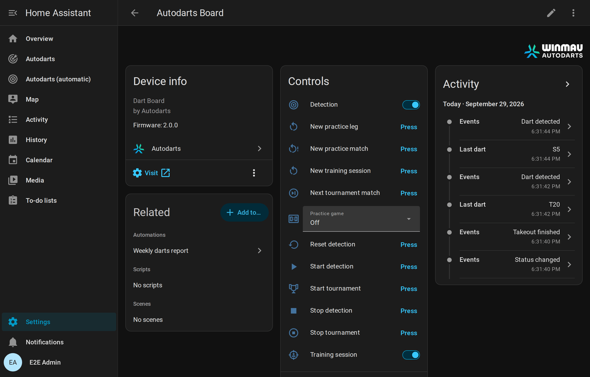

## Live visit

| Entity | Type | Description |
| --- | --- | --- |
| Detection status | Sensor (enum) | `offline`, `starting`, `stopping`, `stopped`, `throw` (ready), `takeout`, `takeout_in_progress`, `calibrating`, `error`. Unknown statuses of future Board Manager versions read as *unknown*. |
| Last dart | Sensor | Segment of the last dart, for example `T20`, `D16`, `S5`, `25`, `Bull`. |
| Last dart score | Sensor, points | Score of the last dart. |
| Darts in visit | Sensor, darts | Darts currently detected on the board (0–3). |
| Detected visit score | Sensor, points | Sum of the detected darts. The `throws` attribute lists each dart with `segment`, `number`, `multiplier`, `score`, `bed` and the normalized position `x`/`y`. Darts corrected or entered in Home Assistant and the darts of the [bot](#bot) belong to the visit, marked `corrected`, `manual` or `bot`; `dart` numbers the darts of the current visit (1–3), as [`autodarts.correct_dart`](#correct-a-dart-autodartscorrect_dart) counts them. The `recent_visits` attribute lists the last ten completed visits, newest first, with `time`, `score`, `darts`, `segments` and `manual` for a visit with darts entered or corrected by hand. The recorder stores neither attribute. |
| Last event | Sensor, *Diagnostic*, *Disabled* | The Board Manager's latest event text, such as `Throw detected` or `Takeout started`, in English as the board writes it; *Detection status* shows the same translated. It changes with every dart, so it starts disabled. |

The visit score is the plain sum of the darts, without game rules such as busts. The last dart, its score and the visit score follow corrections, darts entered by hand and the bot's darts; *Darts in visit* counts the darts the board itself sees.

## Board events

The **Events** entity (for example `event.autodarts_board_events` in a Home Assistant set to English, `event.autodarts_board_ereignisse` in German, or `event.autodarts_board_board_events` for a board set up with an earlier version) fires native Home Assistant events. Its `event_type` attribute tells what happened, and further attributes carry the details. Every event also has `source`: `websocket` for realtime events, `poll` when it was noticed during a reconciliation read, `training` for session events and the start of a tournament, `schedule` for the weekly report, `manual` for [corrections, darts entered by hand](#corrections-and-darts-entered-by-hand) and what follows from them, `bot` for the darts of the [bot](#bot), or `online` for the moments of [online matches](online-matches.md), which the optional online bridge receives from the browser extension Tools for Autodarts. The entity stays available while the board is away, so events of Home Assistant itself, such as `session_ended` or `personal_best`, always arrive.

| `event_type` | When | Attributes |
| --- | --- | --- |
| `dart_detected` | A new dart lands, is entered by hand or thrown by the bot | `dart_index` (1–3), `segment` (for example `T20`, `S5`, `Bull`, `25` or `M` for a miss), `score`, `game`, `name`; `manual` for a dart entered by hand, `bot` for a dart of the bot |
| `dart_corrected` | The board, or [`autodarts.correct_dart`](#correct-a-dart-autodartscorrect_dart), corrects a dart | `dart_index`, `segment`, `score`, `previous` (the segment before), `game`, `name`; `manual` when the dart was corrected in Home Assistant |
| `takeout_started` | You start pulling the darts | none |
| `takeout_finished` | The board is clear again | none |
| `visit_thrown` | The third dart of a visit lands, while the darts are still in the board; once per visit | `score`, `darts` (3), `segments` (for example `["T20", "T20", "S20"]`), `game`, `name`; `manual` when a dart of the visit was entered or corrected by hand, `bot` for a visit of the bot |
| `visit_completed` | A visit ends: on takeout, when new darts follow a missed takeout, when detection stops, or with [`autodarts.next_player`](#pass-the-turn-autodartsnext_player) | `score`, `darts`, `segments`, `game`, `name`, `thrown` (`true` when `visit_thrown` already announced the visit); `manual` and `bot` as with `visit_thrown` |
| `visit_undone` | [`autodarts.undo_visit`](#undo-a-visit-autodartsundo_visit) takes the last visit back | `score`, `darts`, `segments` (the darts that are the current visit again), `game`, `name` |
| `status_changed` | The detection status changes | `status` |
| `session_started` | A training session starts: with the *Training session* switch, the *New training session* button, or the first dart when *Start sessions automatically* is on | `started` and `reason` (`manual`, `new_session` or `first_dart`) |
| `session_ended` | A training session ends: with the switch, the button, or after the pause set in *Session idle timeout* | `reason` (`manual`, `new_session` or `idle`), `started`, `ended`, `duration_minutes`, `darts`, `points`, `average`, `visits`, `highest_visit` and the other training totals |
| `bust` | A dart of the [practice game](#practice-game) goes below zero, leaves 1 with double out, or reaches 0 without a double | `game`, `player`, `name`, `players`, `remaining` (the score at the start of the visit, which stays) |
| `leg_won` | A dart finishes the practice leg | `game`, `player`, `name`, `players`, `darts` and `average` of the leg, `checkout` (the score checked out), `start` (the score the leg started from), `double_out` and `double_in` (the rules of the leg), `legs` of the winner in the set including this leg and `sets` afterwards, `match` (`true` when the leg decides the match); in the [Cricket games](#cricket) `points` and `mpr` instead of `average`, `checkout`, `start` and the rules, in [party games](#party-games) `points`; in a [team match](#teams-and-start-scores) also `team` and `team_name`, and `darts`, `average` and `mpr` of the team |
| `match_won` | A dart decides a practice match of several players | `game`, `player`, `name`, `players`, `legs` (of the winner in the deciding set) and `sets`, `scores` with `player`, `name`, `legs` and `sets` of everybody, for example 3 : 2, and the `average` of the match; `mpr` in Cricket; in a team match also `team` and `team_name`, a `team` for everybody in `scores`, and the team's average; `summary` with every player's numbers of the [match summary](#practice-game), as they are once the deciding visit is booked |
| `turn_changed` | In a practice game, the darts were pulled and the next visit is up: the next player in a match, the same player when playing alone | `game`, `player`, `name`, `players`, `remaining`, `checkout` (the route for three darts, or none), `setup` (in X01 without a checkout, the [setup](#setup-hints) with `route` and `leave`, or none); in Cricket `points`, in [party games](#party-games) `points` and `target` of the next player; during a bull-off `bull_off`; in a team match `team` and `team_name` |
| `drill_finished` | A [training game](#training-games) ends: Around the Clock, the doubles training, Catch 40, the JDC Challenge or the singles training reach the end, or Bob's 27 ends | `drill`, `darts`, `hits`, `hit_rate` (percent); Bob's 27 adds `score` and `completed`; Catch 40 has `score`, `checkouts` and `darts`, the JDC Challenge `score`, `parts` (the points of its three parts) and `darts`, the singles training `score` as well |
| `checkout_attempt` | An attempt of the checkout training or the 121 checkout ends | `drill`, `target`, `success`, `darts`, `attempts`, `successes`, `rate` (percent); the 121 checkout adds `next`, the next target |
| `bull_off_won` | The [bull-off](#practice-game) decides who starts the match | `game`, `player`, `name`, `players`, `hit` (the bed of the winning dart: `BULL`, `25` or for example `S20`), `distance` (millimeters from the center, or none without a position from the board) |
| `tournament_started` | A [tournament](#tournaments) starts | `format` (`round_robin` or `knockout`), `game`, `matches` (the number of matches to play), `players` (in the order of the draw), `start_scores` (in the same order), `legs_to_win`, `sets_to_win`, `seed` (of a random draw, otherwise none) |
| `tournament_match_finished` | A match of the tournament counts: the darts of its winning visit are pulled | `format`, `game`, `matches`, `match` (its number in the order of play), `round`, `stage` (`round_1` to `round_7`, `quarter_final`, `semi_final`, `third_place` or `final`), `players`, `winner`, `loser`, `legs` and `sets` of both players, `next` (the players of the next match, none after the last one) |
| `tournament_finished` | The last match of the tournament counts | `format`, `game`, `matches`, `winner`, `runner_up`, `third` (none in a knockout without the match for third place), `players` |
| `personal_best` | A value beats your [personal best](#personal-bests-streak-and-daily-goal) | `record`, `value`, `previous`, `name` (the player, if known) |
| `daily_goal_reached` | Today's darts reach the [daily goal](#personal-bests-streak-and-daily-goal), once per day | `goal`, `darts`, `streak` |
| `weekly_report` | The [report week](#weekly-report) ends, by default on Monday at midnight | `week_start`, `week_end`, `darts`, `visits`, `sessions`, `training_minutes`, `average`, `average_change`, `highest_visit`, `scores_180`, `checkout_rate`, `darts_at_double`, `checkouts`, `legs`, `matches`, `streak`, `daily_goals`, `personal_bests` |
| `achievement_unlocked` | A named player reaches a new tier of an [achievement](#achievements) | `player` (the seat 1–4 of the player at the board, or none), `name`, `achievement` (for example `maximum`), `tier` (1–4), `tiers` (how many the achievement has) and `threshold` (the value of the tier, for example 10 for ten 180s) |
| `online_game_on` | [Online match](online-matches.md): a turn starts, or a moment without an effect of its own | `trigger`, `name` |
| `online_visit` | Online match: a visit | `trigger`, `score`; for three darts also `darts` and `segments`; for a range `score_min` and `score_max` instead of `score` |
| `online_dart` | Online match: a dart | `trigger`, `segment` (`T20`, `D16`, `S5`, `25`, `BULL` or `MISS`), `score` |
| `online_busted` | Online match: a bust | `trigger`, `name` |
| `online_game_shot` | Online match: a won leg | `trigger`, `segment` of the winning dart and `name`, if the trigger names them |
| `online_match_shot` | Online match: a won match | `trigger`, `segment`, `name` as with `online_game_shot` |
| `online_bull_off` | Online match: the bull-off begins | `trigger` |
| `online_tournament_ready` | A tournament match of yours is ready | `trigger` |
| `online_match_left` | You left the online match | `trigger` |

`game` is the [practice game](#practice-game) being played while the dart lands, such as `501`, `cricket` or `shanghai`, and empty without one and in [training games](#training-games). `name` is the name of the player at the board in that game, also during a bull-off; empty without a game or a name. A visit of three darts is announced twice: with `visit_thrown` the moment its third dart lands, for 180 celebrations and callers, and with `visit_completed` when it ends, with the final score after corrections. To react to every visit exactly once and as early as possible, use `visit_thrown` and `visit_completed` whose `thrown` is `false`; the [blueprints](automations.md#blueprints) do that.

Events of the [bot](#bot)'s seat carry `bot: true` and no `name`, from its darts to a leg or match it wins. Events are never replayed after a restart or reconnection. See [automations](automations.md) for examples.

## Training session

The integration counts your darts in training sessions, in Home Assistant and independent of Autodarts games. Sessions survive restarts.

- **Start and end:** the *Training session* switch starts a session from zero and ends it. *New training session* ends the running session and starts the next one.
- **Automatically:** with *Start sessions automatically* on, the first dart starts a session when none runs. *Session idle timeout* ends a session that many minutes after its last dart; `0` keeps it running.
- **Without a session,** darts and visits are still announced as [board events](#board-events), for example for a 180 celebration during an online game, but they are not counted.
- **By hand and the bot:** darts entered by hand count like detected ones, and a corrected dart counts as corrected; the bot's darts count for no session.
- **History:** a finished session keeps its totals until the next one starts. *Last session average* keeps the 3-dart average of every finished session with darts, so its history shows your progress.

The defaults, automatic start on and no pause limit, count every dart as version 1.0 did.

| Entity | Type | Description |
| --- | --- | --- |
| Training darts | Sensor, total | Darts in the session. The `hits` attribute counts the hits per bed, for example `{"T20": 12, "S20": 30, "BULL": 2, "MISS": 3}`; the heatmap uses it. The recorder does not store `hits`. |
| Training points | Sensor, total | Sum of all dart scores. |
| Training 3-dart average | Sensor | Points per three darts, the usual darts average. *Unknown* before the first dart. |
| Training visits | Sensor, total | Visits with at least one counted dart. |
| Training highest visit | Sensor | Highest visit score of the session. |
| Training 100+ visits | Sensor, total | Visits with 100–139 points. |
| Training 140+ visits | Sensor, total | Visits with 140–179 points. |
| Training 180s | Sensor, total | Visits with three triple 20s. |
| Training triples | Sensor, total | Darts in a triple bed. |
| Training doubles | Sensor, total | Darts in a double bed (bull excluded). |
| Training bull hits | Sensor, total | Darts in the bull or outer bull. |
| Training misses | Sensor, total | Darts outside the scoring area. |
| Training session start | Sensor, timestamp | When the session started. |
| Training session | Switch | On while a session runs. Turning it on starts a session from zero; turning it off ends it. |
| New training session | Button | Ends the running session and starts the next one. The board itself is not touched. |
| Start sessions automatically | Switch, *Configuration* | The first dart starts a session when none runs. On by default. |
| Session idle timeout | Number, *Configuration* | Minutes without darts, 0–240, after which a session ends by itself. `0`, the default, keeps it running. |
| Last session average | Sensor, points | 3-dart average of the last finished session. Attributes: `started`, `ended`, `duration_minutes`, the totals, `manual_darts` (darts entered by hand), and `sessions` with the last 20 sessions, which the recorder does not store. |

Totals use the state class *total*, with the start of the session as `last_reset`: Home Assistant's statistics sum them per session, and a correction or an undone visit may lower them. The 100+, 140+ and 180 visits count once a visit is complete, when its darts are pulled. [How the counting works](how-it-works.md#training-session).

## Personal bests, streak and daily goal

Home Assistant keeps your best values, the days you trained and your darts per day. Every detected dart counts for the day, in a session or not. The first value of each record sets it quietly; beating it fires `personal_best`, and equal values do not count. The records of a leg count when the leg is booked, as its darts are pulled, so a win that a correction takes back sets none.

| Record | Best value | From |
| --- | --- | --- |
| `highest_visit` | highest | a visit of up to three darts |
| `highest_checkout` | highest | a won X01 leg with double out |
| `fewest_darts_101` to `fewest_darts_1001` | fewest | a won X01 leg with double out that started from 101, 301, 501, 701, 901 or 1001, played alone, not as a team |
| `best_cricket_mpr` | highest | the marks per round of a won Cricket leg, played alone |
| `around_the_clock`, `doubles` | fewest | darts of a finished training game |
| `bobs_27` | highest | the score of a completed Bob's 27 |
| `checkout_121` | highest | the highest score checked out in the 121 checkout |
| `catch_40`, `jdc_challenge`, `singles` | highest | the score of a finished game of Catch 40, the JDC Challenge or the singles training |
| `best_session_average` | highest | a finished training session of at least 30 darts |

| Entity | Type | Description |
| --- | --- | --- |
| Last personal best | Sensor, timestamp | When the last personal best fell; *unknown* before the first. Attributes: `record`, `value`, `previous` and `name` of that best, and the best value of every record under its key, for example `highest_checkout`. |
| Darts today | Sensor, darts, total | Darts detected today; starts from 0 at midnight. Attributes: `goal`, `goal_reached`, `progress` (percent of the goal). |
| Training streak | Sensor, duration in days | Days in a row with at least one dart. It stays until a whole day passes without darts. Attributes: `best_streak`, `trained_today`, `last_day`. |
| Daily goal | Number, darts, *Configuration* | Darts to throw every day, 0–2000 in steps of 10; `0`, the default, sets no goal. When today's darts reach it, `daily_goal_reached` fires once. A higher goal set after that is reached anew, with the event again. |

## Weekly report

Home Assistant sums up your training week. Every detected dart counts, in a session or not, like the darts of the day. When the week ends, by default on Monday at midnight in Home Assistant's time zone, the event `weekly_report` announces the week, and the next week starts from zero. The [weekly report blueprint](automations.md#weekly-report-on-your-phone) sends it to your phone.

| Value | Meaning |
| --- | --- |
| `darts` | Darts detected in the week |
| `visits`, `average` | Completed visits and their 3-dart average |
| `average_change` | The average minus the average of the week before; `null` unless both weeks have one |
| `highest_visit`, `scores_180` | The highest visit of up to three darts, and the visits of three triple 20s |
| `sessions` | [Training sessions](#training-session) with darts that ended in the week |
| `training_minutes` | Time at the board: the time from dart to dart, without pauses of more than five minutes |
| `checkout_rate`, `darts_at_double`, `checkouts` | X01 practice legs: legs checked out per dart thrown at a double, like *Practice checkout rate* |
| `legs`, `matches` | Practice legs finished and practice matches of several players decided, as booked when the darts are pulled |
| `streak`, `daily_goals` | The training streak when the week ends, and the days that reached the daily goal |
| `personal_bests` | The personal bests of the week with `record`, `value` and `name`, the latest first, at most 10 |
| `week_start`, `week_end` | Start and end of the week, in UTC |

| Entity | Type | Description |
| --- | --- | --- |
| Weekly report | Sensor, darts, total | Darts of the running week; every week starts from 0, with its start as `last_reset`. Attributes: the values above for the week so far, `average_change` against the last report, and `last_week` with the last report. The recorder stores neither `last_week` nor `personal_bests`. |
| Weekly report day | Select, *Configuration* | The day that ends the week, `monday` to `sunday`; `monday` by default. |
| Weekly report time | Time, *Configuration* | The time of that day, to the minute; midnight by default. |

A new day or time ends the running week at its next occurrence. A report that fell due while Home Assistant was stopped follows at the next start; the weeks in between had no darts and are skipped. [How the week is counted](how-it-works.md#weekly-report).

## Training calendar

The **Training calendar** (`calendar.*_training_calendar`) shows your finished training sessions and practice matches in Home Assistant's calendar, for example *Training · 312 Darts · Ø 54.2* or *501 · Alex 3:2 Sam*. It is read-only. Its titles follow Home Assistant's language in German, Dutch, French and Spanish, with the decimal comma, for example *Training · 312 Darts · Ø 54,2*; other languages read as in English.

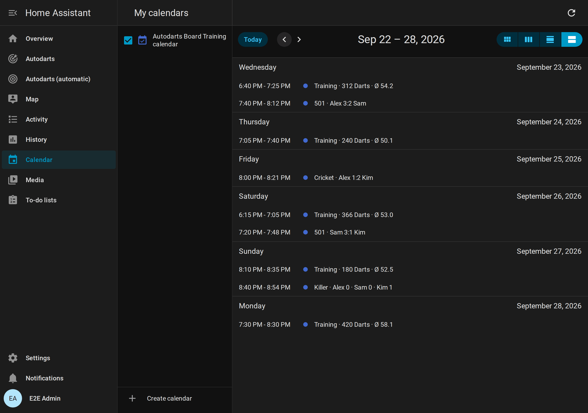

- **Sessions** run from their start to their end. The description lists the 180s, 140+ and 100+ visits and the highest visit (*Max*).
- **Matches** of several players, of every game, run from their first dart to the deciding dart. The title shows the sets won, or the legs when one set decides the match; players without a name appear as `#1` to `#4` and the bot as *Bot*, and a team match names both teams, for example *501 · Alex & Kim 1:0 Sam & Lea*. The description lists each player's average, marks per round or points. Matches played before version 1.6 have no first dart and appear as one minute.
- **A year of history.** The calendar keeps the sessions and matches of the last 365 days, at most 3,000 of each. After the update, it takes over the last 20 sessions and matches already stored.
- **State:** the calendar is *off*, because nothing lies ahead. Its attributes show the session or match that ended last.

Calendar triggers and the action `calendar.get_events` work as with any calendar, for example to count the sessions of a month in a template.

## Practice game

Play X01, [Cricket](#cricket) or a [party game](#party-games) on the local board without an Autodarts game. Home Assistant counts down, recognizes busts and shows the checkout route. The game needs no cloud and survives restarts. The [games guide](games.md) explains how to start a game and the rules of every game; this section is the reference of its entities.


- **Start:** choose 101, 301, 501, 701, 901 or 1001 in *Practice game*. Darts already on the board do not count. *New practice leg* starts the leg again from the full score.
- **Start scores and teams:** every player can start from a score of their own, and four players can play as two teams; see [Teams and start scores](#teams-and-start-scores).
- **Double in:** with *Practice double in*, a player's score starts with the first double or bullseye of the leg; darts before it score nothing, and a bust takes the opening back. The card asks for a double and outlines the double ring.
- **Bull-off:** with *Practice bull-off* and two or more players, a match starts with one dart per player at the bull. As in the official rules, the bullseye beats the outer bull, which beats every other bed; two darts in the same bull bed throw again, in reverse order. Outside the bull, and inside it with *Practice bull-off by distance*, the dart closest to the center wins, measured from the dart positions the board reports; a dart without a position never beats a measured one. [The bull-off rules](games.md#bull-off).
- **Visits:** a visit ends when you pull the darts. After a bust, the score of the visit start stays. Darts after a bust or after the winning dart do not count.
- **Checkout:** the route for the darts left in the visit, for example `T20 T20 BULL` for 170. [How the route is chosen](how-it-works.md#practice-game).
- **Matches:** set *Practice players* to 2, 3 or 4. After a visit, the next player throws; a bust passes the turn too. The first player to win *Practice legs per set* legs wins the set, and the first to win *Practice sets to win* sets wins the match. The first throw passes every leg within a set, and every set starts with the next player. The result, with the legs of the deciding set, stays on the card until the next dart, which starts a new match. With one player, legs count up; there are no sets and no match. [The match rules](games.md#matches-legs-and-sets).
- **Match summary:** a finished match of several players is summed up for every player: legs, sets and darts; in X01 the 3-dart and first-9 average, the checkout rate, the highest checkout, 100+, 140+ and 180 visits, the best leg and the darts at a double; in Cricket the marks per round and the marks. The [scoreboard](cards.md#match-summary) shows it after an X01 or Cricket match, `match_won` announces it, and *Practice remaining score* keeps it in `summary` until the next match ends. [How the numbers are counted](how-it-works.md#match-summary).
- **Sessions:** the practice game and [training sessions](#training-session) are independent. A dart counts in both.
- **Corrections and darts entered by hand:** a dart the board read wrong is corrected with an action or a tap on the scoreboard, missed darts are entered by hand, and the last visit can be taken back; see [Corrections and darts entered by hand](#corrections-and-darts-entered-by-hand).
- **Bot:** X01 and the Cricket games can be played against the computer at a level you choose; see [Bot](#bot).
- **Setup:** where the darts left cannot check out, the game suggests where to aim instead; see [Setup hints](#setup-hints).
- **More games:** *Practice game* also offers the [Cricket games](#cricket), six [party games](#party-games) and eight [training games](#training-games).

| Entity | Type | Description |
| --- | --- | --- |
| Practice game | Select | `off`, `101`, `301`, `501`, `701`, `901`, `1001`, a Cricket game (`cricket`, `cut_throat`, `tactics`, `wild_mouse`), a party game (`shanghai`, `halve_it`, `killer`, `golf`, `baseball`, `count_up`) or a training game: `around_the_clock`, `doubles`, `checkout`, `bobs_27`, `checkout_121`, `catch_40`, `jdc_challenge`, `singles`. Choosing starts a new match or game. |
| Practice remaining score | Sensor | Remaining score of the player at the board; *unknown* without a game. Attributes: `game`, `double_out`, `double_in`, `opened` (the player at the board has opened with double in, or plays without it), `player` and `name` of the player at the board, `checkout`, `bust`, `won`, `visit` (the segments of the current visit), `darts` and `average` of the leg, `players`, `legs_to_win`, `sets_to_win`, `winner` (the player who won the match, until the next dart), `start` (the start score of the player at the board), `teams` in a [team match](#teams-and-start-scores) (`team`, `name` and `players` of both teams, otherwise none), `scores` with `player`, `name`, `remaining`, `opened`, `start`, `legs` (in the current set, or the deciding set of a finished match), `sets`, `match_legs` (legs of the whole match), the match `average` and in a team match the `team` of every player, `bull_off` during a bull-off (the `player` at the board, `rethrow`, `by_distance` and `throws` with `player`, `name`, `hit` and `distance`), and `legs` with the last 10 legs (`game`, `player`, `name`, `darts`, `average`, `checkout`, `ended`), and `summary` with the last finished match of several players: `game`, `ended`, `winner`, `legs_to_win`, `sets_to_win`, `double_out` and `players` with `player`, `name`, `legs` (won in the whole match), `sets` and `darts` of everybody; X01 adds `average`, `first_9_average`, `checkouts`, `darts_at_double`, `checkout_rate`, `highest_checkout`, `scores_100`, `scores_140`, `scores_180` and `best_leg` (fewest darts of a won leg), Cricket `mpr`, `marks` and `best_leg`. `double_out` is the rule of the leg in progress. With the [bot](#bot), `bot` names its `player` and `level` (otherwise none), and its entries in `scores`, the bull-off's `throws` and the summary's `players` carry `bot: true`. `setup` holds the [setup hint](#setup-hints) where no checkout exists, and `undo` is `true` while [`autodarts.undo_visit`](#undo-a-visit-autodartsundo_visit) can take the last visit back. The recorder stores neither `visit`, `scores`, `legs` nor `summary`. |
| Practice checkout | Sensor | The checkout route, for example `T20 25 D18`; *unknown* when no route exists. |
| Practice target | Sensor | The target of the [training game](#training-games), for example `7`, `D16`, `BULL` or the checkout score `81`, or the next open number in [Cricket](#cricket), for example `T19`, in Wild Mouse also `D` or `T` for any double or triple; *unknown* without a target. Attributes: `drill`, `finished`, `visit`, `progress` and `targets`, `darts`, `hits`, `hit_rate`, the best result as `best`, and `results` with the last 10 results, which the recorder does not store. Bob's 27 adds `score`; the checkout training and the 121 checkout add `remaining`, `checkout`, `bust`, `won`, `attempt_visit`, `attempt_visits`, `attempts`, `successes` and `rate`; Catch 40 adds `score`, `checkouts` and the same values of the number being checked out; the JDC Challenge adds `part`, `score` and `parts`, the singles training `score`. |
| New practice leg | Button | Starts the leg again from the full score; legs and sets stay. After a finished match, it starts the next match. |
| New practice match | Button | Starts the match again from zero legs and sets. |
| Practice first 9 average | Sensor, points | 3-dart average of the first nine darts of each leg, over the last 10 legs of everybody at the board. |
| Practice checkout rate | Sensor, % | Legs won per dart thrown at a double, over the last 10 legs. A dart counts at a double when one double could finish the score: 2 to 40 when even, or 50. Only with double out. |
| Practice doubles rate | Sensor, % | The same darts at a double together with the last 10 results of the doubles training and Bob's 27. |
| Practice legs played | Sensor, total | Legs finished in X01, the Cricket games and the party games; its long-term statistics show the legs per day. An undone visit that won a leg takes the leg back. |
| Practice players | Number, *Configuration* | 1–4 players; with the [bot](#bot), 1–3 besides it. A change starts a new match. |
| Practice legs per set | Number, *Configuration* | 1–11 legs win a set. A change starts a new match. |
| Practice sets to win | Number, *Configuration* | 1–7 sets win the match. A change starts a new match. |
| Practice player *N* | Text, *Configuration* | Name of player 1–4, at most 20 characters, for the scoreboard and the events. Without a name, the card shows *Player N*. |
| Practice double out | Switch, *Configuration* | Finish on a double or the bullseye. On by default. Before the first dart of a leg a change applies at once; during a leg it applies from the next leg, so the leg in progress keeps its rules. |
| Practice double in | Switch, *Configuration* | Start scoring with a double or the bullseye. Off by default; a change starts a new match. |
| Practice bull-off | Switch, *Configuration* | A bull-off decides who starts a match of several players. Off by default; a change starts a new match. |
| Practice bull-off by distance | Switch, *Configuration* | Two darts in the same bull bed are decided by the distance the board measured instead of a rethrow. Off by default, as the official rules want; applies at once. |
| Practice teams | Switch, *Configuration* | Four players of X01 or a Cricket game play as two teams. Off by default; a change starts a new match. |
| Practice Wild Mouse three in a bed | Switch, *Configuration* | [Wild Mouse](games.md#wild-mouse) with 3 in a bed, as its rules have it. On by default; a change starts a game of Wild Mouse anew. |
| Practice start score player *N* | Number, *Configuration* | The X01 start score of player 1–4 for a handicap, 2–1001; `0`, the default, plays the game's start score. A change starts a new match. |
| Practice Golf holes | Select, *Configuration* | `9` or `18` holes of [Golf](#party-games); `9` by default. A change starts a game of Golf anew. |
| Practice Count-Up rounds | Number, *Configuration* | 1–20 rounds of [Count-Up](#party-games); `8` by default. A change starts a game of Count-Up anew. |
| Practice manual entry | Switch, *Configuration* | Darts can be [entered by hand](#corrections-and-darts-entered-by-hand), with [`autodarts.throw_dart`](#enter-a-dart-autodartsthrow_dart) or the scoreboard's keypad. Off by default. |
| Practice bot level | Number, *Configuration* | The 3-dart average the [bot](#bot) plays, 20–120; `0`, the default, plays without the bot. A change starts a new match. |
| Practice bot delay | Number, *Configuration* | Seconds before each of the bot's darts and before its visit ends, 0–10 in steps of 0.5; `2` by default. |

## Teams and start scores


- **Teams:** switch on *Practice teams* and set *Practice players* to 4. Players 1 and 3 play against players 2 and 4 in X01 and the [Cricket games](#cricket); they throw in seat order, so the teams alternate. Partners share one score: the remaining score in X01, the marks and points in Cricket. The scoreboard shows two team tiles, *Alex & Kim* against *Sam & Lea*, with the partner at the board in bold. Both partners win the leg and the match; the events add `team` and `team_name`.
- **Statistics:** the averages, the first nine and the checkout rate stay per person, and the [player profiles](#player-profiles) count the leg and the match for both partners. Head-to-head records count only between opponents. A team leg sets no fewest-darts and no marks-per-round personal best, neither in the records nor in the profiles or the weekly progress; its checkout counts for the partner who threw it.
- **Start scores:** for a handicap, set *Practice start score player N*, for example 301 for a beginner against 501. `0` plays the game's start score. The scoreboard shows every start score beside the names, and `leg_won` names it in `start`. A team plays from the start score of its first player. A leg counts for the fewest-darts record of the score it started from: from 301 for `fewest_darts_301`, from 401 for none.
- Party and training games are always played alone; with fewer or more than four players, *Practice teams* does nothing.

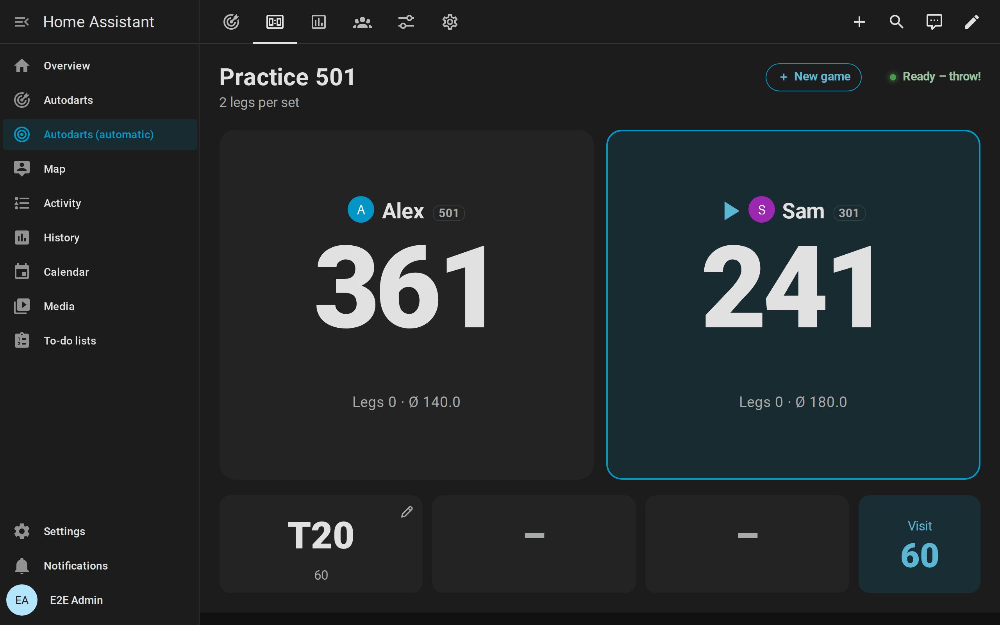

[The rules of teams and start scores](games.md#teams).

## Corrections and darts entered by hand


- **Correct a dart:** when the board reads a dart wrong, [`autodarts.correct_dart`](#correct-a-dart-autodartscorrect_dart) or a tap on the dart on the [scoreboard](cards.md#correcting-and-entering-darts) puts it into the right bed. The practice game and the training session count the corrected dart at once: the remaining score, a bust or a win, the marks and the statistics follow. The board keeps its own reading; the correction holds until the darts are pulled or until the board corrects the dart itself. `dart_corrected` announces it with `previous` and `manual`. A dart corrected into another bed has no position, because the board misread the spot as well, unless the correction says where it is: the *Board* view of the scoreboard's pad, or `x` and `y` of the action.
- **Enter a dart:** with *Practice manual entry* on, [`autodarts.throw_dart`](#enter-a-dart-autodartsthrow_dart) or the scoreboard's keypad adds a dart the board missed, or the darts of a player without cameras, as if the board had detected it, marked `manual`. The detection need not run: while it is stopped, the darts entered make the visit on their own.
- **Next player:** [`autodarts.next_player`](#pass-the-turn-autodartsnext_player) ends the visit without pulling the darts. The darts in the board belong to no visit until they are pulled, and new darts count for the next player. Without darts, the player at the board passes in X01 and the Cricket games.
- **Undo a visit:** when the darts were pulled before a wrong reading was noticed, [`autodarts.undo_visit`](#undo-a-visit-autodartsundo_visit) takes the last visit back: the game returns to where it was before it, also after a won leg, and the visit's darts leave the training totals and become the current visit again, to correct them and end the visit with *Next player*. The players' progress, the weekly report and the training calendar return with it, so the visit counts once when it ends again. Visits of the [bot](#bot) after it are taken back with it. `visit_undone` announces it.

[The rules of corrections and darts entered by hand](how-it-works.md#corrections-and-darts-entered-by-hand).

## Bot

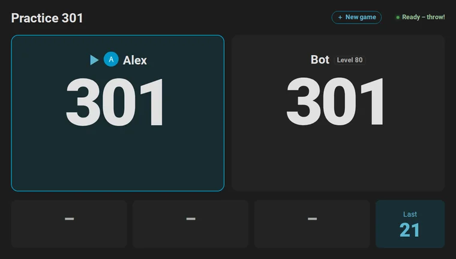

- **Play against the computer** in X01 and the Cricket games: set *Practice bot level* to the 3-dart average it plays, from 20 to 120, or start a game with `bot_level`, or seat it on the scoreboard's [new game screen](cards.md#new-game-screen). `0` plays without it.
- **Its seat:** the bot sits after the players, so one player plays against the bot with *Practice players* at 1; with the bot, up to three players play. Party games, training games and tournaments are played without it.
- **Its turn:** the bot throws *Practice bot delay* seconds after the darts of the player before were pulled, dart by dart, and ends its visit after the same pause. Its darts show on the cards like detected ones, with their positions, and fire the usual events with `bot: true`. If a player throws while the bot is still at the board, the bot throws the rest of its visit at once, and the new darts count for the player.
- **How it aims:** like a player, at the treble 20 to score, along the checkout route, and at the [setup](#setup-hints) where no route exists; in Cricket it closes the numbers and scores while behind. Its darts scatter around the aim point so that its average matches its level. [How the bot plays](how-it-works.md#bot).
- **Its darts count for nobody:** not for the training session, the statistics, the personal bests, the player profiles, the achievements, the weekly report or the correction rate, and they never start a training session. The result of a match against the bot counts in the players' profiles.

## Setup hints

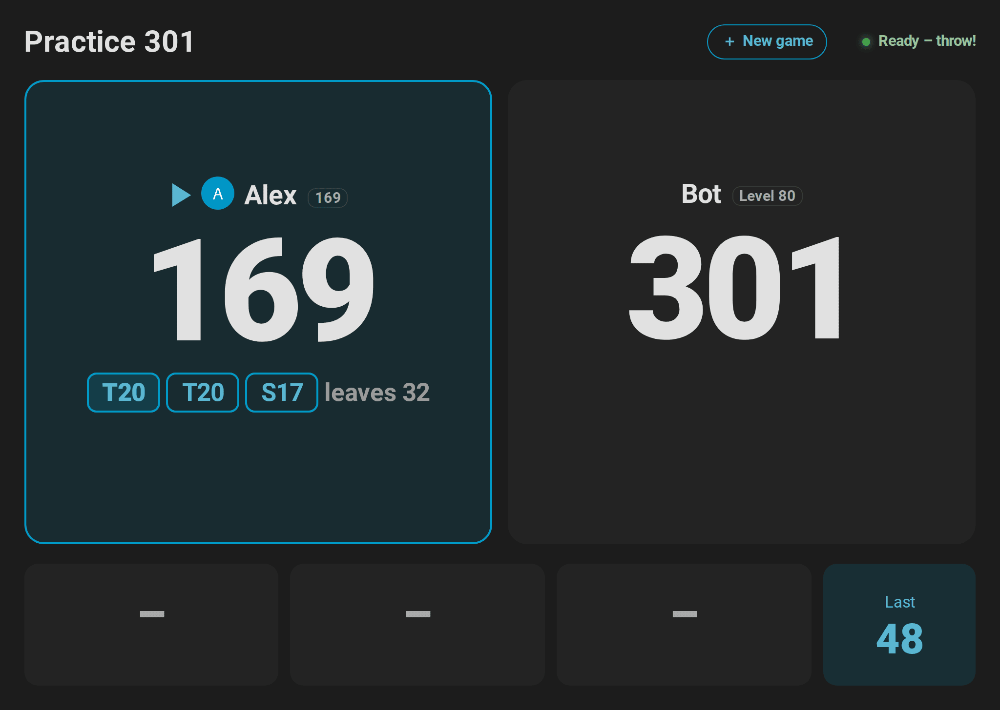

When the darts left in a visit cannot check out, at 169, above 170 or at 100 with one dart, *Practice remaining score* names a setup in `setup`: its darts in `route`, for example `T20 T20 S17`, and the score they leave for the next visit in `leave`, for example `32`. The [scoreboard](cards.md#scoreboard-card) and the [live card](cards.md#live-card) show it where the checkout would be and outline its first dart; `turn_changed` carries it, and the scoreboard's caller says *Leave yourself 32*. Above 170 with three darts, only a double is worth setting up; below, a finish of two darts as well. With *Practice personal checkout routes*, the player's strongest doubles come first. [How the setup is chosen](how-it-works.md#setup-hints).

## Cricket

Choose `cricket` in *Practice game*, alone or as a match of up to four players with legs and sets, like X01.

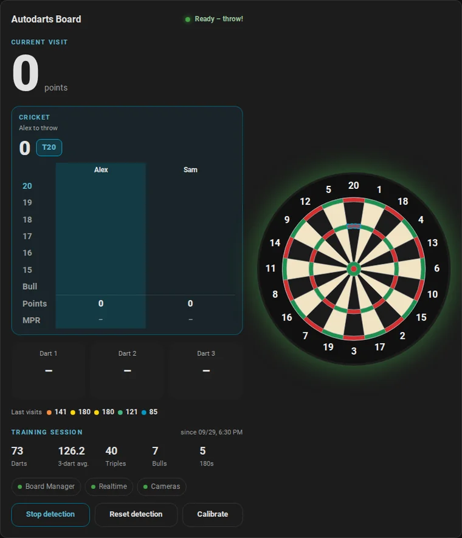

- **Marks:** only 20 to 15 and the bull count. A single is one mark, a double two, a triple three; the outer bull is one mark, the bullseye two. Three marks close a number.
- **Points:** marks on a closed number score its value (25 for the bull) as long as another player still has it open.
- **Win:** close every number with at least as many points as everybody else. Alone, closing every number wins the leg.
- **Target:** *Practice target* shows the next open number from 20 down to the bull, for example `T19` or `BULL`, and the card outlines it on the board.
- **Marks per round (MPR):** marks that counted per three darts, the usual Cricket statistic. Marks on a number nobody needs any more do not count.

Three variants play by the same marks:

| Game | Rules |
| --- | --- |
| **Cut-Throat Cricket** (`cut_throat`) | Marks on a closed number give its value to every other player who still has it open. Close every number with the fewest points to win. |
| **Tactics** (`tactics`) | Cricket on 20 to 10 and the bull, twelve numbers in all. |
| **Wild Mouse** (`wild_mouse`) | Cricket plus Doubles, Triples and 3 in a bed: a dart marks its number while it is open, otherwise doubles or triples; three darts in one bed close 3 in a bed at once. [Rules](games.md#wild-mouse) |

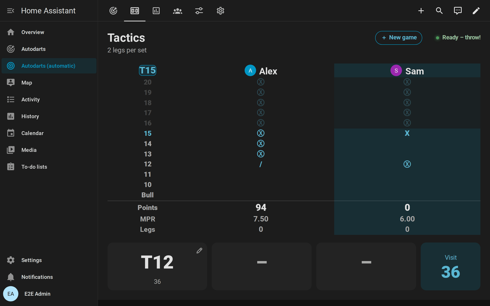

The card shows a chalkboard with the marks of every player (`/`, `X`, `Ⓧ`), the points and the MPR, and the numbers of the game. *Practice remaining score* stays *unknown* in the Cricket games; its attributes carry the game: `game` is `cricket`, `cut_throat`, `tactics` or `wild_mouse`, plus `points`, `mpr`, `target`, `numbers` (20 to 15 and 25, in Tactics 20 to 10 and 25) and `scores` with `marks`, `points`, `legs`, `sets` and `mpr` of every player. Wild Mouse adds `targets`, the targets after the numbers (`doubles`, `triples` and, with three in a bed, `bed`), whose marks follow those of the numbers in `marks`; `target_row`, the row of the target; `counted`, what every dart of the visit counted for (`20` to `15`, `25`, `doubles`, `triples` or `null`); and `bed`, whether the visit was a bed that counted. Cricket legs do not count for the X01 statistics; the MPR of the [player profiles](#player-profiles) and `best_cricket_mpr` come from Cricket only.

## Player profiles

Every named player of a practice game gets a profile with lifetime numbers. Names are the same player regardless of upper and lower case; players without a name count for nobody. Every leg of X01, the Cricket games and the party games counts; X01 legs add the averages and the checkout rate, Cricket legs the marks per round. In a [team match](#teams-and-start-scores), both partners win the leg and the match.

| Entity | Type | Description |
| --- | --- | --- |
| Player profiles | Sensor, players | The number of profiles. Attribute `players` with, for every player: `name`, `legs_played`, `legs_won`, `matches_played`, `matches_won`, `average`, `first_9_average`, `checkout_rate`, `mpr`, `highest_visit`, `highest_checkout`, `best_mpr`, `fewest_darts` (start score → fewest darts for a won leg), `last_played` and `person` (the [linked person](#link-a-player-to-a-person-autodartslink_player), or none), and the player's [progress](#player-progress): `darts_thrown`, `maximums`, `streak`, `best_streak`, `hits`, `spread` and `trend`. `highest_visit` is the highest X01 score of the player; `highest_checkout` and `fewest_darts` come from legs with double out only. The recorder does not store the list. |
| Last match | Sensor, timestamp | When the last match of several players ended. Attributes: `game` and `winner` of that match, `matches` with the last 20 matches (`ended`, `game`, `legs_to_win`, `sets_to_win`, `winner`, in a team match `winners` with both winners, and every player's `name`, `legs` and `sets` at the end, `match_legs` and `average`, `mpr` or `points`, and `team` in a team match), and `head_to_head` with the wins of every pair of named opponents. The recorder stores neither list. |

The [players card](cards.md#players-card) shows all of it. To remove a profile, for example after a typo in a name, use [`autodarts.delete_player`](#delete-a-player-profile-autodartsdelete_player).

**Players and persons:** link a player to a person of Home Assistant with [`autodarts.link_player`](#link-a-player-to-a-person-autodartslink_player). The scoreboard, the players card and the [new game screen](cards.md#new-game-screen) then show the person's picture, and the new game screen lists the players who are at home first. The link is saved with the profile and survives restarts.

### Player progress

Besides the lifetime numbers, every named player's entry in *Player profiles* carries their progress. It counts what the player throws in practice and training games; training games count for *Practice player 1*. [How progress is counted](how-it-works.md#player-progress).

| Attribute | Content |
| --- | --- |
| `darts_thrown` | Darts thrown in practice and training games |
| `maximums` | X01 visits that scored 180 |
| `streak`, `best_streak` | Days in a row with darts in a practice or training game, now and at best; `streak` stays until a whole day passes without darts |
| `hits` | Hits per bed, like the `hits` of *Training darts*, for the player's heatmap |
| `spread` | The [grouping](how-it-works.md#grouping) at up to six beds aimed at, most darts first: `target`, `darts`, `offset_x` and `offset_y` (millimeters from the center of the bed, right and up), `r50` and `r80` (radii holding 50 and 80 % of the darts) and `change` (the radius of the newer half of the darts minus the older half; negative is tighter) |
| `trend` | The last 12 weeks, oldest first: `weeks` with the Monday of each week, and one list per sum with a value for every week: `darts`, `x01_darts`, `x01_points`, `first9_points`, `first9_darts`, `at_double`, `checkouts`, `double_attempts`, `double_hits`, `cricket_darts`, `cricket_marks`, `legs`, `legs_won`, `maximums`, and the week's `highest_checkout`, `best_501` (fewest darts of a 501 leg) and `best_mpr`, which are empty without such a leg |

The sums let you compute any average over any weeks, for example the 3-dart average of the last four weeks as three times the sum of `x01_points` divided by the sum of `x01_darts`.

## Achievements

Named players unlock achievements, most of them in tiers: bronze, silver, gold and, for the streak, platinum. They come from what the player throws in practice and training games; a player without a name unlocks nothing. Each new tier fires [`achievement_unlocked`](#board-events), and the [players card](cards.md#players-card) shows the badges.

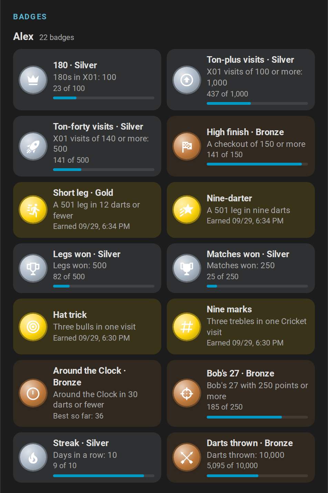

| Achievement | `achievement` | Tiers | Measured by |
| --- | --- | --- | --- |
| 180 | `maximum` | 1, 10, 100 | X01 visits that scored 180 |
| Ton-plus visits | `ton_plus` | 10, 100, 1000 | X01 visits that scored 100 or more; a bust scores nothing |
| Ton-forty visits | `ton_forty` | 10, 100, 500 | X01 visits that scored 140 or more |
| High finish | `high_finish` | 100, 150, 170 | The highest checkout of a won X01 leg with double out, or a finish of the checkout training in one visit |
| Short leg | `short_leg` | 18, 15, 12 darts | The fewest darts of a won 501 leg with double out |
| Nine-darter | `nine_darter` | 9 darts | The same, in nine darts |
| Legs won | `legs_won` | 1, 50, 500 | Legs won in X01, Cricket and the party games |
| Matches won | `matches_won` | 1, 25, 250 | Matches of several players won |
| Hat trick | `hat_trick` | 1 | Three darts in the outer bull or the bullseye in one visit of any game |
| Every double | `all_doubles` | 21 | Every double from D1 to D20 and the bullseye hit at least once |
| Nine marks | `cricket_nine` | 1 | A visit of three trebles on the numbers of Cricket or its variants: 15 to 20, in Tactics 10 to 20 |
| Shanghai | `shanghai` | 1 | Shanghai won with a single, double and treble of the round's number |
| Around the Clock | `around_the_clock` | 40, 30, 21 darts | The fewest darts of a finished Around the Clock; 21 is perfect |
| Bob's 27 | `bobs_27` | 100, 250, 500 points | The best completed Bob's 27 |
| Streak | `streak` | 3, 7, 10, 30 days | The longest run of days with darts in practice or training games |
| Darts thrown | `darts_thrown` | 1,000, 10,000, 100,000 | Darts thrown in practice and training games |

- **Quiet.** An achievement only fires the event. Nothing speaks, plays or flashes unless an automation does.
- **Earned before.** On the first start after the update, every achievement the player profiles already prove unlocks quietly, dated that day: legs and matches won, the highest checkout, the fewest darts of a 501 leg, the doubles hit and the darts of X01 and Cricket legs. Counts the profiles never kept, such as 180s, start from zero.
- **Several tiers at once**, such as a first 501 leg in 12 darts, fire one event with the highest tier.
- **Training games** count for *Practice player 1*.

| Entity | Type | Description |
| --- | --- | --- |
| Achievements | Sensor, badges | The tiers unlocked by all players together. Attributes: `latest` with `name`, `achievement`, `tier` and `date` of the last unlock; `catalogue` with the `id`, the `tiers` and `lower` (true when fewer is better) of every achievement; `players` with every player's `name`, `unlocked` (tiers), `badges` (achievement → `tier` and the `dates` its tiers were unlocked) and `progress` (achievement → the value that measures it). The recorder does not store the catalogue and the players. |
| Unlock achievements | Switch, *Configuration* | Unlock achievements and fire `achievement_unlocked`. On by default. While it is off, nothing unlocks and nothing is announced, but progress keeps counting; turned on again, what was reached meanwhile unlocks quietly. |

## Doubles analysis

Home Assistant counts every dart thrown at a double and whether it hit: in X01 when one double could finish the remaining score (2 to 40 when even, or 50 for the bullseye), in the doubles training at the current double, in Bob's 27 at the double of the round, and in the doubles part of the JDC Challenge at the double of each dart. It keeps the numbers for everybody and, in the [player profiles](#player-profiles), for every named player.

| Entity | Type | Description |
| --- | --- | --- |
| Favorite double | Sensor | The double with the best hit rate among those with at least 10 darts, for example `D16`; *unknown* before. Attributes: `attempts`, `hits`, `rate` (percent), `doubles` with `double`, `attempts`, `hits` and `rate` of every double thrown at, and `landed` with how often every double was hit by any dart, such as `{"D16": 12}`. The recorder stores neither. |
| Practice personal checkout routes | Switch, *Configuration* | Checkout routes prefer the strongest doubles of the player at the board (their profile, otherwise everybody's darts): a route with the same number of darts to a double with a better hit rate wins, without a double to set up; only doubles with at least 10 darts count. Off by default. |

The [doubles card](cards.md#doubles-card) draws the hit rate of every double on the board.

## Party games


Six pub classics for one to four players, chosen in *Practice game*. They follow the darts like X01, book a visit when you pull the darts, and win legs and sets like any match. The live card and the [scoreboard](cards.md#scoreboard-card) show the round, the target, every player's points or lives, and outline the beds to aim at; in Golf and Baseball, the scoreboard keeps a scorecard of every hole and inning.

| Game | Rules |
| --- | --- |
| **Shanghai** (`shanghai`) | Seven rounds at the numbers 1 to 7. Every dart in a bed of the round's number scores its value; a miss next to it does not. A single, double and triple of that number in one visit (a *Shanghai*) wins the leg at once; otherwise the most points after seven rounds win. |
| **Halve-It** (`halve_it`) | Everybody starts with 40 points. The rounds aim at 15, 16, any double (the bullseye included), 17, 18, any triple, 19, 20 and the bull (`25`: the outer bull scores 25, the bullseye 50); hits add their score. A visit without a hit on the target halves the points, rounded down. The most points after nine rounds win. |
| **Killer** (`killer`) | Two to four players. Each first throws one dart for a number of their own (any bed of a number nobody has yet; after a miss, the bull or a taken number, throw again). Then only doubles count: hitting the double of your own number makes you a killer for the rest of the leg. Killers take a life with every hit on another player's double, and lose one when they hit their own. Everybody has 3 lives; a player without lives is out, and the rest of their visit does nothing. The last one with a life left wins. |
| **Golf** (`golf`) | Nine or 18 holes (*Practice Golf holes*), hole *n* on the number *n*. The last dart of a visit counts, so pull your darts to stop after a good one: a double is 1 stroke, a triple 2, an inner single 3, an outer single 4, anything else 5. The fewest strokes win. |
| **Baseball** (`baseball`) | Nine innings, inning *n* on the number *n*. Every dart in a bed of the number scores runs: a single 1, a double 2, a triple 3. The most runs win. |
| **Count-Up** (`count_up`) | Every dart scores its value for 1 to 20 rounds (*Practice Count-Up rounds*, 8 by default). The most points win. |


In Shanghai and Halve-It, a tie in points goes to the player with more hits; if that is equal too, the leg is played again. In Golf, Baseball and Count-Up, a tie at the top plays extra rounds among the tied players until one of them leads after a round. Shanghai and Killer are won by a single dart; later darts of the visit do not count. [All rules](games.md#party-games). *Practice remaining score* stays *unknown*; its attributes carry `game`, `round`, `rounds`, `target` (`D` and `T` mean any double and any triple), `phase` (`choose` or `play` in Killer), `playoff` (the players of the extra rounds after a tie, otherwise none), `points` and `scores` with `points`, `legs`, `sets` and, in Killer, `number`, `lives` and `killer`, in Golf and Baseball the `scorecard` with the score of every round, of every player. *Practice target* shows the target, in Killer the own double until you are a killer. Party games do not count for the X01 statistics.

## Training games

Eight classic drills, chosen in *Practice game*. Each follows the darts of the current visit and books the visit when you pull the darts. Darts already on the board when a game starts do not count. A finished game stays on the card until the next dart starts it again; *New practice leg* starts it again at once. Every game keeps its last 10 results.

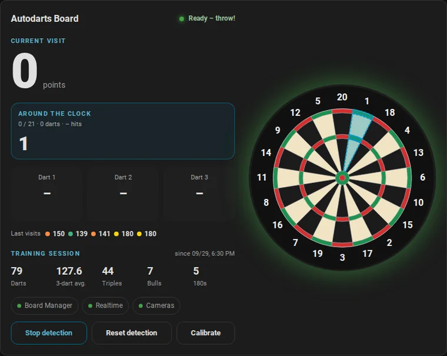

| Game | Goal |
| --- | --- |
| **Around the Clock** (`around_the_clock`) | Hit 1, 2, … 20 and then the bull, in order, with any bed of the number. The bull target is `25`: the outer bull and the bullseye both count. Fewer darts are better. |
| **Doubles training** (`doubles`) | The same with the doubles only: D1 to D20, then the bullseye (`BULL`). |
| **Checkout training** (`checkout`) | A random score from 2 to 170 that three darts can finish, checked out on a double within three visits. A bust voids only its visit, as in X01; the route shows only while the attempt goes on. The checkout rate counts successful attempts. |
| **Bob's 27** (`bobs_27`) | Start with 27 points and throw one visit at each double from D1 to D20 and then at the bullseye. Every hit adds the value of the double; a visit without a hit subtracts it. The game is lost as soon as the score reaches zero or less, and completed after the bullseye. |
| **121 checkout** (`checkout_121`) | Check out 121 within nine darts. A finish raises the target to the next score up to 170, a miss lowers it by one, never below 121; a bust voids only its visit. The highest score checked out is the personal best. |
| **Catch 40** (`catch_40`) | Check out 61 to 100 in turn, with two visits each: 3 points for a checkout in two darts (at 99 in three), 2 in three darts, 1 in four to six darts; a bust voids only its visit. At most 120 points. |
| **JDC Challenge** (`jdc_challenge`) | The 57-dart routine of the Junior Darts Corporation: Shanghai visits at 10 to 15, one dart at every double and the bullseye, Shanghai visits at 15 to 20. At most 3,380 points. |
| **Singles training** (`singles`) | One visit at each number from 1 to 20 and the bull; a single scores 1 point, a double 2, a triple 3. At most 186 points. |

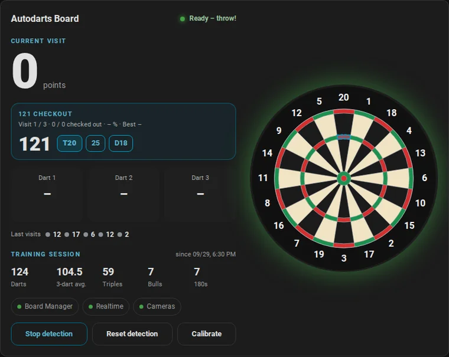

[All rules of the training games](games.md#training-games).

Training games are for one player; *Practice players* applies to X01, the Cricket games and the party games.

## Tournaments

A tournament for three to eight named players at one board: a **round robin**, in which everyone plays everyone once and a table ranks the players, or a **knockout**, in which the winners go on through a bracket until the final. Every match is a [practice match](#practice-game) between two players, with the legs, sets and rules of the tournament: X01, where every player can start from a score of their own as a handicap, or [Cricket](#cricket), Cut-Throat Cricket or Tactics. The results go into the [player profiles](#player-profiles), the match history and the head-to-head records like every match. [The rules and the tie-breakers](games.md#tournaments).

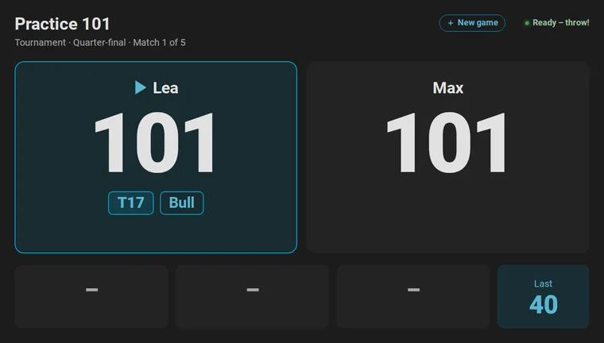

- **Start:** on the [new game screen](cards.md#tournaments) of the scoreboard, tap *Tournament* and choose the players, the format and the game; or set up the *Tournament* entities below and press *Start tournament*; or call the action [`autodarts.start_tournament`](#start-a-tournament-autodartsstart_tournament):

  ```yaml
  action: autodarts.start_tournament
  data:
    players: [Dennis, Lea, Max, Kim]
    format: knockout
    game: "501"
    legs: 2
    third_place: true
  ```

- **Matches:** the tournament sets the practice game up for every match: the game, the two players with their start scores, the legs and sets, double out, double in and the bull-off. The first named player throws first, unless a bull-off decides; the schedule gives every player the first throw about equally often.
- **Between matches:** the result counts when the darts of the winning visit are pulled. First the [summary](cards.md#match-summary) of the match shows for *Tournament summary duration*, 8 seconds by default; then *Tournament pause* begins, 10 seconds by default, in which the scoreboard shows the table or the bracket with the next match. So the next match starts 18 seconds after the end of the last one, but never while darts are on the board: then it starts as soon as they are pulled. With a pause of 0, it waits for *Next tournament match*. Darts thrown during the pause count for no match; the training session counts them as always.
- **Other games:** a game chosen during a tournament is played as usual and does not count for the tournament. After the pause, the next match waits until that game is decided or ended; *Next tournament match* starts it at once, and during a match of the tournament sets that match up again. *Stop tournament* ends the tournament; the match being played goes on as a practice match.
- **Restarts:** the tournament, its results and its pause survive a restart of Home Assistant. When the pause ended meanwhile, the next match starts right away.

| Entity | Type | Description |
| --- | --- | --- |
| Tournament | Sensor (enum) | The stage being played, or during a pause the next one: `no_tournament`, `round_1` to `round_7`, `quarter_final`, `semi_final`, `third_place`, `final` or `finished`. The attributes are below. |
| Tournament format | Select, *Configuration* | `round_robin` (the default) or `knockout`. |
| Tournament game | Select, *Configuration* | `101` to `1001`, `cricket`, `cut_throat`, `tactics` or `wild_mouse`; `501` by default. |
| Tournament players | Text, *Configuration* | Three to eight names, separated by commas, for example `Dennis, Lea, Max`. |
| Tournament pause | Number, seconds, *Configuration* | 0–600 seconds between two matches after the summary, 10 by default; 0 waits for *Next tournament match*. A change applies at once. |
| Tournament summary duration | Number, seconds, *Configuration* | 0–60 seconds the summary of a match shows before the pause begins, 8 by default. A change applies at once. |
| Tournament third-place match | Switch, *Configuration* | In a knockout of four players or more, the losers of the semi-finals play for third place. Off by default. |
| Tournament random draw | Switch, *Configuration* | Draws the order of the players at random instead of taking the order of the names. Off by default. |
| Start tournament | Button | Starts a tournament with these settings and the legs per set, sets to win and rules of the [practice game](#practice-game). |
| Next tournament match | Button | Starts the next match without waiting for the pause to end. |
| Stop tournament | Button | Ends the tournament. |

*Tournament* has the attributes `status` (`playing`, `waiting` or `finished`), `format`, `game`, `legs_to_win`, `sets_to_win`, `double_out`, `double_in`, `bull_off`, `bull_off_distance`, `third_place`, `seed`, `players` (in the order of the draw), `start_scores` (of the players in the same order; 0 plays the game's), `round` and `rounds`, `matches_played` and `matches_total`, `current` (the match at the board), `next` (the match after it), `last_result`, `pause`, `summary`, `next_at` (when the next match starts: the end of the last match, the summary and the pause), `winner`, `started`, `ended` and `fixtures` (every match in the order of play). A round robin adds `standings`, a knockout `bracket`: its rounds with their matches, byes included, and the match for third place.

- A **match** has `match` (its number in the order of play; none for a bye), `round`, `stage`, `players`, `winner`, `bye`, `legs` (of the whole match) and `sets` of both players, `ended` and, once played, the `average` (X01) or `mpr` (Cricket) of both players.
- A row of **standings** has `position`, `name`, `played`, `won`, `lost`, `legs_for`, `legs_against`, `leg_difference`, `points` and `average` or `mpr`.

The recorder stores neither `fixtures`, `standings`, `bracket`, `current`, `next` nor `last_result`. The [scoreboard](cards.md#tournaments) shows the round during a match and the table or the bracket between the matches.

## Controls

| Entity | Type | Description |
| --- | --- | --- |
| Detection | Switch | Starts or stops the dart detection. |
| Start detection, Stop detection | Buttons | The same actions as buttons, for scripts and dashboards. |
| Reset detection | Button | Discards the darts detected on the board. |
| Start automatic calibration | Button, *Configuration* | Calibrates all cameras. |
| Calibrate camera *N* | Button, *Configuration* | Calibrates one camera. |
| Restart Board Manager | Button, *Configuration* | Restarts the Board Manager service. |
| Start camera streams, Stop camera streams | Buttons, *Configuration*, *Disabled* | Controls the camera streams of the Board Manager. |
| Cloud link | Switch, **BM 1** | Connects or disconnects the board's own connection to Autodarts. |
| Connect cloud link, Disconnect cloud link | Buttons, **BM 1**, *Disabled* | The same as buttons. |

Every action is sent **once**. If the board rejects it or does not answer, Home Assistant shows an error message instead of retrying, so an action is never executed twice.

## Board settings

| Entity | Type | Description |
| --- | --- | --- |
| Calibrate on start | Switch, *Configuration* | Calibrates when the detection starts. |
| Automatic recalibration | Switch, *Configuration* | Lets the Board Manager recalibrate by itself. |
| Distortion correction | Switch, *Configuration* | Corrects lens distortion during calibration. |
| Camera standby | Select, *Configuration* | Puts the cameras on standby after 5, 10, 15, 30 or 60 idle minutes. |

A change is written to the Board Manager configuration; only the changed setting is sent.

## Health and connections

| Entity | Type | Description |
| --- | --- | --- |
| Local connection | Binary sensor, *Diagnostic* | Home Assistant reaches the Board Manager. One or two missed reads, a few seconds, keep it on. |
| Realtime connection | Binary sensor, *Diagnostic* | The connection for realtime events is open. Until events arrive over it, the integration reads every 2 seconds. |
| Cloud link | Binary sensor, **BM 2**, *Diagnostic* | The board's connection to Autodarts. |
| Cameras active | Binary sensor | The cameras are running. |
| Calibration in progress | Binary sensor | A calibration is running. |
| Camera problem | Binary sensor, *Diagnostic* | On when any camera delivers no frames for 15 seconds during active detection. Normal stops, calibration and standby are ignored. |
| Camera *N* problem | Binary sensor, *Diagnostic* | The same for one camera. |
| Detection frame rate | Sensor, fps, *Diagnostic*, *Disabled* | Frames per second of the detection. |
| Detection correction rate | Sensor, %, *Diagnostic* | Share of the last 100 detected darts that were corrected afterwards: by the board, on the scoreboard or with `autodarts.correct_dart`. From 20 % over at least 50 darts, a [repair](troubleshooting.md#repairs) suggests to recalibrate. Attributes: `darts`, `corrected`. |
| Camera *N* frame rate | Sensor, fps, *Diagnostic*, *Disabled* | Frames per second of one camera. |
| CPU usage | Sensor, %, **BM 2**, *Diagnostic*, *Disabled* | CPU load of the board PC. |
| Memory usage | Sensor, **BM 2**, *Diagnostic*, *Disabled* | Memory use as reported by Board Manager 2. |
| Operating system | Sensor, **BM 2**, *Diagnostic* | Distribution and version of the board PC, for example *Debian 13*. Attributes: `kernel`, `architecture`. |
| Processor | Sensor, **BM 2**, *Diagnostic* | Processor model of the board PC. Attribute: `cores`. |
| Detection software version | Sensor, **BM 2**, *Diagnostic* | Version of the Autodarts detection software. Attribute: `opencv_version`. |
| Software | Update, **BM 2** | Installed and latest Board Manager version. Install updates on the board PC. |
| Online bridge last event | Sensor, timestamp, *Diagnostic* | When the last moment of an [online match](online-matches.md) arrived; *unknown* before the first. Only while the online bridge is on. Attributes: `trigger`, `event_type`. |

Per-camera entities carry a `camera` attribute with the camera number, which the [status card](cards.md#board-status-card) uses.

## Motion

| Entity | Type | Description |
| --- | --- | --- |
| Hand detected | Binary sensor, *Diagnostic* | A hand is in front of the board. |
| Image stable | Binary sensor, *Diagnostic*, *Disabled* | The camera image is steady. |
| Darts partially removed | Binary sensor, *Diagnostic* | Some darts are removed. |
| Darts fully removed | Binary sensor, *Diagnostic*, *Disabled* | All darts are removed. |

These sensors are *off* while the detection is stopped, starting, stopping or calibrating. They change with nearly every dart and takeout, and each change is recorded. The live card shows a hand at the board and a takeout from the first and third, so these two are enabled; the other two start disabled. Boards set up with an earlier version keep all four enabled; disable those you do not need in the entity settings.

## Cameras

| Entity | Type | Description |
| --- | --- | --- |
| Camera *N* | Camera, *Disabled* | One board camera, for example in a picture card or the camera dialog. With **BM 2**, the live view relays the board's camera stream through Home Assistant; when the stream is not running, and with BM 1, it shows snapshots. To show a camera, the integration never starts or stops the detection or the streams. |

## Cloud match data (optional)

These entities exist only with a [linked Autodarts account](installation.md#link-the-autodarts-cloud-optional) and are read every 5 seconds during a match, otherwise once a minute.

| Entity | Type | Description |
| --- | --- | --- |
| Cloud status | Sensor (enum), *Diagnostic* | `connected` or `disconnected` in the Autodarts cloud. |
| Game mode | Sensor | Variant of the current match, such as `X01` or `Cricket`. |
| Match state | Sensor (enum) | `no_match`, `active` or `finished`. |
| Round | Sensor | Current round. |
| Visit score | Sensor, points | Score of the current visit in the match. |
| Darts thrown | Sensor, darts | Darts thrown in the match. |

Without a local board, *Last event*, *Last dart* and *Darts in visit* come from the cloud as well.

## Actions

Every logged-in user can play with the actions. `autodarts.delete_player`, `autodarts.link_player`, `autodarts.unlink_player` and `autodarts.export` change or write out the players' data and are for administrators: a user who is no administrator, such as the user of a wall tablet, gets an error. Automations run them, and so do scripts that an administrator or an automation starts.

### Start a practice game: `autodarts.start_game`

Sets up and starts a game in one call, for automations, scripts, dashboard buttons and voice control. Values you leave out stay as they are.

| Field | Values | Description |
| --- | --- | --- |
| `game` | `101`, `301`, `501`, `701`, `901`, `1001`, `cricket`, `cut_throat`, `tactics`, `wild_mouse`, `shanghai`, `halve_it`, `killer`, `golf`, `baseball`, `count_up`, `around_the_clock`, `doubles`, `checkout`, `bobs_27`, `checkout_121`, `catch_40`, `jdc_challenge`, `singles`, or a game's name | The game; required. A name as the game list shows it, in any language of the integration, works too, without regard to case, spaces and punctuation: `Around the Clock`, `Bobs 27`, `Doppeltraining`. The beginning of a name is enough where it fits one game alone, such as `Cut Throat` |
| `players` | 1–4 names | Players in throwing order; the number of names sets the number of players. A name a player's profile already has keeps the profile's spelling, so `alex` plays as Alex |
| `legs` | 1–11 | Legs that win a set |
| `sets` | 1–7 | Sets that win the match |
| `double_out` | `true`, `false` | Finish X01 legs on a double or the bullseye |
| `double_in` | `true`, `false` | Start X01 legs with a double or the bullseye |
| `bull_off` | `true`, `false` | A bull-off decides who starts a match of several players |
| `bull_off_distance` | `true`, `false` | Two darts in the same bull bed are decided by the measured distance instead of a rethrow |
| `teams` | `true`, `false` | Four players of X01 or a Cricket game play as two teams: players 1 and 3 against 2 and 4 |
| `three_in_a_bed` | `true`, `false` | Wild Mouse with 3 in a bed |
| `start_scores` | up to 4 numbers, `0` or 2–1001 | X01 start scores in throwing order, for a handicap: one per player, and one for the bot's seat after them. Teams play from the start scores of players 1 and 2, so give at most two. `0` or a missing score plays the game's start score. With double in and double out, a start score of 3 cannot be won and is refused. |
| `holes` | `9`, `18` | Holes of Golf |
| `rounds` | 1–20 | Rounds of Count-Up |
| `bot_level` | `0` or 20–120 | Play against the [bot](#bot) in X01 and the Cricket games, at this 3-dart average; `0` plays without it |
| `config_entry_id` | Autodarts entry | Only needed with more than one board |

```yaml
action: autodarts.start_game
data:
  game: "501"
  players: [Dennis, Lea]
  legs: 3
```

Against the bot at a 3-dart average of 60:

```yaml
action: autodarts.start_game
data:
  game: "501"
  players: [Dennis]
  bot_level: 60
```

A team match of four:

```yaml
action: autodarts.start_game
data:
  game: "501"
  players: [Alex, Sam, Kim, Lea]
  teams: true
```

A handicap, Mia starting from 301:

```yaml
action: autodarts.start_game
data:
  game: "501"
  players: [Dennis, Mia]
  start_scores: [501, 301]
```

The action fails with a clear message when no board is loaded, when several boards are set up and none is chosen, when the chosen entry is unknown, belongs to another integration or is not loaded, when a name appears twice among the players or contains curly brackets, a percent sign, a number sign or control characters, when Killer would have fewer than two players, when `teams` asks for teams without four players or in a game other than X01 and the Cricket games, when four players leave no seat for the bot, when a start score is not `0` or 2–1001, when there are more start scores than seats or, for teams, more than two, when a start score of 3 meets double in and double out, or when the bot level is 1–19 or above 120. Values beyond the limits above are rejected before anything changes.

**Response:** with `response_variable`, the action answers instead of failing, so a voice assistant can say what happened. `started` is `true` with the `game` as its key, the named `players`, `bot` and the `message` "Game on: 501 with Alex and Sam."; or `started` is `false` and `message` says what was wrong, in the language of Home Assistant. The blueprint [Start a game by voice](automations.md#start-a-game-by-voice) says the message.

```yaml
action: autodarts.start_game
data:
  game: Around the Clock
  players: [alex, sam]
response_variable: result
```

### Correct a dart: `autodarts.correct_dart`

Puts a dart of the current visit into another bed, for the practice game and the training session, as if the board had detected it there. The board keeps its own reading. Where the board misread the bed, it misread the spot too: the corrected dart leaves the board's position behind and stays out of the [dart positions](how-it-works.md#dart-positions), unless `x` and `y` say where it is. [Corrections](#corrections-and-darts-entered-by-hand).

| Field | Values | Description |
| --- | --- | --- |
| `dart` | 1–3 | The dart of the current visit; required |
| `segment` | `S1`–`S20`, `D1`–`D20`, `T1`–`T20`, `25` (outer bull, also `S25`, `SB` or `OB`), `BULL` (bullseye, also `D25`, `DB` or `50`), `MISS` | The bed, in any upper and lower case; required without `x` and `y` |
| `x`, `y` | -3 to 3 | Where the dart is, as the board reports positions: 0 is the center, 1 the outer edge of the double ring, and `y` points to the 20. The bed follows from the position; a `segment` given as well must be that bed |
| `config_entry_id` | Autodarts entry | Only needed with more than one board |

```yaml
action: autodarts.correct_dart
data:
  dart: 2
  segment: T20
```

With the spot where the dart is, the bed follows from it:

```yaml
action: autodarts.correct_dart
data:
  dart: 2
  x: 0.02
  y: 0.61
```

The action fails with a clear message, which names the accepted beds, when the bed is unknown, when neither a bed nor a position is given, when only `x` or `y` is given or a value lies outside -3 to 3, when the bed is not the bed at the position, and when the visit has no such dart or the dart is the bot's.

### Enter a dart: `autodarts.throw_dart`

Adds a dart to the current visit as if the board had detected it, marked `manual`: a dart the board missed, or the darts of a player without cameras. Needs *Practice manual entry*.

| Field | Values | Description |
| --- | --- | --- |
| `segment` | `S1`–`S20`, `D1`–`D20`, `T1`–`T20`, `25`, `BULL`, `MISS` and the other names of the bulls, as for `autodarts.correct_dart` | The bed; required without `x` and `y` |
| `x`, `y` | -3 to 3 | Where the dart is, as for `autodarts.correct_dart`; the bed follows from it, and the dart is logged in the [dart positions](how-it-works.md#dart-positions) |
| `config_entry_id` | Autodarts entry | Only needed with more than one board |

```yaml
action: autodarts.throw_dart
data:
  segment: D16
```

The action fails with a clear message when the bed is unknown, when neither a bed nor a whole position between -3 and 3 is given, when the bed is not the bed at the position, when manual entry is off, when the visit already has three darts, or while the bot is at the board.

### Pass the turn: `autodarts.next_player`

Ends the current visit without pulling the darts, so the next player throws; the darts in the board count for nobody until they are pulled. Without darts, the player at the board passes in X01 and the Cricket games; in other games, the action then fails with a clear message.

```yaml
action: autodarts.next_player
```

Takes `config_entry_id` when there is more than one board.

### Undo a visit: `autodarts.undo_visit`

Takes the last completed visit back: the game returns to where it was before it, and its darts become the current visit again, to correct them and end the visit with `autodarts.next_player`. Visits of the bot after it are taken back, too. One visit can be undone, while no dart is in the board and the game and the training session have not changed since; a restart forgets it. The action fails with a clear message otherwise; `undo` of *Practice remaining score* tells whether it can.

```yaml
action: autodarts.undo_visit
```

Takes `config_entry_id` when there is more than one board.

### Delete a player profile: `autodarts.delete_player`

Forgets a player's statistics, personal bests, head-to-head records, progress and badges, and the link to a person. The name also disappears from the board's [personal bests](#personal-bests-streak-and-daily-goal), whose values stay, and from the practice player names, so the next leg does not create the profile again. The match history keeps the name. For administrators.

| Field | Values | Description |
| --- | --- | --- |
| `name` | text | The player name, in any upper and lower case; required |
| `config_entry_id` | Autodarts entry | Only needed with more than one board |

The action fails with a clear message when there is no profile by that name, and while the player plays in the tournament being played: stop the tournament first. The player also leaves the players of the next tournament.

### Export training data: `autodarts.export`

Writes your training sessions, practice matches or player profiles to a file and returns where it is, for spreadsheets, backups or your own analysis. For administrators; automations can use it, too.

| Field | Values | Description |
| --- | --- | --- |
| `format` | `csv` (default), `json` | CSV for spreadsheets, in UTF-8 with a byte order mark; with `what: all`, a ZIP file with `sessions.csv`, `matches.csv` and `profiles.csv`. JSON is one file with a list per table. |
| `what` | `sessions`, `matches`, `profiles`, `all` (default) | The sessions and matches of the last 365 days (those of the [training calendar](#training-calendar)), the [player profiles](#player-profiles), or everything |
| `folder` | folder | A folder where Home Assistant allows writing: `www`, a media folder or a folder of [`allowlist_external_dirs`](https://www.home-assistant.io/integrations/homeassistant/#allowlist_external_dirs), relative to the configuration folder or as an absolute path. Without it, `autodarts/exports` in the media folder, `/media/autodarts/exports` on Home Assistant OS. Hidden folders such as `.storage`, control characters and folders that `..` or a symbolic link lead elsewhere are refused. |
| `config_entry_id` | Autodarts entry | Only needed with more than one board |

```yaml
action: autodarts.export
data:
  format: json
  what: matches
response_variable: export
```

The response has `path` (the file), `url` (its `/local/` address when the folder is inside `www`, otherwise `null`), `download` (an address below `/api/` from which administrators download the file until Home Assistant restarts), `format`, `what` and `rows` with the rows of every table. Every export is a new file, named like `autodarts-all-20260927-201500-<random>.zip`. Home Assistant serves `www` at `/local/` only if the folder existed when Home Assistant started: after the first export into a new `www` folder, `url` works after the next restart, `download` at once. At most 20 exports are written in an hour.

| Table | Columns |
| --- | --- |
| Sessions | `started`, `ended`, `duration_minutes`, `average`, `darts`, `points`, `visits`, `highest_visit`, `scores_100`, `scores_140`, `scores_180`, `triples`, `doubles`, `bulls`, `misses` |
| Matches | `started` (the first dart, if known), `ended`, `game`, `legs_to_win`, `sets_to_win`, `winner` (player number), `winner_name` and every player's `name`, `legs` (won in the deciding set), `sets`, `match_legs` (won in the whole match; empty for matches before version 1.6) and `average`, `mpr` or `points`; in CSV as `player_1_name` to `player_4_points` |
| Profiles | The values of *Player profiles*; in CSV every plain value is a column, and the fewest darts per start score are `fewest_darts_101` to `fewest_darts_1001` |

> **Privacy:** exports contain player names. The media folder, where they go by default, needs a login. Files in `www` are served at `/local/` **without a login** to anyone who can reach Home Assistant and knows the file name; the random part of the name keeps it from being guessed. Export to `www` only on purpose, and delete exports there that you no longer need.

The action fails with a clear message when the folder is not allowed, when 20 exports were written in the last hour, or when the file cannot be written.

### Link a player to a person: `autodarts.link_player`

Makes a player a person of Home Assistant. The [scoreboard](cards.md#scoreboard-card), the [players card](cards.md#players-card) and the [new game screen](cards.md#new-game-screen) show the person's picture, and the new game screen lists the players who are at home first. A player without a profile gets one. A person is one player: linking the person to another player moves the link. For administrators.

| Field | Values | Description |
| --- | --- | --- |
| `player` | text | The player name, in any upper and lower case; required |
| `person` | person entity | For example `person.dennis`; required |
| `config_entry_id` | Autodarts entry | Only needed with more than one board |

```yaml
action: autodarts.link_player
data:
  player: Dennis
  person: person.dennis
```

The action fails with a clear message when Home Assistant has no such person, or when the player name contains curly brackets, a percent sign, a number sign or control characters.

### Unlink a player: `autodarts.unlink_player`

Forgets which person a player is. The player's statistics stay. For administrators.

| Field | Values | Description |
| --- | --- | --- |
| `player` | text | The player name, in any upper and lower case; required |
| `config_entry_id` | Autodarts entry | Only needed with more than one board |

The action fails with a clear message when there is no profile by that name.

### Start a tournament: `autodarts.start_tournament`

Draws a [tournament](#tournaments) and starts its first match. Values you leave out come from the *Tournament* entities, and the legs, sets and rules from the [practice game](#practice-game); the values you give are kept in the *Tournament* entities for the next tournament.

| Field | Values | Description |
| --- | --- | --- |
| `players` | 3–8 names | The players, in the order of the draw |
| `format` | `round_robin`, `knockout` | Everyone against everyone, or a bracket up to the final |
| `start_scores` | 0 or 2–1001 per player | X01 start scores of the players in the order of `players`, for a handicap, at most one per player; 0 or a missing score plays the game's start score. With double in and double out, a start score of 3 cannot be won and is refused. |
| `game` | `101`, `301`, `501`, `701`, `901`, `1001`, `cricket`, `cut_throat`, `tactics`, `wild_mouse` | The game of every match |
| `legs` | 1–11 | Legs that win a set |
| `sets` | 1–7 | Sets that win a match |
| `double_out` | `true`, `false` | Finish X01 legs on a double or the bullseye |
| `double_in` | `true`, `false` | Start X01 legs with a double or the bullseye |
| `bull_off` | `true`, `false` | A bull-off decides who starts every match |
| `bull_off_distance` | `true`, `false` | Two darts in the same bull bed are decided by the measured distance instead of a rethrow |
| `third_place` | `true`, `false` | In a knockout of four players or more, the losers of the semi-finals play for third place |
| `random_draw` | `true`, `false` | Draw the order of the players at random |
| `seed` | 1–999999 | A number for a random draw: the same number draws the same order |
| `pause` | 0–600 | Seconds between two matches, after the summary; 0 waits for *Next tournament match* |
| `summary` | 0–60 | Seconds the summary of a match shows before the pause begins |
| `config_entry_id` | Autodarts entry | Only needed with more than one board |

```yaml
action: autodarts.start_tournament
data:
  players: [Dennis, Lea, Max, Kim, Sam]
  format: round_robin
  game: cricket
  legs: 3
  pause: 30
```

A tournament being played has to be stopped before the next one starts; a finished one is replaced. The action fails with a clear message while a tournament is being played, when fewer than three or more than eight players are named, when a name appears twice or contains curly brackets, a percent sign, a number sign or control characters, or when the start scores are wrong as above.

### Start the next tournament match: `autodarts.next_tournament_match`

Starts the next match of the tournament during the pause, or sets the tournament's match up again when another game was chosen meanwhile. It fails with a clear message while the match of the tournament is being played, and when no tournament is running.

```yaml
action: autodarts.next_tournament_match
```

### Stop a tournament: `autodarts.stop_tournament`

Ends the tournament; the match being played goes on as a practice match. It fails with a clear message when there is no tournament.

Both actions take `config_entry_id` when there is more than one board.

## Availability

- Local entities become *unavailable* when the Board Manager does not answer and recover on their own.
- Training entities stay available, because the session is stored in Home Assistant.
- If the configured address answers as a **different board**, the entities stay unavailable and Home Assistant shows a repair notice.
- When the board is updated from Board Manager 1 to 2, the integration reloads by itself and adds or removes the generation-specific entities.
