# Spiele und Regeln

[← Dokumentation](README.de.md) · [English](games.md)

Dein Autodarts-Board spielt Spiele direkt in Home Assistant: X01 von 101 bis 1001, vier Cricket-Spiele, sechs Partyspiele und acht Trainingsspiele, allein, als Match mit bis zu vier Spielern oder als Turnier mit bis zu acht. Home Assistant zählt jeden Dart, den das Board erkennt, erkennt Überwerfen, zeigt den Checkout-Weg und behält das Spiel über Neustarts hinweg. Du brauchst kein Autodarts-Konto, keine Cloud und keinen Browser-Tab.

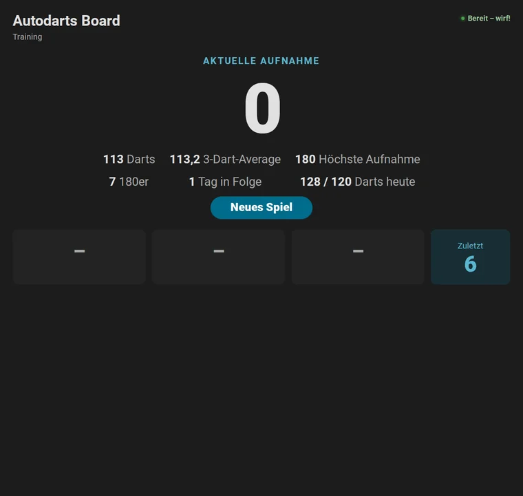

**Auf dieser Seite:** [Alle Spiele im Überblick](#alle-spiele-im-überblick) · [Ein Spiel starten](#ein-spiel-starten) · [Am Board](#am-board) · [Korrekturen und von Hand eingegebene Darts](#korrekturen-und-von-hand-eingegebene-darts) · [Matches, Legs und Sätze](#matches-legs-und-sätze) · [Match-Zusammenfassung](#match-zusammenfassung) · [Teams](#teams) · [Startpunkte (Handicap)](#startpunkte-handicap) · [Ausbullen](#ausbullen) · [Gegen den Bot spielen](#gegen-den-bot-spielen) · [Turniere](#turniere) · [X01](#x01) · [Cricket-Spiele](#cricket-spiele) · [Partyspiele](#partyspiele) · [Trainingsspiele](#trainingsspiele) · [Statistik](#statistik)

## Alle Spiele im Überblick

| Spiel | Spieler | Ziel |
| --- | :---: | --- |
| [**X01**](#x01): 101, 301, 501, 701, 901, 1001 | 1–4 oder zwei Teams zu zwei | Genau auf null herunterzählen, standardmäßig auf einem Double |
| [**Cricket**](#cricket) | 1–4 oder zwei Teams zu zwei | 20 bis 15 und das Bull schließen und auf Zahlen punkten, die die anderen noch offen haben |
| [**Cut-Throat Cricket**](#cut-throat-cricket) | 1–4 oder zwei Teams zu zwei | Alles schließen, mit den wenigsten Punkten: Deine Punkte bekommen die anderen |
| [**Tactics**](#tactics) | 1–4 oder zwei Teams zu zwei | Cricket auf 20 bis 10 und das Bull |
| [**Wild Mouse**](#wild-mouse) | 1–4 oder zwei Teams zu zwei | Cricket plus drei Doubles, drei Triples und drei Darts in einem Feld |
| [**Shanghai**](#shanghai) | 1–4 | Auf die Zahlen 1 bis 7 punkten; Single, Double und Triple in einer Aufnahme gewinnen sofort |
| [**Halve-It**](#halve-it) | 1–4 | Das Ziel der Runde treffen, sonst halbieren sich die Punkte |
| [**Killer**](#killer) | 2–4 | Die eigene Zahl erobern, Killer werden und den anderen die Leben nehmen |
| [**Golf**](#golf) | 1–4 | Neun oder 18 Löcher mit den wenigsten Schlägen |
| [**Baseball**](#baseball) | 1–4 | Die meisten Runs in neun Innings |
| [**Count-Up**](#count-up) | 1–4 | Die meisten Punkte in 1 bis 20 Runden |
| [**Around the Clock**](#around-the-clock) | 1 | 1 bis 20 und das Bull mit den wenigsten Darts |
| [**Doppeltraining**](#doppeltraining) | 1 | D1 bis D20 und das Bullseye mit den wenigsten Darts |
| [**Checkout-Training**](#checkout-training) | 1 | Zufällige Reste von 2 bis 170 in drei Aufnahmen checken |
| [**Bob's 27**](#bobs-27) | 1 | Eine Aufnahme auf jedes Double, ohne auf null zu fallen |
| [**121-Checkout**](#121-checkout) | 1 | 121 in neun Darts checken und aufsteigen |
| [**Catch 40**](#catch-40) | 1 | 61 bis 100 checken, je schneller, desto mehr Punkte |
| [**JDC Challenge**](#jdc-challenge) | 1 | Die 57-Dart-Routine der Junior Darts Corporation |
| [**Singles-Training**](#singles-training) | 1 | Eine Aufnahme auf jede Zahl, Punkte pro Treffer |
| [**Turnier**](#turniere) | 3–8 | Jeder gegen jeden oder K.-o.-System aus X01- oder Cricket-Matches, eines nach dem anderen |

## Ein Spiel starten

Es gibt vier Wege, ein Spiel zu starten. Alle enden am selben Ort: im *Übungsspiel* deines Boards, dem die [Live-Karte](cards.de.md#live-karte), die [Anzeigetafel](scoreboard.de.md) und die [Board-Ereignisse](entities.de.md#board-ereignisse) folgen.

1. **Am Bildschirm neben dem Board.** Tippe auf der [Anzeigetafel](scoreboard.de.md#das-nächste-spiel-wählen) auf **Neues Spiel**, wähle Spiel, Spieler und Format und tippe auf **Starten**. Einige Sekunden nach dem Ende eines Spiels öffnet sich die Auswahl auch von selbst, bereit für eine Revanche. **Turnier** in derselben Auswahl startet ein [Turnier](#turniere).
2. **Im Dashboard.** Die Ansicht *Live* des [automatischen Dashboards](cards.de.md#automatisches-dashboard) hat die Steuerung des Übungsspiels: *Übungsspiel*, die Spielerzahl, die Namen und Startpunkte, Legs, Sätze und die Regeln. Die Wahl eines Spiels startet es.
3. **In einer Automation oder einem Skript** mit der Aktion [`autodarts.start_game`](entities.de.md#übungsspiel-starten-autodartsstart_game), die alles in einem Aufruf einstellt:

   ```yaml
   action: autodarts.start_game
   data:
     game: "501"
     players: [Alex, Sam]
     legs: 3
   ```

4. **Per Sprache** mit Assist: „Starte Cricket für Alex und Sam“. Die [Anleitung zu Automationen](automations.de.md#spiel-per-sprache-starten) enthält die Automation.

Um ein Spiel zu beenden, wählst du *Aus* in *Übungsspiel* oder tippst in der Spielauswahl auf **Spiel beenden**. *Übungsspiel neues Leg* beginnt das Leg neu, und was dieses Leg zu den Averages und der Zusammenfassung des Matches beigetragen hat, zählt nicht mehr; *Übungsspiel neues Match* beginnt das Match bei null Legs und Sätzen.

Spielernamen dürfen keine geschweiften Klammern, kein Prozentzeichen, keine Raute (#) und keine Steuerzeichen enthalten, weil Home Assistant sie sonst als Template liest, wo ein Name in eine Nachricht oder einen Dateinamen kommt. Die Namens-Entitäten und die Aktionen lehnen solche Namen ab.

## Am Board

- **Eine Aufnahme endet, wenn du die Darts ziehst.** Das Übungsspiel verbucht sie mit der Entnahme. Darts, die beim Start eines Spiels schon im Board stecken, zählen nicht.
- **Drei Darts pro Aufnahme.** Ein vierter Dart vor der Entnahme zählt nicht. Darts, die das Board nicht erkennt, etwa Abpraller, gelten als nicht geworfen.
- **Korrekturen zählen.** Korrigierst du einen Dart in Autodarts oder auf der Anzeigetafel vor der Entnahme, folgt das Spiel der Korrektur; siehe [Korrekturen und von Hand eingegebene Darts](#korrekturen-und-von-hand-eingegebene-darts).
- **Der Wurf wechselt mit der Entnahme,** auch nach dem Überwerfen. Live-Karte und Anzeigetafel heben den Spieler am Board hervor.
- **Was die Karten zeigen:** Rest und Checkout-Weg, die Kreidetafel von Cricket, Runde und Ziel eines Partyspiels oder das Ziel eines Trainingsspiels. Die Scheibe umrandet das Feld, auf das du zielst. [Live-Karte](cards.de.md#live-karte), [Anzeigetafel](scoreboard.de.md).
- **Ereignisse für deine Automationen:** `bust`, `leg_won`, `match_won`, `turn_changed`, `bull_off_won`, `drill_finished`, `checkout_attempt`, `achievement_unlocked` und die Turnier-Ereignisse kommen in dem Moment, in dem sie passieren, für Caller und [Lichtshows](automations.de.md#light-show).
- **Trainingssessions zählen weiter.** Übungsspiel und [Trainingssession](statistics.de.md#trainingssessions) sind unabhängig; ein Dart zählt in beiden.

## Korrekturen und von Hand eingegebene Darts

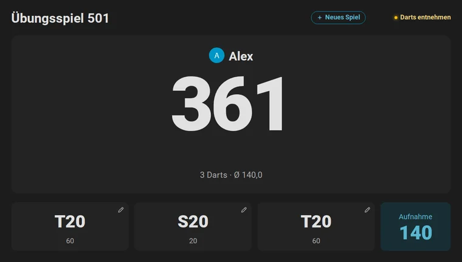

Ein falsch erkannter Dart, ein übersehener Dart oder die Aufnahmen eines Spielers ohne Kameras: Home Assistant bringt die Aufnahme in Ordnung, bevor sie zählt.

- **Dart korrigieren:** Tippe auf der [Anzeigetafel](scoreboard.de.md#darts-korrigieren-und-eingeben) auf den Dart und wähle das richtige Feld, oder nutze [`autodarts.correct_dart`](entities.de.md#dart-korrigieren-autodartscorrect_dart). Rest, Überwerfen oder Sieg, die Cricket-Marks und die Statistik folgen sofort. Das Board behält seine Erkennung; korrigiert es den Dart später selbst, zählt wieder seine Erkennung. Tippst du die Stelle auf der Scheibe des Tastenfelds an, zählt der Dart auch für die Dart-Positionen dort, wo er wirklich steckt.
- **Dart eingeben:** Mit eingeschalteter *Übungsspiel manuelle Eingabe* fügt das Tastenfeld der Anzeigetafel oder [`autodarts.throw_dart`](entities.de.md#dart-eingeben-autodartsthrow_dart) einen Dart hinzu, als hätte das Board ihn erkannt. Das geht auch bei gestoppter Erkennung, so spielt auch ein Spieler ohne Kameras mit.
- **Nächster Spieler:** beendet die Aufnahme, ohne die Darts zu ziehen; die Darts im Board zählen für niemanden, bis sie gezogen sind. Ohne Darts setzt der Spieler am Board bei X01, den Cricket- und den Partyspielen aus; in einem Partyspiel zählt das Aussetzen als Aufnahme aus drei Fehlwürfen, Halve-It halbiert also die Punkte und Golf zählt 5 Schläge. In Trainingsspielen, beim Ausbullen und bei Killer, solange die Zahlen gewählt werden, setzt niemand aus.
- **Letzte Aufnahme zurücknehmen:** Fällt eine falsche Erkennung erst nach der Entnahme auf, nimmt ein Tipp auf die letzte Aufnahme neben den Darts der Anzeigetafel oder [`autodarts.undo_visit`](entities.de.md#aufnahme-zurücknehmen-autodartsundo_visit) die Aufnahme zurück, auch nach einem gewonnenen Leg: Ihre Darts werden wieder die aktuelle Aufnahme, zum Korrigieren, und *Nächster Spieler* beendet sie. Das geht, solange kein Dart im Board steckt und sich das Spiel seitdem nicht geändert hat, aber nicht nach einer Aufnahme, die ein Turniermatch entschieden hat. Statistik, Fortschritt der Spieler mit ihren Erfolgen, Wochenbericht und Trainingskalender gehen mit der Aufnahme zurück, sodass sie nur einmal zählt, wenn sie erneut verbucht wird.
- **Markiert:** In Home Assistant eingegebene oder korrigierte Darts tragen `manual`, damit Automationen sie unterscheiden können. [Die genauen Regeln](how-it-works.de.md#korrekturen-und-von-hand-eingegebene-darts).

## Matches, Legs und Sätze

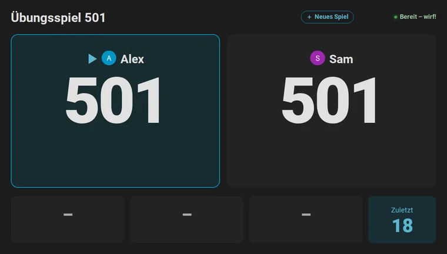

- **Spieler:** Stelle *Übungsspiel Spielerzahl* auf 2, 3 oder 4 oder wähle die Spieler in der Spielauswahl. Nach jeder Aufnahme wirft der nächste Spieler; auch nach dem Überwerfen ist der Nächste dran.
- **Legs und Sätze:** Wer zuerst *Übungsspiel Legs pro Satz* Legs gewinnt, holt den Satz; es gibt keinen Tie-Break und keine zwei Legs Vorsprung. Wer zuerst *Übungsspiel Sätze zum Sieg* Sätze holt, gewinnt das Match. Mit einem Satz zum Sieg gewinnt einfach, wer zuerst so viele Legs holt. Mit einem Spieler zählen die Legs nur hoch.
- **Anwurf:** Wie bei den Sätzen der PDC wechselt der Anwurf innerhalb eines Satzes jedes Leg zum nächsten Spieler, und jeder neue Satz beginnt mit dem Spieler nach dem, der den vorigen Satz begonnen hat. Bei zwei Spielern beginnt Spieler 1 die Sätze 1, 3 und 5 und Spieler 2 die Sätze 2 und 4. Das erste Leg eines Matches beginnt Spieler 1 oder wer das [Ausbullen](#ausbullen) gewinnt.
- **Ergebnis:** Das Ergebnis bleibt auf den Karten stehen, bis der nächste Dart ein neues Match beginnt. Der Sieger behält die Legs des entscheidenden Satzes, ein Match auf drei gewonnene Legs endet also 3:2 auf der Anzeigetafel. `match_won`, der Match-Verlauf und die [Spielerprofile](statistics.de.md#spielerprofile) behalten Legs und Sätze aller Spieler; `match_legs` zählt die Legs des ganzen Matches.
- **Averages:** Average und Marks pro Runde jedes Spielers gelten für das ganze Match.

## Match-Zusammenfassung

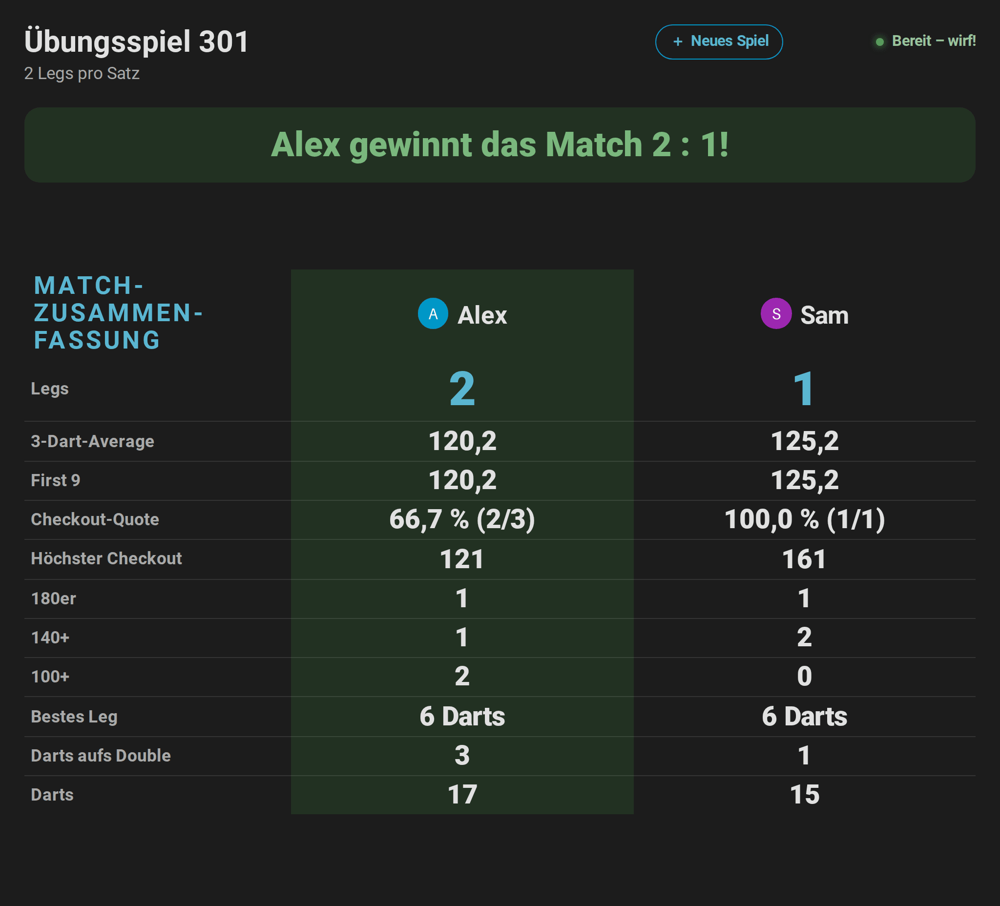

Endet ein X01- oder Cricket-Match mehrerer Spieler, fassen Anzeigetafel und Live-Karte es zusammen: eine Spalte pro Spieler, die des Siegers hervorgehoben, mit dem Ergebnis in der ersten Zeile. Auch das Banner des Siegers nennt das Ergebnis, etwa *Alex gewinnt das Match 3 : 2!*

- **X01:** Legs und Sätze, 3-Dart- und First-9-Average, die Checkout-Quote mit den ausgecheckten Legs und den Darts aufs Double, der höchste Checkout, 180er, Aufnahmen mit 140+ und 100+, das beste Leg in Darts und alle Darts. Ohne Double-Out fehlen Checkout-Quote und Darts aufs Double.
- **Cricket:** Legs und Sätze, Marks pro Runde, Marks, das beste Leg in Darts und alle Darts.
- **Partyspiele** behalten ihre Punkte auf dem Bildschirm.
- **Wie lange:** bis zum ersten Dart des nächsten Spiels oder für `summary_seconds` der [Karte](cards.de.md#match-zusammenfassung). `match_won` liefert die Zahlen für deine Automationen, etwa um [sie aufs Handy zu schicken](automations.de.md#die-zusammenfassung-eines-matches-senden). [So werden sie gezählt](how-it-works.de.md#match-zusammenfassung).

## Teams

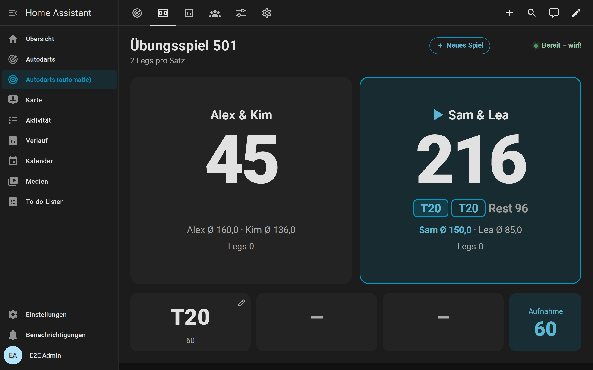

- **Zwei Teams zu zwei:** Schalte *Übungsspiel Teams* ein (in der Spielauswahl: *Teams*) und spiele X01 oder ein Cricket-Spiel zu viert. Spieler 1 und 3 spielen gegen Spieler 2 und 4. Geworfen wird in der Reihenfolge der Plätze, die Teams wechseln sich also ab: A1, B1, A2, B2. Mit weniger oder mehr als vier Spielern und in Party- und Trainingsspielen spielt jeder für sich.
- **Ein Stand pro Team:** Partner teilen sich den Rest, mit Double-In das öffnende Double und in den Cricket-Spielen Marks und Punkte. Ein Team spielt mit den Startpunkten seines ersten Spielers.
- **Der Anwurf** wechselt jedes Leg zum nächsten Platz, wie in jedem Match zu viert, die Teams wechseln sich also ab.
- **Sieg:** Beide Partner gewinnen das Leg und das Match. Die Anzeigetafel nennt das siegreiche Team, und `leg_won` und `match_won` nennen zusätzlich `team` und `team_name`, etwa *Alex & Kim*. Ein Team, bei dem nicht beide Spieler einen Namen haben, und ein Team mit dem Bot haben keinen `team_name`.
- **Statistik pro Person:** First 9, Checkout-Quote, Averages und Marks pro Runde bleiben bei dem Spieler, der die Darts geworfen hat. Die Spielerprofile zählen Leg und Match für beide Partner, und jeder von ihnen schlägt im direkten Vergleich beide Gegner; Partner haben keinen direkten Vergleich. Ein Team-Leg setzt keine Bestleistung für die wenigsten Darts und für Marks pro Runde; ein Checkout zählt weiter für den Spieler, der ihn geworfen hat.

## Startpunkte (Handicap)

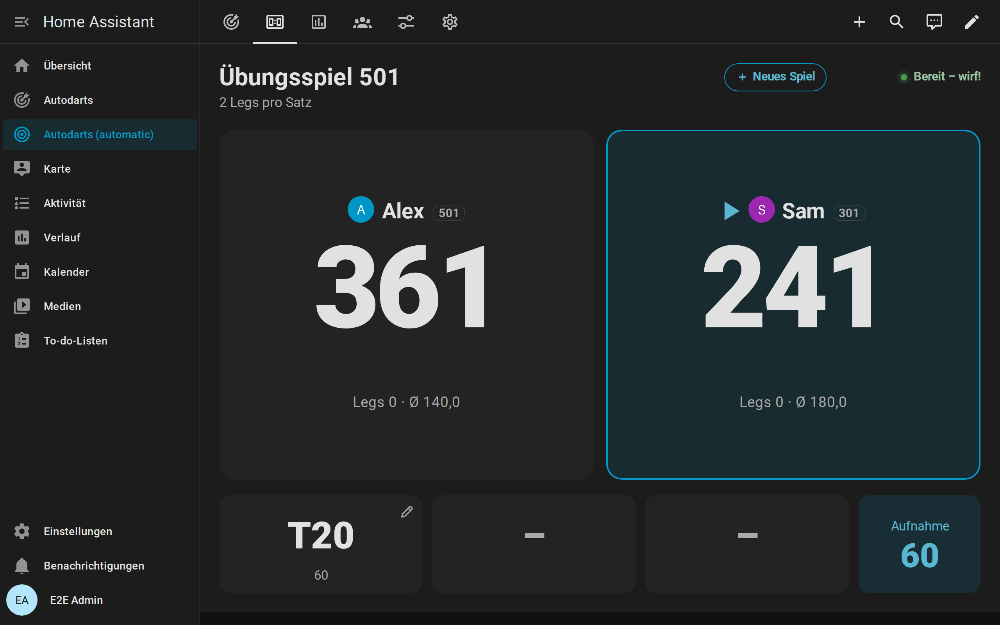

- Für ein faires Match zwischen unterschiedlich starken Spielern kann jeder X01 mit eigenen Startpunkten beginnen, von 2 bis 1001: Stelle *Übungsspiel Startpunkte Spieler N* ein, nutze − und + neben dem Spieler in der Spielauswahl oder gib `start_scores` an [`autodarts.start_game`](entities.de.md#übungsspiel-starten-autodartsstart_game).
- `0` spielt die Startpunkte des Spiels. Alle anderen Regeln bleiben gleich; der Average zählt ab den eigenen Startpunkten, und `leg_won` nennt sie in `start`.
- Anzeigetafel und Live-Karte zeigen eigene Startpunkte neben dem Namen.
- Ein Leg zählt für die Bestleistung der wenigsten Darts der Punkte, mit denen es wirklich begann: ein Leg ab 301 für `fewest_darts_301`, ein Leg ab 401 für keine, weil 401 kein X01-Spiel ist.

## Ausbullen

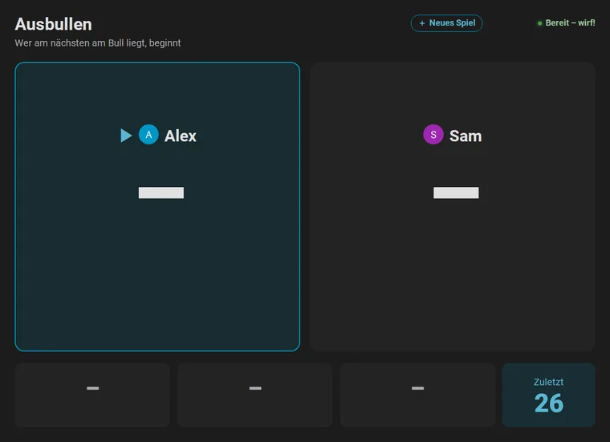

- Mit *Übungsspiel Ausbullen* (in der Spielauswahl: *Ausbullen*) und zwei oder mehr Spielern beginnt ein Match mit einem Dart pro Spieler aufs Bull, in der Reihenfolge der Plätze. Nur der erste Dart jeder Aufnahme zählt. Die Anzeigetafel zeigt das Feld jedes Darts und seinen Abstand zur Mitte, hebt den führenden Dart hervor und meldet *Gleichstand – noch einmal werfen*, wenn ein Gleichstand neu wirft.
- Wie es die Regeln von WDF und PDC wollen, schlägt das Bullseye das Single-Bull und dieses jedes andere Feld. Zwei oder mehr Darts im selben Bull-Feld sind gleichauf: Diese Spieler werfen noch einmal, der letzte von ihnen zuerst.
- Außerhalb des Bulls gewinnt der Dart, der der Mitte näher ist. Der Abstand ergibt sich aus der Position, die das Board meldet, bezogen auf den äußeren Rand des Doppelrings (170 mm). Jedes Feld der Scheibe schlägt einen Dart neben der Scheibe; verfehlen alle Darts die Scheibe, werfen alle noch einmal.
- Mit *Übungsspiel Ausbullen nach Abstand* entscheidet der gemessene Abstand auch zwischen zwei Darts im selben Bull-Feld; Darts mit gleichem Abstand auf 0,1 mm werfen noch einmal.
- Ein Dart ohne Position, etwa ein von Hand eingegebener, lässt sich nicht messen. Außerhalb des Bulls schlägt ihn ein gemessener Dart, und zwei Darts ohne Position werfen noch einmal. Im selben Bull-Feld ist ein Dart ohne Position gleichauf, auch nach Abstand, und diese Spieler werfen noch einmal.
- Der Dart aufs Bull zählt im Spiel nichts: Rest, Marks und Averages beginnen mit der ersten Aufnahme des Matches.
- Das Ausbullen entscheidet nur, wer beginnt. Bei drei oder vier Spielern folgen die anderen in der Reihenfolge der Plätze. `bull_off_won` meldet den Gewinner, etwa für den [Übungs-Caller](automations.de.md#practice-caller).

## Gegen den Bot spielen

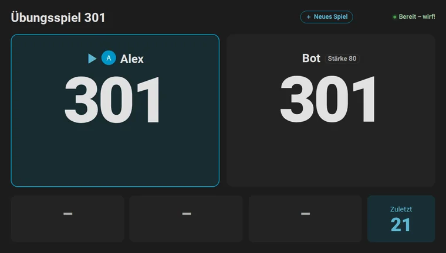

Niemand zum Mitspielen? X01 und die Cricket-Spiele lassen sich gegen den Bot spielen, einen Computerspieler in der Stärke deiner Wahl.

- **Den Bot dazusetzen:** Tippe in der [Spielauswahl](scoreboard.de.md#das-nächste-spiel-wählen) auf **+ Bot**, stell *Übungsspiel Bot-Stärke* ein oder starte ein Spiel mit `bot_level`. Die Stärke ist der 3-Dart-Average, den der Bot spielt, von 20 für Anfänger bis 120, mehr als der Saison-Average jedes Profis. `0` spielt ohne Bot. Stärken von 1 bis 19 gibt es nicht: In *Übungsspiel Bot-Stärke* setzt ein Schritt nach oben von 0 den Bot auf 20, ein Schritt nach unten von 20 schickt ihn nach Hause.
- **In den Cricket-Spielen** spielt die Stärke die Marks pro Runde eines Spielers mit diesem Average, etwa ein Vierundzwanzigstel davon: 2,5 bei Stärke 60, 3,3 bei 80, 4,2 bei 100 und 5 bei 120.
- **Sein Platz:** nach den Spielern. Mit dem Bot spielen bis zu drei Spieler, auch als vierter Spieler von zwei Teams; ein solches Team hat keinen Teamnamen. Wählst du X01 oder ein Cricket-Spiel für vier Spieler, während eine Bot-Stärke eingestellt ist, bittet dich die Meldung, erst Platz zu machen.
- **Die Stärke ändern:** Während eines Matches spielt der Bot die neue Stärke ab seinem nächsten Dart. Den Bot dazuzusetzen oder mit `0` nach Hause zu schicken, beginnt ein neues Match; in Party- und Trainingsspielen, in denen er nicht mitspielt, ändert eine neue Stärke bis zum nächsten X01- oder Cricket-Spiel nichts.
- **Sein Zug:** Sind deine Darts gezogen, wirft der Bot seine drei Darts nacheinander, jeweils nach der Pause von *Übungsspiel Bot-Pause* (2 Sekunden), und sie erscheinen auf den Karten dort, wo sie gelandet sind. Wirfst du, während er am Board ist, wirft er den Rest seiner Aufnahme sofort.
- **Wie er spielt:** wie ein Spieler: auf die Triple 20 zum Punkten, entlang des Checkout-Wegs zum Checken und auf einen [Stellwurf](#x01), wo es keinen Weg gibt; bei Cricket schließt er die Zahlen und punktet, solange er zurückliegt. Mit Double-In eröffnet er mit einem Double, das gewinnt oder für seine Darts einen checkbaren Rest lässt, sonst mit der Double 20 oder, wo die Double 20 überwerfen würde, mit einem kleineren Double. Ohne Double-Out und ohne Checkout nimmt er das größte Feld, das nicht überwirft. Er zielt immer auf die üblichen Checkout-Wege, auch mit *Übungsspiel persönliche Checkout-Wege*, und die Karten zeigen diese Wege in seinem Zug. Seine Darts streuen so stark wie die eines Spielers seiner Stärke. [Wie der Bot spielt](how-it-works.de.md#bot).
- **Was zählt:** Die Darts des Bots zählen für niemandes Statistik, Bestleistungen oder Erfolge; das Ergebnis des Matches zählt in deinem Spielerprofil. Partyspiele, Trainingsspiele und Turniere laufen ohne Bot; nach einem Turnier kommt der Bot mit den übrigen Einstellungen des Übungsspiels zurück.

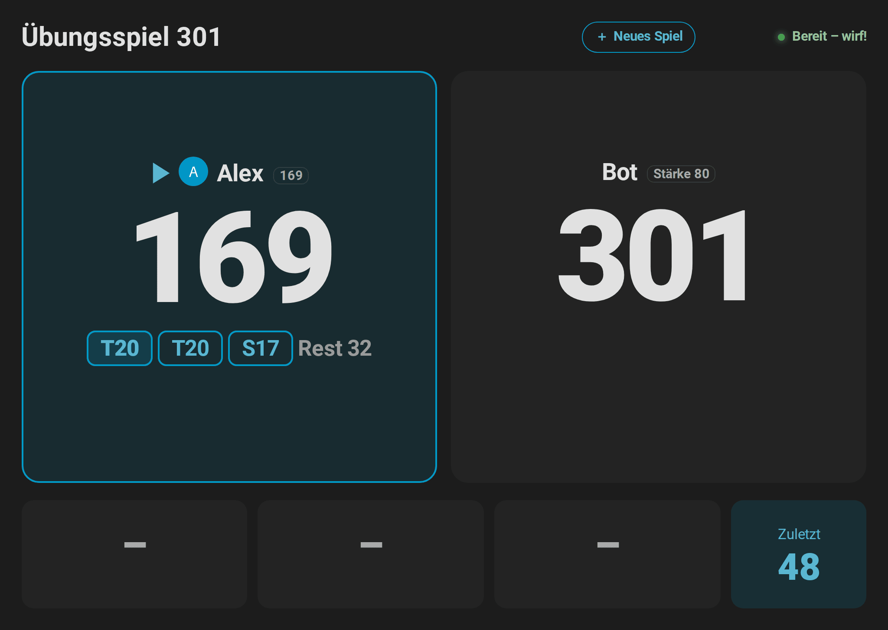

## Turniere

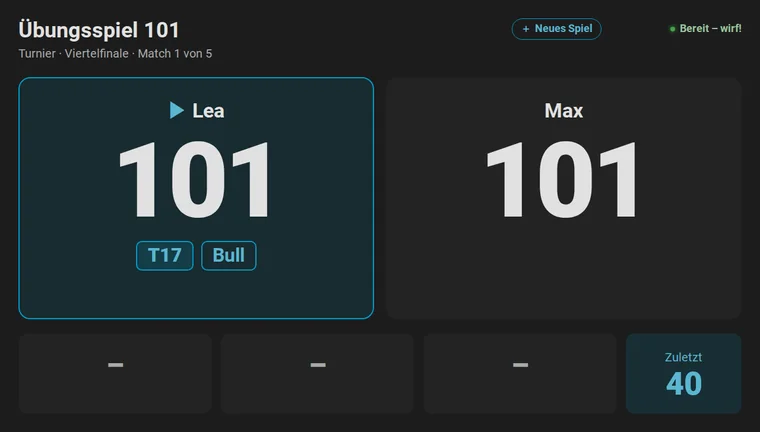

Ein Turnier für drei bis acht Spieler mit Namen an einem Board, ein Match nach dem anderen: **jeder gegen jeden**, bei dem alle einmal gegeneinander spielen und eine Tabelle die Spieler ordnet, oder das **K.-o.-System**, bei dem die Sieger über einen Turnierbaum bis ins Finale weiterkommen. Jedes Match ist ein X01-Match, auf Wunsch mit Startpunkten als Handicap, oder ein Cricket-Spiel, mit den Legs, Sätzen und Regeln des Turniers. Die Ergebnisse fließen wie bei jedem Match in die [Spielerprofile](statistics.de.md#spielerprofile) und die direkten Vergleiche.

1. **Starten:** Tippe auf der Anzeigetafel auf **Neues Spiel**, dann auf **Turnier**. Wähle die Spieler, jeder gegen jeden oder K.-o.-System, das Spiel, Legs und Sätze und die Regeln und tippe auf **Turnier starten**. Oder starte es aus einer Automation:

   ```yaml
   action: autodarts.start_tournament
   data:
     players: [Alex, Sam, Kim, Lea]
     format: round_robin
     game: "501"
     legs: 2
   ```

2. **Spielen:** Das erste Match beginnt sofort, und die Titelzeile der Anzeigetafel nennt Runde und Match. Ist ein Match entschieden und sind die Darts gezogen, zeigt die Anzeigetafel seine Zusammenfassung, dann Tabelle oder Turnierbaum mit dem nächsten Match und einem Countdown. Das nächste Match beginnt von selbst; **Jetzt starten** überspringt das Warten.
3. **Sieger:** Nach dem letzten Match nennt ein Banner den Sieger, und Tabelle oder Turnierbaum bleiben stehen, bis ein neues Match beginnt. `tournament_finished` kann die [Lichtshow](automations.de.md#light-show) starten oder [die Ergebnisse ansagen](automations.de.md#ergebnisse-eines-turniers-ansagen).
4. **Danach:** Das Übungsspiel kehrt zu den Spielern, Namen, Startpunkten, Legs, Sätzen, Regeln und der Bot-Stärke von vor dem Turnier zurück, mit dem ersten Dart des nächsten Matches oder der ersten Änderung einer Einstellung des Übungsspiels. Nach *Turnier beenden* wird ein laufendes Match erst zu Ende gespielt. Ein neues Turnier startet nur, wenn keines läuft: Beende das laufende zuerst.

<table>
  <tr>
    <td width="50%">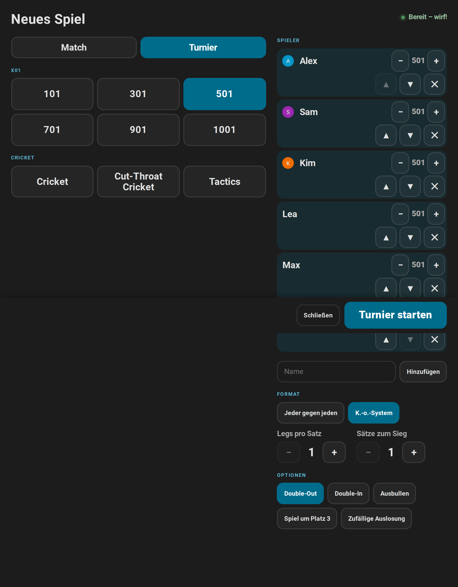</td>
    <td width="50%">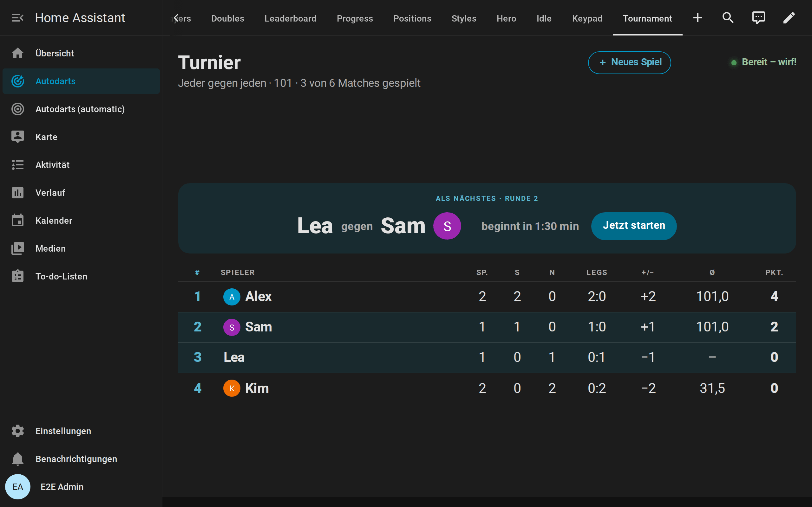</td>
  </tr>
</table>

Die [Referenz der Entitäten](entities.de.md#turniere) nennt Einstellungen, Tasten und Aktionen des Turniers, die [Anleitung zur Anzeigetafel](scoreboard.de.md#turniere), was der Bildschirm zeigt.

### Turnierregeln

- **Spieler:** drei bis acht Spieler mit je einem Namen, höchstens acht auch in *Turnierspieler*. Ein Name ist unabhängig von Groß- und Kleinschreibung derselbe Spieler, wie bei den [Spielerprofilen](entities.de.md#spielerprofile). Einen Spieler des laufenden Turniers kannst du nicht löschen; ein gelöschter Spieler verschwindet aus der Liste für das nächste Turnier.
- **Auslosung:** die Reihenfolge der Namen oder mit *Turnier zufällige Auslosung* oder einem `seed` eine zufällige Reihenfolge. Derselbe Startwert lost immer dieselbe Reihenfolge aus; eine zufällige Auslosung ohne Startwert wählt einen und zeigt ihn im Attribut `seed` von *Turnier*.
- **Jeder gegen jeden:** Alle spielen einmal gegeneinander, in Runden nach dem Rutschsystem (Kreismethode): drei oder vier Spieler spielen 3 Runden, fünf oder sechs 5, sieben oder acht 7. Bei einer ungeraden Zahl setzt in jeder Runde ein Spieler aus. Ein Spieler des letzten Matches einer Runde eröffnet die nächste Runde nur, wenn kein anderes Match es kann, und den Anwurf eines Matches bekommt der Spieler, der ihn seltener hatte.
- **Punkte:** Ein gewonnenes Match bringt 2 Punkte wie in der Premier League, ein verlorenes keine. Ein Match kann nicht unentschieden enden.
- **Bei Punktgleichheit** entscheiden nacheinander
  1. die Punkte aus den Matches der punktgleichen Spieler untereinander,
  2. die Leg-Differenz: gewonnene minus verlorene Legs aus allen ihren Matches, bei Matches mit Sätzen alle Legs,
  3. der 3-Dart-Average aus allen ihren Matches (Cricket: die Marks pro Runde),
  4. die Reihenfolge der Auslosung.

  Von zwei punktgleichen Spielern steht also vorn, wer das direkte Duell gewonnen hat; bei drei Spielern, die sich reihum geschlagen haben, entscheidet die Leg-Differenz.
- **K.-o.-System:** ein Turnierbaum mit 4 Plätzen für drei oder vier Spieler und mit 8 Plätzen für fünf bis acht. Der erste Spieler der Auslosung ist Nummer 1 der Setzliste, der zweite Nummer 2 und so weiter, gesetzt wie bei Profiturnieren: Nummer 1 trifft zuerst auf die letzte Nummer, die Nummern 1 und 2 können sich frühestens im Finale treffen und die Nummern 1 bis 4 nicht vor dem Halbfinale. Plätze, die die Spieler nicht füllen, sind Freilose für die besten Nummern, die direkt in die nächste Runde kommen. Die Runden heißen Viertelfinale, Halbfinale und Finale.
- **Platz 3:** Mit *Turnier Spiel um Platz 3* und mindestens vier Spielern spielen die Verlierer der Halbfinals vor dem Finale um Platz 3. Ohne diese Einstellung gibt es im K.-o.-System keinen dritten Platz.
- **Spielplan:** ein Match nach dem anderen, Runde für Runde. Im K.-o.-System spielen die Matches einer Runde von oben nach unten im Turnierbaum, das Spiel um Platz 3 vor dem Finale.
- **Matches:** Jedes Match ist ein [Match](#matches-legs-und-sätze) zweier Spieler mit den Legs pro Satz, Sätzen zum Sieg, Double-Out, Double-In und dem Ausbullen des Turniers. Regeln, die das Turnier nicht festlegt, übernimmt es aus dem Übungsspiel, so wie du sie eingestellt hast, auch ein Double-Out, das aufs nächste Leg wartet. Bei X01 beginnt ein Spieler mit eigenen Startpunkten jedes Leg des Turniers von diesen, als Handicap; der andere von denen des Spiels. Der zuerst genannte Spieler hat den Anwurf, wenn kein Ausbullen entscheidet.
- **Geänderte Matches:** Ein Match, dessen Legs, Sätze, Startpunkte oder Regeln sich während des Spiels ändern, ist kein Turniermatch mehr, und sein Ergebnis zählt nicht; *Nächstes Turniermatch* stellt das Turniermatch wieder her. Eine in der Pause geänderte Einstellung beginnt das Match der letzten beiden Spieler neu: Bis zu seinem ersten Dart macht es nach der Pause dem nächsten Match Platz.
- **Averages:** Der Average eines Spielers zählt Punkte und Darts aller seiner Turniermatches; die Darts einer überworfenen Aufnahme zählen, ihre Punkte nicht.
- **Sieger:** der Sieger des Finales oder der Erste der Tabelle nach dem letzten Match. Danach meldet *Nächstes Turniermatch*, dass das Turnier vorbei ist: Beende es oder starte ein neues.

## X01

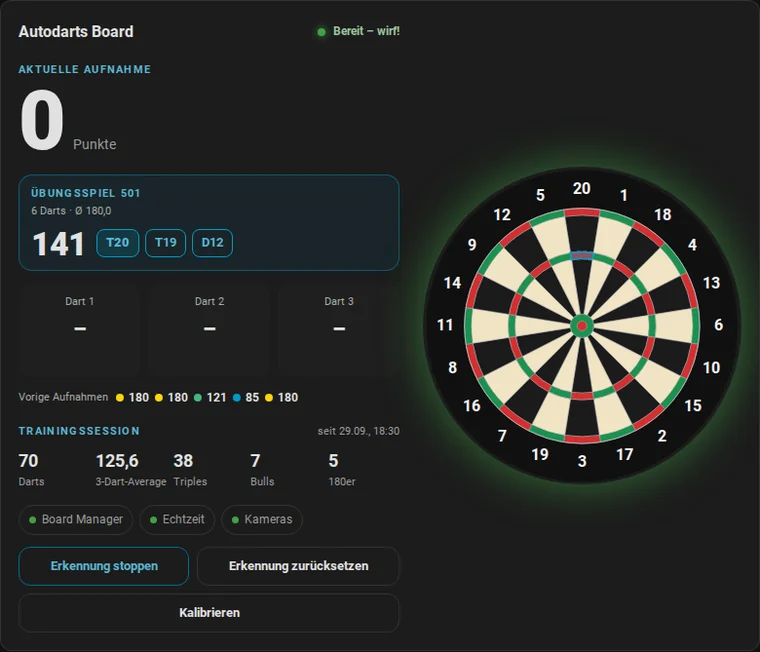

- **Herunterzählen:** Der Rest beginnt bei 101, 301, 501, 701, 901 oder 1001, und jeder Dart zieht seine Punkte ab.
- **Double-Out** (standardmäßig an): Der letzte Dart eines Legs muss ein Double oder das Bullseye treffen. Ohne Double-Out checkt jedes Feld.
- **Double-In** (standardmäßig aus): Die Zählung eines Spielers beginnt mit dem ersten Double oder Bullseye des Legs; Darts davor zählen nichts. Die Karten fordern ein Double und umranden den Doppelring. Ein Überwerfen nimmt das öffnende Double zurück.
- **Double-Out ändern:** Ein Leg behält die Regeln, mit denen es begonnen hat. Schaltest du Double-Out während eines Legs ein oder aus, sobald ein Dart gezählt hat, gilt das ab dem nächsten Leg; vor dem ersten Dart eines Legs, zwischen zwei Matches und in den anderen Spielen gilt es sofort. So wird kein Leg unlösbar: Wer in einem Leg ohne Double-Out auf 1 steht, kann es mit einem Single 1 noch beenden, wenn Double-Out eingeschaltet wird.
- **Überwerfen:** Ein Dart, der unter null geht, mit Double-Out 1 übrig lässt oder 0 ohne Double erreicht, überwirft die Aufnahme. Der Rest springt auf den Beginn der Aufnahme zurück. Der überwerfende Dart zählt als geworfen, spätere Darts der Aufnahme nicht.
- **Game shot:** Ein Dart, der genau 0 erreicht, gewinnt das Leg. `leg_won` wird sofort gemeldet; verbucht wird das Leg beim Ziehen der Darts, eine Korrektur davor zählt also noch. Darts nach dem Siegdart zählen nicht.
- **Checkout-Weg:** Sobald ein Rest checkbar ist, zeigen die Karten den Weg für die restlichen Darts der Aufnahme, etwa `T20 T20 BULL` für 170, und umranden das nächste Feld auf der Scheibe. „Kein Checkout möglich“ erscheint nur bei einem Rest, den eine Aufnahme checken könnte: bis 170 mit Double-Out, bis 180 ohne. Der Weg folgt den Checkout-Tabellen der Profis; mit *Übungsspiel persönliche Checkout-Wege* bevorzugt er deine stärksten Doubles: die mit mindestens 10 Darts, die du mindestens so oft triffst wie alle deine Doubles zusammen, nie eines, das du noch nie getroffen hast. Auf dem Weg zum Double zählt das Single-Bull als leichtes Single, wie in `25 D18` für 61 aus den Tabellen; ein Stellwurf für die nächste Aufnahme meidet es, weil ein Fehlwurf daneben keinen checkbaren Rest lässt. [So wird der Weg gewählt](how-it-works.de.md#übungsspiel).
- **Stellwurf:** Wo die übrigen Darts nicht checken können, bei 169, über 170 oder bei 100 mit einem Dart, zeigen die Karten stattdessen einen Stellwurf, etwa *T20 T20 S17 Rest 32*: Darts, die für die nächste Aufnahme ein gutes Double stellen, am liebsten 32, 40, 36 oder 16. Der Caller sagt „stell dir die 32“. [So wird der Stellwurf gewählt](how-it-works.de.md#stellwürfe).
- **Average:** erzielte Punkte pro drei Darts des Legs. Darts einer überworfenen Aufnahme zählen, ihre Punkte nicht.

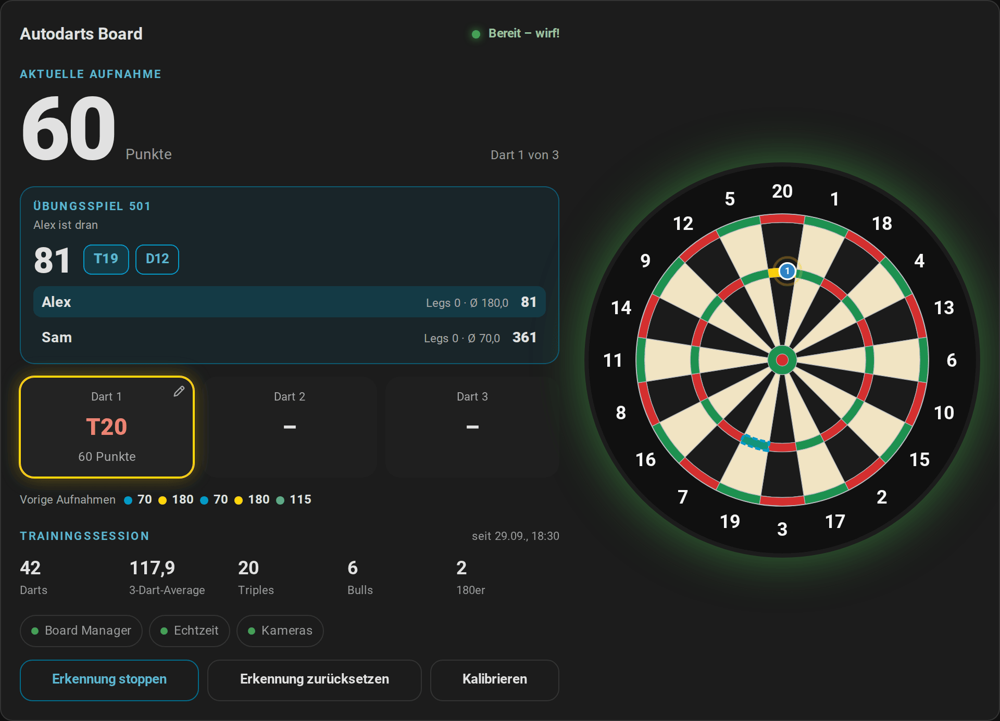

## Cricket-Spiele

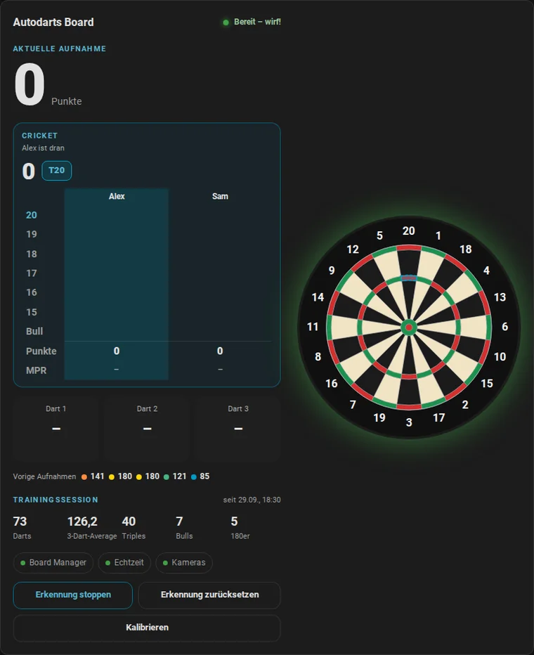

Live-Karte und Anzeigetafel zeigen eine Kreidetafel mit den Marks jedes Spielers oder Teams (`/`, `X`, `Ⓧ`), den Punkten und den Marks pro Runde (MPR). Zahlen, die alle geschlossen haben, werden abgedunkelt, und die Scheibe umrandet die nächste offene Zahl, von 20 abwärts bis zum Bull. Hast du alles geschlossen, reichen die Punkte aber noch nicht zum Sieg, umrandet sie die höchste Zahl, die ein Gegner noch offen hat, zum Punkten; bei Cut-Throat eine, die ein Spieler mit den wenigsten Punkten offen hat. Screenreader lesen die Marks als Wörter vor.

### Cricket

- **Marks:** Nur 20 bis 15 und das Bull zählen. Ein Single ist ein Mark, ein Double zwei, ein Triple drei; das Single-Bull ist ein Mark, das Bullseye zwei. Drei Marks schließen eine Zahl.
- **Punkte:** Weitere Marks auf eine geschlossene Zahl bringen ihren Wert (25 fürs Bull), solange ein anderer Spieler sie offen hat.
- **Sieg:** Schließe alle Zahlen mit mindestens so vielen Punkten wie alle anderen. Der Sieg wird nach jedem Dart geprüft: Ein schließender Dart gewinnt sofort, wenn die Punkte reichen, und spätere Darts der Aufnahme zählen nicht. Allein gewinnt, wer alle Zahlen schließt.
- **Marks pro Runde:** die Marks, die eine Zahl geschlossen oder gepunktet haben, pro drei tatsächlich geworfene Darts. Marks auf eine Zahl, die niemand mehr braucht, zählen nicht.

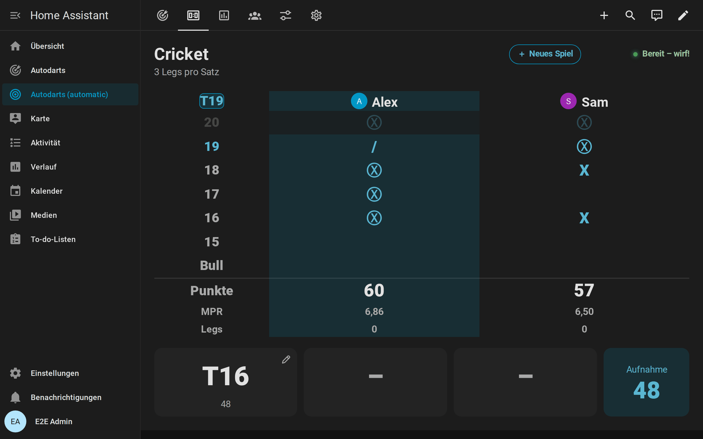

### Cut-Throat Cricket

- **Marks:** wie bei Cricket, auf 20 bis 15 und das Bull.
- **Punkte für die anderen:** Weitere Marks auf eine geschlossene Zahl geben ihren Wert jedem anderen Spieler, der sie noch offen hat; wer sie wirft, bekommt nichts.
- **Sieg:** Schließe alle Zahlen mit nicht mehr Punkten als alle anderen: Die wenigsten Punkte gewinnen. Der Sieg wird nach jedem Dart geprüft, auch für die anderen: Lassen die Punkte eines Darts einen anderen Spieler, der alles geschlossen hat, mit den wenigsten Punkten zurück, gewinnt dieser sofort, und spätere Darts der Aufnahme zählen nicht. Allein gewinnt, wer alle Zahlen schließt. Die Anzeigetafel erinnert daran, dass die wenigsten Punkte gewinnen.

### Tactics

- Cricket auf die Zahlen 20 bis 10 und das Bull, zwölf Zahlen insgesamt. Marks, Punkte und Sieg folgen den Regeln von Cricket.

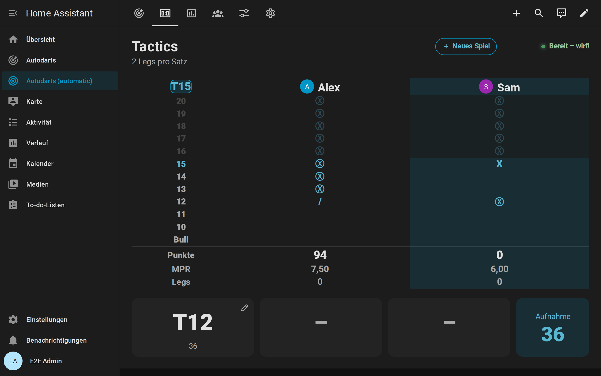

### Wild Mouse

Auch als Minnesota Cricket bekannt. Neben 20 bis 15 und dem Bull schließt jeder Spieler drei weitere Ziele: **Doubles**, **Triples** und **3 in a Bed**. Die Kreidetafel hat für jedes eine Zeile.

- **Jeder Dart zählt einmal:** Ein Dart markiert seine Zahl, solange du sie noch offen hast, wie bei Cricket: Eine T20 sind drei Marks auf der 20. Sonst ist ein Double eine Mark auf Doubles und ein Triple eine Mark auf Triples, auf jeder Zahl und mit dem Bullseye als Double. Drei Marks schließen Doubles und Triples.
- **3 in a Bed:** Drei Darts einer Aufnahme im selben Feld, etwa drei Single 18 oder drei T20, schließen es sofort; die Darts zählen zusätzlich für ihre Ziele. Um ohne zu spielen, wie es Freizeitspieler oft tun, schalte auf dem Bildschirm für ein neues Spiel *Three in a Bed* oder *Übungsspiel Wild Mouse Three in a Bed* aus; eine Änderung startet das Spiel neu.
- **Punkte:** Ein Ziel, das du geschlossen hast, punktet, solange ein anderer Spieler es noch offen hat: eine Zahl ihren Wert pro Mark wie bei Cricket, Doubles und Triples die ganze Punktzahl des Darts (32 Punkte für eine D16) und 3 in a Bed die drei Darts zusammen (180 für drei T20).
- **Sieg:** Schließe alle Ziele mit mindestens so vielen Punkten wie alle anderen, wie bei Cricket.
- **Ziel:** Das Board umrandet das nächste offene Ziel: 20 abwärts bis 15, dann jedes Double, jedes Triple, für 3 in a Bed die Single 20 und nach dem ersten Dart dessen Feld, zuletzt das Bull.
- **Marks pro Runde:** Jede Mark, die geschlossen oder gepunktet hat, zählt, auf den Zahlen wie auf Doubles und Triples; 3 in a Bed zählt eine.

## Partyspiele

Sechs Kneipenklassiker für einen bis vier Spieler; Killer braucht zwei. Sie verbuchen eine Aufnahme, wenn du die Darts ziehst, und gewinnen Legs und Sätze wie jedes Match. Die Karten zeigen die Runde, das Ziel und die Punkte oder Leben jedes Spielers und umranden die Felder, auf die du zielst. Partyspiele zählen nicht für die X01-Statistik.

### Shanghai

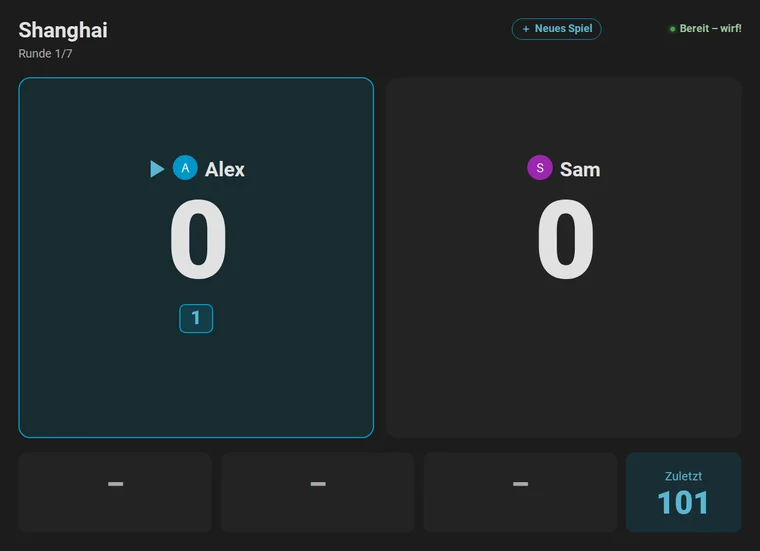

- Sieben Runden auf die Zahlen 1 bis 7; das klassische Kneipenspiel geht über 1 bis 20 oder neun Runden.
- Jeder Dart in einem Feld der Rundenzahl bringt seinen Wert. Ein Fehlwurf neben der Zahl zählt nichts.
- Single, Double und Triple der Zahl in einer Aufnahme, ein *Shanghai*, gewinnen das Leg sofort; spätere Darts der Aufnahme zählen nicht.
- Nach sieben Runden gewinnen die meisten Punkte. Bei gleichen Punkten gewinnt, wer öfter getroffen hat; bei gleich vielen Treffern wird das Leg neu gespielt, und der nächste Spieler beginnt es.

### Halve-It

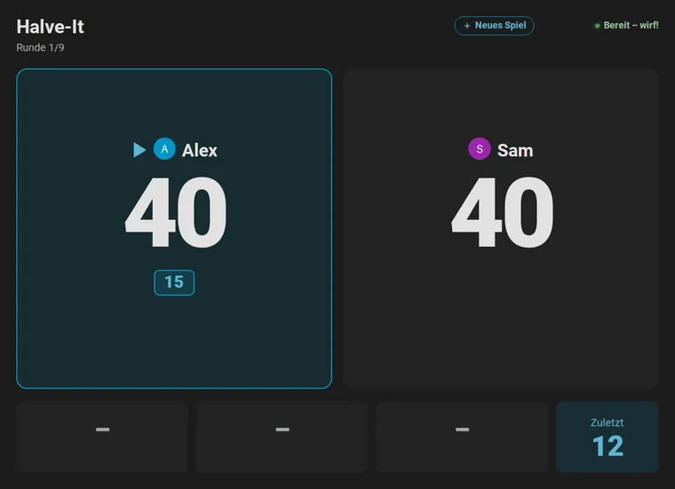

- Alle beginnen mit 40 Punkten. Die neun Runden zielen auf 15, 16, ein beliebiges Double, 17, 18, ein beliebiges Triple, 19, 20 und das Bull, angezeigt als *Bull (25/50)*.
- Treffer bringen ihre Punkte. *Beliebiges Double* schließt das Bullseye ein. In der Bull-Runde bringt das Single-Bull 25 und das Bullseye 50.
- Eine Aufnahme ohne Treffer aufs Ziel halbiert die Punkte, abgerundet, auch wenn weniger als drei Darts geworfen wurden.
- Die meisten Punkte nach neun Runden gewinnen; Gleichstände werden wie bei Shanghai entschieden.

### Killer

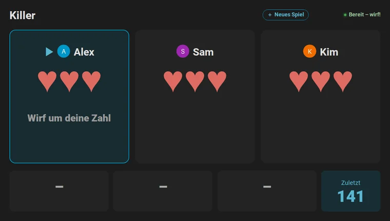

- Zwei bis vier Spieler mit je 3 Leben.
- Zuerst wirft jeder einen Dart für seine eigene Zahl: ein beliebiges Feld von 1 bis 20, das noch niemand hat. Ein Fehlwurf, das Bull oder eine vergebene Zahl heißen: noch einmal werfen.
- Danach zählen nur Doubles. Wer das Double der eigenen Zahl trifft, ist für den Rest des Legs Killer. Vorher bewirken die Doubles der anderen nichts.
- Ein Killer nimmt mit jedem Treffer auf das Double eines anderen ein Leben und verliert mit jedem Treffer auf das eigene eines, auch mit einem zweiten eigenen Double in der Aufnahme, die ihn zum Killer gemacht hat.
- Wer keine Leben mehr hat, ist raus: Der Rest der Aufnahme bewirkt nichts, und der Wurf überspringt ihn von da an.
- Wer als Letzter noch ein Leben hat, gewinnt sofort; spätere Darts der Aufnahme zählen nicht.
- Killer führt keine Punkte: `turn_changed` und `leg_won` nennen stattdessen die `lives` des Spielers und ob er `killer` ist.

### Golf

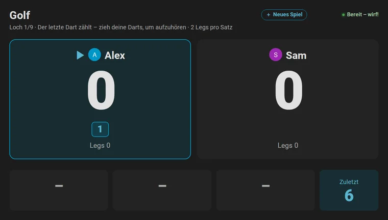

- Neun oder 18 Löcher, eingestellt in *Übungsspiel Golf-Löcher*; Loch *n* wird auf die Zahl *n* gespielt.
- Ein Spieler wirft bis zu drei Darts pro Loch und darf nach jedem Dart aufhören, indem er die Darts zieht: **Der letzte geworfene Dart zählt.**
- Schläge: Ein Double ist ein Hole-in-One, 1 Schlag; ein Triple 2, ein inneres Single 3, ein äußeres Single 4, alles andere 5, auch eine Aufnahme, bei der du ohne Dart aussetzt. Ob ein Single innen oder außen liegt, ergibt sich aus der Position, die das Board meldet, geteilt in der Mitte des Triple-Rings; ein Single ohne Position zählt als äußeres Single.
- Die wenigsten Schläge nach dem letzten Loch gewinnen. Bei Gleichstand an der Spitze spielen die Gleichauf-Liegenden in ihrer Wurfreihenfolge Zusatzlöcher auf die nächsten Zahlen (nach 20 wieder ab 1), bis einer von ihnen nach einem Loch weniger Schläge hat. Die Anzeigetafel führt eine Scorekarte jedes Lochs und zeigt die Zusatzlöcher als Stechen.

### Baseball

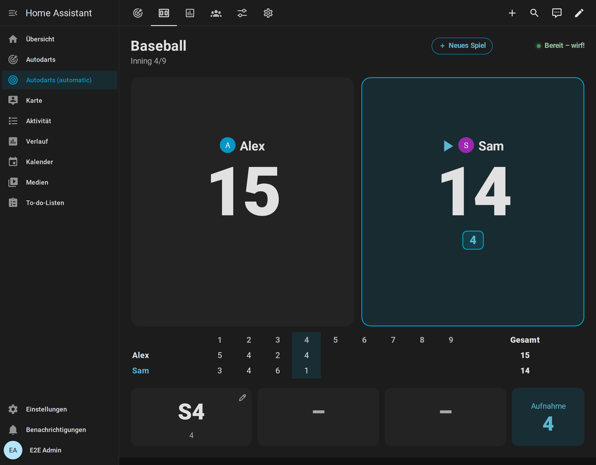

- Neun Innings; Inning *n* wird auf die Zahl *n* gespielt, mit einer Aufnahme aus drei Darts.
- Jeder Dart in einem Feld der Zahl des Innings bringt Runs: ein Single 1, ein Double 2, ein Triple 3. Das Bull bringt nichts.
- Die meisten Runs nach neun Innings gewinnen. Bei Gleichstand an der Spitze spielen die Gleichauf-Liegenden Zusatz-Innings auf 10, 11 und so weiter, bis einer von ihnen nach einem Inning vorn liegt.

### Count-Up

- 1 bis 20 Runden, eingestellt in *Übungsspiel Count-Up-Runden*, standardmäßig 8. Jeder Dart bringt seinen Wert.
- Die meisten Punkte gewinnen. Bei Gleichstand an der Spitze spielen die Gleichauf-Liegenden Zusatzrunden, bis einer von ihnen nach einer Runde vorn liegt.

## Trainingsspiele

Acht klassische Übungen für einen Spieler. Jede folgt den Darts der aktuellen Aufnahme, verbucht die Aufnahme, wenn du die Darts ziehst, und umrandet ihr Ziel auf der Scheibe. Ein beendetes Spiel bleibt auf den Karten, bis der nächste Dart es neu startet; *Übungsspiel neues Leg* startet es sofort neu. Jedes Spiel behält seine letzten 10 Ergebnisse, und sein bestes Ergebnis ist eine [Bestleistung](statistics.de.md#bestleistungen-serie-und-tagesziel). `drill_finished` und `checkout_attempt` melden die Ergebnisse. Im Checkout-Training, bei 121 und Catch 40 zählt wie bei X01 jeder Dart auf einen Rest, den ein Double checkt, für deine [Doppelanalyse](statistics.de.md#doppelanalyse).

### Around the Clock

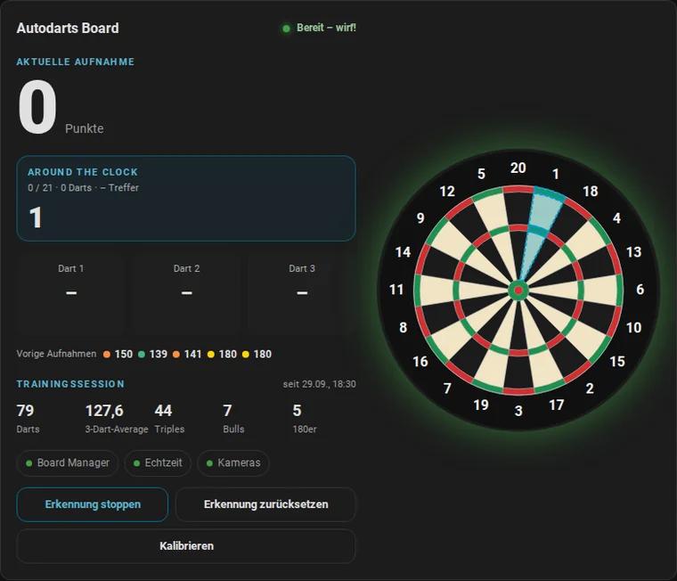

- 1 bis 20, dann das Bull, der Reihe nach, mit jedem Feld der Zahl. Das Bull-Ziel heißt auf den Karten *Bull (25/50)*, in den Attributen `25`: Single-Bull und Bullseye zählen beide, und beide sind umrandet. Weniger Darts sind besser.

### Doppeltraining

- D1 bis D20, dann das Bullseye (`BULL`); nur Doppelring und Bullseye zählen. Weniger Darts sind besser, und jeder Dart zählt für deine [Doppelanalyse](statistics.de.md#doppelanalyse).

### Checkout-Training

- Ein zufälliger Rest von 2 bis 170, der mit drei Darts checkbar ist, auf einem Double in höchstens drei Aufnahmen ausgecheckt. Wie bei X01 macht ein Überwerfen nur seine Aufnahme ungültig: Die nächste Aufnahme beginnt mit dem Rest davor. Eine dritte Aufnahme ohne Checkout, auch eine überworfene, beendet den Versuch; der Weg steht nur, solange der Versuch läuft. Die Checkout-Quote zählt die gelungenen Versuche.

### Bob's 27

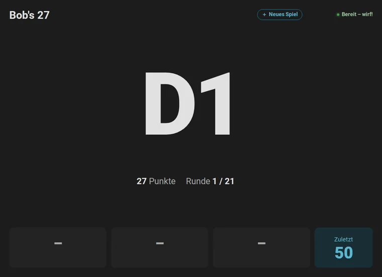

- Start mit 27 Punkten, je eine Aufnahme auf jedes Double von D1 bis D20 und dann aufs Bullseye. Jeder Treffer bringt den Wert des Doubles; eine Aufnahme ohne Treffer zieht ihn ab.
- Das Spiel ist verloren, sobald die Punkte null oder weniger erreichen, und geschafft nach dem Bullseye.

### 121-Checkout

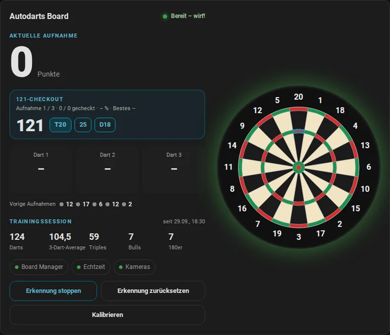

- Checke 121 auf einem Double in höchstens drei Aufnahmen, also neun Darts. Wie bei X01 macht ein Überwerfen nur seine Aufnahme ungültig. Ein Checkout hebt das Ziel auf den nächsten Rest; drei Aufnahmen ohne Checkout senken es um eins, nie unter 121.
- Jeder Rest bis 170 wird gespielt, auch die, die eine Aufnahme nicht checken kann, etwa 159: Neun Darts können es, und die Karten zeigen dort statt eines Wegs einen Stellwurf für die nächste Aufnahme. 170 ist das höchste Ziel. Der höchste gecheckte Rest ist die Bestleistung.

### Catch 40

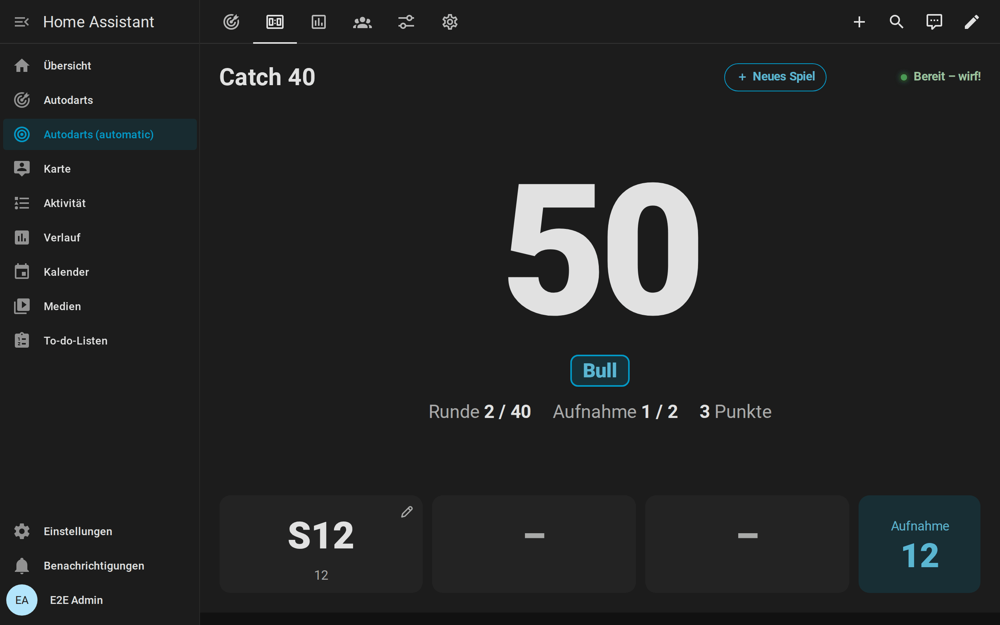

- Checke 61, 62 und so weiter bis 100, jeden Rest auf einem Double in höchstens zwei Aufnahmen, also sechs Darts.
- Ein Checkout mit zwei Darts bringt 3 Punkte, mit drei Darts 2 und mit vier bis sechs Darts 1. Die 99 lässt sich mit zwei Darts nicht checken, dort bringen deshalb drei Darts 3 Punkte.
- Wie bei X01 macht ein Überwerfen nur seine Aufnahme ungültig: Die zweite Aufnahme beginnt mit dem Rest davor, und ein Checkout bringt dann 1 Punkt. Zwei Aufnahmen ohne Checkout bringen nichts, und der nächste Rest folgt. Höchstens 120 Punkte.

### JDC Challenge

- Das Trainingsprogramm der [Junior Darts Corporation](https://www.juniordarts.com/) mit 57 Darts, wie es ihre Akademien spielen ([Regeln](https://www.godartspro.com/jdc/)).
- Zuerst eine Aufnahme auf jede Zahl von 10 bis 15: Jeder Dart in einem Feld der Zahl bringt seinen Wert, und Single, Double und Triple der Zahl in der Aufnahme bringen 100 dazu (ein Shanghai).
- Dann ein Dart auf jedes Double von D1 bis D20, 50 Punkte pro Treffer, und einer aufs Bullseye für 100. Erkennt das Board einen Dart nicht, geht der nächste erkannte Dart aufs nächste Double.
- Dann eine Aufnahme auf jede Zahl von 15 bis 20 wie im ersten Teil. Höchstens 3.380 Punkte.

### Singles-Training

- Eine Aufnahme auf jede Zahl von 1 bis 20 und dann aufs Bull (`25`).
- Jeder Dart in einem Feld der Zahl bringt einen Punkt pro Treffer: ein Single 1, ein Double 2, ein Triple 3; das Single-Bull 1 und das Bullseye 2. Höchstens 186 Punkte.

## Statistik

Jedes Spiel füllt die Statistik: X01-Legs den First-9-Average, die Checkout-Quote und die Doppelquote; Cricket die Marks pro Runde; benannte Spieler ihre [Profile](statistics.de.md#spielerprofile), direkten Vergleiche, den Match-Verlauf, ihre [Erfolge](statistics.de.md#erfolge) und Wochentrends; jeder Dart aufs Double die [Doppelanalyse](statistics.de.md#doppelanalyse). Die [Anleitung zur Statistik](statistics.de.md) zeigt alles davon, und [Bestleistungen und Statistik](how-it-works.de.md#bestleistungen-und-statistik) erklärt genau, welche Legs für welche Bestleistung zählen.
