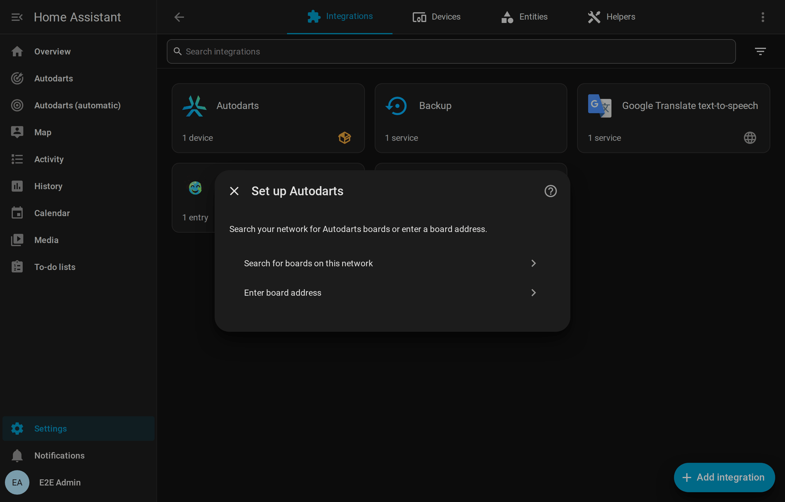
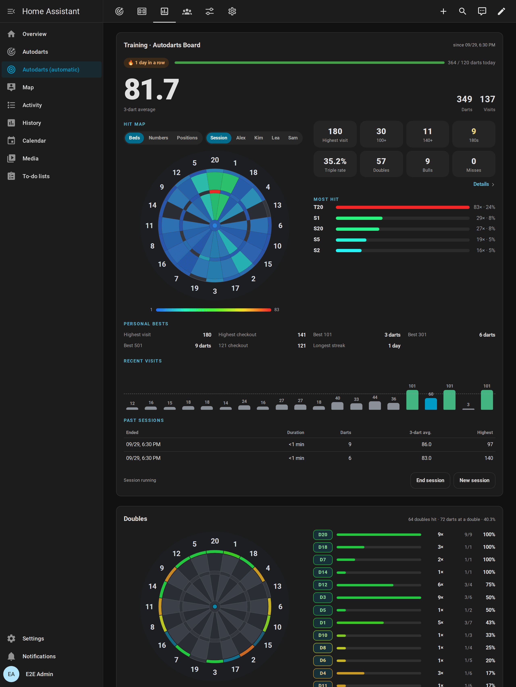

# From zero to the scoreboard

[← Documentation](README.md) · [Deutsch](getting-started.de.md)

You play on an Autodarts board and have never used Home Assistant? This guide takes you from nothing to the scoreboard on a tablet next to your board. Home Assistant, HACS and the integration are free. Plan about an hour; most of it is setting up Home Assistant itself.

**On this page:** [What you need](#what-you-need) · [1. Install Home Assistant](#1-install-home-assistant) · [2. Install HACS](#2-install-hacs) · [3. Install the integration](#3-install-the-integration) · [4. Add your board](#4-add-your-board) · [5. Create the dashboard](#5-create-the-dashboard) · [6. Put the scoreboard next to the board](#6-put-the-scoreboard-next-to-the-board) · [7. Play your first game](#7-play-your-first-game) · [What next](#what-next) · [If something doesn't work](#if-something-doesnt-work)

## What you need

- **Your Autodarts board,** set up and working. [Supported devices](README.md#supported-devices) lists the tested setups.
- **A device for Home Assistant** that stays on, in the same network as the board: a Raspberry Pi 4 or 5, a mini PC, or a virtual machine on a computer that runs all the time. Home Assistant also sells ready-made devices. Use a device of its own: the board PC needs its power for the detection.
- **A free GitHub account,** which HACS uses to download integrations.
- **A screen for the scoreboard,** if you want one: a tablet, a TV with a browser or an old phone.

## 1. Install Home Assistant

Follow the official [installation guide](https://www.home-assistant.io/installation/) for your device; it shows every step with pictures. On a Raspberry Pi, choose **Home Assistant OS** ([guide for the Raspberry Pi](https://www.home-assistant.io/installation/raspberrypi)).

At the end, open Home Assistant in a browser, usually at `http://homeassistant.local:8123`, and create your account. The [onboarding guide](https://www.home-assistant.io/getting-started/onboarding/) explains the questions.

## 2. Install HACS

HACS is the store for integrations and cards from the community, like this one. Follow the official guide to [download HACS](https://www.hacs.xyz/docs/use/download/download/) and to [set it up](https://www.hacs.xyz/docs/use/configuration/basic/) with your GitHub account. Afterwards, **HACS** appears in the sidebar of Home Assistant.

## 3. Install the integration

1. Select the button above and confirm your Home Assistant address. HACS opens this integration. Without the button: open **HACS**, the menu (⋮) → **Custom repositories**, add `https://github.com/Dennis-Otto/ha-autodarts` with the type **Integration**.
2. Select **Download**.
3. Restart Home Assistant: **Settings → System**, the power button at the top right, **Restart Home Assistant**.

## 4. Add your board

With Board Manager 2, Home Assistant usually finds the board by itself: **Settings → Devices & services** shows **Autodarts board found** under *Discovered*. Select **Add** and confirm.

Otherwise, select the button above and choose **Search for boards on this network**, or **Enter board address** with the IP address of the board PC. You need no Autodarts account.

The [installation guide](installation.md#add-your-board) explains the three ways in detail.

## 5. Create the dashboard

Go to **Settings → Dashboards → Add dashboard → Autodarts**. One click creates a complete dashboard for your board, with views for the live game, the scoreboard, training, the players and the board. It updates itself when you add a board or a later version brings new views.

## 6. Put the scoreboard next to the board

1. On the tablet, open Home Assistant in the browser or in the [Home Assistant app](https://companion.home-assistant.io/) and sign in. A user of its own without administrator rights keeps the screen from changing your settings.
2. Open the Autodarts dashboard and its *Scoreboard* view.
3. Switch the browser to full screen and keep the tablet awake while it is charging.

The [scoreboard guide](scoreboard.md#set-up-the-screen) has the details and the options, such as the caller.

## 7. Play your first game

Tap **New game** on the scoreboard. Choose 501, add yourself, add the **bot** with **+ Bot** if you play alone, and tap **Start 501**. Throw your darts: the scoreboard counts, shows your checkout route and passes the turn after every visit.

If the board misreads a dart, tap it in the visit and correct it. The [games guide](games.md#start-a-game) shows every game and the other ways to start one.

## What next

- **Light and sound:** the [blueprints](automations.md#blueprints) flash your lights on a 180, call the scores or take a photo of a highlight. Each one is a single click to import.
- **Your progress:** personal bests, a heatmap of your darts, trends and achievements are in the [statistics guide](statistics.md).
- **Friends over:** teams, handicaps and tournaments for up to eight players are in the [games guide](games.md).

## If something doesn't work

- The [troubleshooting guide](troubleshooting.md) explains every message of the setup and every repair notice.
- Ask in [GitHub Discussions](https://github.com/Dennis-Otto/ha-autodarts/discussions/categories/q-a). Questions are answered there, so every answer helps the next player too. English and German are welcome.
- If your setup is not in the list of [supported devices](README.md#supported-devices), a [compatibility report](https://github.com/Dennis-Otto/ha-autodarts/issues/new?template=board_compatibility.yml) helps, whether it works or not.
