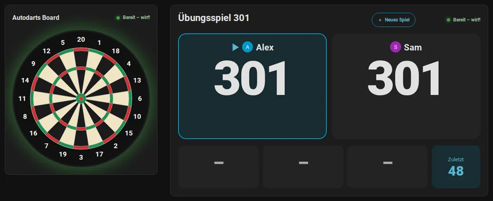

---
hide:
  - navigation
  - toc
---

# Autodarts für Home Assistant

{ width="96" align="right" }

**Dein Autodarts-Board live in Home Assistant: lokal, in Echtzeit und bereit für Automationen.**

Darts erscheinen in Home Assistant Sekundenbruchteile, nachdem sie landen, direkt vom Board Manager in deinem Netzwerk. Spiele und trainiere damit, stell eine Anzeigetafel neben das Board, verfolge deine Statistik und lass dein Zuhause mitspielen. Kein Konto, keine Cloud, keine Client-ID.

[:material-download: Zu HACS hinzufügen](https://my.home-assistant.io/redirect/hacs_repository/?owner=Dennis-Otto&repository=ha-autodarts&category=integration){ .md-button .md-button--primary } [:material-rocket-launch: Erste Schritte](getting-started.de.md){ .md-button }

## Das kann die Integration

- :material-lan-connect:{ .lg .middle } **Lokal und in Echtzeit**

    ---

    Mit Board Manager 2 automatisch gefunden; Board Manager 1 funktioniert auch. Nichts verlässt dein Netzwerk, außer du nutzt die Board-Suche, die Cloud-Verknüpfung oder die Online-Brücke, und Geheimnisse des Boards werden nie gespeichert.

    [:octicons-arrow-right-24: Funktionsweise](how-it-works.de.md)

- :material-bullseye-arrow:{ .lg .middle } **Spiele**

    ---

    X01 von 101 bis 1001 mit dem Checkout-Weg nach jedem Dart, Cricket, Cut-Throat Cricket, Tactics und Wild Mouse und sechs Partyspiele, allein oder als Match mit bis zu vier Spielern, mit Legs, Sätzen, Teams und Handicap.

    [:octicons-arrow-right-24: Spiele und Regeln](games.de.md)

- :material-target:{ .lg .middle } **Training**

    ---

    Trainingssessions, die mit dem ersten Dart beginnen, acht Trainingsspiele von Around the Clock bis zur JDC Challenge, ein Tagesziel, eine Trainingsserie und Bestleistungen.

    [:octicons-arrow-right-24: Trainingsspiele](games.de.md#trainingsspiele)

- :material-monitor-dashboard:{ .lg .middle } **Anzeigetafel und Karten**

    ---

    Eine Anzeigetafel für Tablet oder Fernseher, lesbar vom Abwurf aus, mit Spielauswahl, Caller und Ruhemodus. Sieben Dashboard-Karten und ein automatisches Dashboard, auf Deutsch, Englisch, Niederländisch, Französisch und Spanisch.

    [:octicons-arrow-right-24: Anzeigetafel am Board](scoreboard.de.md) · [Dashboard-Karten](cards.de.md)

- :material-chart-line:{ .lg .middle } **Statistik mit Trefferbildern**

    ---

    3-Dart-Average, First-9-Average, Checkout- und Doppelquote und ein Trefferbild jedes Feldes oder der echten Dart-Positionen. Spielerprofile mit Abzeichen, Wochentrends, eine Bestenliste, ein Wochenbericht und ein Trainingskalender.

    [:octicons-arrow-right-24: Statistik und Spieler](statistics.de.md)

- :material-home-automation:{ .lg .middle } **Automationen und Blueprints**

    ---

    Board-Ereignisse für jeden Dart, jede Aufnahme, Entnahme, jedes Überwerfen, gewonnene Leg und Match. Zwölf Blueprints: Lichtshow, Dart- und Übungs-Caller, Highlight-Fotos, Berichte, Warnungen und Routinen.

    [:octicons-arrow-right-24: Automationen](automations.de.md)

- :material-tournament:{ .lg .middle } **Turniere und ein Bot**

    ---

    Turniere mit drei bis acht Spielern, jeder gegen jeden mit Tabelle oder im K.-o.-System mit Turnierbaum, und ein Bot mit Stärke 20 bis 120 als Gegner bei X01 und Cricket.

    [:octicons-arrow-right-24: Turniere](games.de.md#turniere) · [Der Bot](games.de.md#gegen-den-bot-spielen)

- :material-microphone:{ .lg .middle } **Sprache**

    ---

    Sag Assist „Starte 501 für Alex und Sam“, auf Deutsch oder Englisch, und das Spiel beginnt. Jedes Spiel startet auch mit einer Aktion einer Automation.

    [:octicons-arrow-right-24: Spiel per Sprache starten](automations.de.md#spiel-per-sprache-starten)

## Anleitungen

- :material-rocket-launch:{ .lg .middle } [**Von null bis zur Anzeigetafel**](getting-started.de.md)

    ---

    Für Autodarts-Spieler ohne Home Assistant: Home Assistant und HACS aufsetzen, die Integration installieren, das Board hinzufügen und das erste Spiel auf der Anzeigetafel.

- :material-download:{ .lg .middle } [**Installation und Einrichtung**](installation.de.md)

    ---

    Voraussetzungen, HACS und manuelle Installation, die drei Wege, ein Board hinzuzufügen, die optionale Cloud-Verknüpfung, Neukonfiguration, Updates und Entfernen.

- :material-bullseye-arrow:{ .lg .middle } [**Spiele und Regeln**](games.de.md)

    ---

    Alle Spiele im Überblick, vier Wege, eines zu starten, Matches, Teams, Handicaps, das Ausbullen, Turniere und die Regeln jedes Spiels.

- :material-television:{ .lg .middle } [**Anzeigetafel am Board**](scoreboard.de.md)

    ---

    Ein Tablet oder Fernseher neben dem Board: Einrichtung, Quer- und Hochformat, Spielauswahl, Turniere, Caller und Ruhemodus.

- :material-chart-line:{ .lg .middle } [**Statistik und Spieler**](statistics.de.md)

    ---

    Trainingssessions, Bestleistungen, Trefferbild und Dart-Positionen, Fortschritt über die Zeit, Doubles, Spielerprofile, Erfolge, Bestenliste und Exporte.

- :material-home-automation:{ .lg .middle } [**Automationen**](automations.de.md)

    ---

    Zwölf Blueprints, ihre Einstellungen, Board-Ereignisse und fertige Beispiele.

- :material-play-network:{ .lg .middle } [**Online-Matches**](online-matches.de.md)

    ---

    Überwerfen, gewonnene Legs und Matches von Online-Matches als Board-Ereignisse, mit der Browser-Erweiterung Tools for Autodarts *(experimentell)*.

## Nachschlagen

- :material-view-dashboard:{ .lg .middle } [**Dashboard-Karten**](cards.de.md)

    ---

    Alle sieben Karten und das automatische Dashboard, mit allen Optionen und Barrierefreiheit.

- :material-format-list-bulleted:{ .lg .middle } [**Entitäten und Ereignisse**](entities.de.md)

    ---

    Alle Entitäten, Board-Ereignisse, Zustände, Attribute und Aktionen, und welche Board-Manager-Generation sie liefert.

- :material-cog-transfer:{ .lg .middle } [**Funktionsweise**](how-it-works.de.md)

    ---

    Architektur, Aktualisierung, Verbindungsverhalten, Training und Bestleistungen, gespeicherte Daten und Datenschutz.

- :material-lifebuoy:{ .lg .middle } [**Fehlerbehebung**](troubleshooting.de.md)

    ---

    Meldungen bei der Einrichtung, Reparaturen, nicht verfügbare Entitäten, fehlgeschlagene Aktionen, Diagnose und Logs.

- :material-shield-lock:{ .lg .middle } [**Sicherheit**](security.de.md)

    ---

    Schutzgüter, Vertrauensgrenzen, Bedrohungen und Gegenmaßnahmen.

- :material-book-alphabet:{ .lg .middle } [**Glossar**](glossary.de.md)

    ---

    Die Begriffe des Dartsports und dieser Integration, mit ihren englischen Entsprechungen.

Was jede Version gebracht hat, steht in den [Änderungen](https://github.com/Dennis-Otto/ha-autodarts/blob/main/CHANGELOG.md) (auf Englisch), was als Nächstes kommt, in der [Roadmap](roadmap.de.md). Für Videos und Artikel hat das [Creator-Kit](creator-kit.de.md) Fakten, Videos und Bilder, frei nutzbar.

--8<-- "docs/README.de.md:devices-and-languages"
