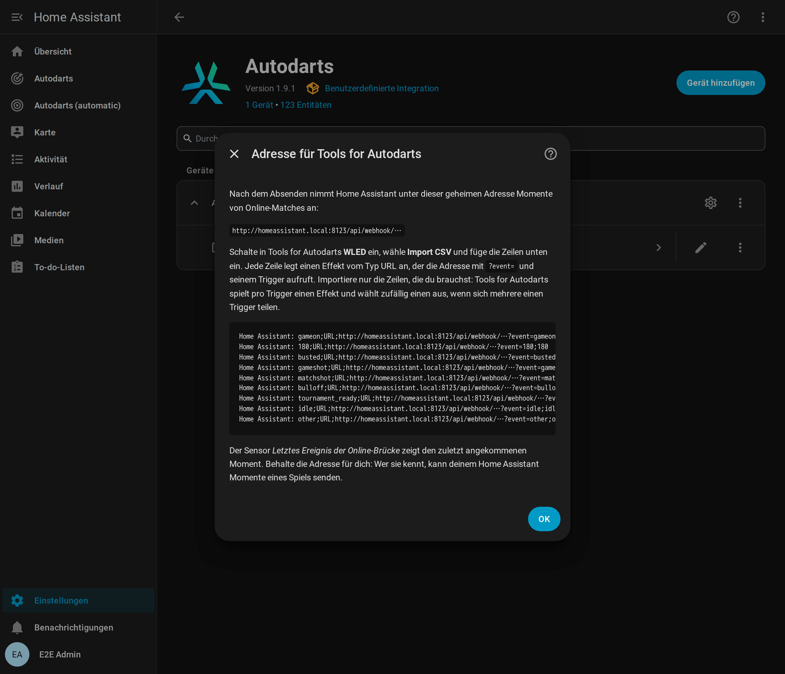

# Online-Matches (experimentell)

[← Dokumentation](README.de.md) · [English](online-matches.md)

Spiel online auf play.autodarts.io und lass Home Assistant mitfeiern: Überwerfen, gewonnene Legs und Matches und die Darts deiner Gegner kommen als Board-Ereignisse an, für die Lichtshow, einen Caller oder eine Benachrichtigung, wenn dein Turnier-Match bereit ist.

**Auf dieser Seite:** [So funktioniert es](#so-funktioniert-es) · [Brücke einrichten](#brücke-einrichten) · [Trigger und Ereignisse](#trigger-und-ereignisse) · [Sicherheit](#sicherheit) · [Grenzen](#grenzen)

## So funktioniert es

Die Integration sieht die Darts auf deinem Board auch in einem Online-Match auf play.autodarts.io: `dart_detected`, `visit_thrown` und die Entnahme kommen wie gewohnt. Das Spiel selbst sieht sie nicht: Überwerfen, ein gewonnenes Leg oder Match und die Darts deiner Gegner passieren im Browser. Autodarts teilt sie nur über seine Cloud, und dafür fehlt noch eine Client-ID.

Die optionale **Online-Brücke** bringt diese Momente mit der Browser-Erweiterung [Tools for Autodarts](https://github.com/creazy231/tools-for-autodarts) nach Home Assistant. Deren WLED-Funktion ruft für jeden Moment des Spiels eine Adresse deiner Wahl auf. Die Brücke bietet dafür eine geheime Adresse von Home Assistant an und macht aus jedem Aufruf ein [Board-Ereignis](entities.de.md#board-ereignisse), dessen Typ mit `online_` beginnt und dessen `source` `online` ist. Standardmäßig ist sie aus.

## Brücke einrichten

1. Öffne **Einstellungen → Geräte & Dienste → Autodarts**, dort **Konfigurieren** (das Zahnrad) deines Boards, schalte **Online-Matches von Tools for Autodarts empfangen** ein und sende ab. Diese Optionen haben nur Einträge mit lokalem Board.
2. Der nächste Schritt zeigt die geheime Adresse und fertige Zeilen für Tools for Autodarts. Kopiere die Zeilen und sende ab. Ab jetzt nimmt Home Assistant Aufrufe unter der Adresse an. Öffne die Optionen wieder, wann immer du die Adresse brauchst.
3. Öffne im Browser am Board die Einstellungen von Tools for Autodarts, schalte **WLED** ein, wähle **Import CSV**, füge die Zeilen ein und speichere. Jede Zeile ist ein Effekt vom Typ **URL** für einen Trigger; lösche die, die du nicht brauchst.
4. Prüfe, ob die Momente ankommen: Öffne die Adresse mit angehängtem `?event=gameon` in einem Browser in deinem Heimnetz, oder spiele ein Match. Der Sensor **Letztes Ereignis der Online-Brücke** auf der Geräteseite unter *Diagnose* zeigt, wann der letzte Moment ankam, und seinen Trigger.



Für einen Effekt von Hand gibst du ihm einen Trigger, den Typ **URL** und die Adresse mit `?event=` und demselben Trigger, zum Beispiel `…/api/webhook/<geheim>?event=busted`. Der Name eines Spielers kann als `&player=Lea` folgen. Ein Effekt vom Typ **JSON API** geht auch, mit einem Body wie `{"event": "busted", "player": "Lea"}`.

## Trigger und Ereignisse

| Trigger in Tools for Autodarts | Board-Ereignis | Details |
| --- | --- | --- |
| `gameon`, `bot_throw` | `online_game_on` | Tools for Autodarts sendet `gameon` zu Beginn jeder Aufnahme und nach jedem Moment ohne eigenen Effekt: ein guter Moment für dein normales Licht. |
| `busted` | `online_busted` | Überworfen. |
| `gameshot`, `gameshot+d10`, `gameshot_<name>` | `online_game_shot` | Ein gewonnenes Leg, mit dem `segment` des Siegerdarts oder dem `name` des Spielers, wenn der Trigger sie nennt. Der Name kommt kleingeschrieben an: Aus `gameshot_Lea` wird `lea`. |
| `matchshot`, `matchshot+bull`, `matchshot_<name>` | `online_match_shot` | Ein gewonnenes Match, mit denselben Details. |
| `0` bis `180` | `online_visit` | Die Punkte (`score`) einer Aufnahme. |
| `range_100_140` oder `100-140` | `online_visit` | Eine Aufnahme in dem Bereich, mit `score_min` und `score_max`. |
| Drei Darts wie `t20_t20_t20` | `online_visit` | `score`, `darts` und `segments` (zum Beispiel `["T20", "T20", "T20"]`). |
| `t20`, `d16`, `s5`, `s25`, `bull`, `m17`, `miss`, `outside` | `online_dart` | Ein Dart, mit `segment` (`T20`, `D16`, `S5`, `25`, `BULL` oder `MISS`) und `score`. |
| `bulloff` | `online_bull_off` | Das Ausbullen beginnt. |
| `tournament_ready` | `online_tournament_ready` | Ein Turniermatch von dir wartet darauf, dass du dich bereit meldest. |
| `idle` | `online_match_left` | Du hast das Match verlassen. |
| `other` | keins | Ein Moment auf einem anderen Board; die Brücke ignoriert ihn. |

Jedes Online-Ereignis hat `trigger` (wie gesendet, kleingeschrieben), `source` (`online`) und `name`, wenn die Adresse `&player=` enthält. Eine reine Zahl ist immer die Punktzahl einer Aufnahme: `25` ist eine Aufnahme mit 25 Punkten, `s25` ein Dart im Single-Bull. Die Board-Trigger von Tools for Autodarts wie `board_started`, `throw` oder `takeout` nimmt die Brücke nicht an: Die Board-Ereignisse melden sie direkt von deinem Board, schneller und ohne Browser.

- **Deine eigenen Darts** kommen sowieso vom Board: `dart_detected`, `visit_thrown` und die Entnahme sind schneller als die Erweiterung und funktionieren ohne sie. Nutze die Online-Ereignisse für das, was nur das Match weiß: Überwerfen, gewonnene Legs und Matches und die Darts deiner Gegner.
- **Nur dein Board:** Tools for Autodarts meldet die Momente aller Spieler im Match, auch die deiner Gegner. Um nur auf dein Board zu reagieren, trägst du in den WLED-Einstellungen unter **Board IDs** deine Board-ID ein und behältst die Zeile `other`: Momente auf anderen Boards senden dann stattdessen `other`.
- **Lichtshow:** Schalte in der [Lichtshow](automations.de.md#light-show) *Also react to online matches* ein, damit sie Überwerfen, gewonnene Legs und gewonnene Matches in Online-Matches spielt.

Eine Benachrichtigung, wenn ein Turniermatch bereit ist:

```yaml
alias: Darts - Turniermatch bereit
triggers:
  - trigger: event.received
    target:
      entity_id: event.autodarts_board_ereignisse
    options:
      event_type:
        - online_tournament_ready
actions:
  - action: notify.mobile_app_handy
    data:
      message: Dein Turniermatch ist bereit. Melde dich bei Autodarts bereit.
mode: single
```

## Sicherheit

- Die Adresse enthält ein Geheimnis aus 64 zufälligen Hexadezimalzeichen. Wer sie kennt, kann deinem Home Assistant Momente eines Spiels senden, sonst nichts: Die Brücke nimmt nur die Trigger oben an, Felder begrenzter Länge und höchstens 20 Aufrufe pro Sekunde und 120 pro Minute. Die Integration schreibt die Adresse nie ins Log, und die Diagnosedaten enthalten sie nicht. Home Assistant selbst nennt sie in einigen eigenen Warnungen, etwa zu einem Aufruf von außerhalb deines Netzes; prüfe Logs also, bevor du sie teilst.
- Standardmäßig können nur Geräte in deinem Heimnetz die Adresse aufrufen; Aufrufe aus dem Internet ignoriert Home Assistant. Schalte **Aufrufe von außerhalb deines Heimnetzes annehmen** nur für eine https-Adresse über Home Assistant Cloud oder deine eigene Domain ein.
- Ist die Adresse nach außen gelangt, schalte in den Optionen **Neue geheime Adresse erzeugen** ein und importiere die neuen Zeilen in Tools for Autodarts. Die alte Adresse funktioniert dann sofort nicht mehr, auch wenn du die Brücke im selben Schritt ausschaltest.
- Ausgeschaltet gibt es die Brücke nicht: Home Assistant beantwortet ihre Adresse wie jede unbekannte. Die Integration behält die Adresse für das nächste Einschalten.

## Grenzen

- **Eine Browser-Erweiterung von Dritten.** Momente kommen nur an, solange die Autodarts-Seite in einem Browser mit Tools for Autodarts und eingeschalteter WLED-Funktion offen ist. Ändert die Erweiterung ihre Trigger, braucht die Brücke eventuell ein Update. Ereignisse werden nie nachgeliefert.
- **Ein Effekt pro Trigger.** Tools for Autodarts spielt pro Trigger einen Effekt und wählt zufällig einen aus, wenn sich mehrere Effekte einen Trigger teilen. Ein Trigger, der in der Erweiterung ein WLED-Gerät und gleichzeitig Home Assistant steuert, erreicht beide nur hin und wieder. Lass Home Assistant dein Licht steuern, etwa mit der Lichtshow, oder nutze getrennte Trigger.
- **Effekte nur einmal.** Mit *trigger Effects only once* überspringt die Erweiterung einen Effekt, der schon läuft; derselbe Moment zweimal hintereinander kommt dann einmal an.
- **Gemischte Inhalte.** play.autodarts.io ist eine https-Seite, und Browser blockieren womöglich ihre Aufrufe einer reinen http-Adresse; die Erweiterung warnt davor, wenn du eine einträgst. Das funktioniert:
  - Eine https-Adresse von Home Assistant mit vertrauenswürdigem Zertifikat, etwa deine Adresse von Home Assistant Cloud oder deine eigene Domain. Schalte *Aufrufe von außerhalb deines Heimnetzes annehmen* ein, außer der Browser erreicht diese Adresse innerhalb deines Heimnetzes.
  - Eine reine http-Adresse in deinem Heimnetz wie `http://homeassistant.local:8123`, wenn der Browser die Aufrufe durchlässt: Erlaube in den Website-Einstellungen von Chrome oder Edge *Unsichere Inhalte* für play.autodarts.io, und erlaube den Zugriff auf Geräte in deinem lokalen Netzwerk, wenn der Browser fragt.
  - Was du auch wählst: Der Sensor *Letztes Ereignis der Online-Brücke* zeigt, ob die Momente ankommen.
- **Nur Board-Ereignisse.** Online-Momente zählen nicht für die Trainingssession, das Übungsspiel oder die Bestleistungen.
