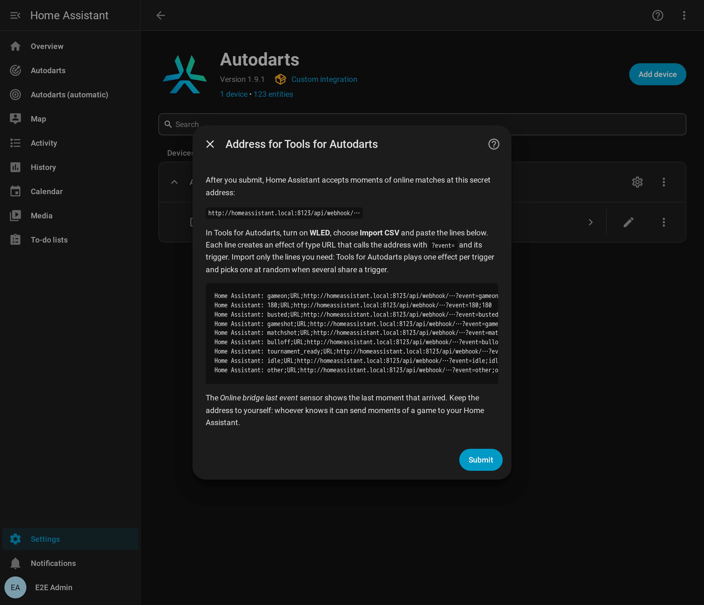

# Online matches (experimental)

[← Documentation](README.md) · [Deutsch](online-matches.de.md)

Play online on play.autodarts.io and let Home Assistant celebrate with you: busts, won legs and matches, and the darts of your opponents arrive as board events, for the light show, a caller or a notification when your tournament match is ready.

**On this page:** [How it works](#how-it-works) · [Set up the bridge](#set-up-the-bridge) · [Triggers and events](#triggers-and-events) · [Security](#security) · [Limitations](#limitations)

## How it works

The integration sees the darts on your board in an online match on play.autodarts.io, too: `dart_detected`, `visit_thrown` and the takeout arrive as usual. It cannot see the game itself: a bust, a won leg or match and the darts of your opponents happen in the browser. Autodarts shares them only through its cloud, which needs a client ID that has not been issued yet.

The optional **online bridge** brings these moments into Home Assistant with the browser extension [Tools for Autodarts](https://github.com/creazy231/tools-for-autodarts). Its WLED feature calls an address of your choice for each moment of the game. The bridge offers a secret Home Assistant address for it and turns every call into a [board event](entities.md#board-events) whose type starts with `online_` and whose `source` is `online`. It is off by default.

## Set up the bridge

1. Go to **Settings → Devices & services → Autodarts**, open **Configure** (the cog) of your board, turn on **Receive online matches from Tools for Autodarts** and submit. Only entries with a local board have these options.
2. The next step shows the secret address and ready-made lines for Tools for Autodarts. Copy the lines and submit. From now on, Home Assistant accepts calls at the address. Open the options again whenever you need the address.
3. In the browser at the board, open the settings of Tools for Autodarts, turn on **WLED**, choose **Import CSV**, paste the lines and save. Each line is an effect of the type **URL** for one trigger; delete the ones you don't need.
4. Check that the moments arrive: open the address with `?event=gameon` added in a browser of your home network, or play a match. The **Online bridge last event** sensor on the device page, under *Diagnostic*, shows when the last moment arrived and its trigger.



To add an effect by hand, give it one trigger, the type **URL** and the address followed by `?event=` and the same trigger, for example `…/api/webhook/<secret>?event=busted`. The name of a player can follow as `&player=Lea`. An effect of the type **JSON API** works too, with a body such as `{"event": "busted", "player": "Lea"}`.

## Triggers and events

| Trigger in Tools for Autodarts | Board event | Details |
| --- | --- | --- |
| `gameon`, `bot_throw` | `online_game_on` | Tools for Autodarts sends `gameon` at the start of every turn and after every moment without an effect of its own: a good moment to return to your normal light. |
| `busted` | `online_busted` | A bust. |
| `gameshot`, `gameshot+d10`, `gameshot_<name>` | `online_game_shot` | A won leg, with the `segment` of the winning dart or the `name` of the player when the trigger names them. The name arrives in lower case: `gameshot_Lea` gives `lea`. |
| `matchshot`, `matchshot+bull`, `matchshot_<name>` | `online_match_shot` | A won match, with the same details. |
| `0` to `180` | `online_visit` | The `score` of a visit. |
| `range_100_140` or `100-140` | `online_visit` | A visit in the range, with `score_min` and `score_max`. |
| Three darts such as `t20_t20_t20` | `online_visit` | `score`, `darts` and `segments` (for example `["T20", "T20", "T20"]`). |
| `t20`, `d16`, `s5`, `s25`, `bull`, `m17`, `miss`, `outside` | `online_dart` | A dart, with `segment` (`T20`, `D16`, `S5`, `25`, `BULL` or `MISS`) and `score`. |
| `bulloff` | `online_bull_off` | The bull-off begins. |
| `tournament_ready` | `online_tournament_ready` | A tournament match of yours waits for you to mark yourself ready. |
| `idle` | `online_match_left` | You left the match. |
| `other` | none | A moment on another board; the bridge ignores it. |

Every online event has `trigger` (as sent, in lowercase), `source` (`online`) and `name` when the address has `&player=`. A plain number is always the score of a visit, so `25` is a visit of 25 points and `s25` a dart in the outer bull. The board triggers of Tools for Autodarts, such as `board_started`, `throw` or `takeout`, are not accepted: the board events report them directly from your board, faster and without a browser.

- **Your own darts** come from the board anyway: `dart_detected`, `visit_thrown` and the takeout are faster than the extension and work without it. Use the online events for what only the match knows: busts, won legs and matches, and the darts of your opponents.
- **Only your board:** Tools for Autodarts reports the moments of every player in the match, your opponents' as well. To react to your own board only, enter your board ID under **Board IDs** in its WLED settings and keep the `other` line: moments on other boards then send `other` instead.
- **Light show:** turn on *Also react to online matches* in the [light show](automations.md#light-show) to play busts, won legs and won matches of online matches.

A notification when a tournament match is ready:

```yaml
alias: Darts - tournament match ready
triggers:
  - trigger: event.received
    target:
      entity_id: event.autodarts_board_events
    options:
      event_type:
        - online_tournament_ready
actions:
  - action: notify.mobile_app_phone
    data:
      message: Your tournament match is ready. Mark yourself ready on Autodarts.
mode: single
```

## Security

- The address contains a secret of 64 random hexadecimal characters. Whoever knows it can send moments of a game to your Home Assistant, nothing else: the bridge accepts only the triggers above, fields of limited length and at most 20 calls per second and 120 per minute. The integration never logs the address, and diagnostics don't contain it. Home Assistant itself names it in a few of its own warnings, for example about a call from outside your network, so check logs before you share them.
- By default, only devices in your home network can call the address; Home Assistant ignores calls from the internet. Turn on **Accept calls from outside your home network** only for an https address through Home Assistant Cloud or your own domain.
- If the address got out, turn on **Create a new secret address** in the options and import the new lines into Tools for Autodarts. The old address stops working at once, also when you switch the bridge off in the same step.
- Switched off, the bridge does not exist: Home Assistant answers its address like any unknown one. The integration keeps the address for the next time you switch the bridge on.

## Limitations

- **A browser extension of a third party.** Moments arrive only while the Autodarts page is open in a browser with Tools for Autodarts and its WLED feature on. When the extension changes its triggers, the bridge may need an update. The events are never replayed.
- **One effect per trigger.** Tools for Autodarts plays one effect per trigger and picks one at random when several effects share a trigger. A trigger that drives a WLED device in the extension and Home Assistant at the same time reaches each of them only now and then. Let Home Assistant drive your lights, for example with the light show, or use separate triggers.
- **Effects only once.** With *trigger Effects only once* on, the extension skips an effect that is already playing, so the same moment twice in a row arrives once.
- **Mixed content.** play.autodarts.io is an https page, and browsers may block its calls to a plain http address; the extension warns about that when you enter one. What works:
  - An https address of Home Assistant with a trusted certificate, such as your Home Assistant Cloud address or your own domain. Turn on *Accept calls from outside your home network* unless the browser reaches that address inside your home network.
  - A plain http address in your home network, such as `http://homeassistant.local:8123`, if the browser lets the calls through: allow *Insecure content* for play.autodarts.io in the site settings of Chrome or Edge, and allow access to devices on your local network when the browser asks.
  - Whichever you choose, the *Online bridge last event* sensor shows whether the moments arrive.
- **Board events only.** Online moments don't count in the training session, the practice game or the personal bests.
