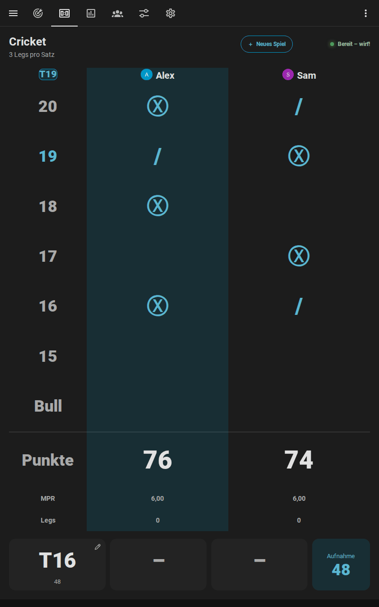
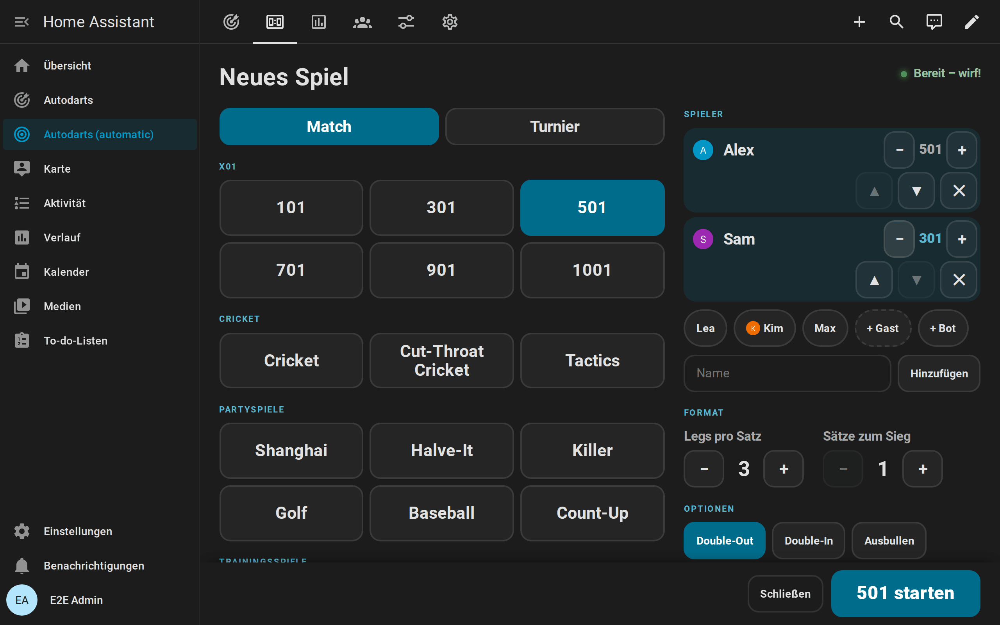
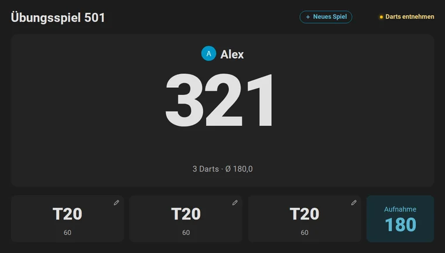
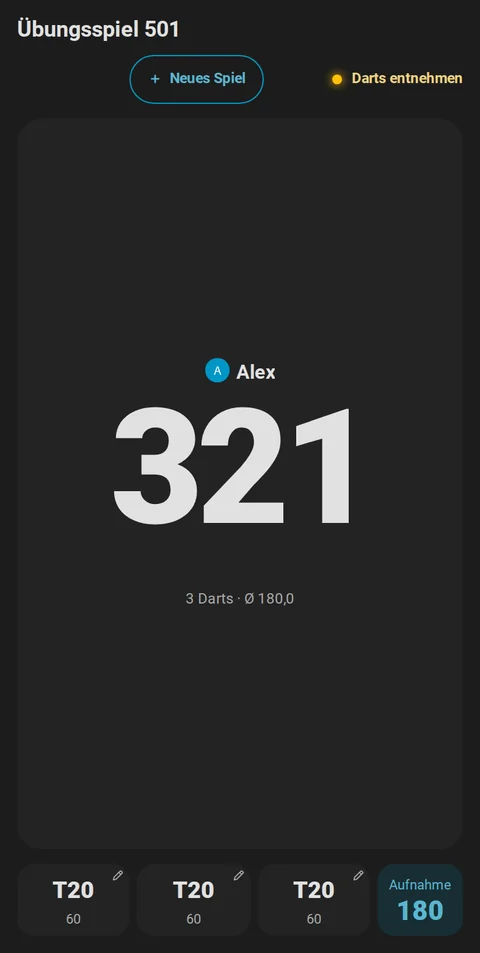
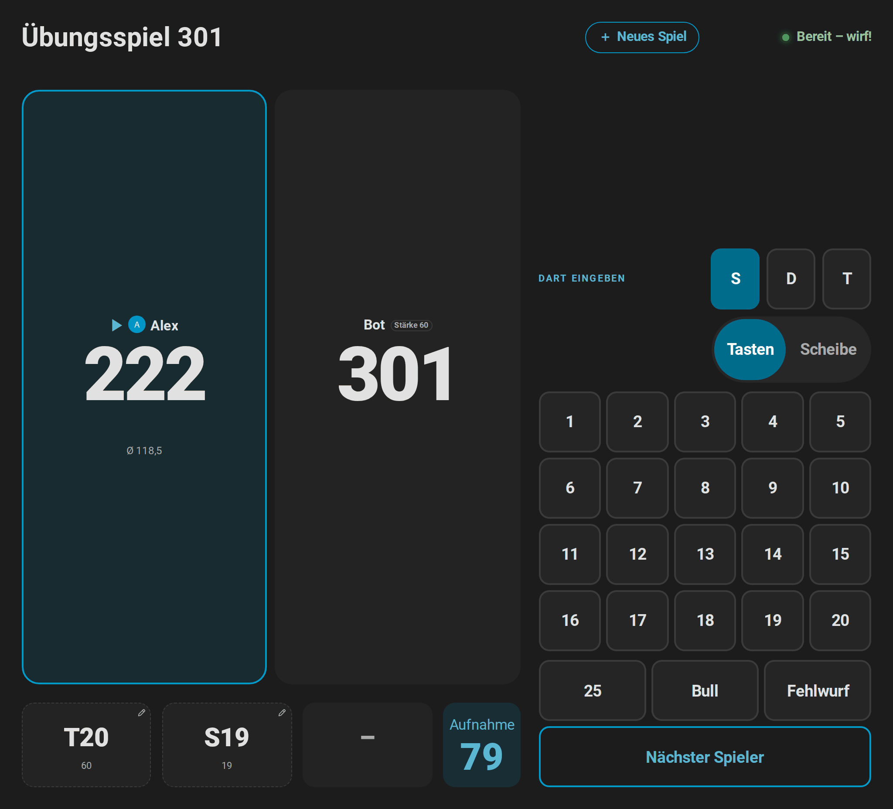
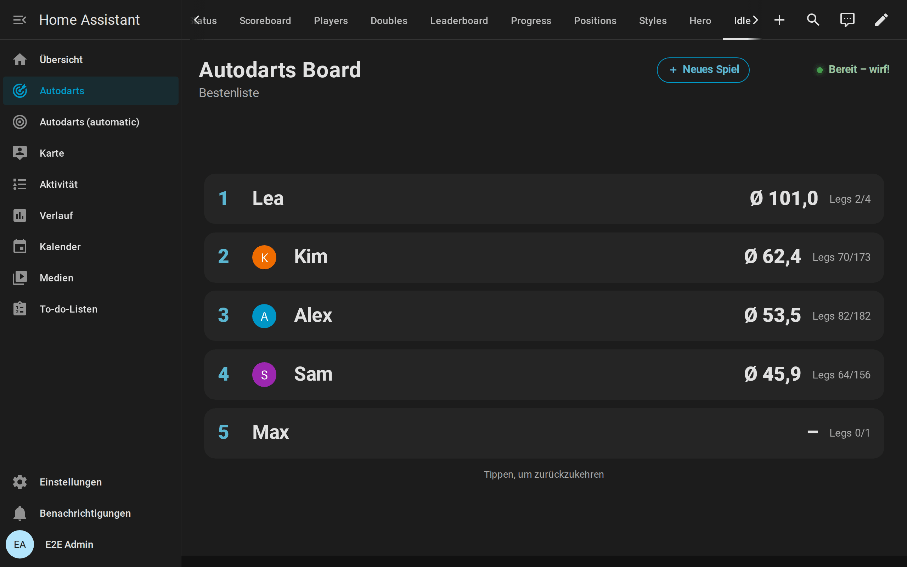

# Anzeigetafel am Board

[← Dokumentation](README.de.md) · [English](scoreboard.md)

Ein Tablet oder Fernseher neben dem Board macht deinen Dartraum zur Bühne: der Rest groß genug, um ihn vom Abwurf zu lesen, der Checkout-Weg des Spielers am Board, das nächste Spiel oder ein ganzes Turnier direkt dort gewählt, ein Caller und zwischen den Spielen eine Bestenliste. Alles läuft in Home Assistant; der Bildschirm braucht nur einen Browser.


**Auf dieser Seite:** [Was du brauchst](#was-du-brauchst) · [Den Bildschirm einrichten](#den-bildschirm-einrichten) · [Quer, hochkant und Fernseher](#quer-hochkant-und-fernseher) · [Das nächste Spiel wählen](#das-nächste-spiel-wählen) · [Während des Spiels](#während-des-spiels) · [Darts korrigieren und eingeben](#darts-korrigieren-und-eingeben) · [Turniere](#turniere) · [Der Caller](#der-caller) · [Zwischen den Spielen: Ruhemodus](#zwischen-den-spielen-ruhemodus) · [Tipps](#tipps) · [Wenn etwas nicht passt](#wenn-etwas-nicht-passt)

## Was du brauchst

- **Einen Bildschirm mit Browser:** ein Tablet an der Wand, einen Fernseher mit Browser oder einem kleinen PC, ein altes Handy. Alles, was dein Home Assistant öffnet, funktioniert.
- **Einen Home-Assistant-Benutzer für den Bildschirm.** Ein eigener Benutzer ohne Administratorrechte verhindert, dass am Bildschirm deine Einstellungen geändert werden. Der Bildschirm zeigt das Dashboard in der Sprache dieses Benutzers: Deutsch, Englisch, Niederländisch, Französisch oder Spanisch, andere [Sprachen](README.de.md#sprachen) auf Englisch.
- **Die Karten der Integration,** die sich von selbst laden. Auf dem Bildschirm musst du nichts installieren.

## Den Bildschirm einrichten

1. **Dashboard anlegen.** Öffne **Einstellungen → Dashboards → Dashboard hinzufügen → Autodarts**. Das [automatische Dashboard](cards.de.md#automatisches-dashboard) hat eine Ansicht *Anzeigetafel*, die die [Anzeigetafel-Karte](cards.de.md#anzeigetafel) über den ganzen Bildschirm zeigt.
2. **Ansicht auf dem Bildschirm öffnen.** Melde dich als Benutzer des Bildschirms an und öffne die Ansicht *Anzeigetafel* des Dashboards. Ihre Adresse endet auf `/scoreboard`, bei mehreren Boards auf `/scoreboard-1`, `/scoreboard-2` und so weiter; lege ein Lesezeichen an oder setze sie auf den Startbildschirm des Tablets.
3. **Vollbild.** Nutze den Vollbildmodus des Browsers oder einen Kiosk-Browser, der die Adresse beim Start öffnet. Lass den Bildschirm am Ladegerät eingeschaltet, in den Einstellungen des Tablets oder des Kiosk-Browsers.
4. **Einschalten, was dir gefällt.** Öffne das Menü des Dashboards (⋮) → **Dashboard bearbeiten**. Im Abschnitt *Ansicht Anzeigetafel* schaltest du den [Caller](#der-caller) und das [Tastenfeld](#darts-korrigieren-und-eingeben) ein und wählst die Spiele der [Spielauswahl](#das-nächste-spiel-wählen) und die Seiten des [Ruhemodus](#zwischen-den-spielen-ruhemodus); das Dashboard bleibt automatisch und bekommt die Ansichten späterer Versionen. Für jede andere Option baust du eine eigene Ansicht: eine Ansicht im Panel-Modus mit der Anzeigetafel und `full_height: true`, oder du wählst im Menü dieses Editors **Kontrolle übernehmen**, das aus dem Dashboard eines macht, das du selbst bearbeitest:

```yaml
type: custom:autodarts-scoreboard-card
full_height: true
caller: true
lobby_games: ["301", "501", cricket, killer, around_the_clock]
idle_after: 300
idle_panels: [leaderboard, today, last_match, clock]
```

Die [Anleitung zu den Karten](cards.de.md#anzeigetafel) nennt jede Option.

## Quer, hochkant und Fernseher

Die Anzeigetafel passt sich der Form des Bildschirms an. Mit `full_height: true` ist sie genau der Bildschirm unter der Werkzeugleiste: Ein Banner, die Aufnahme oder das Tastenfeld machen Zahlen und Tabellen kleiner, statt die Seite über den Bildschirm hinauszuschieben, sodass nichts gescrollt werden muss, vom kleinen 800 × 480-Display bis zum Fernseher. Auf einem Handy lässt sie Platz für die Adressleiste des Browsers und in der Companion-App für die Statusleiste und den Home-Balken.

<table>
  <tr>
    <td width="62%"></td>
    <td width="38%"></td>
  </tr>
  <tr>
    <td align="center">Tablet im Querformat oder Fernseher</td>
    <td align="center">Tablet im Hochformat</td>
  </tr>
</table>

- **Tablet im Querformat oder Fernseher:** die beste Wahl für X01 und die Partyspiele, deren Spielerkacheln nebeneinander stehen.
- **Tablet im Hochformat:** gut für Cricket, dessen Kreidetafel hoch ist, und für X01: Zwei Spieler stehen übereinander, drei oder vier zu zweit nebeneinander, und die Punkte nutzen die Höhe des Bildschirms.
- **Handy:** Alles passt auf einen Bildschirm, hochkant wie quer. Mit dem Tastenfeld oder der Scheibe zum Antippen wird der Punktestand jedes Spielers zu einer Zeile, sodass alle Punktestände sichtbar bleiben; quer nimmt das Tastenfeld die rechte Bildschirmhälfte von oben bis unten ein. Zum [Korrigieren eines Darts](#darts-korrigieren-und-eingeben) öffnet sich die Scheibe vergrößert, mit einer Lupe unter dem Finger.
- **Touch-Monitor:** Auf einem 24- oder 27-Zoll-Touchscreen neben dem Board ist jede Taste groß genug für einen Finger, auch mit angeschlossener Maus, und die Scheibe zum Antippen hat die Lupe und den Zwei-Finger-Zoom eines Handys.
- **Entfernung:** Der Rest ist der größte Text auf dem Bildschirm und wächst mit ihm. Je größer der Bildschirm, desto weiter weg ist er lesbar; ein Fernseher bedient also auch die Zuschauer.

## Das nächste Spiel wählen

Tippe zwischen den Spielen auf **Neues Spiel** unter dem Punktestand, während eines Spiels oben rechts. Einige Sekunden nach dem Ende eines Matches oder Trainingsspiels öffnet sich die Auswahl auch von selbst, mit der letzten Wahl für eine Revanche; ein stattdessen geworfener Dart schließt sie wieder.


1. **Spiel:** X01, die Cricket-Spiele, die Partyspiele und die Trainingsspiele, in Gruppen. `lobby_games` beschränkt die Auswahl auf die Spiele, die ihr spielt.
2. **Spieler:** Tippe auf einen Namen, um den Spieler hinzuzufügen, auf ▲ und ▼, um die Reihenfolge zu ändern, und auf ✕, um ihn zu entfernen. Spieler, die mit einer [Person verknüpft](statistics.de.md#spieler-und-personen) sind, die zu Hause ist, stehen vorn, mit ihrem Bild. Tippe einen neuen Namen ein oder füge einen Gast ohne Namen hinzu. Bei X01 setzen − und + neben einem Spieler [eigene Startpunkte](games.de.md#startpunkte-handicap). Bei X01 und den Cricket-Spielen setzt **+ Bot** den [Bot](games.de.md#gegen-den-bot-spielen) nach den Spielern dazu; − und + daneben ändern seine Stärke.
3. **Format und Optionen:** Legs pro Satz und Sätze zum Sieg; Double-Out und Double-In für X01; das [Ausbullen](games.de.md#ausbullen); *Teams* für vier Spieler bei X01 oder Cricket; *Three in a Bed* für [Wild Mouse](games.de.md#wild-mouse).
4. **Starten.** Die Anzeigetafel zeigt das Spiel sofort. Ist die Erkennung gestoppt, schaltet der Start sie ein, und die Auswahl sagt es vorher über der Taste. Die Starttaste bleibt am unteren Bildschirmrand, während die Seite scrollt. Während eines Spiels beendet *Spiel beenden* es nach einem zweiten Tippen.



Die Auswahl startet das Spiel mit [`autodarts.start_game`](entities.de.md#übungsspiel-starten-autodartsstart_game), genau wie eine Automation oder ein Sprachbefehl. Die [Anleitung zu Spielen](games.de.md#ein-spiel-starten) zeigt die anderen Wege.

## Während des Spiels

Die Anzeigetafel zeigt immer, was gespielt wird, und der Spieler am Board ist hervorgehoben:

| Spiel | Die Anzeigetafel zeigt |
| --- | --- |
| X01 | Rest, Legs, Sätze und Average jedes Spielers oder Teams; Checkout-Weg, Überwerfen oder Game shot des Spielers am Board und, wo kein Checkout möglich ist, der [Stellwurf](games.de.md#x01) mit dem Rest, den er stellt |
| Cricket-Spiele | Eine große Kreidetafel mit den Marks jedes Spielers oder Teams, den Punkten und den Marks pro Runde; die nächste offene Zahl oben links |
| Partyspiele | Runde und Ziel, die Punkte jedes Spielers, bei Killer Zahl und Leben, bei Golf und Baseball eine Scorekarte jedes Lochs oder Innings |
| Ausbullen | Das Feld des Darts jedes Spielers und seinen Abstand zur Mitte, den führenden Dart und *Gleichstand – noch einmal werfen*, wenn ein Gleichstand neu wirft |
| Trainingsspiele | Das Ziel in großer Schrift mit Runde, Punkten oder Trefferquote |

Am unteren Rand stehen die drei Darts der aktuellen Aufnahme und ihre Punkte, und solange das Board leer ist, die letzte Aufnahme; ein Tipp auf einen Dart [korrigiert ihn](#darts-korrigieren-und-eingeben). Beim Spielen bewegt sich nichts: Die Kacheln behalten ihre Höhe vom ersten Dart bis zum Game Shot. Ist ein Match entschieden, nennt ein Banner den Sieger mit dem Ergebnis, etwa *Alex gewinnt das Match 3 : 2!*, und nach einem X01- oder Cricket-Match tritt die [Match-Zusammenfassung](games.de.md#match-zusammenfassung) an die Stelle der Spieler: Averages, Checkout-Quote, höchster Checkout, 180er und das beste Leg aller Spieler.


<table>
  <tr>
    <td width="50%"></td>
    <td width="50%"></td>
  </tr>
  <tr>
    <td width="50%"></td>
    <td width="50%"></td>
  </tr>
</table>

## Darts korrigieren und eingeben


- **Ein falsch erkannter Dart:** Tippe ihn in der Aufnahme am unteren Rand an. Ein Tastenfeld öffnet sich mit S, D und T, den Zahlen 1 bis 20, 25, Bull und Fehlwurf; tippe den Multiplikator und die Zahl, und das Spiel zählt den Dart dort. Ein zweiter Tipp auf den Dart oder *Abbrechen* schließt das Tastenfeld.
- **Wo er wirklich steckt:** Wähle oben im Tastenfeld *Scheibe* und tippe auf die Stelle der Scheibe, an der der Dart steckt. Das Feld ergibt sich aus der Stelle, und der Dart zählt dort für die [Dart-Positionen](statistics.de.md#trefferbild-und-dart-positionen). Ein gestrichelter Ring zeigt, wo das Board ihn gesehen hat. Mit den Tasten korrigiert, hat der Dart keine Position, damit eine falsch erkannte Stelle nie die Streuung verfälscht.

  

- **Auf dem Handy:** Die Scheibe öffnet sich vergrößert um die Stelle, an der das Board den Dart gesehen hat, damit die Fingerkuppe das richtige Feld trifft. Halte einen Finger auf die Scheibe und schiebe ihn: Eine Lupe über dem Finger zeigt die Stelle vergrößert mit einem Kreuz, und der Dart landet dort, wo du loslässt. Mit zwei Fingern zoomst du weiter und verschiebst die Scheibe; die runde Lupen-Taste in der Ecke der Scheibe zeigt sie mit ihrem Minus ganz und vergrößert mit ihrem Plus wieder.

  

- **Zu spät bemerkt:** Nach der Entnahme zeigt die Kachel *Zuletzt* neben den Darts die letzte Aufnahme mit einem gebogenen Pfeil; ein Tipp darauf und ein zweiter auf das rote *Zurück?* nehmen sie zurück. Korrigiere ihre Darts und beende sie dann mit *Nächster Spieler*.
- **Von Hand eingegebene Darts:** Für Darts, die das Board übersehen hat, oder einen Spieler ohne Kameras schaltest du *Übungsspiel manuelle Eingabe* und die Option `keypad` der Karte ein. Das Tastenfeld gibt jedes angetippte Feld als Dart ein; *Nächster Spieler* beendet die Aufnahme. Im Querformat stehen Korrektur und Tastenfeld neben den Punkten, sodass beides auf den Bildschirm passt.
- **Was du siehst:** Ein Stift zeigt jeden Dart, den ein Tipp korrigiert; von Hand eingegebene oder korrigierte Darts haben einen gestrichelten Rahmen, die Darts des Bots eine Tönung in der Akzentfarbe.



Was eine Korrektur ändert, erklärt die [Anleitung zu Spielen](games.de.md#korrekturen-und-von-hand-eingegebene-darts), [alle Details](cards.de.md#darts-korrigieren-und-eingeben) stehen in der Anleitung zu den Karten.

## Turniere

Für ein [Turnier](games.de.md#turniere) mit drei bis acht Spielern führt der Bildschirm am Board durch den Abend:

1. **Hier starten:** Tippe auf **Neues Spiel**, dann auf **Turnier**. Wähle bis zu acht Spieler mit Namen, X01 mit Startpunkten als Handicap oder ein Cricket-Spiel, jeder gegen jeden oder K.-o.-System, Legs und Sätze, die Regeln, das Spiel um Platz 3 und eine zufällige Auslosung, und tippe auf **Turnier starten**.
2. **Während eines Matches** nennt die Titelzeile Runde und Match, etwa *Turnier · Halbfinale · Match 5 von 7*.
3. **Zwischen den Matches** bleibt die Zusammenfassung des Matches einige Sekunden stehen, dann erscheint die Tabelle (jeder gegen jeden) oder der Turnierbaum (K.-o.-System) mit dem nächsten Match und einem Countdown. **Jetzt starten** startet es sofort; sonst beginnt es von selbst, sobald die Darts aus dem Board sind.
4. **Am Ende** nennt ein Banner den Turniersieger, und Tabelle oder Turnierbaum bleiben stehen, bis ein neues Match beginnt. *Turnier beenden* in der Spielauswahl beendet ein Turnier vorzeitig. Ein neues Turnier, das während eines laufenden startet, beendet zuerst das laufende, nach einem zweiten Tipp.

<table>
  <tr>
    <td width="50%"></td>
    <td width="50%"></td>
  </tr>
</table>

Die Tabelle ordnet nach Punkten, zwei für einen Sieg, dann nach der Entscheidung bei Gleichstand aus den [Turnierregeln](games.de.md#turnierregeln). Im Turnierbaum gleitet, wer weiterkommt, in die nächste Runde. [Alle Details](cards.de.md#turniere).

## Der Caller

Mit `caller: true` sagt der Bildschirm am Board das Spiel selbst an, über den Lautsprecher des Tablets oder Fernsehers. Er braucht keine Lautsprecher und keine Sprachausgabe in Home Assistant.

1. Schalte `caller` im Editor der Karte ein, oder beim automatischen Dashboard in seinen Einstellungen: Menü (⋮) → **Dashboard bearbeiten** → *Ansicht Anzeigetafel*.
2. Browser spielen Ton erst nach einem Tippen ab: Tippe einmal auf **Caller** auf der Anzeigetafel. Lautsprechersymbol und gedrückte Taste zeigen, dass er an ist; ein weiteres Tippen schaltet ihn stumm.

Er sagt nur an, was zählt, in der Sprache des Benutzers am Bildschirm: Deutsch, Englisch, Niederländisch, Französisch oder Spanisch.

- **X01:** die Punkte einer Aufnahme, „Überworfen“ beim Überwerfen, „Keine Punkte“ vor dem öffnenden Double, „du brauchst 81“, sobald der Rest checkbar ist, „stell dir die 32“, wenn nur ein Stellwurf möglich ist, den Game shot eines Legs und des Matches und eine Fanfare bei einer 180. Der Bot heißt *Bot*.
- **Cricket-Spiele:** die Marks einer Aufnahme, etwa „5 Marks“. **Shanghai** und **Halve-It:** die Punkte auf das Ziel; **Count-Up:** die Punkte der Aufnahme; **Baseball:** die Runs.
- **Checkout-Training, 121-Checkout und Catch 40:** was der nächste Versuch braucht.
- **Turniere:** jedes Match beim Start, „Nächstes Match: Alex gegen Sam“, und den Sieger des Turniers.
- Darts nach dem Überwerfen oder einem Game shot werden nicht angesagt. Killer, Golf und die anderen Trainingsspiele bekommen keine Punktansagen.

`call_scores`, `call_checkouts`, `call_results` und `call_sounds` schalten jede Art von Ansage ein oder aus. Welche Stimme spricht, hängt von Browser und Betriebssystem ab: Offline-Stimmen des Betriebssystems behalten die Ansagen bei dir zu Hause; manche Browser nutzen Online-Stimmen, die den Text an ihren Anbieter schicken. Für Lautsprecher im Raum nutzt du stattdessen die [Blueprints Dart caller und Practice caller](automations.de.md#welcher-caller).

## Zwischen den Spielen: Ruhemodus

Läuft kein Spiel oder ist ein Match oder Trainingsspiel entschieden und wirft oder tippt `idle_after` Sekunden lang niemand (standardmäßig 3 Minuten), zeigt die Anzeigetafel ihre Seiten im Wechsel: Tabelle oder Turnierbaum eines Turniers, die Bestenliste, die Bestleistungen des Boards, die Darts von heute zum Tagesziel, das letzte Match und eine Uhr.



Ein Dart, ein neues Spiel oder ein Tippen irgendwohin beendet den Ruhemodus; eine Spielauswahl, die du geöffnet hattest, kommt so zurück, wie du sie verlassen hast. `idle_panels` wählt die Seiten und ihre Reihenfolge, `idle_interval`, wie lange jede zu sehen ist. Auf Geräten, die reduzierte Bewegung wünschen, wechseln die Seiten ohne Überblendung. [Alle Seiten](cards.de.md#ruhemodus).

## Tipps

- **Die Live-Karte auf einem zweiten Bildschirm:** Ein Handy oder zweites Tablet mit der [Live-Karte](cards.de.md#live-karte) zeigt die Scheibe mit jedem Dart dort, wo er gelandet ist, neben der Anzeigetafel.
- **Bilder der Spieler:** [Verknüpfe die Spieler mit Personen](statistics.de.md#spieler-und-personen) von Home Assistant; Anzeigetafel, Spielauswahl und Ruhemodus zeigen ihre Bilder, und Spieler, die zu Hause sind, stehen vorn.
- **Licht und Ton:** Die [Lichtshow](automations.de.md#light-show) und der [Übungs-Caller](automations.de.md#practice-caller) reagieren auf dasselbe Spiel, mit den Lampen und Lautsprechern deines Zuhauses.
- **Mehrere Boards:** Jedes Board bekommt im automatischen Dashboard eine eigene Ansicht *Anzeigetafel*; für eine eigene Ansicht wählst du das Board im Editor der Karte.
- **Barrierefreiheit:** Die Anzeigetafel folgt deinem Theme mit Text, der in seinen Farben lesbar bleibt, meldet Screenreadern den Sieger, markiert den Spieler am Board, liest die Cricket-Marks als Wörter und die Herzen im Killer als Leben vor, behält den Fokus auf der Taste, die du gedrückt hast, und wünscht das Gerät reduzierte Bewegung, füllt sie den Turnierbaum ohne Gleiten und wechselt die Seiten des Ruhemodus ohne Überblendung. [Barrierefreiheit](cards.de.md#barrierefreiheit).

## Wenn etwas nicht passt

| Was du siehst | Was hilft |
| --- | --- |
| Darts werden nicht gezählt | Die Erkennung ist gestoppt: Der Status oben rechts zeigt *Erkennung gestoppt*. Der Start in der Spielauswahl schaltet sie ein; sonst schaltest du sie im [Board-Status](cards.de.md#board-status) oder in der Live-Karte ein. Prüfe außerdem, dass *Übungsspiel* nicht auf *Aus* steht und kein [Online-Match](online-matches.de.md) das Board belegt. |
| Der Caller bleibt stumm | Tippe nach jedem Neuladen der Seite einmal auf **Caller**: Browser spielen Ton erst nach einem Tippen ab. Prüfe die Lautstärke des Geräts. |
| Die Spielauswahl öffnet sich nicht | Sie öffnet sich nie in der Vorschau des Karteneditors und nicht mit `lobby: false`. |
| Nach einem Update zeigt der Bildschirm eine alte Version der Karte | Lade die Seite neu. In der Home-Assistant-App nutzt du *Einstellungen → Companion-App → Fehlerbehebung → Frontend-Cache zurücksetzen*. |
| Der Ruhemodus beginnt während eines Spiels | Der Ruhemodus wartet `idle_after` Sekunden ohne Darts und Tippen, und nur, wenn kein Spiel läuft oder das Spiel entschieden ist. Erhöhe `idle_after` oder setze `idle: false`. |
| Ein Tipp auf einen Dart bewirkt nichts | Der Dart gehört dem Bot, die Karte hat `corrections: false`, oder es ist die Vorschau des Karteneditors. |
| Das Tastenfeld erscheint nicht | Es braucht `keypad: true` in der Karte (im automatischen Dashboard: seine Einstellungen, *Ansicht Anzeigetafel*) und eingeschaltete *Übungsspiel manuelle Eingabe*, und es wartet, solange der Bot am Board ist. |
| Kein Bild neben einem Namen | Der Spieler ist mit keiner Person verknüpft, oder die Person hat kein Bild. Siehe [Spieler und Personen](statistics.de.md#spieler-und-personen). |

Mehr Hilfe: [Fehlerbehebung](troubleshooting.de.md).
