# Scoreboard at the board

[← Documentation](README.md) · [Deutsch](scoreboard.de.md)

A tablet or a TV next to the board turns your darts room into a stage: the score large enough to read from the oche, the checkout route of the player at the board, the next game or a whole tournament chosen right there, a caller, and between games a leaderboard. Everything runs in Home Assistant; the screen only needs a browser.

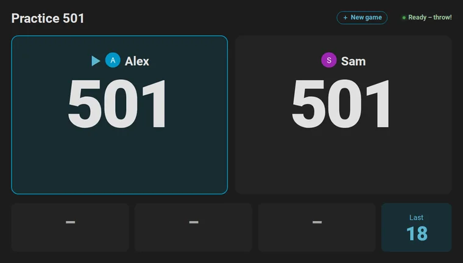

**On this page:** [What you need](#what-you-need) · [Set up the screen](#set-up-the-screen) · [Landscape, portrait and TV](#landscape-portrait-and-tv) · [Choose the next game](#choose-the-next-game) · [During the game](#during-the-game) · [Correct and enter darts](#correct-and-enter-darts) · [Tournaments](#tournaments) · [The caller](#the-caller) · [Between games: idle mode](#between-games-idle-mode) · [Tips](#tips) · [If something is off](#if-something-is-off)

## What you need

- **A screen with a browser:** a tablet on the wall, a TV with a browser or a small PC, an old phone. Anything that opens your Home Assistant works.
- **A Home Assistant user for the screen.** A user of its own, without administrator rights, keeps the screen from changing your settings. The screen shows the dashboard in that user's language: English, German, Dutch, French or Spanish, other [languages](README.md#languages) in English.
- **The integration's cards,** which load by themselves. There is nothing to install on the screen.

## Set up the screen

1. **Create the dashboard.** Go to **Settings → Dashboards → Add dashboard → Autodarts**. The [automatic dashboard](cards.md#automatic-dashboard) has a *Scoreboard* view that shows the [scoreboard card](cards.md#scoreboard-card) across the whole screen.
2. **Open the view on the screen.** Sign in as the screen's user and open the dashboard's *Scoreboard* view. Its address ends in `/scoreboard`, with several boards in `/scoreboard-1`, `/scoreboard-2` and so on; bookmark it or put it on the home screen of the tablet.
3. **Go full screen.** Use the browser's full-screen mode or a kiosk browser that opens the address at start. Keep the screen awake while it is on the charger, in the settings of the tablet or the kiosk browser.
4. **Switch on what you like.** Open the dashboard's menu (⋮) → **Edit dashboard**. In the section *Scoreboard view*, switch on the [caller](#the-caller) and the [keypad](#correct-and-enter-darts), and choose the games of the [new game screen](#choose-the-next-game) and the panels of [idle mode](#between-games-idle-mode); the dashboard stays automatic and gets the views of later releases. For every other option, build a view of your own: a view in panel mode with the scoreboard card and `full_height: true`, or choose **Take control** in that editor's menu, which turns the dashboard into one you edit yourself:

```yaml
type: custom:autodarts-scoreboard-card
full_height: true
caller: true
lobby_games: ["301", "501", cricket, killer, around_the_clock]
idle_after: 300
idle_panels: [leaderboard, today, last_match, clock]
```

The [card guide](cards.md#scoreboard-card) lists every option.

## Landscape, portrait and TV

The scoreboard adapts to the shape of the screen. With `full_height: true` it is exactly the screen below the toolbar: a banner, the visit or the keypad make the numbers and tables smaller instead of pushing the page past the screen, so nothing needs scrolling, from a small 800 × 480 display to a TV. On a phone it leaves room for the browser's address bar, and in the companion app for the status bar and the home indicator.

<table>
  <tr>
    <td width="62%">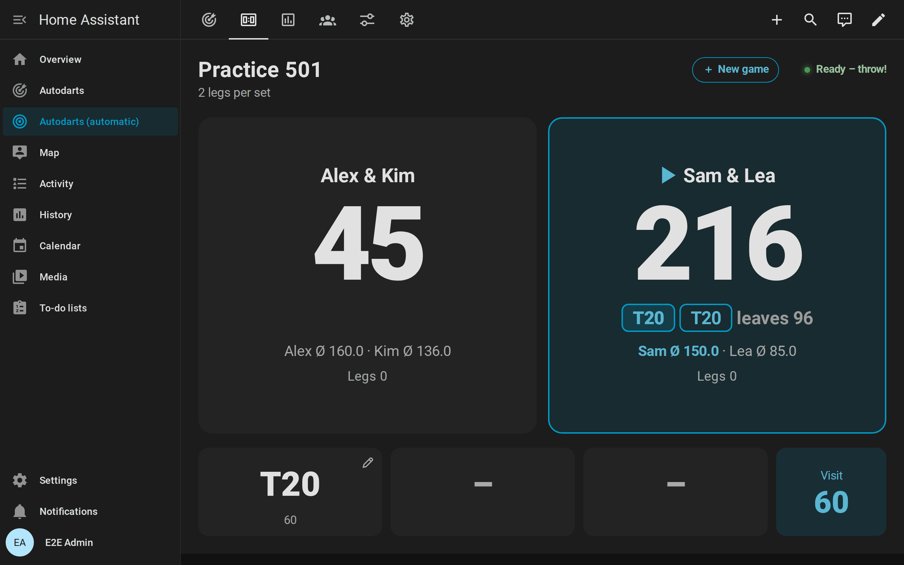</td>
    <td width="38%">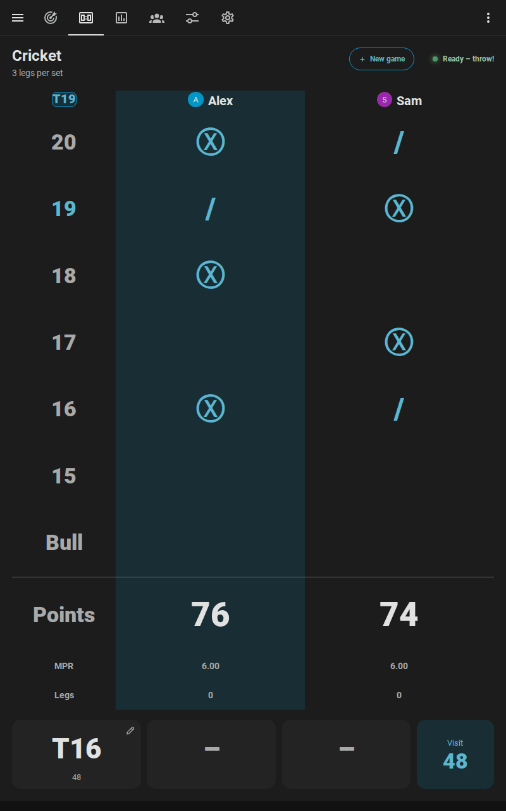</td>
  </tr>
  <tr>
    <td align="center">Landscape tablet or TV</td>
    <td align="center">Portrait tablet</td>
  </tr>
</table>

- **Landscape tablet or TV:** the best choice for X01 and the party games, whose player tiles sit side by side.
- **Portrait tablet:** fine for Cricket, whose chalkboard is tall, and for X01: two players stand one above the other, three or four two by two, and the scores use the height of the screen.
- **Phone:** everything fits one screen, upright or on its side. With the keypad or the board to tap, every player's score becomes one line, so all scores stay in sight; on its side, the keypad takes the right half of the screen from top to bottom. To [correct a dart](#correct-and-enter-darts), the board opens zoomed in, with a loupe under the finger.
- **Touch monitor:** on a 24 or 27 inch touch screen beside the board, every button is large enough for a finger, also with a mouse plugged in, and the board to tap has the loupe and the two-finger zoom of a phone.
- **Distance:** the remaining score is the largest text on the screen and grows with it. The bigger the screen, the farther away it reads, so a TV also serves the people watching.

## Choose the next game

Tap **New game** below the score between games, or at the top right during a game. The screen also opens by itself a few seconds after a match or a training game ends, with the last choice ready for a rematch; a dart thrown instead closes it again.

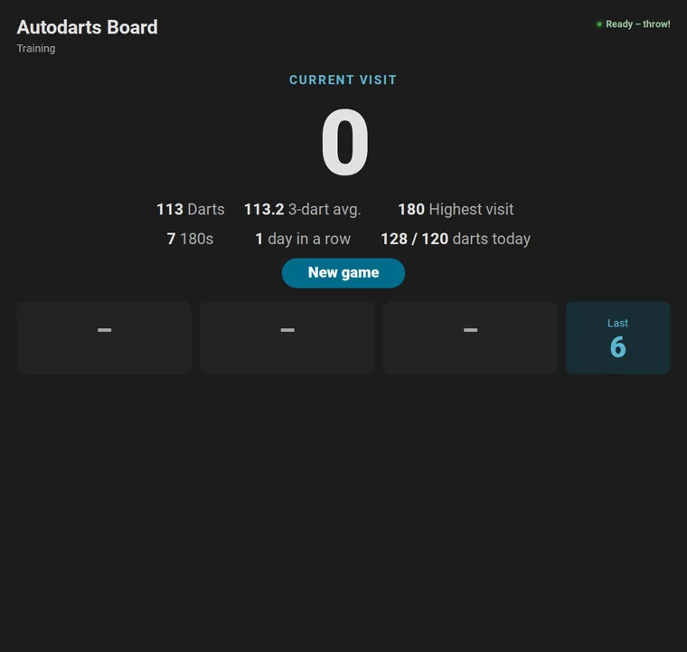

1. **Game:** X01, the Cricket games, the party games and the training games, grouped. `lobby_games` limits the choice to the games you play.
2. **Players:** tap a name to add the player, ▲ and ▼ to change the order, ✕ to remove them. Players [linked to a person](statistics.md#players-and-persons) who is at home come first, with their picture. Type a new name, or add a guest without one. In X01, − and + beside a player set a [start score](games.md#start-scores-handicap) of their own. In X01 and the Cricket games, **+ Bot** seats the [bot](games.md#playing-against-the-bot) after the players; − and + beside it change its level.
3. **Format and options:** legs per set and sets to win; double out and double in for X01; the [bull-off](games.md#bull-off); *Teams* for four players of X01 or Cricket; *Three in a bed* for [Wild Mouse](games.md#wild-mouse).
4. **Start.** The scoreboard shows the game at once. If detection is stopped, the start switches it on, and the screen says so above the button beforehand. The start button stays at the bottom of the screen while the page scrolls. During a game, *End game* stops it after a second tap.

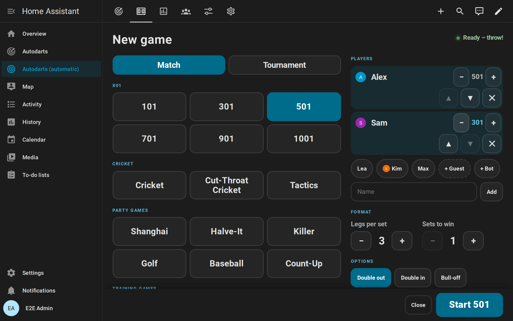

The screen starts the game with [`autodarts.start_game`](entities.md#start-a-practice-game-autodartsstart_game), exactly like an automation or a voice command would. The [games guide](games.md#start-a-game) shows the other ways.

## During the game

The scoreboard always shows what is being played, and the player at the board is outlined:

| Game | The scoreboard shows |
| --- | --- |
| X01 | Every player's or team's remaining score, legs, sets and average; the checkout route, a bust or the game shot of the player at the board, and where no checkout exists the [setup](games.md#x01) with the score it leaves |
| Cricket games | A large chalkboard with the marks of every player or team, the points and the marks per round; the next open number in the top-left corner |
| Party games | The round and the target, every player's points, in Killer their number and lives, in Golf and Baseball a scorecard of every hole or inning |
| Bull-off | The bed of every player's dart and its distance from the center, the dart that leads, and *Tie – throw again* when a tie throws again |
| Training games | The target in large type with the round, the points or the hit rate |

Along the bottom it shows the three darts of the current visit and their score, and while the board is empty the last visit; a tap on a dart [corrects it](#correct-and-enter-darts). Nothing moves while you play: the tiles keep their height from the first dart to the game shot. When a match is decided, a banner names the winner with the result, for example *Alex wins the match 3 : 2!*, and after an X01 or Cricket match the [match summary](games.md#match-summary) takes the place of the players: averages, checkout rate, highest checkout, 180s and the best leg of everybody.

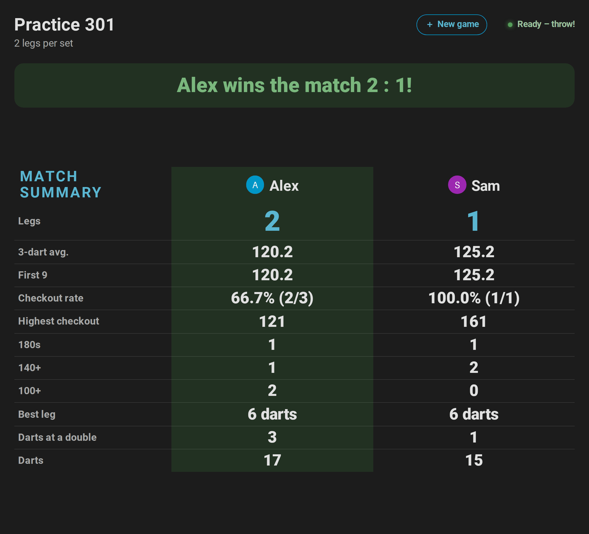

<table>
  <tr>
    <td width="50%">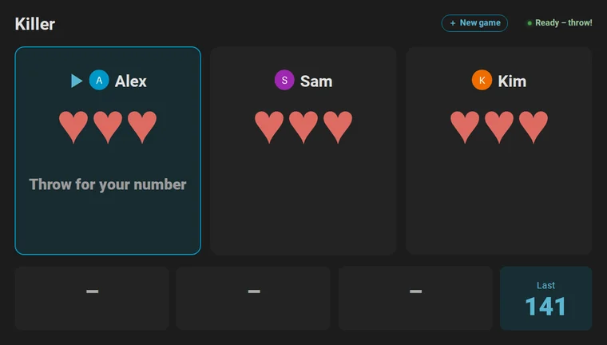</td>
    <td width="50%">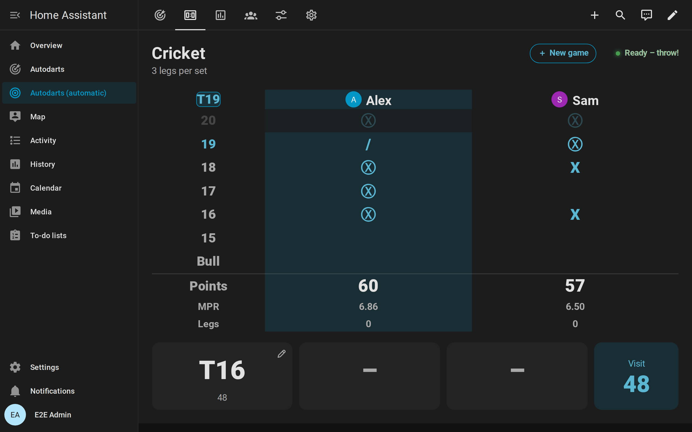</td>
  </tr>
  <tr>
    <td width="50%">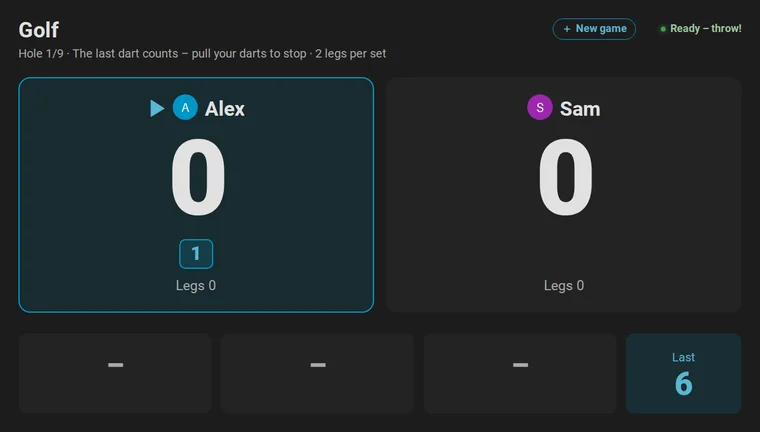</td>
    <td width="50%">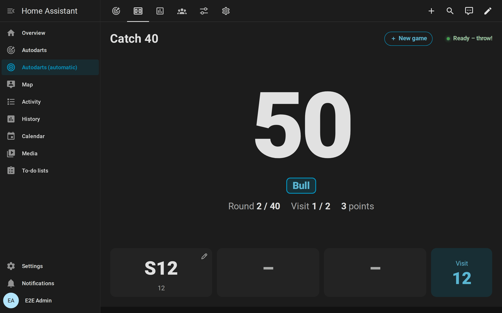</td>
  </tr>
</table>

## Correct and enter darts

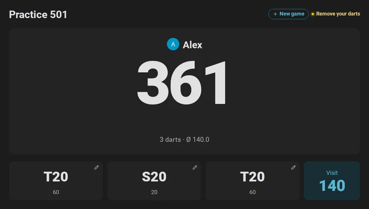

- **A dart read wrong:** tap it in the visit along the bottom. A pad opens with S, D and T, the numbers 1 to 20, 25, Bull and Miss; tap the multiplier and the number, and the game counts the dart there. A second tap on the dart, or *Cancel*, closes the pad.
- **Where it really is:** choose *Board* at the top of the pad and tap the spot on the board where the dart is. The bed follows from the spot, and the dart counts there for the [dart positions](statistics.md#heatmap-and-dart-positions). A dashed ring shows where the board saw it. Corrected with the keys, the dart has no position, so a misread spot never spoils the grouping.

  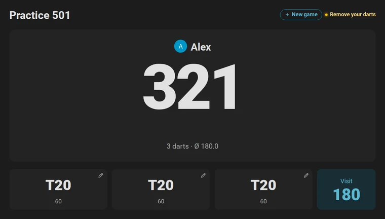

- **On a phone:** the board opens zoomed in around where the board saw the dart, so a fingertip finds the right bed. Hold a finger on the board and slide it: a loupe above the finger shows the spot enlarged with a cross, and the dart goes where the finger lets go. Two fingers zoom further and move the board; the round magnifier in the board's corner shows all of it with its minus and zooms back in with its plus.

  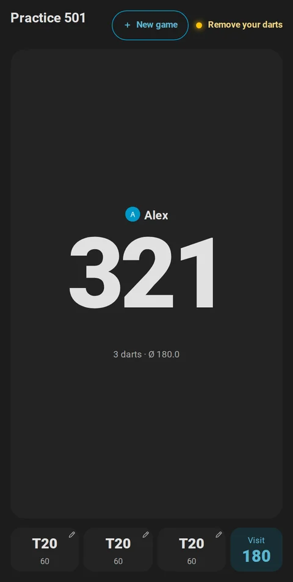

- **A visit noticed too late:** after the takeout, the tile *Last* beside the darts shows the last visit with a curved arrow; a tap on it and a second one on the red *Undo?* take it back. Correct its darts, then end it with *Next player*.
- **Darts entered by hand:** for darts the board missed, or a player without cameras, switch on *Practice manual entry* and the card's `keypad` option. The keypad enters every tapped bed as a dart; *Next player* ends the visit. On a landscape screen, the pad and the keypad sit beside the scores, so both fit the screen.
- **What you see:** a pencil marks every dart that a tap corrects; darts entered or corrected by hand get a dashed frame, and the bot's darts a tint of the accent color.

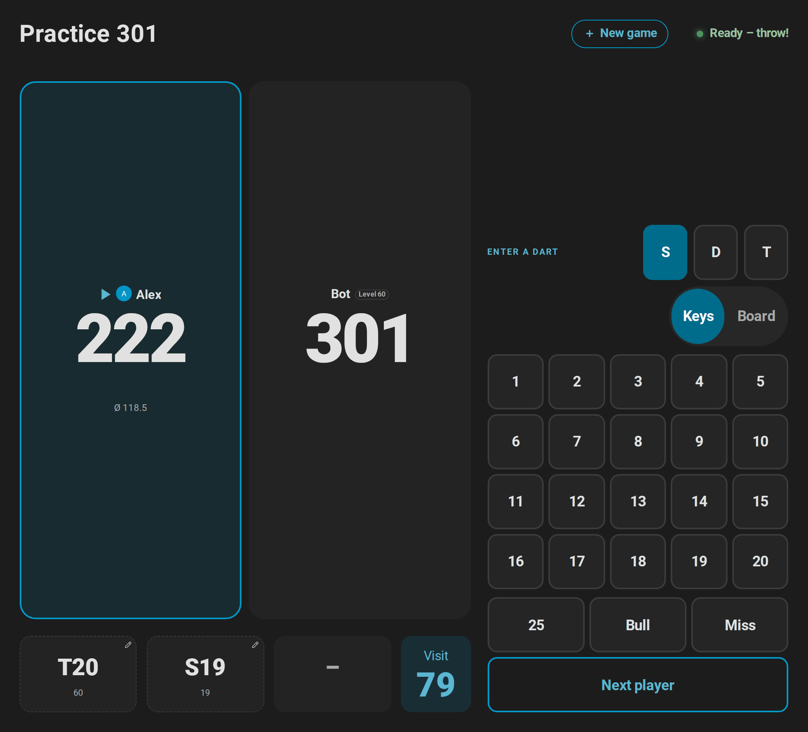

The [games guide](games.md#corrections-and-darts-entered-by-hand) explains what a correction changes, [all details](cards.md#correcting-and-entering-darts) are in the card guide.

## Tournaments

For a [tournament](games.md#tournaments) of three to eight players, the screen at the board runs the evening:

1. **Start it here:** tap **New game**, then **Tournament**. Choose up to eight named players, X01 with start scores for a handicap or a Cricket game, round robin or knockout, legs and sets, the rules, the match for third place and a random draw, and tap **Start tournament**.
2. **During a match,** the title line names the round and the match, for example *Tournament · Semi-final · Match 5 of 7*.
3. **Between the matches,** the summary of the match stays for a few seconds, then the table of a round robin or the bracket of a knockout shows, with the next match and a countdown. **Start now** starts it at once; otherwise it starts by itself as soon as the darts are out of the board.
4. **At the end,** a banner names the winner of the tournament, and the table or the bracket stays until a new match begins. *Stop tournament* on the new game screen ends a tournament early. Starting a new tournament while one is played stops that one first, after a second tap.

<table>
  <tr>
    <td width="50%">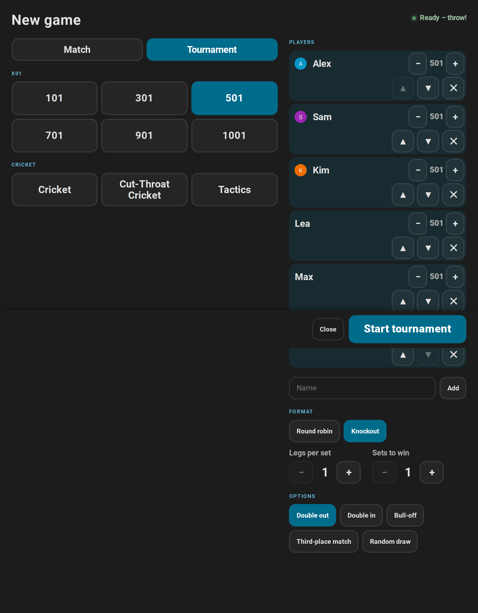</td>
    <td width="50%">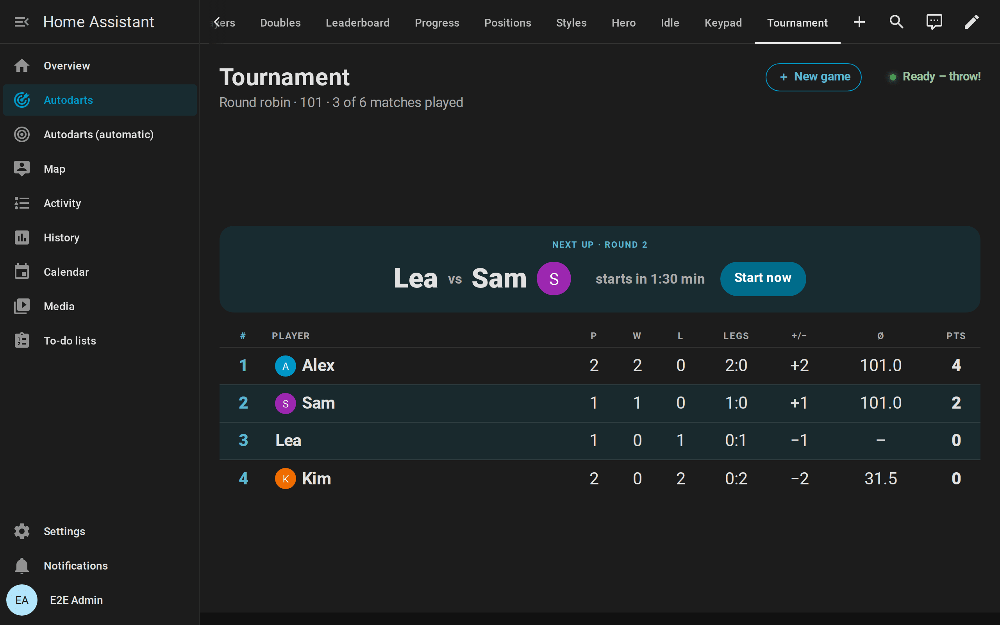</td>
  </tr>
</table>

The table ranks by points, two for a win, then by the tie-breakers of the [tournament rules](games.md#tournament-rules). In the bracket, a player who goes on slides into the next round. [All details](cards.md#tournaments).

## The caller

With `caller: true`, the screen at the board calls the game itself, through the speaker of the tablet or the TV. It needs no speakers or text-to-speech in Home Assistant.

1. Switch on `caller` in the card's editor, or for the automatic dashboard in its settings: menu (⋮) → **Edit dashboard** → *Scoreboard view*.
2. Browsers play sound only after a tap: tap **Caller** on the scoreboard once. The speaker symbol and the pressed button show that it is on; tap again to mute it.

It calls only what counts, in the language of the screen's user: English, German, Dutch, French or Spanish.

- **X01:** the points of a visit, "No score" for a bust or a visit before the opening double, "you require 81" whenever the remaining score can be finished, "leave yourself 32" when only a setup is possible, the game shot of a leg and the match, and a fanfare for a 180. The bot is called *Bot*.
- **Cricket games:** the marks of a visit, such as "5 marks". **Shanghai** and **Halve-It:** the points on the target; **Count-Up:** the points of the visit; **Baseball:** the runs.
- **Checkout training, 121 checkout and Catch 40:** what the next attempt requires.
- **Tournaments:** every match as it starts, "Next match: Alex against Sam", and the winner of the tournament.
- Darts after a bust or a game shot are not called. Killer, Golf and the other training games get no score calls.

`call_scores`, `call_checkouts`, `call_results` and `call_sounds` switch each kind of call on or off. Which voice speaks depends on the browser and the operating system: offline voices of the operating system keep the calls in your home; some browsers use online voices that send the text to their provider. For speakers in the room, use the [dart caller and practice caller blueprints](automations.md#which-caller) instead.

## Between games: idle mode

When no game runs, or a match or training game is decided, and nobody throws or taps for `idle_after` seconds (3 minutes by default), the scoreboard shows its panels in turn: the table or bracket of a tournament, the leaderboard, the personal bests of the board, today's darts towards the daily goal, the last match and a clock.

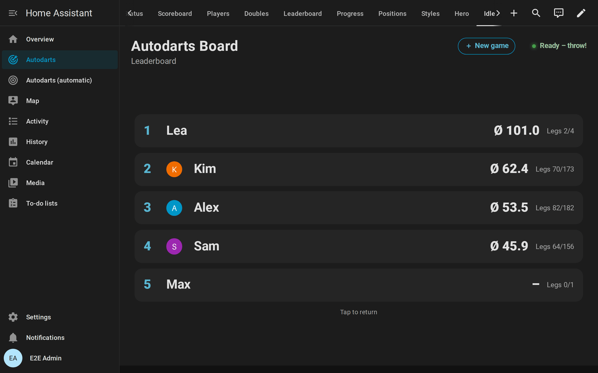

A dart, a new game or a tap anywhere ends idle mode; a new game screen you had opened comes back as you left it. `idle_panels` chooses the panels and their order, `idle_interval` how long each one shows. On devices set to reduce motion, the panels change without fading. [All panels](cards.md#idle-mode).

## Tips

- **The live card on a second screen:** a phone or a second tablet with the [live card](cards.md#live-card) shows the board with every dart where it landed, next to the scoreboard.
- **Pictures of the players:** [link the players to persons](statistics.md#players-and-persons) of Home Assistant; the scoreboard, the new game screen and idle mode show their pictures, and players who are at home come first.
- **Light and sound:** the [light show](automations.md#light-show) and the [practice caller](automations.md#practice-caller) react to the same game, with the lights and speakers of your home.
- **Several boards:** every board gets its own *Scoreboard* view in the automatic dashboard; choose the board in the card's editor for a view of your own.
- **Accessibility:** the scoreboard follows your theme with text that stays readable in its colors, announces the winner to screen readers, marks the player at the board, reads the Cricket marks as words and Killer's hearts as lives, keeps the focus on the button you pressed, and when the device asks for reduced motion, it fills the tournament bracket without sliding and changes the panels of idle mode without fading. [Accessibility](cards.md#accessibility).

## If something is off

| What you see | What helps |
| --- | --- |
| Darts are not counted | Detection is stopped: the status at the top right says *Detection stopped*. The new game screen's start switches it on; otherwise switch it on with the [board status card](cards.md#board-status-card) or the live card. Also check that *Practice game* is not *Off* and that no [online match](online-matches.md) holds the board. |
| The caller stays silent | Tap **Caller** once after every reload of the page: browsers play sound only after a tap. Check the volume of the device. |
| The new game screen does not open | It never opens in the preview of the card editor, and not with `lobby: false`. |
| The screen shows an old version of the card after an update | Reload the page. In the Home Assistant app, use *Settings → Companion app → Debugging → Reset frontend cache*. |
| Idle mode starts during a game | Idle mode waits for `idle_after` seconds without darts and taps, and only when no game runs or the game is decided. Raise `idle_after`, or set `idle: false`. |
| A tap on a dart does nothing | The dart belongs to the bot, the card has `corrections: false`, or it is the preview of the card editor. |
| The keypad does not show | It needs the card's `keypad: true` (in the automatic dashboard: its settings, *Scoreboard view*) and *Practice manual entry* on, and it waits while the bot is at the board. |
| No picture next to a name | The player is not linked to a person, or the person has no picture. See [players and persons](statistics.md#players-and-persons). |

More help: [troubleshooting](troubleshooting.md).
