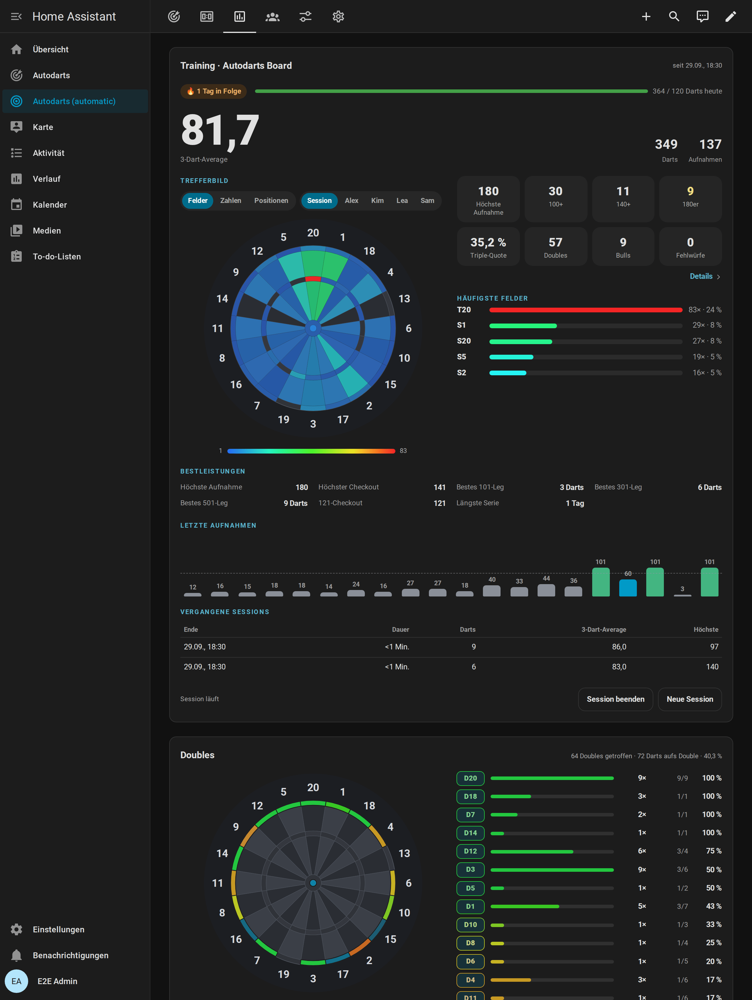
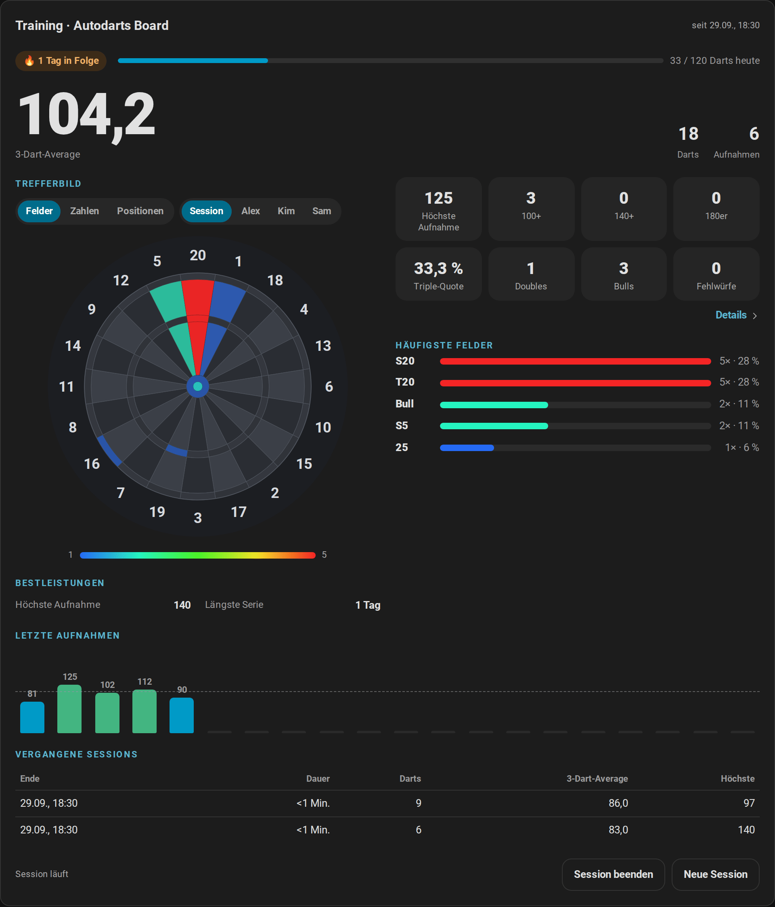
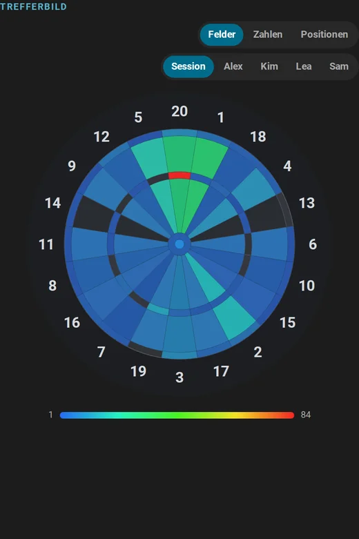
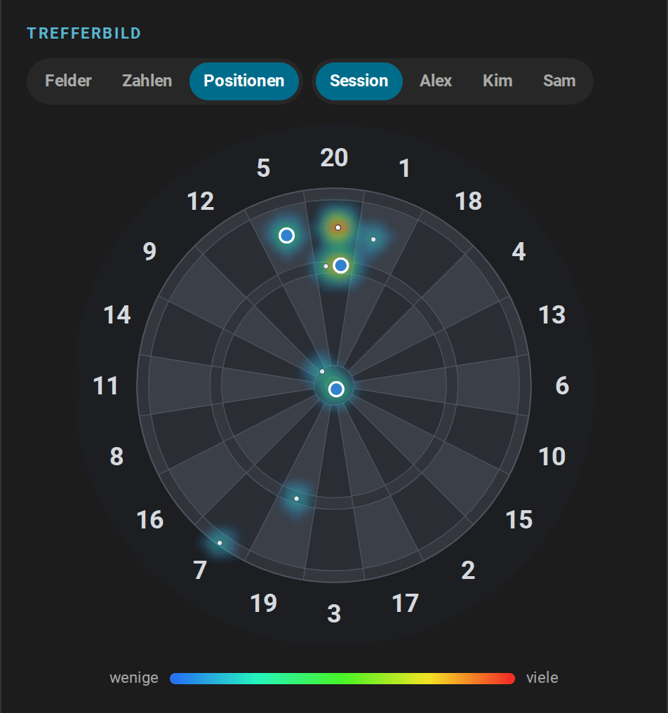
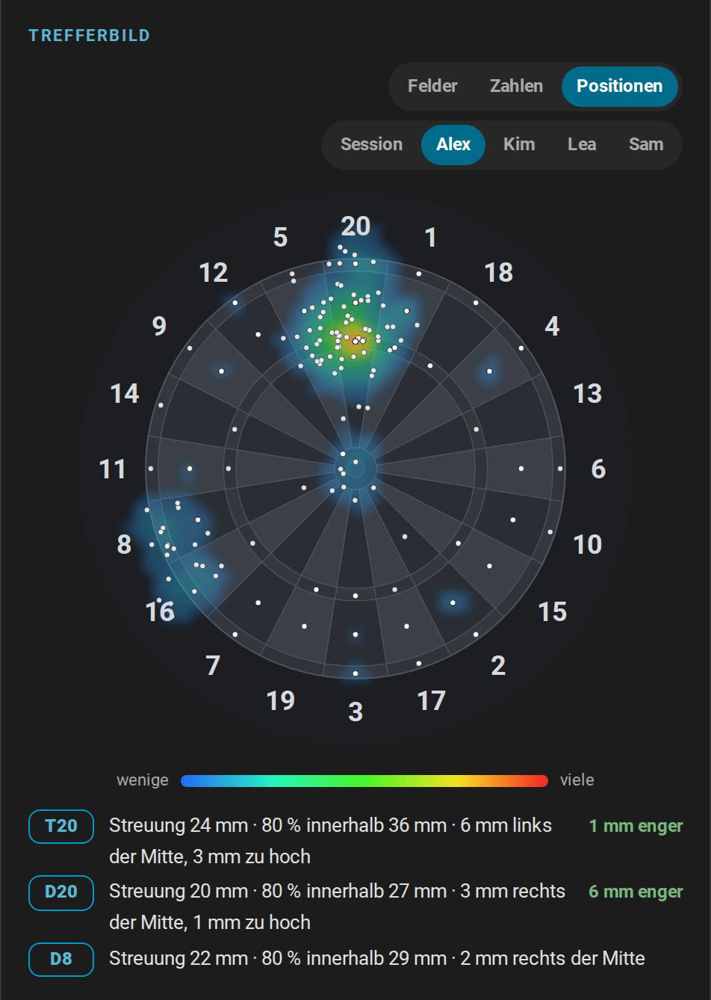
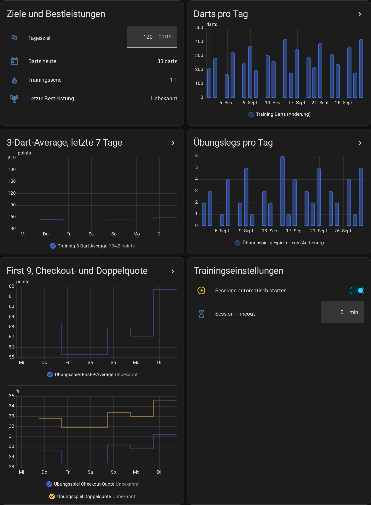
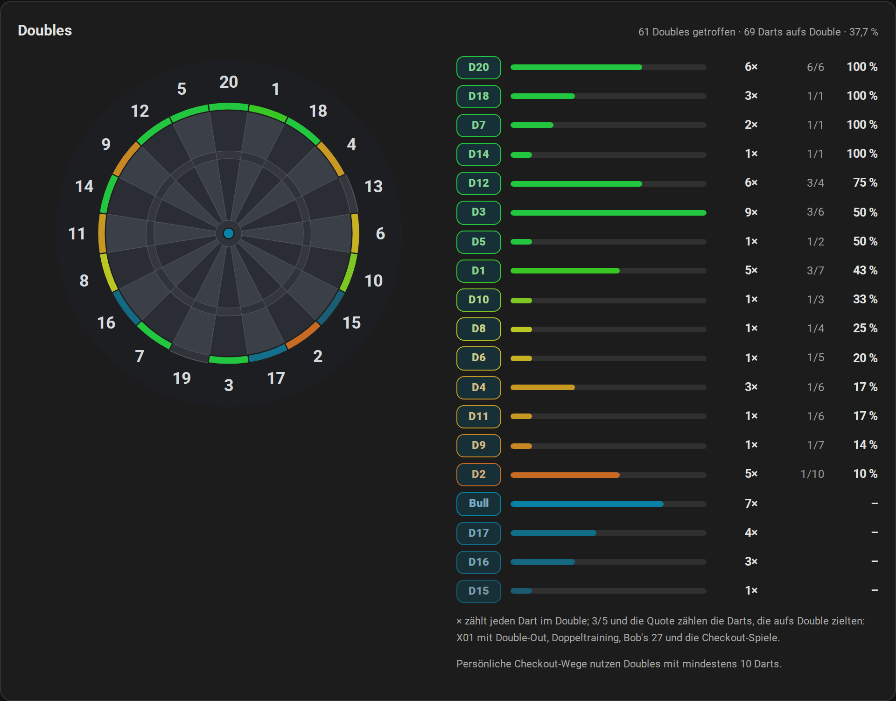
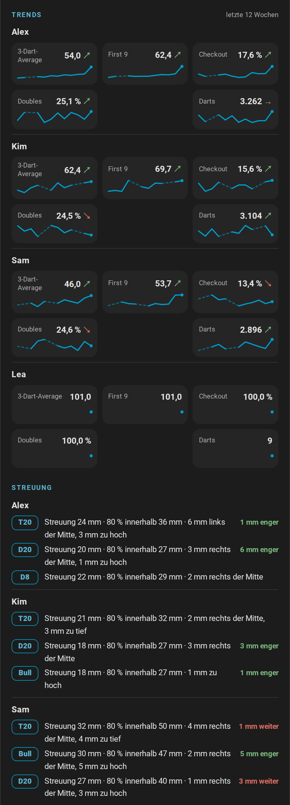
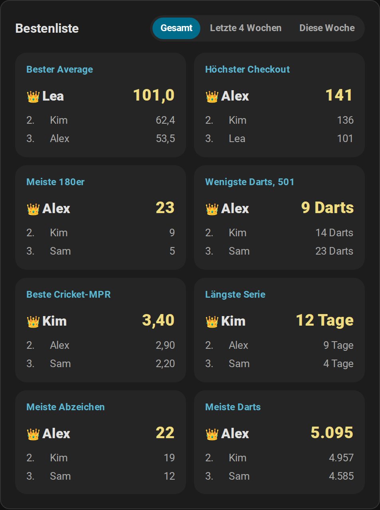
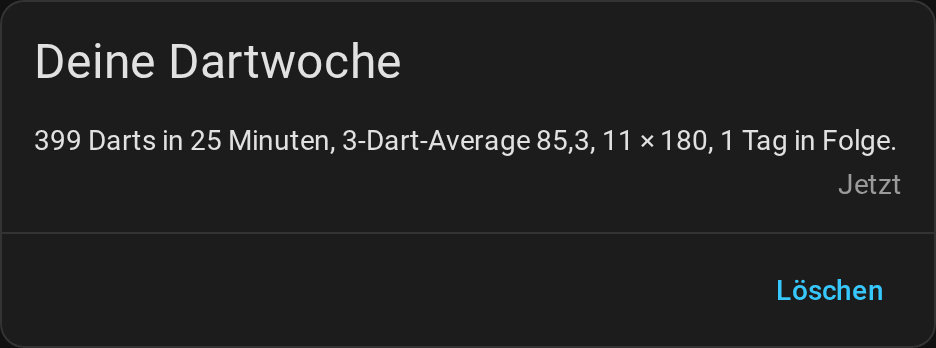

# Statistik und Spieler

[← Dokumentation](README.de.md) · [English](statistics.md)

Jeder Dart, den das Board erkennt, wird in Home Assistant zu einer Zahl: dein 3-Dart-Average, wohin deine Darts fliegen, deine Bestleistungen, deine Doubles und für jeden Spieler mit Namen ein Profil mit Abzeichen, Wochentrends und direkten Vergleichen. Alles bleibt bei dir zu Hause, übersteht Neustarts und füllt die Langzeitstatistik von Home Assistant, sodass du deine Entwicklung über Wochen und Monate siehst.



**Auf dieser Seite:** [Wo du was findest](#wo-du-was-findest) · [Trainingssessions](#trainingssessions) · [Bestleistungen, Serie und Tagesziel](#bestleistungen-serie-und-tagesziel) · [Trefferbild und Dart-Positionen](#trefferbild-und-dart-positionen) · [Fortschritt über die Zeit](#fortschritt-über-die-zeit) · [Doppelanalyse](#doppelanalyse) · [Spielerprofile](#spielerprofile) · [Erfolge](#erfolge) · [Trends und Streuung](#trends-und-streuung) · [Bestenliste](#bestenliste) · [Spieler und Personen](#spieler-und-personen) · [Wochenbericht](#wochenbericht) · [Trainingskalender](#trainingskalender) · [Export](#export) · [Deine Daten](#deine-daten)

## Wo du was findest

| Wo | Was es zeigt |
| --- | --- |
| [Trainingskarte](cards.de.md#trainingskarte) | Die laufende Session: 3-Dart-Average, Trefferbild nach Feldern, Zahlen oder Dart-Positionen für die Session oder jeden Spieler, Statistik, Bestleistungen, letzte Aufnahmen und vergangene Sessions |
| [Spielerkarte](cards.de.md#spielerkarte) | Statistik und Bestleistungen jedes Spielers mit Namen, Abzeichen, Wochentrends und Streuung, direkte Vergleiche, letzte Matches und der Export |
| [Bestenliste](cards.de.md#bestenliste) | Die Rekorde aller Spieler, insgesamt, in den letzten vier Wochen oder in dieser Woche |
| [Doubles-Karte](cards.de.md#doubles-karte) | Die Quote jedes Doubles, für alle oder einen Spieler |
| Ansichten *Training* und *Spieler* des [automatischen Dashboards](cards.de.md#automatisches-dashboard) | Trainingskarte, Doubles-Karte und Grafiken der Darts pro Tag, des 3-Dart-Averages, der Legs pro Tag und der Quoten des Übungsspiels; Spielerkarte und Bestenliste |
| [Ruhemodus](scoreboard.de.md#zwischen-den-spielen-ruhemodus) der Anzeigetafel | Die Bestenliste, die Bestleistungen des Boards, die Darts von heute und das letzte Match |
| Kalender von Home Assistant | Jede Session und jedes Match des letzten Jahres im [Trainingskalender](#trainingskalender) |
| Dein Handy | Der [Wochenbericht](#wochenbericht) |
| [Sensoren](entities.de.md) | Jeder Wert, für eigene Karten, Grafiken und Automationen |

## Trainingssessions

<picture>
  <source media="(prefers-color-scheme: light)" srcset="images/de/training-card-light.png">
  
</picture>

Eine Trainingssession zählt die Darts, die du wirfst, egal was du spielst: ein Online-Match, ein Übungsspiel oder nur ein paar Aufnahmen auf die 20.

- **Beginn:** Mit *Sessions automatisch starten* (Standard) startet der erste Dart eine Session. Du kannst eine auch bewusst starten, mit *Session starten* auf der Trainingskarte oder dem Schalter *Trainingssession*.
- **Ende:** *Session beenden* auf der Karte oder automatisch nach der Pause, die in *Session-Timeout* eingestellt ist. `0`, der Standard, lässt eine Session laufen, bis du sie beendest. *Neue Session* beendet die laufende Session und startet die nächste.
- **Was zählt:** Darts, Punkte, 3-Dart-Average, Aufnahmen, die höchste Aufnahme, 100+-, 140+- und 180er-Aufnahmen, Triples, Doubles, Bulls, Fehlwürfe und die Treffer jedes Feldes. Eine Aufnahme zählt als 100+, 140+ oder 180, sobald ihre Darts gezogen werden. Korrekturen des Boards oder auf der Anzeigetafel ändern die Summen mit, eine [zurückgenommene Aufnahme](games.de.md#korrekturen-und-von-hand-eingegebene-darts) verlässt sie, bis sie erneut verbucht wird, und [von Hand eingegebene Darts](games.de.md#korrekturen-und-von-hand-eingegebene-darts) zählen wie erkannte; die Darts des [Bots](games.de.md#gegen-den-bot-spielen) und Darts, die beim Start von Home Assistant im Board stecken, zählen nicht.
- **Verlauf:** Die letzten 20 Sessions bleiben mit ihren Summen erhalten; die Trainingskarte zeigt die letzten fünf. *Average der letzten Session* hält den 3-Dart-Average jeder beendeten Session, sein Verlauf ist also deine Entwicklung von Session zu Session.
- **Automationen:** `session_started` und `session_ended` starten die [Routine für Trainingssessions](automations.de.md#training-session-routine), und der [Trainingsbericht](automations.de.md#training-report) schickt deinen Tag.

[Alle Trainingsentitäten](entities.de.md#trainingssession) · [So wird gezählt](how-it-works.de.md#trainingssession)

## Bestleistungen, Serie und Tagesziel

Home Assistant behält den besten Wert jeder Bestleistung und meldet `personal_best`, wenn du eine übertriffst, etwa für die [Lichtshow](automations.de.md#light-show):

| Bestleistung | Aus |
| --- | --- |
| Höchste Aufnahme | Jeder Aufnahme mit bis zu drei Darts |
| Höchster Checkout | Gewonnenen X01-Legs mit Double-Out, auch im Team-Match, für den Spieler, der ausgecheckt hat |
| Wenigste Darts für 101 bis 1001 | Gewonnenen X01-Legs mit Double-Out, nicht im Team-Match, gezählt von den Startpunkten des Legs |
| Beste Marks pro Runde im Cricket | Gewonnenen Cricket-Legs, nicht im Team-Match |
| Bester Session-Average | Beendeten Sessions mit mindestens 30 Darts |
| Around the Clock, Doppeltraining | Den wenigsten Darts eines beendeten Spiels |
| Bob's 27, 121-Checkout, Catch 40, JDC Challenge, Singles-Training | Der höchsten Punktzahl |
| Längste Serie | Tagen in Folge mit mindestens einem Dart |

- **Trainingsserie:** die Tage in Folge mit mindestens einem Dart. Der heutige Tag unterbricht sie nicht; ein ganzer Tag ohne Darts schon.
- **Tagesziel:** Stelle *Tagesziel* auf die Darts, die du jeden Tag werfen willst. Die Trainingskarte zeigt einen Balken bis dorthin, und `daily_goal_reached` meldet einmal am Tag, wenn du es erreichst.
- Der erste Wert jeder Bestleistung setzt sie still; gleiche Werte zählen nicht als neue Bestleistung.

[Die Bestleistungen im Detail](entities.de.md#bestleistungen-serie-und-tagesziel) · [Welche Legs für welche Bestleistung zählen](how-it-works.de.md#bestleistungen-und-statistik)

## Trefferbild und Dart-Positionen



Das Trefferbild der Trainingskarte hat drei Modi, die die Umschalter über der Scheibe wählen:

- **Felder:** jedes Feld danach eingefärbt, wie oft du es getroffen hast, von Blau (selten) bis Rot (am häufigsten). Fahre mit der Maus über ein Feld für Anzahl und Anteil.
- **Zahlen:** Single, Double und Triple jeder Zahl zusammengefasst; das zeigt auf einen Blick, ob du zur 5 oder zur 1 abdriftest.
- **Positionen:** wo die Darts wirklich gelandet sind, aus den Positionen, die das Board meldet: eine geglättete Dichte mit den neuesten 300 Darts als Punkten und unter der Scheibe die [Streuung](#trends-und-streuung) an bis zu drei Feldern, auf die du gezielt hast. Bei der Session erscheinen die Darts der aktuellen Aufnahme sofort als blaue Pins; beim Ziehen gehen sie in die gespeicherten Darts über. Ein Dart neben der Scheibe samt Zahlenring wird nicht gezeichnet.



Der zweite Umschalter wählt, wessen Darts es zeigt: die laufende Session oder einen Spieler mit Namen mit all seinen Treffern und den Positionen seiner letzten 1000 Darts. Die häufigsten Felder folgen der Wahl.



```yaml
type: custom:autodarts-training-card
mode: positions
player: Alex
```

## Fortschritt über die Zeit

Home Assistant führt eine Langzeitstatistik der Summen und Averages, Stunde für Stunde und so lange du die Integration nutzt. Die Ansicht *Training* des automatischen Dashboards zeichnet sie:



- **Darts pro Tag** und **Übungslegs pro Tag** der letzten 30 Tage;
- der **3-Dart-Average** der letzten sieben Tage;
- **First-9-Average und Checkout-Quote** der letzten 10 X01-Legs und die **Doppelquote** derselben Legs, zusammen mit den letzten 10 Ergebnissen des Doppeltrainings und von Bob's 27.

Eigene Grafiken baust du mit der Statistik-Grafik-Karte von Home Assistant. Der 3-Dart-Average deiner Sessions, Woche für Woche, über drei Monate:

```yaml
type: statistics-graph
title: 3-Dart-Average pro Woche
entities:
  - sensor.autodarts_board_average_der_letzten_session
stat_types: [mean]
period: week
days_to_show: 90
chart_type: line
```

Die Entitäts-IDs hängen vom Namen deines Boards und der Sprache bei der Einrichtung ab; deine findest du auf der Geräteseite. Home Assistant berechnet die Langzeitstatistik einmal pro Stunde, ein neuer Tag erscheint also nach der nächsten vollen Stunde in den Grafiken.

## Doppelanalyse



Home Assistant zählt jedes Double, das du triffst, in jedem Spiel und im Training ohne Spiel, egal wohin der Dart zielte. Für die Quote zählt es zusätzlich jeden Dart aufs Double und ob er getroffen hat: bei X01 mit Double-Out, sobald ein Double den Rest checken könnte, im Doppeltraining, bei Bob's 27, im Checkout-Training, beim 121-Checkout und bei Catch 40 genauso wie bei X01 und im Double-Teil der JDC Challenge. Die [Doubles-Karte](cards.de.md#doubles-karte) zeigt jedes getroffene Double auf der Scheibe, wie oft du es getroffen hast und, wo Darts darauf zielten, seine Quote, für alle oder mit `player` für einen Spieler mit Namen. Ein Dart in der D20 beim Zielen auf die Triple 20 zählt als Treffer der D20, aber nicht für die Quote der D20. *Lieblingsdouble* nennt dein bestes Double mit mindestens 10 Darts.

Mit *Übungsspiel persönliche Checkout-Wege* bevorzugt der Checkout-Weg die stärksten Doubles des Spielers am Board: Ein Weg mit gleich vielen Darts zu einem Double mit besserer Quote gewinnt, solange er kein Double zum Stellen braucht. Als stark gilt ein Double ab 10 Darts darauf und mit einer Quote mindestens so hoch wie die des Spielers auf alle Doubles; ein nie getroffenes Double wird nie bevorzugt. [So wird der Weg gewählt](how-it-works.de.md#übungsspiel).

## Spielerprofile


Jeder Spieler mit Namen bekommt im Übungsspiel ein Profil mit Werten über seine ganze Zeit: gespielte und gewonnene Legs und Matches, 3-Dart-Average, First-9-Average, Checkout-Quote, Marks pro Runde, die höchste Aufnahme und der höchste Checkout, die besten Marks pro Runde und die wenigsten Darts für jede Startpunktzahl. Die [Spielerkarte](cards.de.md#spielerkarte) zeigt sie mit den direkten Vergleichen jedes Gegnerpaars und den letzten Matches.

- **Namen:** Ein Name ist derselbe Spieler, egal in welcher Groß- und Kleinschreibung; Spieler ohne Namen zählen für niemanden. Gib deinen Stammspielern Namen, in der [Spielauswahl](scoreboard.de.md#das-nächste-spiel-wählen) oder in *Übungsspiel Spieler N*.
- **Was zählt:** jedes Leg von X01, den Cricket-Spielen und den Partyspielen. X01-Legs bringen die Averages und die Checkout-Quote, Cricket-Legs die Marks pro Runde. In einem [Team-Match](games.de.md#teams) gewinnen beide Partner Leg und Match; der Checkout zählt für den Partner, der ihn geworfen hat, und ein Team-Leg setzt keine wenigsten Darts und keine besten Marks pro Runde.
- **Match-Verlauf:** die letzten 20 Matches mehrerer Spieler, mit Legs, Sätzen und Average jedes Spielers.
- **Turniere** zählen wie jedes Match: Ihre Legs, Matches und direkten Vergleiche fließen in die Profile. [Turniere](games.de.md#turniere).
- **Ein Tippfehler im Namen?** Entferne das Profil mit [`autodarts.delete_player`](entities.de.md#spielerprofil-löschen-autodartsdelete_player); das vergisst auch Fortschritt und Abzeichen des Spielers und nimmt den Namen aus den Bestleistungen und dem Wochenbericht. Der Match-Verlauf behält den Namen.

## Erfolge


Spieler mit Namen schalten Erfolge in Stufen frei, Bronze, Silber, Gold und für die Serie Platin: von der ersten 180 bis zur hundertsten, vom Checkout ab 100 bis zur 170, ein Leg in 18, 15 oder 12 Darts, ein Neun-Darter, ein Hattrick, jedes Double einmal getroffen, neun Marks im Cricket, ein Shanghai, das beste Around the Clock und Bob's 27, Tage in Folge und geworfene Darts. Die Spielerkarte zeigt jedes Abzeichen mit dem nächsten Ziel und dem Fortschritt dorthin.

- Jede neue Stufe meldet `achievement_unlocked`, für eine [Benachrichtigung](automations.de.md#einen-erfolg-feiern) oder die [Lichtshow](automations.de.md#light-show). Nichts spielt oder spricht, solange keine Automation es tut.
- Beim ersten Start nach dem Update wird still freigeschaltet, was die Profile schon belegen.
- Der Schalter *Erfolge freischalten* schaltet sie ab; der Fortschritt zählt weiter und wird still freigeschaltet, wenn du sie wieder einschaltest.

[Alle Erfolge und ihre Stufen](entities.de.md#erfolge)

## Trends und Streuung



- **Wochentrends:** für jeden Spieler, der in den gezeigten Wochen geübt hat, 3-Dart-Average, First 9, Checkout-Quote, Doppelquote und Darts über bis zu 12 Wochen, als Linie mit einem Pfeil, der die neuere Hälfte der Wochen mit der älteren vergleicht: ↗ besser, ↘ schlechter, → etwa gleich.
- **Streuung:** wo die Darts eines Spielers um die Felder landen, auf die er am meisten gezielt hat, in Millimetern. Die Abweichung zeigt die Treffgenauigkeit, etwa *6 mm links der Mitte*, die Streuung die Präzision, den Radius, in dem die Hälfte der Darts liegt, etwa *Streuung 38 mm*, und der Trend, ob die neueren Darts enger liegen. [So wird die Streuung gemessen](how-it-works.de.md#streuung).

Die Wochensummen stehen im Attribut `trend` von *Spielerprofile*, für eigene Grafiken. [Fortschritt der Spieler](entities.de.md#fortschritt-der-spieler).

## Bestenliste



Die [Bestenliste](cards.de.md#bestenliste) ordnet die Rekorde aller Spieler mit Namen: bester Average, höchster Checkout, meiste 180er, wenigste Darts bei 501, beste Cricket-MPR, längste Serie, meiste Abzeichen und meiste Darts. Der Umschalter oben wählt insgesamt, die letzten vier Wochen oder diese Woche, so kann auch ein neuer Spieler die Woche anführen. Auch der [Ruhemodus](scoreboard.de.md#zwischen-den-spielen-ruhemodus) der Anzeigetafel zeigt zwischen den Spielen eine Bestenliste.

## Spieler und Personen

Verknüpfe einen Spieler mit einer Person von Home Assistant, dann zeigen die [Anzeigetafel](scoreboard.de.md), die Spielerkarte und die Spielauswahl das Bild der Person. Die Spielauswahl listet die Spieler, die zu Hause sind, zuerst.

```yaml
action: autodarts.link_player
data:
  player: Alex
  person: person.alex
```

Eine Person ist ein Spieler: Verknüpfst du die Person mit einem anderen Spieler, wandert die Verknüpfung. [`autodarts.unlink_player`](entities.de.md#spieler-verknüpfung-lösen-autodartsunlink_player) löst sie; die Statistik bleibt. Die Integration behält nur die Entitäts-ID der Person; Bild und Anwesenheit kommen aus Home Assistant.

## Wochenbericht



Endet die Woche, standardmäßig montags um Mitternacht, fasst `weekly_report` sie zusammen: Darts, Trainingszeit, Sessions, der 3-Dart-Average und seine Änderung zur Vorwoche, die beste Aufnahme, 180er, die Checkout-Quote, die Serie, die Tage mit erreichtem Tagesziel und die neuen Bestleistungen. Der [Blueprint Weekly report](automations.de.md#deutscher-wochenbericht) schickt ihn auf dein Handy. *Tag des Wochenberichts* und *Uhrzeit des Wochenberichts* verschieben das Ende der Woche; der Sensor *Wochenbericht* zeigt die laufende Woche.

[Alle Werte des Berichts](entities.de.md#wochenbericht) · [So wird die Woche gezählt](how-it-works.de.md#wochenbericht)

## Trainingskalender


Der **Trainingskalender** zeigt deine beendeten Sessions und Übungsmatches jedes Spiels der letzten 365 Tage im Kalender von Home Assistant, etwa *Training · 312 Darts · Ø 54,2* oder *501 · Alex 3:2 Sam*. Öffne **Kalender** in der Seitenleiste oder frage ihn in einer Automation mit `calendar.get_events` ab, etwa um [die Trainingssessions eines Monats zu zählen](automations.de.md#trainingssessions-des-monats-zählen).

## Export

Nimm deine Daten mit in eine Tabellenkalkulation, eine Sicherung oder deine eigene Auswertung:

- **Auf der Spielerkarte:** Schalte `export` ein und tippe auf *Exportieren*. Der Browser lädt Sessions, Matches und Profile herunter, als ZIP mit CSV-Tabellen oder als JSON.
- **In einer Automation:** Die Aktion [`autodarts.export`](entities.de.md#trainingsdaten-exportieren-autodartsexport) schreibt die Datei und gibt zurück, wo sie liegt. Sie ist eine Aktion für Administratoren; Automationen führen sie auch aus.

```yaml
action: autodarts.export
data:
  format: csv
  what: sessions
response_variable: export
```

Exporte enthalten Spielernamen. Standardmäßig landen sie in `autodarts/exports` im Medienordner, der eine Anmeldung braucht; herunterladen dürfen sie nur Administratoren. Ein eigener Ordner muss einer sein, in den Home Assistant schreiben darf (`www`, ein Medienordner oder ein Ordner aus `allowlist_external_dirs`), und darf nicht versteckt sein. Höchstens 20 Exporte werden pro Stunde geschrieben. Dateien in `www` liefert Home Assistant unter `/local/` ohne Anmeldung an jeden aus, der Home Assistant erreicht und den Dateinamen kennt; lösche Exporte dort also, wenn du sie nicht mehr brauchst.

## Deine Daten

- **Nur lokal.** Sessions, Spiele und Turniere, Bestleistungen, Profile mit Fortschritt, Abzeichen und Dart-Positionen, der Wochenbericht und der Kalender liegen im Ordner `.storage` von Home Assistant und verlassen dein Zuhause nie. [Was wo gespeichert wird](how-it-works.de.md#gespeicherte-daten).
- **Diagnosedaten** schwärzen Spielernamen und Board-Details, du kannst sie also einem Fehlerbericht anhängen.
- **Neu anfangen:** *Neue Session* startet eine neue Trainingssession; [`autodarts.delete_player`](entities.de.md#spielerprofil-löschen-autodartsdelete_player) vergisst einen Spieler. Löschst du das Board unter **Einstellungen → Geräte & Dienste**, werden alle seine gespeicherten Daten gelöscht.
