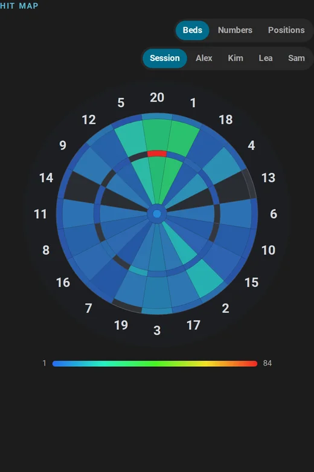
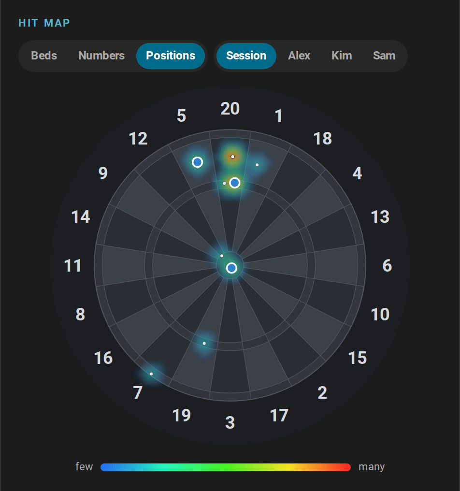
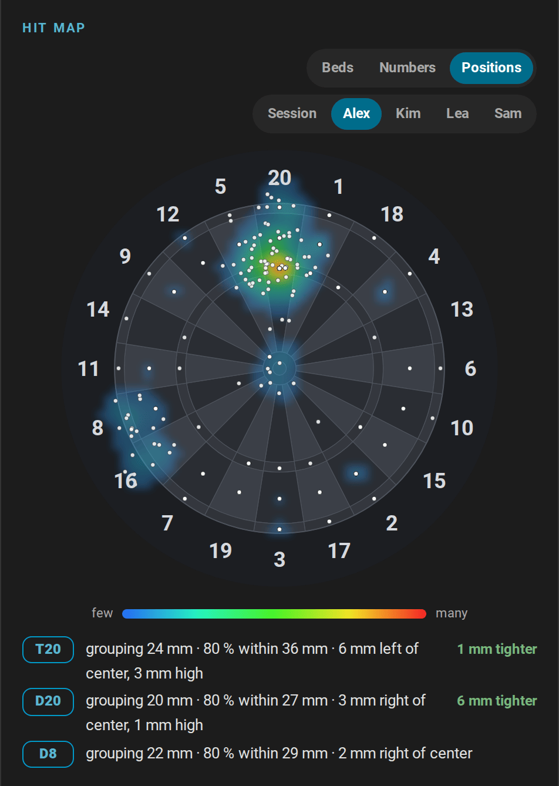
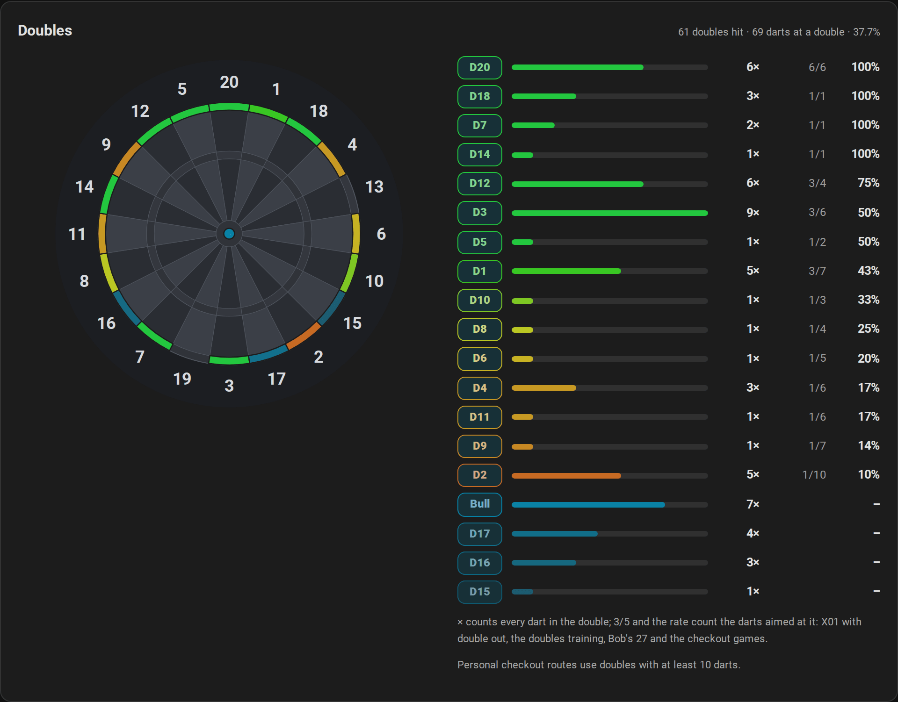
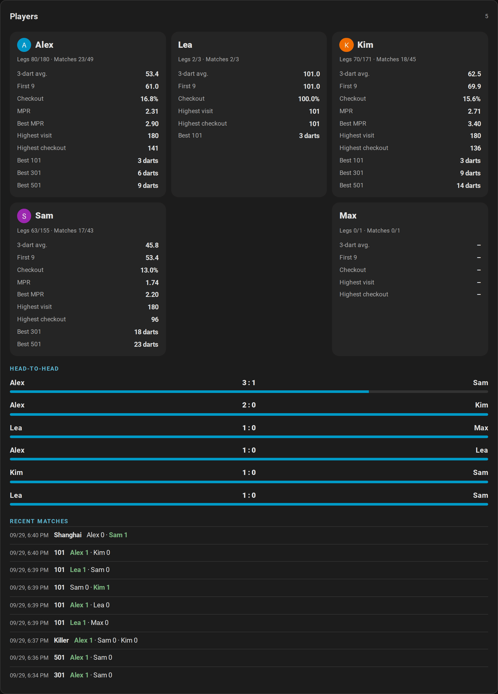
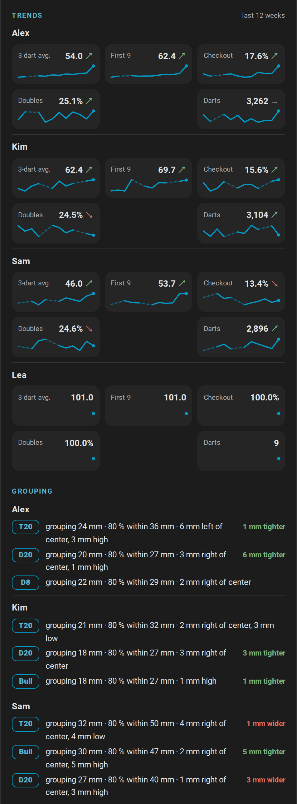
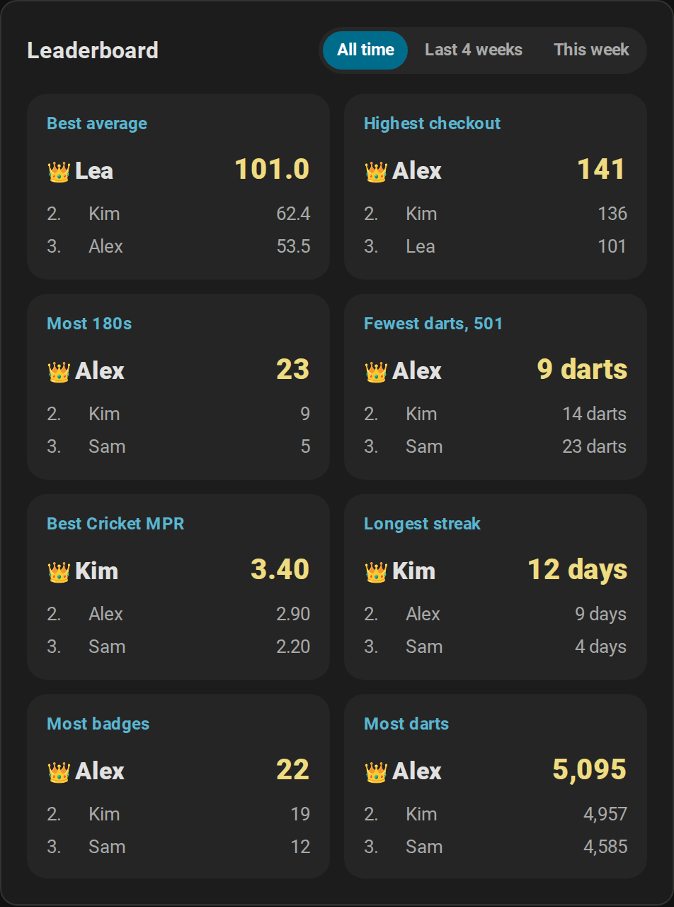
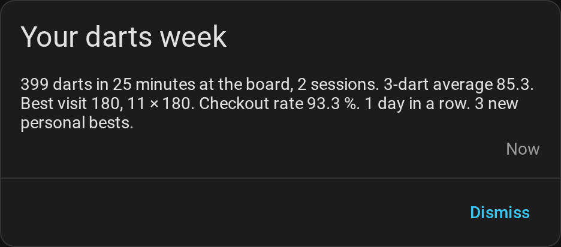

# Statistics and players

[← Documentation](README.md) · [Deutsch](statistics.de.md)

Every dart the board detects becomes a number in Home Assistant: your 3-dart average, where your darts land, your personal bests, your doubles, and for every named player a profile with badges, weekly trends and head-to-head records. It all stays in your home, survives restarts and fills Home Assistant's long-term statistics, so you see your progress over weeks and months.


**On this page:** [Where to find what](#where-to-find-what) · [Training sessions](#training-sessions) · [Personal bests, streak and daily goal](#personal-bests-streak-and-daily-goal) · [Heatmap and dart positions](#heatmap-and-dart-positions) · [Progress over time](#progress-over-time) · [Doubles analysis](#doubles-analysis) · [Player profiles](#player-profiles) · [Achievements](#achievements) · [Trends and grouping](#trends-and-grouping) · [Leaderboard](#leaderboard) · [Players and persons](#players-and-persons) · [Weekly report](#weekly-report) · [Training calendar](#training-calendar) · [Export](#export) · [Your data](#your-data)

## Where to find what

| Where | What it shows |
| --- | --- |
| [Training card](cards.md#training-card) | The running session: 3-dart average, heatmap of beds, numbers or dart positions for the session or any player, statistics, personal bests, recent visits and past sessions |
| [Players card](cards.md#players-card) | Every named player's statistics and personal bests, badges, weekly trends and grouping, head-to-head records, recent matches and the export |
| [Leaderboard card](cards.md#leaderboard-card) | The records of all players, for all time, the last four weeks or this week |
| [Doubles card](cards.md#doubles-card) | The hit rate of every double, for everybody or one player |
| *Training* and *Players* views of the [automatic dashboard](cards.md#automatic-dashboard) | The training card, the doubles card and graphs of darts per day, the 3-dart average, legs per day and the practice rates; the players card and the leaderboard |
| [Idle mode](scoreboard.md#between-games-idle-mode) of the scoreboard | The leaderboard, the personal bests of the board, today's darts and the last match |
| Home Assistant's calendar | Every session and match of the last year, in the [training calendar](#training-calendar) |
| Your phone | The [weekly report](#weekly-report) |
| [Sensors](entities.md) | Every value, for your own cards, graphs and automations |

## Training sessions

<picture>
  <source media="(prefers-color-scheme: light)" srcset="images/en/training-card-light.png">
  
</picture>

A training session counts the darts you throw, whatever you play: an online match, a practice game or just a few visits at the 20.

- **Start:** with *Start sessions automatically* on (the default), the first dart starts a session. You can also start one on purpose with *Start session* on the training card or the *Training session* switch.
- **End:** *End session* on the card, or automatically after the pause set in *Session idle timeout*. `0`, the default, keeps a session running until you end it. *New session* ends the running session and starts the next one.
- **What counts:** darts, points, 3-dart average, visits, the highest visit, 100+, 140+ and 180 visits, triples, doubles, bulls, misses and the hits of every bed. A visit counts as 100+, 140+ or 180 once its darts are pulled. Corrections of the board or on the scoreboard revise the totals, an [undone visit](games.md#corrections-and-darts-entered-by-hand) leaves them until it is booked again, and [darts entered by hand](games.md#corrections-and-darts-entered-by-hand) count like detected ones; the darts of the [bot](games.md#playing-against-the-bot) and darts that were in the board when Home Assistant started do not count.
- **History:** the last 20 sessions stay with their totals; the training card lists the last five. *Last session average* keeps the 3-dart average of every finished session, so its history is your progress from session to session.
- **Automations:** `session_started` and `session_ended` start the [training session routine](automations.md#training-session-routine), and the [training report](automations.md#training-report) sends your day.

[All training entities](entities.md#training-session) · [How the counting works](how-it-works.md#training-session)

## Personal bests, streak and daily goal

Home Assistant keeps the best value of every record and fires `personal_best` when you beat one, for example for the [light show](automations.md#light-show):

| Record | From |
| --- | --- |
| Highest visit | Any visit of up to three darts |
| Highest checkout | Won X01 legs with double out, also in a team match, for the player who checked out |
| Fewest darts for 101 to 1001 | Won X01 legs with double out, not in a team match, counted from the leg's own start score |
| Best Cricket marks per round | Won Cricket legs, not in a team match |
| Best session average | Finished sessions of at least 30 darts |
| Around the Clock, doubles training | The fewest darts of a finished game |
| Bob's 27, 121 checkout, Catch 40, JDC Challenge, singles training | The highest score |
| Longest streak | Days in a row with at least one dart |

- **Training streak:** the days in a row with at least one dart. Today does not break it; a whole day without darts does.
- **Daily goal:** set *Daily goal* to the darts you want to throw every day. The training card shows a bar towards it, and `daily_goal_reached` fires once a day when you reach it.
- The first value of each record sets it quietly; equal values do not count as new bests.

[The records in detail](entities.md#personal-bests-streak-and-daily-goal) · [Which legs count for which record](how-it-works.md#records-and-statistics)

## Heatmap and dart positions



The heatmap of the training card has three modes, which the switches above the board choose:

- **Beds:** every bed colored by how often you hit it, from blue (rarely) to red (most often). Hover a bed for its count and share.
- **Numbers:** the singles, doubles and triples of every number summed up, which shows at a glance whether you drift towards the 5 or the 1.
- **Positions:** where the darts really landed, from the positions the board reports: a smoothed density with the newest 300 darts as dots, and below the board the [grouping](#trends-and-grouping) at up to three beds you aimed at. For the session, the darts of the current visit appear the moment they land, as blue pins; when you pull them, they join the logged darts. A dart that misses the board, number ring included, is not drawn.



The second switch chooses whose darts it shows: the running session, or a named player with all their hits and the positions of their last 1000 darts. The most hit beds follow the choice.



```yaml
type: custom:autodarts-training-card
mode: positions
player: Alex
```

## Progress over time

Home Assistant keeps long-term statistics of the totals and averages, hour by hour and for as long as you use the integration. The *Training* view of the automatic dashboard draws them:


- **Darts per day** and **practice legs per day** for the last 30 days;
- the **3-dart average** of the last seven days;
- the **first 9 average and checkout rate** of the last 10 X01 legs, and the **doubles rate** of the same legs together with the last 10 results of the doubles training and Bob's 27.

Build your own graphs with Home Assistant's statistics graph card. The 3-dart average of your sessions, week by week, over three months:

```yaml
type: statistics-graph
title: 3-dart average per week
entities:
  - sensor.autodarts_board_last_session_average
stat_types: [mean]
period: week
days_to_show: 90
chart_type: line
```

The entity IDs depend on the name of your board; you find yours on the device page. Home Assistant compiles long-term statistics once an hour, so a new day appears in the graphs after the next full hour.

## Doubles analysis



Home Assistant counts every double you hit, in any game or in training without one, whatever the dart was aimed at. For the hit rate it also counts every dart thrown at a double and whether it hit: in X01 with double out whenever one double could finish the score, in the doubles training, in Bob's 27, in the checkout training, the 121 checkout and Catch 40 in the same way as in X01, and in the doubles part of the JDC Challenge. The [doubles card](cards.md#doubles-card) shows every double you hit on the board, how often you hit it and, where darts were aimed at it, its hit rate, for everybody or, with `player`, for one named player. A dart in D20 while aiming at the treble 20 counts as a hit of D20, but not for the rate of D20. *Favorite double* names your best double with at least 10 darts.

With *Practice personal checkout routes* on, the checkout route prefers the strongest doubles of the player at the board: a route with the same number of darts to a double with a better hit rate wins, as long as it needs no double to set up. A double counts as strong from 10 darts thrown at it and a hit rate at least as high as the player's rate on all doubles; a double never hit is never preferred. [How the route is chosen](how-it-works.md#practice-game).

## Player profiles



Every named player of a practice game gets a profile with lifetime numbers: legs and matches played and won, 3-dart average, first 9 average, checkout rate, marks per round, the highest visit and checkout, the best marks per round and the fewest darts for every start score. The [players card](cards.md#players-card) shows them with the head-to-head records of every pair of opponents and the recent matches.

- **Names:** a name is the same player whatever the upper and lower case; players without a name count for nobody. Give your regular players names, on the [new game screen](scoreboard.md#choose-the-next-game) or in *Practice player N*.
- **What counts:** every leg of X01, the Cricket games and the party games. X01 legs add the averages and the checkout rate, Cricket legs the marks per round. In a [team match](games.md#teams), both partners win the leg and the match; the checkout counts for the partner who threw it, and a team leg sets no fewest darts and no best marks per round.
- **Match history:** the last 20 matches of several players, with every player's legs, sets and average.
- **Tournaments** count like every match: their legs, matches and head-to-head records go into the profiles. [Tournaments](games.md#tournaments).
- **A typo in a name?** Remove the profile with [`autodarts.delete_player`](entities.md#delete-a-player-profile-autodartsdelete_player), which also forgets the player's progress and badges and takes the name out of the personal bests and the weekly report. The match history keeps the name.

## Achievements


Named players unlock achievements in tiers of bronze, silver, gold and, for the streak, platinum: from the first 180 to a hundred, from a ton-plus checkout to 170, a leg in 18, 15 or 12 darts, a nine-darter, a hat trick, every double hit once, nine marks in Cricket, a Shanghai, the best Around the Clock and Bob's 27, days in a row and darts thrown. The players card shows every badge with the next goal and the progress towards it.

- Each new tier fires `achievement_unlocked`, for a [notification](automations.md#celebrate-an-achievement) or the [light show](automations.md#light-show). Nothing plays or speaks unless an automation does.
- On the first start after the update, what the profiles already prove unlocks quietly.
- The *Unlock achievements* switch turns them off; progress keeps counting and unlocks quietly when you turn them on again.

[Every achievement and its tiers](entities.md#achievements)

## Trends and grouping



- **Weekly trends:** for every player who practiced in the weeks shown, the 3-dart average, first 9, checkout rate, doubles rate and darts of up to 12 weeks, as a line with an arrow that compares the newer half of the weeks with the older half: ↗ better, ↘ worse, → about the same.
- **Grouping:** where a player's darts land around the beds they aimed at most, in millimeters. The offset tells the accuracy, for example *6 mm left of center*; the grouping the precision, the radius that holds half of the darts, for example *grouping 38 mm*; and the trend whether the newer darts group tighter. [How the grouping is measured](how-it-works.md#grouping).

The weekly sums are in the `trend` attribute of *Player profiles*, so you can build graphs of your own. [Player progress](entities.md#player-progress).

## Leaderboard



The [leaderboard card](cards.md#leaderboard-card) ranks the records of all named players: best average, highest checkout, most 180s, fewest darts in 501, best Cricket MPR, longest streak, most badges and most darts. The switch at the top chooses all time, the last four weeks or this week, so a new player can top this week's board. The scoreboard's [idle mode](scoreboard.md#between-games-idle-mode) shows a leaderboard between games, too.

## Players and persons

Link a player to a person of Home Assistant, and the [scoreboard](scoreboard.md), the players card and the new game screen show the person's picture. The new game screen lists the players who are at home first.

```yaml
action: autodarts.link_player
data:
  player: Alex
  person: person.alex
```

A person is one player: linking the person to another player moves the link. [`autodarts.unlink_player`](entities.md#unlink-a-player-autodartsunlink_player) removes it; the statistics stay. The integration keeps only the entity ID of the person; the picture and whether the person is home come from Home Assistant.

## Weekly report



When the week ends, by default on Monday at midnight, `weekly_report` sums it up: darts, training time, sessions, the 3-dart average and its change since the week before, the best visit, 180s, the checkout rate, the streak, the days that reached the daily goal and the new personal bests. The [weekly report blueprint](automations.md#weekly-report-on-your-phone) sends it to your phone. *Weekly report day* and *Weekly report time* move the end of the week; the *Weekly report* sensor shows the running week.

[All values of the report](entities.md#weekly-report) · [How the week is counted](how-it-works.md#weekly-report)

## Training calendar


The **Training calendar** shows your finished sessions and practice matches of every game of the last 365 days in Home Assistant's calendar, for example *Training · 312 Darts · Ø 54.2* or *501 · Alex 3:2 Sam*, in German *Training · 312 Darts · Ø 54,2*. Open **Calendar** in the sidebar, or ask it in an automation with `calendar.get_events`, for example to [count the sessions of a month](automations.md#count-the-training-sessions-of-the-month).

## Export

Take your data to a spreadsheet, a backup or your own analysis:

- **On the players card:** turn on `export` and tap *Export*. The browser downloads the sessions, matches and profiles, as a ZIP of CSV tables or as JSON.
- **In an automation:** the action [`autodarts.export`](entities.md#export-training-data-autodartsexport) writes the file and returns where it is. It is an action for administrators; automations run it, too.

```yaml
action: autodarts.export
data:
  format: csv
  what: sessions
response_variable: export
```

Exports contain player names. By default they go to `autodarts/exports` in the media folder, which needs a login; only administrators download them. A folder of your own must be one where Home Assistant allows writing (`www`, a media folder or a folder listed in `allowlist_external_dirs`) and must not be hidden. At most 20 exports are written in an hour. Files in `www` are served at `/local/` without a login to anyone who can reach Home Assistant and knows the file name, so delete exports there that you no longer need.

## Your data

- **Local only.** Sessions, games and tournaments, personal bests, profiles with their progress, badges and dart positions, the weekly report and the calendar are stored in Home Assistant's `.storage` folder and never leave your home. [What is stored where](how-it-works.md#stored-data).
- **Diagnostics** redact player names and board details, so you can attach them to a bug report.
- **Start over:** *New session* starts a new training session; [`autodarts.delete_player`](entities.md#delete-a-player-profile-autodartsdelete_player) forgets one player. Deleting the board in **Settings → Devices & services** deletes all of its stored data.
