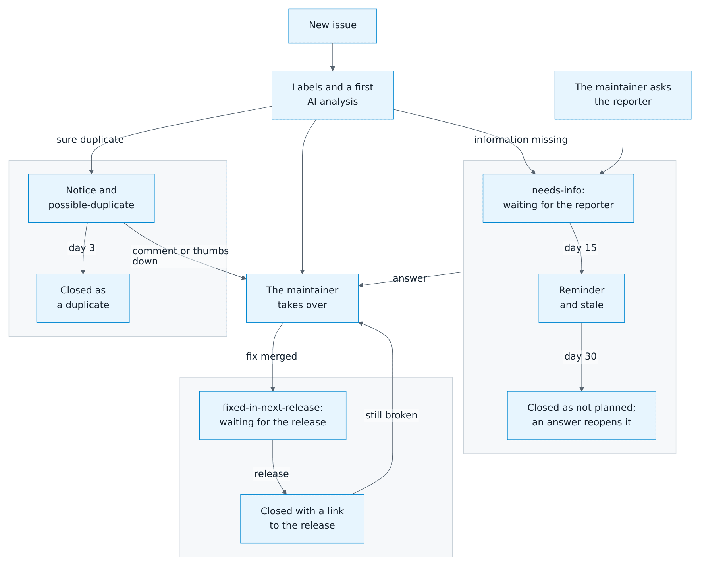

# Troubleshooting

[← Documentation](README.md) · [Deutsch](troubleshooting.de.md)

## Quick checks

1. **Is the Board Manager running?** Open `http://<board-ip>:3180` in a browser on a device in the same network. Board Manager 1 shows its app; Board Manager 2 answers on `http://<board-ip>:3180/api/state`.
2. **Is the entity *Local connection* on?** If not, Home Assistant cannot reach the board. Check the address, the port and the network between them (VLANs, firewall, Docker networking).
3. **Is the entity *Realtime connection* on?** If not, updates still arrive every 2 seconds, but not instantly. See [realtime connection](#no-realtime-updates).

## Setup

| Message | Cause and solution |
| --- | --- |
| *Enter an IP address or hostname only* | The address contains more than the host, such as `http://`, a path or a port. Enter only the IP address or host name, and the port in its own field. |
| *Cannot reach the local Board Manager or its response is invalid* | Wrong address or port, the Board Manager is not running, or something else answers on that port. Enter the IP address only, without `http://` and without a port. |
| *The board refused access (HTTP 401 or 403)* | The Board Manager itself needs no login, so something in front of port 3180 blocks Home Assistant, for example a reverse proxy, a firewall or a login page. Let Home Assistant reach the board directly, or enter the board's own address. |
| *No board ID is configured in Board Manager* | The board has not been set up with Autodarts yet. Finish the setup in the Board Manager, then try again. |
| *No new boards were found automatically* | The search only finds boards that registered from your internet connection and that are not set up yet. Enter the address instead. |
| *The board search is unavailable right now* | The Autodarts discovery service is unreachable. Enter the address instead. |
| *This Autodarts board is already configured* | The board is already set up. Use **Reconfigure** to change its address. |
| *This address belongs to a different board* | **Reconfigure** found another board at the new address. Enter the address of the board this entry belongs to, or add the other board as a new entry. |
| *The board announced on your network does not answer* | A discovered board did not answer at the address it announced, for example because the Board Manager stopped meanwhile. Start the Board Manager and add the board again, or enter its address. |
| *Setup of this board is already in progress* | Another setup dialog for the same board is open, for example the discovered board. Finish or close it. |
| The board is not discovered automatically | Automatic discovery needs Board Manager 2 and mDNS in your network. Home Assistant in Docker needs `network_mode: host`, and mDNS does not cross VLANs without a repeater. Use the search or the address instead. |
| *This client ID is invalid or is not enabled for device login* | The cloud link needs a client ID issued by Autodarts for this integration. None is available yet; see [cloud link](installation.md#link-the-autodarts-cloud-optional). Local setup works without it. |

## Repairs

Home Assistant shows these notices under **Settings → Repairs**:

| Notice | Meaning and solution |
| --- | --- |
| **Autodarts board address points to a different board** | The configured address answers with a different board ID, for example because IP addresses were swapped. The entities stay unavailable so that they never show another board's data. Open the integration, choose **Reconfigure** and select the correct board. The notice disappears by itself. |
| **Calibrate the Autodarts board** | At least 20 % of the last 100 darts, and at least 50 darts in all, needed a correction, by the board, on the scoreboard or with `autodarts.correct_dart`, see *Detection correction rate*. Remove all darts, open the notice and confirm: the integration calibrates all cameras and counts again from zero. The notice also disappears once the rate falls below 10 %. |
| **Update the board to the new Autodarts Board Manager** | The board still runs the classic Board Manager 1, which Autodarts will switch off. Install Board Manager 2 on the board PC. The integration switches over by itself and the notice disappears. |
| **Autodarts board found at a new address** | The board has not answered at its address for five minutes, but the Autodarts cloud reports another address where it answers with its board ID, for example after a DHCP change. Open the notice and confirm: the integration checks the address once more, switches to it and reloads. Entities, training and settings are kept. Only entries linked to the Autodarts cloud get this notice; Board Manager 2 announces a new address itself, see [address changes](how-it-works.md#address-changes). |
| **Autodarts board refuses access** | The board answers with HTTP 401 or 403. The Board Manager needs no login, so a reverse proxy, a firewall or a login in front of port 3180 blocks Home Assistant. Let Home Assistant reach the board; the notice disappears with the next successful read. |
| **Autodarts board answers in an unknown format** | A required read (state, settings or `/api/system`) answered three times in a row in a format this version does not understand, typically after a Board Manager update. Update the integration. If the notice stays, [report it](#report-a-bug) with the diagnostics; the log names the affected reads. |

## Operation

### Entities are unavailable

- **All board entities unavailable:** the Board Manager has not answered three reads in a row; one or two missed reads, a few seconds, keep the last values. The entities recover by themselves within seconds after the board is back. Training, practice game, personal bests and the board events stay available, also when the board is switched off while Home Assistant starts.
- **Settings and camera entities unavailable, the rest works:** the board has not reported its configuration yet. This resolves with the next read, at the latest after 30 seconds.
- **Unavailable after a Board Manager update:** the integration reloads itself when the generation changes. Wait a few seconds.

### Messages on the board's entry

**Settings → Devices & services → Autodarts** shows why a board is not loaded or its entities are unavailable:

| Message | Cause and solution |
| --- | --- |
| *Board Manager does not answer* | The board is offline or unreachable. Check that the board PC and the Board Manager run; the entities recover by themselves. |
| *Enter the local Board Manager address: open the menu of this entry and select Reconfigure* | The entry has no local address, for example an old cloud entry. Open the entry's menu (⋮) → **Reconfigure** and enter the address. |
| *Board Manager answers in a format this version of the integration does not understand* | Usually after a Board Manager update. Update the integration; see **Autodarts board answers in an unknown format** under [repairs](#repairs). |
| *Board Manager refused access* | See **Autodarts board refuses access** under [repairs](#repairs). |
| *The stored training of this board comes from a newer version of the integration* | The integration was downgraded after a newer version had saved the training, the practice game and the statistics. Install that version again, or restore a backup of Home Assistant from before the update. The board does not load until then, and the stored data stays unchanged. |
| *The stored training of this board cannot be read right now* | Home Assistant could not read its `.storage` folder, for example because the disk is full or the permissions changed. Check the free space and the permissions of `.storage`; Home Assistant tries again by itself and overwrites nothing in the meantime. |
| *The stored training of this board cannot be restored* | The stored data does not fit what this version expects. [Report a bug](https://github.com/Dennis-Otto/ha-autodarts/issues/new/choose) with the log and the diagnostics; the stored data stays unchanged. |

### An action fails

| Message | Cause and solution |
| --- | --- |
| *The board did not accept the action* | The board rejected the command or did not answer. Check the connection and try again. |
| *This board does not support the action* | The Board Manager has no such command, for example the camera streams on Board Manager 1. |
| *Board Manager refused access* | See **Autodarts board refuses access** under [repairs](#repairs). |
| *No Autodarts board with a local connection is loaded* | Every `autodarts` action needs a board that is connected locally and loaded. Check the entry under **Settings → Devices & services**; an entry linked to the cloud only cannot play. |
| *Unauthorized* | `autodarts.delete_player`, `autodarts.export`, `autodarts.link_player` and `autodarts.unlink_player` delete or write out the players' data, so only administrators may run them, for example not the user of the screen at the board. Automations run them, too. |
| *Several Autodarts boards are set up. Choose the board.* | With more than one board, choose the board in the action, the `config_entry_id` field in YAML. |
| *Config entry … was not found*, *… does not belong to integration autodarts* or *… is not loaded* | The board chosen in the action was deleted, is another integration's entry or is not loaded. Choose the board again; a board that does not load shows why on its entry. |
| *… is on the list of players more than once* | Every player needs a name of their own. Players without a name may appear more than once. |
| *A player name cannot contain curly brackets, …* | Home Assistant would read these characters as the start of a template. Leave out `{`, `}`, `%`, `#` and control characters. |
| *Killer needs at least two players* | Name two to four players in the action, or set *Practice players* to 2 or more. |
| *There is no player profile named …* | Check the spelling; upper and lower case do not matter. The *Player profiles* sensor lists every profile. |
| *There is no person … in Home Assistant* | `autodarts.link_player` needs a person entity, such as `person.alex`. Create the person under **Settings → People** first. |
| *Teams need four players* | Teams play 1 and 3 against 2 and 4: name four players, or set *Practice players* to 4. |
| *Teams play X01 and the Cricket games* | Switch *Teams* off for party and training games. |
| *A start score is 0, for the game's start score, or 2 to 1001* | Correct `start_scores` in the action or the *Practice start score player N* setting. |
| *The start scores name … values, but only … players play* | `start_scores` has at most one value per player, in throwing order; with the bot, its seat counts, too. Leave out the extra values. |
| *Teams play from the start scores of players 1 and 2* | In a team match, the first start score is team 1's and the second team 2's. Give at most two. |
| *A start score of 3 cannot be checked out with double in and double out* | The only opening double, D1, leaves 1, which no double can finish. Choose another start score, or switch off double in or double out. |
| *… is not a bed of the board* | `segment` of `autodarts.correct_dart` or `autodarts.throw_dart` takes S1 to S20, D1 to D20, T1 to T20, 25 for the outer bull, BULL for the bullseye or MISS. |
| *Name the bed with segment, or where the dart is with x and y* | `autodarts.correct_dart` and `autodarts.throw_dart` need the bed, the position, or both. |
| *Give the position with both x and y …* | A position needs `x` and `y`, each from -3 to 3: 0 is the center, 1 the outer edge of the double ring, and `y` points to the 20. |
| *The position given is in …, not in …* | The bed follows from the position. Leave out `segment`, or give the bed at that spot. |
| *The current visit has no dart …* | `autodarts.correct_dart` corrects dart 1, 2 or 3 of the current visit once it is on the board. A visit whose darts were pulled comes back with `autodarts.undo_visit`. |
| *The darts of the bot cannot be corrected* | The bot's darts come from Home Assistant, not from the board. Only the darts of a player can be corrected. |
| *Manual entry is off* | `autodarts.throw_dart` enters darts only while the *Practice manual entry* switch is on. Switch it on first. |
| *The bot is at the board* | The bot is throwing its visit. Wait for it, or end it with `autodarts.next_player`. |
| *The visit already has three darts* | Pass the turn with `autodarts.next_player`, or pull the darts, before you enter the next dart. |
| *The visit has no darts to end* | Without darts, `autodarts.next_player` passes the turn only where a player may pass: in X01, the Cricket and the party games, but not in the training games, in a bull-off or while the Killer numbers are chosen. |
| *There is no visit to undo* | `autodarts.undo_visit` takes back the last completed visit, while no dart is in the board and neither the game nor the training session has changed since. Pull the darts first; the darts of the current visit are corrected with `autodarts.correct_dart`. |
| *The bot level is 0, for no bot, or a 3-dart average of 20 to 120* | Correct `bot_level` in the action or the *Practice bot level* setting. |
| *With the bot, up to three players play* | The bot takes a seat of its own in X01 and the Cricket games. Play with three players at most, or set the bot level to 0. |
| *The export folder … must not be hidden, and Home Assistant must allow writing to it* | Leave the folder empty for `autodarts/exports` of the media folder, or choose a folder that does not start with a dot in `www`, in a media folder or in a folder listed in `allowlist_external_dirs`. |
| *The export could not be written* | The folder is not writable or the disk is full; the message names the reason. |
| *… exports were written in the last hour* | The integration writes a limited number of exports per hour. Try again later. |
| *A tournament needs three to eight players* | Name three to eight players, each with a name of their own. |
| *No tournament is being played* | *Next tournament match* and *Stop tournament* need a running tournament. |
| *A tournament is being played* | Only one tournament runs at a time. Stop it before you start a new one. |
| *The tournament is over* | The final is played; *Next tournament match* has no match left. Stop the tournament, or start a new one. |
| *… plays in the tournament* | A player of the running tournament cannot be deleted. Stop the tournament first. |
| *The tournament match of … against … is still being played* | *Next tournament match* waits for the pause between two matches. Play the match to the end, or stop the tournament. |

### No realtime updates

*Realtime connection* is off, and changes appear with a delay of about 2 seconds:

- A proxy or firewall between Home Assistant and the board may block WebSocket connections to port 3180. If the board answers reads but its realtime events stay away for about half a minute, the log shows one warning.
- After a restart of the Board Manager, the integration reconnects as soon as a read finds the board back, otherwise within 60 seconds at most.

### Darts are counted wrongly in the training session

- Darts on the board while Home Assistant starts are deliberately ignored.
- If a takeout is not detected and new darts follow, the previous visit is closed and the new darts are counted.
- If the connection is interrupted during a visit, the visit continues when the board still shows its darts afterwards. If the darts were pulled meanwhile, the visit is completed with the darts known before the interruption; darts thrown after that during the interruption are not counted.
- The training session counts what the board detects. If the board detects a wrong segment and you correct it in Autodarts, the session follows the correction only if the board reports it.

To start over, press **New training session** or *New session* on the training card. To stop counting, turn off the **Training session** switch and *Start sessions automatically*.

### A camera is reported as a problem

*Camera problem* turns on when a camera delivers no frames for 15 seconds during active detection. Check the camera's cable and USB port, and whether the camera appears in the Board Manager. Calibrating once more often helps as well.

### The card is missing or outdated

- **Custom element doesn't exist: autodarts-card:** restart Home Assistant after installing, then reload the browser page.
- **An old version of a card after an update:** reload the page. In the companion app, use *Settings → Companion app → Debugging → Reset frontend cache*.
- **The training history is empty:** the history is read from the recorder. It needs the `recorder` integration (enabled by default) and fills with completed visits.

### Moments of online matches don't arrive

Follow the [online bridge](online-matches.md) step by step and watch the *Online bridge last event* sensor:

- **No sensor:** the bridge is off. Turn it on in the options of the board (**Configure**).
- **The address itself:** open it with `?event=gameon` added in a browser of your home network. If the sensor does not change, the browser cannot reach Home Assistant at this address: use the address you open Home Assistant with. An address from outside your home network needs *Accept calls from outside your home network*.
- **Only from the Autodarts page:** check that the WLED feature of Tools for Autodarts is on, the effects are enabled and the Autodarts page is open. The developer tools of the browser (F12, *Console*) show calls that the browser blocked, for example as *Mixed Content*; see [mixed content](online-matches.md#limitations).
- **Some moments only:** a trigger the bridge does not know is named once in a warning in the Home Assistant log. Tools for Autodarts plays one effect per trigger, so remove other effects with the same trigger.

## Diagnostics and logs

### Download diagnostics

**Settings → Devices & services → Autodarts →** the board's menu (⋮) → **Download diagnostics**. The file contains the board state, the settings summary, the Board Manager generation, connection states and the poll interval, whether a cloud connection is set up, the practice game with its rules and whether a bull-off runs, and the numbers of stored sessions, personal bests, player profiles, matches and darts at a double. Under `connection`, it also shows the connection history: failed reads in a row, the kind of the last error, the last successful read, how long the board has been away, the duration of the last read, reads answered in an unknown format and, for the realtime connection, connects, failed attempts, the current back-off, why it last ended and how many frames were skipped. The board ID, the board name, addresses, tokens and player names are redacted; error messages are not included.

### Enable debug logging

On the integration page, select **Enable debug logging**, reproduce the problem and then select **Disable debug logging**. Home Assistant downloads the log. Alternatively, in `configuration.yaml`:

```yaml
logger:
  default: warning
  logs:
    custom_components.autodarts: debug
```

### Report a bug

Open an [issue](https://github.com/Dennis-Otto/ha-autodarts/issues/new/choose) with the Home Assistant version, the Board Manager version, the diagnostics file and the relevant log lines. Report security problems privately as described in [SECURITY.md](https://github.com/Dennis-Otto/ha-autodarts/blob/main/SECURITY.md).

Within a few minutes, an AI issue assistant posts a first analysis, often with a fix or the part of the documentation that helps, and asks for anything that's missing. The maintainer reads every issue as well. If questions stay unanswered, a reminder follows after 15 days and the issue closes after 30 days; an answer reopens it. A likely duplicate closes 3 days after a notice unless you object. A fixed issue stays open until a release ships the fix and then closes with a link to the release ([details](https://github.com/Dennis-Otto/ha-autodarts/blob/main/SUPPORT.md#what-happens-with-your-issue)).

<picture>
  <source media="(prefers-color-scheme: dark)" srcset="images/en/issue-lifecycle-dark.png">
  
</picture>
